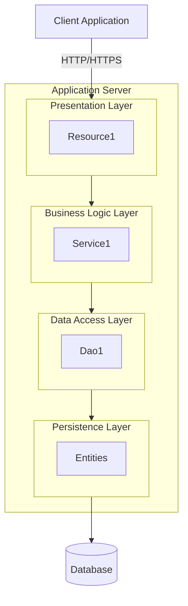
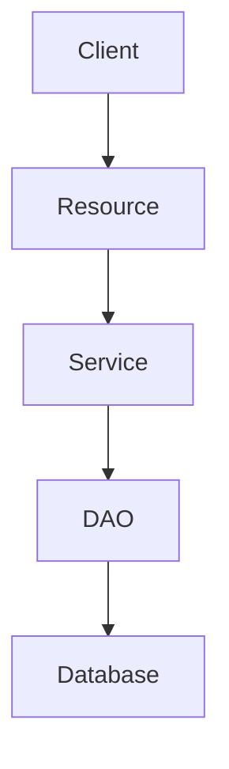

# [PROJECT_NAME] - アーキテクチャ設計書（共通）

プロジェクトID: [PROJECT_ID]  
バージョン: 1.0.0  
最終更新日: [DATE]  
ステータス: [STATUS]

---

## 概要

このドキュメントは、[PROJECT_NAME]プロジェクト固有の共通アーキテクチャ設計を記述する。

* 共通的な技術スタック、開発ガイドライン、技術的対応方針については、以下を参照すること：
  * [architecture.md](../../../../../agent_skills/jakarta-ee-api-agile/principles/architecture.md) - Jakarta EE APIアーキテクチャ標準
  * [common_rules.md](../../../../../agent_skills/jakarta-ee-api-agile/principles/common_rules.md) - 共通ルール
  * [security.md](../../../../../agent_skills/jakarta-ee-api-agile/principles/security.md) - セキュリティ標準

---

## 1. システム概要

### 1.1 システム名

[SYSTEM_NAME]

### 1.2 アーキテクチャスタイル

* アーキテクチャパターン: [レイヤードアーキテクチャ / マイクロサービス / その他]
* API設計: [RESTful API / GraphQL / その他]
* データアクセス: [JPA / JDBC / その他]
* 認証方式: [JWT / セッション / OAuth / その他]

---

## 2. 全体アーキテクチャ

### 2.1 システム構成図

[プロジェクト固有のシステム構成をMermaid図で表示]



### 2.2 アーキテクチャパターンの説明

[採用したアーキテクチャパターンの詳細説明]

* マイクロサービスの場合:
  * サービス間通信
  * データ管理の責務分担
  * サービス境界

---

## 3. パッケージ構造

### 3.1 ベースパッケージ

```
[BASE_PACKAGE]
```

### 3.2 パッケージ階層（概要）

```
[BASE_PACKAGE]/
├── api                    # Presentation Layer (JAX-RS Resources)
│   ├── dto               # Data Transfer Objects
│   └── exception         # Exception Mappers
├── service               # Business Logic Layer
├── dao                   # Data Access Layer
├── entity                # Persistence Layer (JPA Entities)
├── security              # Security (JWT, Authentication)
├── exception             # General Exception Mappers
├── common                # Common Classes
└── util                  # Utilities
```

* 詳細なクラス構成: 各ユースケースの usecases/{名}/userstory.md, behaviors.md を参照すること。

---

## 4. レイヤー設計

[プロジェクト固有のレイヤー設計、責務分担を記述]

### 4.1 Presentation Layer

* 責務: [プロジェクト固有の責務]
* 主要コンポーネント:
  * [COMPONENT_1]
  * [COMPONENT_2]

### 4.2 Business Logic Layer

* 責務: [プロジェクト固有の責務]
* 主要コンポーネント:
  * [COMPONENT_1]
  * [COMPONENT_2]

### 4.3 Data Access Layer

* 責務: [プロジェクト固有の責務]
* 主要コンポーネント:
  * [COMPONENT_1]
  * [COMPONENT_2]

### 4.4 Persistence Layer

* 責務: [プロジェクト固有の責務]
* 主要エンティティ:
  * [ENTITY_1]
  * [ENTITY_2]

### 4.5 Cross-Cutting Concerns

[プロジェクト固有の横断的関心事]

---

## 5. データフロー

[プロジェクト固有の典型的なデータフロー]

### 5.1 典型的なリクエストフロー



---

## 6. セキュリティアーキテクチャ

[プロジェクト固有のセキュリティ設計]

### 6.1 認証フロー

[必要に応じてMermaid図で記述]

### 6.2 認証除外エンドポイント

[プロジェクト固有の公開エンドポイント]

* [ENDPOINT_1]
* [ENDPOINT_2]

---

## 7. トランザクション管理

[プロジェクト固有のトランザクション設計]

### 7.1 トランザクション境界

[プロジェクト固有のトランザクション境界の説明]

### 7.2 トランザクション戦略

[プロジェクト固有のトランザクション戦略]

---

## 8. 並行制御

[プロジェクト固有の並行制御設計]

### 8.1 並行制御戦略

[採用する並行制御方式を記述]

* 楽観的ロック: バージョン番号による競合検出（該当する場合）
* 悲観的ロック: データベースレベルのロック機構（該当する場合）

---

## 9. エラーハンドリング

[プロジェクト固有のエラーハンドリング]

### 9.1 例外マッピング

| Exception | HTTP Status | Mapper |
|-----------|-------------|--------|
| [EXCEPTION_1] | [STATUS] | [MAPPER] |
| [EXCEPTION_2] | [STATUS] | [MAPPER] |

---

## 10. その他の考慮事項

### 10.1 パフォーマンス

[必要に応じて記述]

### 10.2 拡張性・保守性

[必要に応じて記述]

---

## 11. 参考資料

### 11.1 関連SPEC（共通）

* [data_model.md](data_model.md) - データモデル仕様書
* [external_interface.md](external_interface.md) - 外部インターフェース仕様書
* usecases/{名}/userstory.md - 各ユースケースのユーザーストーリー
* usecases/{名}/behaviors.md - 各ユースケースの振る舞い仕様

### 11.2 共通原則・標準

* [architecture.md](../../../../../agent_skills/jakarta-ee-api-agile/principles/architecture.md) - Jakarta EE APIアーキテクチャ標準
* [common_rules.md](../../../../../agent_skills/jakarta-ee-api-agile/principles/common_rules.md) - 共通ルール
* [security.md](../../../../../agent_skills/jakarta-ee-api-agile/principles/security.md) - セキュリティ標準
