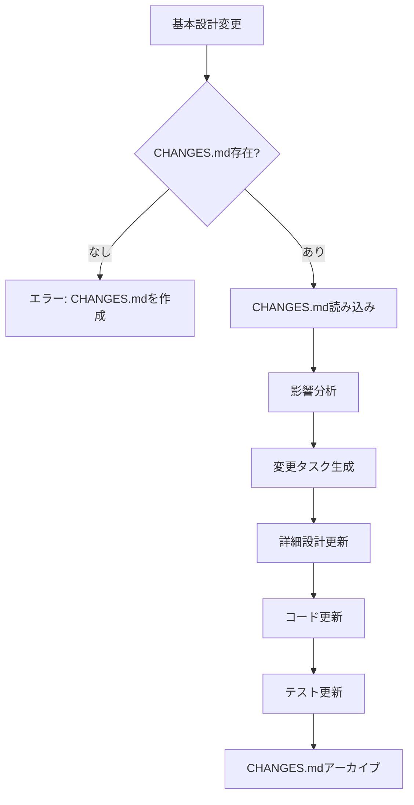

# Jakarta EE API サービス開発 Agent Skill

## 🎯 これは何？

Jakarta EE 10とJAX-RS 3.1を使ったREST API サービスプロジェクト全般を実装するための汎用Agent Skillです。

このAgent Skillsに含まれるもの:
* instructions/: 6段階の開発インストラクション（基本設計、タスク分解、詳細設計、コード生成、単体テスト実行評価、E2Eテスト生成）
* principles/: Jakarta EE開発の原則（全プロジェクトで遵守すべき共通ルール、品質基準、アーキテクチャ標準）

対応する実装要件:

* エンティティ実装（JPA/EntityManager）
* 外部API連携（RestClient）
* JWT認証・認可
* CORS対応
* トランザクション管理

---

## 🚀 超簡単な使い方（6段階プロセス）

### ステップ1: 📄 基本設計（SPEC作成）

```
@agent_skills/jakarta-ee-api-base/instructions/basic_design.md

SPECを作成してください

パラメータ:
* project_root: <プロジェクトルートパス>
* spec_directory: <SPECディレクトリパス>
```

AIと対話しながら:
1. 📋 テンプレートを basic_design/ フォルダに展開
2. 📖 requirements.mdを読み込み、理解内容を説明
3. 💬 ユーザーと対話しながら各SPECの中身を埋める
4. 📝 システム全体のSPEC（architecture_design.md、functional_design.md等）を basic_design/ に作成

注意:
* requirements.md（要件定義書）は所与とする（既に存在している前提）
* 基本設計フェーズでは、システム全体を一枚岩として設計する
* 機能単位への分解は、次のタスク分解フェーズで実施する

### ステップ2: 📋 タスク分解

```
@agent_skills/jakarta-ee-api-base/instructions/task_breakdown.md

タスクを分解してください。

パラメータ:
* project_root: <プロジェクトルートパス>
* spec_directory: <SPECディレクトリパス>
* output_directory: <タスク出力先パス（オプション）>
```

これだけ！ AIが自動で：
1. 📖 basic_design/ を分析
2. 🎯 機能を依存関係に基づいて識別し、実装順序を決定
3. 🔧 タスクファイルを分解・生成する
4. 💾 `tasks/`フォルダに保存する

重要: このタスク分解の結果が、次の詳細設計フェーズで detailed_design/ フォルダ構造を決定します

### ステップ3: 🎨 詳細設計

```
@agent_skills/jakarta-ee-api-base/instructions/detailed_design.md

詳細設計書を作成してください。

パラメータ:
* project_root: <プロジェクトルートパス>
* spec_directory: <SPECディレクトリパス>
* target_type: FUNC_XXX_xxx
```

AIと対話しながら：
1. 📂 タスク分解の結果に基づいて detailed_design/{target_type}/ フォルダを作成
2. 📖 basic_design/functional_design.md を参照して実装設計を作成
3. 🎨 実装レベルの detailed_design.md を生成（クラス設計、メソッドシグネチャ、アノテーション）
4. ✅ 単体テスト用の behaviors.md を新規作成（タスク粒度内のテストシナリオ）
5. ❓ 不明点をユーザーに質問
6. 💬 対話で妥当性・充足性を確認

重要：
* functional_design.md は basic_design/ にのみ存在（唯一の真実の情報源）
* requirements/behaviors.md: システム全体の振る舞い（E2Eテスト用）
* basic_design/behaviors.md: Service層以下の振る舞い（結合テスト用）
* detailed_design/{target}/behaviors.md: タスク粒度内の振る舞い（単体テスト用）

なぜ必要？
* SPECの理解を人が確認できる
* 不足情報を補完できる
* コード生成の精度が向上する

### ステップ4: ⚙️ コード生成（詳細設計→実装→単体テスト）

```
@agent_skills/jakarta-ee-api-base/instructions/code_generation.md

タスクを実行してください。

パラメータ:
* project_root: <プロジェクトルートパス>
* task_file: <タスクファイルパス>
* skip_infrastructure: true  # インフラセットアップをスキップ（オプション）
```

AIが：
1. 📄 タスクと詳細設計（detailed_design/配下）を読み込む
2. 💻 コードを生成する（Resource、Service、Dao、Entity、DTO等）
3. ✅ タスク粒度内の単体テストを作成する
   * 同じタスク内のコンポーネント間は実際の連携をテスト
   * タスク外の依存関係のみモック化
   * 例: BookService → BookDao は実際の連携、EntityManagerはモック
4. ☑️ タスクを完了としてマークする

💡 skip_infrastructureパラメータ:
* `true`: DB/APサーバーのセットアップをスキップ（既存環境を使用）
* `false`またはパラメータなし: 完全セットアップを実行

### ステップ5: 🔍 単体テスト実行評価

```
@agent_skills/jakarta-ee-api-base/instructions/unit_test_execution.md

単体テストを実行してください。

パラメータ:
* project_root: <プロジェクトルートパス>
* target_type: FUNC_XXX_xxx
```

AIが：
1. 🧪 テスト実行（gradle test jacocoTestReport）
2. 📊 テスト結果とカバレッジを分析
3. 🔍 問題を分類:
   * テスト失敗（アサーション、例外、タイムアウト）
   * 必要な振る舞い（テストが不足）
   * デッドコード（到達不可能・冗長）
   * 設計の誤り（仕様との不一致）
4. 📋 フィードバックレポートを生成
5. 💬 ユーザーに推奨アクションを提示

重要：
* 問題を発見してもユーザー確認なしに修正しない
* カバレッジ不足やデッドコードを具体的に提案
* 必要に応じてステップ3（詳細設計）に戻ってループ

🔄 フィードバックループ:
```
詳細設計 → コード生成 → テスト実行評価
    ↑                         ↓
    └──── フィードバック ←────┘
```

品質目標を達成するまで繰り返す

### ステップ6: 🔗 結合テスト生成

```
@agent_skills/jakarta-ee-api-base/instructions/it_generation.md

結合テストを生成してください。

パラメータ:
* project_root: <プロジェクトルートパス>
* spec_directory: <SPECディレクトリパス>
```

AIが：
1. 📄 basic_design/behaviors.md（結合テストシナリオ）を読み込む
2. 🧪 JUnit 5 + Weld SE を使用した結合テストを生成する
   * Service層以下（Service + DAO + Entity + DB）の連携テスト
   * 実際のDBアクセス（メモリDB）
   * 外部APIはWireMockでスタブ化
   * アプリケーションサーバー不要
3. 🏷️ `@Tag("integration")` で結合テストを分離

実行方法:
```bash
# 結合テストを実行
./gradlew integrationTest
```

### ステップ7: 🧪 E2Eテスト生成

```
@agent_skills/jakarta-ee-api-base/instructions/e2e_test_generation.md

E2Eテストを生成してください。

パラメータ:
* project_root: <プロジェクトルートパス>
* spec_directory: <SPECディレクトリパス>
```

AIが：
1. 📄 requirements/behaviors.md（E2Eテストシナリオ）を読み込む
2. 🧪 REST Assured を使用したE2Eテストを生成する
   * 複数機能間の連携をテスト
   * 実際のHTTPリクエスト/レスポンス
   * 実際のDBアクセスを含む
   * E2Eのフロー検証
3. 📋 テストデータのセットアップ/クリーンアップコードを生成
4. 🏷️ `@Tag("e2e")` でE2Eテストを分離

重要：
* E2Eテストは実装完了後に実行
* アプリケーションサーバーが起動している状態で実行
* `./gradlew e2eTest` で実行（通常の `test` タスクからは除外）

---

## 🔄 基本設計変更対応（手戻り・拡張案件）

### いつ使う？

* 結合テストやE2Eテストで不具合が見つかり、基本設計に戻る必要がある場合（baseline手戻り）
* 拡張案件（enhancements）で新機能を追加し、基本設計を更新する場合
* 既存機能の仕様変更が発生した場合

### 実行方法

```
@agent_skills/jakarta-ee-api-base/instructions/basic_design_change.md

基本設計の変更を検出して、影響を受けるファイルを更新してください。

パラメータ:
* project_root: <プロジェクトルートパス>
* spec_directory: <SPECディレクトリパス>
```

AIが：
1. 📄 CHANGES.md（変更差分ファイル）を読み込み
2. 🔍 変更の影響を受けるファイル（詳細設計、コード、テスト）を特定
3. 📋 変更タスクファイル（`tasks/change_tasks.md`）を生成
4. 🎯 既存の指示書を呼び出して、影響を受けるファイルを更新
5. ✅ すべての変更適用後、CHANGES.mdをアーカイブ

### 処理フロー



### 変更差分管理

```
specs/baseline/basic_design/
  ├── functional_design.md (or .xlsx)
  ├── CHANGES.md              # アクティブな変更
  └── changes_archive/        # 適用済み変更
      ├── 20260118_order_cancel.md
      └── 20260125_order_history.md
```

重要:
* マスターファイル（functional_design.md等）は自由に更新
* 変更内容はCHANGES.mdに明示的に記載
* Markdown、EXCEL、PDF等、形式非依存

---

## 📜 開発原則

このAgent Skillsには、Jakarta EE開発で遵守すべき原則が含まれています：

* 場所: `@agent_skills/jakarta-ee-api-base/principles/`
  * [architecture.md](principles/architecture.md) - Jakarta EE APIアーキテクチャ標準
  * [security.md](principles/security.md) - セキュリティ標準
  * [common_rules.md](principles/common_rules.md) - 共通ルール

* アーキテクチャ標準の主な内容:
  * 標準技術スタック（Jakarta EE 10、JPA 3.1、JAX-RS 3.1等）
  * レイヤードアーキテクチャ（API、Security、Service、DAO、Entity）
  * 開発標準（命名規則、コーディング規約、バリデーション、エラーハンドリング、ログ出力）
  * セキュリティ実装（JWT認証、認証フィルター、認証コンテキスト）
  * トランザクション管理と並行制御（楽観的ロック）
  * データベース構成、REST API設計原則、テスト戦略
  * パフォーマンス考慮事項

* セキュリティ標準の主な内容:
  * JWT認証（HttpOnly Cookie、トークンライフサイクル、CSRF対策）
  * パスワード管理（BCryptハッシュ化）
  * データ保護（個人情報、機密情報、暗号化）
  * 通信セキュリティ（HTTPS/TLS、証明書管理）
  * セキュアコーディング（SQLインジェクション、XSS、コマンドインジェクション対策）
  * OWASP Top 10対応

* 共通ルールの主な内容:
  1. 仕様ファースト開発: すべての機能開発は詳細なSPECの作成から始める
  2. アーキテクチャの一貫性: Jakarta EE 10のベストプラクティスに従う
  3. テスト駆動品質: すべてのビジネスロジックに対して単体テストを作成
  4. ドキュメント品質の追求: コードとSPECドキュメントを常に最新に保つ
  5. Markdownフォーマット規約: 箇条書きはアスタリスク、ボールド不使用等

* 注意:
  * これらの原則は全Jakarta EEプロジェクトで共通
  * プロジェクト固有のルールがある場合は、それも併せて遵守してください

---

## 💡 実践例

### 例1: プロジェクト立ち上げ（REST APIサービス - 4段階）

ステップ1: 基本設計（SPEC作成）
```
@agent_skills/jakarta-ee-api-base/instructions/basic_design.md

SPECを作成してください

パラメータ:
* project_root: projects/sdd/bookstore/back-office-api-sdd
* spec_directory: projects/sdd/bookstore/back-office-api-sdd/specs/baseline
```

AIと対話しながらSPECを作成

ステップ2: タスク分解
```
@agent_skills/jakarta-ee-api-base/instructions/task_breakdown.md

全タスクを分解してください。

パラメータ:
* project_root: projects/sdd/bookstore/back-office-api-sdd
* spec_directory: projects/sdd/bookstore/back-office-api-sdd/specs/baseline
```

結果:
```
tasks/
├── tasks.md              ← メインタスクリスト（依存関係、実行順序を記載）
├── setup.md              ← セットアップ（特別なタスク、常に最初）
├── FUNC_001_xxx.md       ← 機能別タスク（内容はプロジェクト固有）
├── FUNC_002_yyy.md       ← 機能別タスク（内容はプロジェクト固有）
└── FUNC_003_zzz.md
```

ステップ3: 詳細設計（書籍API）
```
@agent_skills/jakarta-ee-api-base/instructions/detailed_design.md

書籍APIの詳細設計書を作成してください。

パラメータ:
* project_root: projects/sdd/bookstore/back-office-api-sdd
* spec_directory: projects/sdd/bookstore/back-office-api-sdd/specs/baseline
* target_type: FUNC_002_books

JPQL検索とCriteria API検索の両方を実装する予定です。
```

AIとの対話:
```
AI: タスク分解の結果を確認しました。
    detailed_design/FUNC_002_books/ フォルダを作成します。
    basic_design/functional_design.md を参照して書籍APIの実装設計を作成します。
    
    【API概要】（basic_design/functional_design.mdから）
    * 書籍API（/api/books）
    * エンドポイント:
      1. GET /api/books - 全書籍取得
      2. GET /api/books/{id} - 書籍詳細
      3. GET /api/books/search/jpql - JPQL検索
      4. GET /api/books/search/criteria - Criteria API検索
    
    【関連エンティティ】
    * Book（テーブル: BOOK + STOCK）
      * @ManyToOne Category
      * @ManyToOne Publisher
      * @SecondaryTable(name="STOCK") for quantity, version
    
    【不明点・確認事項】
    1. 検索条件はkeywordとcategoryIdでよろしいでしょうか？
    2. keywordはbookNameとauthorの両方を対象にしますか？

ユーザー: はい、その通りです。keywordは両方を対象にしてください。

AI: 承知しました。以下を作成しました：
    → specs/baseline/detailed_design/FUNC_002_books/detailed_design.md（実装クラス設計）
    → specs/baseline/detailed_design/FUNC_002_books/behaviors.md（単体テスト用）
```

ステップ4: コード生成
```
@agent_skills/jakarta-ee-api-base/instructions/code_generation.md

書籍APIを実装してください。

パラメータ:
* project_root: projects/sdd/bookstore/back-office-api-sdd
* task_file: projects/sdd/bookstore/back-office-api-sdd/tasks/FUNC_002_books.md
```

### 例2: 外部API連携（4段階）

ステップ1: 基本設計（スキップ - 既にSPECが存在する場合）

ステップ2: タスク分解
```
@agent_skills/jakarta-ee-api-base/instructions/task_breakdown.md

全タスクを分解してください。

パラメータ:
* project_root: projects/sdd/bookstore/berry-books-api-sdd
* spec_directory: projects/sdd/bookstore/berry-books-api-sdd/specs/baseline
```

ステップ3: 詳細設計（注文API - 独自実装 + 外部API連携）
```
@agent_skills/jakarta-ee-api-base/instructions/detailed_design.md
@projects/sdd/bookstore/berry-books-api-sdd/specs

対象: FUNC_003_orders

注文APIの詳細設計書を作成してください。
独自実装 + 外部API連携を実装します。
```

AIとの対話:
```
AI: 理解した内容を説明します...
    【API概要】
    * 注文API（/api/orders）
    * REST APIサービス（独自実装 + 外部API連携）
    
    【実装するクラス】
    * OrderResource, OrderService, OrderDao
    * Entity: OrderTran, OrderDetail（ローカルDB）
    
    【外部API連携】
    * BackOfficeRestClient: 在庫チェック、在庫更新
    * 楽観的ロック対応
    
    【不明点・確認事項】
    1. 在庫更新失敗時のロールバック戦略は？
    2. 配送料金の計算ロジックはSPECにありますか？

ユーザー: 在庫更新失敗時はOptimisticLockExceptionをスローしてください。
         配送料金は東京都内500円、関東圏700円、その他1000円です。

AI: 承知しました。DeliveryFeeServiceを追加します。
    detailed_design.mdを作成しました。
```

ステップ4: コード生成
```
@agent_skills/jakarta-ee-api-base/instructions/code_generation.md
@projects/sdd/bookstore/berry-books-api-sdd/specs/baseline/detailed_design/FUNC_003_orders/detailed_design.md

注文APIを実装してください。
```

AIが自動実装：
* ✅ エンティティ
* ✅ Dao（JPQL検索 + Criteria API検索）
* ✅ Service
* ✅ Resource（REST API）
* ✅ 各種テスト

### 例4: 楽観的ロック実装

```
@agent_skills/jakarta-ee-api-base/instructions/code_generation.md
@projects/sdd/bookstore/back-office-api-sdd/tasks/FUNC_002_stocks.md

在庫APIを実装してください。
楽観的ロック（@Version）を使った在庫更新を実装してください。
```

AIが自動実装：
* ✅ エンティティ（@Versionアノテーション付き）
* ✅ Dao
* ✅ Service（楽観的ロック処理）
* ✅ Resource（REST API）
* ✅ OptimisticLockExceptionMapper（HTTP 409 Conflict）
* ✅ 各種テスト（競合シナリオ含む）

### 例5: 外部API統合 + JWT認証

```
@agent_skills/jakarta-ee-api-base/instructions/code_generation.md
@projects/sdd/bookstore/berry-books-api-sdd/tasks/FUNC_001_auth.md

認証APIを実装してください。
```

AIが自動実装：
* ✅ JWT認証基盤（JwtUtil、JwtAuthenFilter、AuthenContext）
* ✅ 外部APIクライアント（RestClient）
* ✅ Resource（REST API）
* ✅ 各種テスト

### 例6: 並行作業（チーム開発）

開発者A:
```
@agent_skills/jakarta-ee-api-base/instructions/code_generation.md
@<プロジェクトパス>/tasks/FUNC_001_xxx.md

FUNC_001を実装
```

開発者B（同時に実行）:
```
@agent_skills/jakarta-ee-api-base/instructions/code_generation.md
@<プロジェクトパス>/tasks/FUNC_002_yyy.md

FUNC_002を実装
```

開発者C（同時に実行）:
```
@agent_skills/jakarta-ee-api-base/instructions/code_generation.md
@<プロジェクトパス>/tasks/FUNC_003_zzz.md

FUNC_003を実装
```

→ ファイルが衝突しないので並行実行可能！

---

## 🎨 便利な使い方

### 複数ファイルを同時参照

```
@agent_skills/jakarta-ee-api-base/instructions/code_generation.md
@<プロジェクトパス>/tasks/FUNC_001_xxx.md
@<プロジェクトパス>/specs/baseline/detailed_design/FUNC_001_xxx/detailed_design.md
@<プロジェクトパス>/specs/baseline/detailed_design/FUNC_001_xxx/behaviors.md

FUNC_001を実装してください。
```

### 段階的実装

```
@agent_skills/jakarta-ee-api-base/instructions/code_generation.md
@<プロジェクトパス>/tasks/FUNC_001_xxx.md

タスクT_API001_001からT_API001_003まで実装してください。
残りは次回やります。
```

### レビュー依頼

```
@agent_skills/jakarta-ee-api-base/instructions/code_generation.md
@<プロジェクトパス>/tasks/FUNC_001_xxx.md

全タスク完了しています。
SPECとの整合性をチェックしてください。
```

---

## 🔧 実践的なワークフロー

### Day 1: プロジェクト立ち上げ

```
@agent_skills/jakarta-ee-api-base/instructions/task_breakdown.md

プロジェクト全体のタスクを分解してください。
```

→ タスクファイル群が生成される

### Day 2: セットアップ（全員）

パターンA: フルセットアップ（初回のみ）
```
@agent_skills/jakarta-ee-api-base/instructions/code_generation.md
@<プロジェクトパス>/tasks/setup.md

セットアップを実行してください。

パラメータ:
* project_root: <プロジェクトルートパス>
* task_file: <プロジェクトルートパス>/tasks/setup.md
* skip_infrastructure: false
```

パターンB: アプリケーションセットアップのみ（開発環境構築済みの場合）
```
@agent_skills/jakarta-ee-api-base/instructions/code_generation.md
@<プロジェクトパス>/tasks/setup.md

セットアップを実行してください（インフラセットアップはスキップ）。

パラメータ:
* project_root: <プロジェクトルートパス>
* task_file: <プロジェクトルートパス>/tasks/setup.md
* skip_infrastructure: true
```

💡 skip_infrastructureオプション:
* `false`（デフォルト）: データベースサーバー、アプリケーションサーバーのインストールを含む完全セットアップ
* `true`: インフラは既存環境を使用し、スキーマ作成・初期データ投入・静的リソース配置のみ実行

### Day 3-5: API実装（並行作業）

各担当者が独立してAPIを実装

### Day 6: 結合テスト

```
@agent_skills/jakarta-ee-api-base/instructions/it_generation.md

結合テストを生成・実行してください。

パラメータ:
* project_root: <プロジェクトルート>
* spec_directory: <SPECディレクトリ>
```

### Day 7: E2Eテスト

```
@agent_skills/jakarta-ee-api-base/instructions/e2e_test_generation.md

E2Eテストを生成・実行してください。

パラメータ:
* project_root: <プロジェクトルート>
* spec_directory: <SPECディレクトリ>
```

### 設計変更・手戻り対応（必要に応じて）

結合テストやE2Eテストで不具合が見つかり、基本設計の変更が必要な場合：

```
@agent_skills/jakarta-ee-api-base/instructions/basic_design_change.md

基本設計の変更を検出して、影響を受けるファイルを更新してください。

パラメータ:
* project_root: <プロジェクトルート>
* spec_directory: <SPECディレクトリ>
```

AIが変更を検出し、影響を受ける詳細設計・コード・テストを自動的に更新します。

---

## 🎯 対応する主要機能

### Jakarta EE-based REST API

Jakarta EE 10とJAX-RS 3.1を使ったREST APIサービスの開発を支援します。

### エンティティ実装

* JPA/EntityManagerによるデータ永続化
* CRUD操作の実装
* トランザクション管理
* 独立したデータベース管理

### 外部API連携

* RestClientによる外部API呼び出し
* プロキシ転送
* 独自ビジネスロジックの実装
* 複数のAPIを統合

### 楽観的ロック（Optimistic Locking）

* `@Version`アノテーションを使用
* 更新時の競合を検出
* `OptimisticLockException`を適切に処理
* 競合時はHTTP 409 Conflictを返す

### 2種類の検索実装#### JPQL検索

* JPQLクエリで動的検索を実装
* シンプルで読みやすいコード

#### Criteria API検索

* JPA Criteria APIで型安全な検索を実装
* コンパイル時の型チェックが効く

両方の実装を比較学習できる設計！

### REST API統合

* 外部APIクライアント（JAX-RS Client）
* API間連携
* タイムアウト、リトライ処理
* エラーハンドリング

### JWT認証

* JWT生成・検証
* 認証フィルター
* 認証コンテキスト
* 権限チェック

### CORS対応

* クロスオリジンリクエスト許可
* レスポンスヘッダー設定
* プリフライトリクエスト対応

---

## 📁 ディレクトリ構造

```
agent_skills/jakarta-ee-api-base/
├── SKILL.md                          # Agent Skill説明書
├── README.md                         # このファイル
├── principles/                       # 開発原則（全プロジェクト共通）
│   ├── architecture.md              # Jakarta EE APIアーキテクチャ標準
│   ├── security.md                  # セキュリティ標準
│   └── common_rules.md              # 共通ルール
├── templates/                        # SPECテンプレート
│   ├── basic_design/                # 基本設計用テンプレート
│   │   ├── architecture_design.md
│   │   ├── functional_design.md
│   │   ├── data_model.md
│   │   ├── behaviors.md            # E2Eテスト用
│   │   └── external_interface.md
│   └── detailed_design/             # 詳細設計用テンプレート
│       ├── detailed_design.md
│       └── behaviors.md            # 単体テスト用
└── instructions/
    ├── basic_design.md               # ステップ1: 基本設計（SPEC作成）
    ├── task_breakdown.md             # ステップ2: タスク分解
    ├── detailed_design.md            # ステップ3: 詳細設計
    └── code_generation.md            # ステップ4: コード生成
```

---

## 🔑 重要な実装ポイント

### 1. 楽観的ロック

```java
@Entity
public class Stock {
    @Version
    private int version;  // 楽観的ロック用
    // ...
}
```

### 2. 2種類の検索実装

* JPQL:
```java
@ApplicationScoped
public class BookDao {
    public List<Book> searchBooks(String keyword, Integer categoryId) {
        // JPQL動的クエリ
    }
}
```

* Criteria API:
```java
@ApplicationScoped
public class BookDaoCriteria {
    public List<Book> searchBooks(String keyword, Integer categoryId) {
        // Criteria API型安全クエリ
    }
}
```

### 3. CORS設定

```java
@Provider
public class CorsFilter implements ContainerResponseFilter {
    // CORSヘッダー設定
}
```

### 4. 外部API連携

```java
@ApplicationScoped
public class BackOfficeRestClient {
    private Client client;
    
    @ConfigProperty(name = "back-office-api.base-url")
    private String baseUrl;
    
    public BookTO getBook(Integer bookId) {
        // REST API呼び出し
    }
}
```

### 5. JWT認証

```java
@Provider
@Priority(Priorities.AUTHENTICATION)
public class JwtAuthenFilter implements ContainerRequestFilter {
    // JWT検証とコンテキスト設定
}
```
