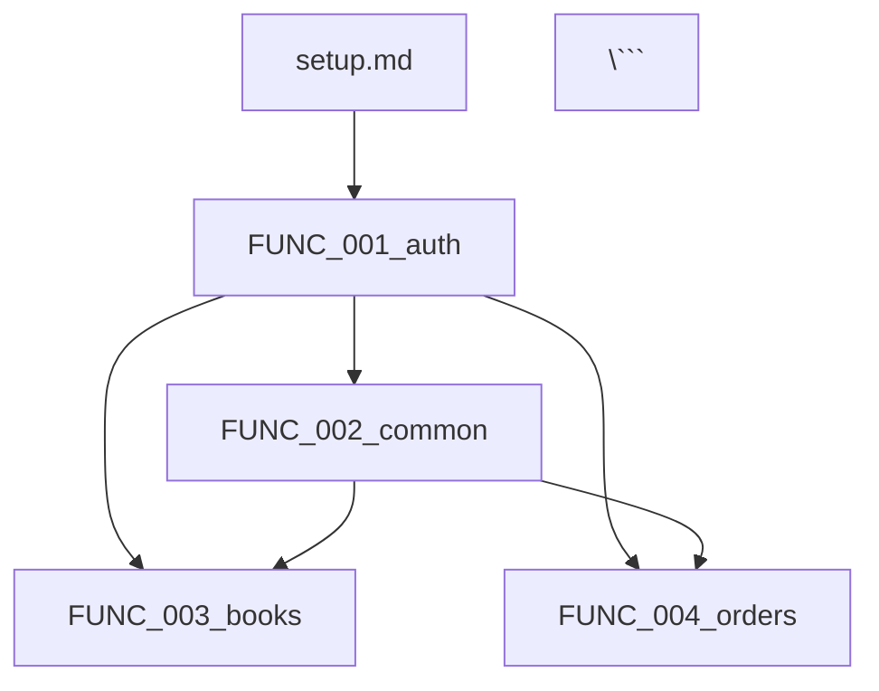

# タスク分解インストラクション

## パラメータ設定

実行前に以下のパラメータを設定する

```yaml
project_root: "ここにプロジェクトルートのパスを入力"
spec_directory: "ここにSPECディレクトリのパスを入力"
output_directory: "ここにタスク出力先のパスを入力（オプション）"
```

* 例
```yaml
project_root: "projects/sdd/bookstore/back-office-api-sdd"
spec_directory: "projects/sdd/bookstore/back-office-api-sdd/specs"
output_directory: "projects/sdd/bookstore/back-office-api-sdd/tasks"
```

注意
* パス区切りはOS環境に応じて調整する（Windows: `\`, Unix/Linux/Mac: `/`）
* 以降、`{project_root}` と表記されている箇所は、上記で設定した値に置き換える

---

## 概要

このインストラクションは、基本設計SPEC（basic_design/）を分析して、複数人が並行して作業できる実装タスクリストを分解・生成するためのものである

重要な方針
* タスクリストは抽象度の高いレベルで作成する
* ソースコードや詳細な実装手順は含めない
* 各タスクは「何を作成・修正するか」を明確に示す
* 詳細な実装は次の「実装フェーズ（コード生成）」でSPECを参照して行う
* タスク分解の結果として、機能を依存関係に基づいて識別し、実装順序を決定する
* この識別結果に基づいて、次の詳細設計フェーズで detailed_design/ フォルダ構造を作成する

タスク分解の成果物と依存関係の明示方法:

1. `tasks/tasks.md`（メインタスクリスト）に以下を記載:
   * タスク概要表: 各タスクの「依存タスク」「並行実行可能」「レベル」を明記
   * 実行順序セクション: レベル別に実行順序を記載
   * 依存関係図: Mermaid形式でタスク間の依存関係を可視化

2. 各タスクファイル（`FUNC_XXX.md`）のヘッダーに以下のメタデータを記載:
   * 依存タスク: このタスクを開始する前に完了が必要なタスク
   * 並行実行可能: このタスクと同時に実行可能なタスク

これにより、詳細設計フェーズとコード生成フェーズでは、`tasks/tasks.md`を参照するだけで、どの順序で実行すべきかが明確になります。

出力先
* ベースプロジェクトの場合: `{project_root}/tasks/` ディレクトリ
* 拡張の場合: `{spec_directory}/tasks/` ディレクトリ
* 重要: `{project_root}` と `{spec_directory}` は、パラメータで指定した値に置き換える

---

## 1. 設計ドキュメントの分析

パラメータで指定されたプロジェクト情報に基づいて、以下の設計ドキュメントを読み込んで分析する

注意: `{project_root}` は、パラメータで指定されたパスに置き換える。全てのパスはそのプロジェクトルートを基準とした相対パスである

### 1.1 Agent Skillsルール（最優先で確認）

* @agent_skills/jakarta-ee-api-base/principles/ - Jakarta EE開発の原則、アーキテクチャ標準、品質基準、セキュリティ標準を確認する
  * このフォルダ配下の原則ドキュメントを読み込み、共通ルールを遵守すること
  * 重要: タスク分解においても、ルールドキュメントに記載されたすべてのルールを遵守すること
  * 注意: Agent Skills配下のルールは全プロジェクト共通。プロジェクト固有のルールがある場合は `{project_root}/principles/` も確認すること

### 1.2 フレームワーク仕様（該当する場合）

* @agent_skills/jakarta-ee-api-base/frameworks/ - フレームワーク固有のSPECやサンプルコードを確認する
  * 特定のフレームワーク（ライブラリ、ツール等）の使用方法、設計パターン、実装例を参照する
  * タスク分解時に、フレームワーク固有の実装要件を考慮する

### 1.3 必須ドキュメント（basic_design/配下 - 基本設計SPEC）

* architecture_design.md - 技術スタック、アーキテクチャパターン、ライブラリを確認する
  * アーキテクチャパターンを識別する
  * データ管理方針を確認する
  * 外部連携要件を確認する
* functional_design.md - システム全体の機能設計（全APIを含む）を確認する
  * 全ての機能を分析する
  * 何が共通機能で何が機能固有機能かを識別する
* data_model.md - テーブル定義とERDを確認する（該当する場合）
* behaviors.md - システム全体の振る舞い（全APIの振る舞いを含む）を確認する
* external_interface.md - 外部連携とAPI仕様を確認する（該当する場合）

注意: 
* 基本設計フェーズでは、detailed_design/フォルダはまだ作成されていない
* 全ての機能と振る舞いは basic_design/functional_design.md と basic_design/behaviors.md に記載されている
* タスク分解フェーズで、これらを分析して機能を依存関係に基づいて識別し、実装順序を決定する

---

## 2. タスクファイルの分割構造

* 出力先の決定:
  * ベースプロジェクトの場合: `{project_root}/tasks/` ディレクトリ
  * 拡張の場合: `{spec_directory}/tasks/` ディレクトリ

重要: 
* `{project_root}` は、パラメータで指定されたパスに置き換えてください
* ベースプロジェクトのタスクは `{project_root}/tasks/` に配置
* 拡張のタスクは `{spec_directory}/tasks/` に配置（例: `specs/enhancements/202512_inventory_alert/tasks/`）

複数人が並行して作業できるように、以下のようにタスクファイルを分割して生成してください：

### 2.1 メインタスクリスト

`tasks/tasks.md` （指定された出力先に配置）
* プロジェクト全体の実行順序を示すメインタスクリスト
* 各タスクと担当者割り当ての概要
* 他のタスクファイルへのリンク集
* タスク間の依存関係を明示する

### 2.2 setupタスク（特別なタスク）

`tasks/setup.md`
* 唯一の固定タスク（常に最初に実行される）
* プロジェクト初期化（全員が実行前に1回だけ）
* 開発環境セットアップ
* データベース初期化
* すべての機能タスクはこのsetupタスクに依存する
* アプリケーションサーバー設定
* ログ設定
* 静的リソース配置

### 2.3 機能タスク（依存関係ベース分解）

機能（API、サービス、基盤コンポーネント）を依存関係に基づいて分解し、実装順序を決定します。

#### ステップ1: 機能の抽出

basic_design/配下のSPECから全ての機能を抽出：

* basic_design/functional_design.md: 全機能の仕様
* basic_design/architecture_design.md: アーキテクチャと技術選定
* basic_design/data_model.md: エンティティとDAO
* basic_design/external_interface.md: 外部API連携

抽出する機能タイプ：
* 基盤コンポーネント: Entity、Dao、認証基盤、ユーティリティ、フィルター
* ビジネスサービス: 複数のAPIから使われるサービス（例: 注文処理サービス）
* API機能: REST APIエンドポイント（Resource、DTO、API固有Service）
* 外部連携: 外部API連携クライアント

#### ステップ2: 依存関係の分析

各機能が何に依存しているかを識別：

分析観点：
* データ依存: どのEntityやDaoを使用するか
* サービス依存: どのServiceを呼び出すか
* 認証依存: 認証基盤を必要とするか
* 外部API依存: 外部システムとの連携が必要か

依存関係の記録：
```yaml
FUNC_004_books_api:
  depends_on:
    - FUNC_001_auth     # 認証・認可機能
    - FUNC_002_inventory   # 在庫管理サービス
```

#### ステップ3: 実装順序の決定（トポロジカルソート）

依存関係グラフをトポロジカルソートして実装順序を決定：

1. setupにのみ依存する機能をレベル1に配置
   * 例: FUNC_001_xxx（内容はプロジェクトにより異なる: 認証・認可、Entity、Dao等）

2. レベル1のみに依存する機能を次に配置（レベル2）
   * 例: FUNC_002_xxx（内容はプロジェクトにより異なる: 共通Service、ビジネスロジック等）

3. レベル1-2に依存する機能を配置（レベル3）
   * 例: FUNC_003_books、FUNC_004_orders

4. 同一レベルの機能は並行実行可能

#### ステップ4: タスクファイルの生成

タスクファイルの命名規則：
* setupタスク: `tasks/setup.md`（固定）
* 機能タスク: `tasks/FUNC_[番号]_[機能名].md`
* 番号は依存関係に基づく実装順序（推奨されるが、必須ではない）
* 機能名はプロジェクト固有（例: auth、books、orders等）
* 例: `FUNC_001_auth.md`、`FUNC_002_books.md`、`FUNC_003_orders.md`

各タスクファイルに含めるメタデータ：
```markdown
# FUNC_XXX: [機能名]

## メタデータ
* タスクID: FUNC_XXX
* 機能タイプ: [基盤/サービス/API/外部連携]
* 依存タスク: [FUNC_YYY, FUNC_ZZZ]
* 並行実行可能: [FUNC_AAA, FUNC_BBB]
* 担当者: [割り当て]

## 実装内容
[詳細なタスク内容]
```

重要な原則：
* 「共通」という特別な分類は不要
* 依存関係の分析で自然に実装順序が決まる
* 同じレベルのタスクは並行実行可能
* タスク番号（FUNC_001、FUNC_002...）は実装順序を示すだけで、永続的なIDではない

---

## 3. タスク分解ルール

### 3.1 並行実行の判断基準（依存関係ベース）

並行実行可能性は依存関係グラフから自動的に決まります：

* 並行実行可能（同一レベルのタスク）
  * 依存関係グラフで同じレベルに配置されたタスク
  * 例: FUNC_003とFUNC_004が両方ともFUNC_001とFUNC_002のみに依存する場合、並行実行可能
  * 異なるファイルを編集する
  * 独立したリソース（Entity、API等）を扱う

* 順次実行が必要（異なるレベルのタスク）
  * 依存関係がある場合（例: FUNC_002がFUNC_001に依存）
  * 同じファイルを編集する場合
  * 共有リソースへのアクセスが競合する場合

タスクファイルのメタデータで明示：
```yaml
並行実行可能: [FUNC_004, FUNC_005]  # 同じレベルのタスク
依存タスク: [FUNC_001, FUNC_002]     # これらが完了後に実行可能
```

### 3.2 タスクの粒度

重要: タスクは抽象度の高いレベルで定義し、ソースコードは含めない

各タスクは以下の粒度で分割する
* Entity/Model: 1エンティティクラスの作成/修正
* DTO/Response: 1 DTOまたはレスポンスモデルクラスの作成/修正
* Dao: 1 Daoクラスの作成/修正
* Service: 1 Serviceクラスの作成/修正（複雑な場合は複数タスクに分割）
* Resource: 1 Resourceクラスの作成/修正
* Filter/Interceptor/ExceptionMapper: 1コンポーネントの作成/修正
* RestClient: 1外部API連携クライアントの作成/修正
* Test: 1テストクラスの作成/修正

* 注意: 上記の用語はプロジェクトの技術スタックに応じて読み替える

* タスクの記述レベル
  * 「何を作成・修正するか」を明確に記述する
  * 「どのような機能を実装するか」を簡潔に記述する
  * ソースコードや詳細な実装手順は記述しない
  * 詳細な実装は次の「実装フェーズ（コード生成）」で行う

### 3.3 依存関係の順序付け（トポロジカルソート）

依存関係グラフに基づいて自動的にタスクを配置：

#### レベル0: setupタスク（特別なタスク）
* 唯一の固定タスク
* `tasks/setup.md`
* 開発環境構築、プロジェクト初期化、データベース設定
* すべての機能タスクはこのタスクに依存する

#### レベル1以降: 依存関係に基づく機能タスク

トポロジカルソートで決定された順序：

典型的なパターン例（プロジェクトごとに異なる）：

レベル1（依存されるが依存しない）:
* 例: `FUNC_001_auth.md`（内容はプロジェクト固有）
  * Entity、Dao、認証基盤、ユーティリティ
  * フィルター、例外ハンドラ、共通DTO

レベル2（レベル1のみに依存）:
* `FUNC_002_order_service.md`
  * 注文処理サービス（複数APIから使用）
* `FUNC_003_payment_service.md`
  * 決済処理サービス（複数APIから使用）

レベル3（レベル1-2に依存、並行実行可能）:
* `FUNC_004_books_api.md` [並行: FUNC_005, FUNC_006]
* `FUNC_005_orders_api.md` [並行: FUNC_004, FUNC_006]
* `FUNC_006_images_api.md` [並行: FUNC_004, FUNC_005]

重要な原則：
* レベルは依存関係から自動的に決まる
* 同じレベルのタスクは並行実行可能
* 「共通」という分類は使わない（依存関係の結果として自然に最初のレベルに配置される）

---

## 4. タスクファイルのフォーマット

各タスクファイルには以下の情報を含める

### 4.1 ヘッダー情報（メタデータ）

```markdown
# [タスクファイル名]

## メタデータ
* タスクID: FUNC_XXX
* 依存タスク: [このタスクを開始する前に完了が必要なタスク]
  * 例: setup.md, FUNC_001_auth.md
* 並行実行可能: [このタスクと同時に実行可能なタスク]
  * 例: FUNC_003_books.md, FUNC_004_orders.md
  * 注: 並行実行可能なタスクがない場合は「なし」と記載
* 担当者: [想定人数と役割]
* 推奨スキル: [必要なスキルセット]
* 想定工数: [時間]

## 実装内容
[このタスクで実装するコンポーネントの説明]
```

重要: 
* 「依存タスク」と「並行実行可能」は、tasks/tasks.mdのタスク概要表と一致させる
* これにより、詳細設計やコード生成フェーズで実行順序を判断できる

### 4.2 タスクリスト

```markdown
* [ ] [P] タスク X.X.X: [タスク名]
  * 目的: [このタスクで実現する機能・目的]
  * 対象: [作成/修正するコンポーネント名やファイル名]
  * 参照SPEC: [参照するSPEC（Markdownリンク形式）] の「[セクション番号 セクション名]」
  * 注意事項: [考慮すべき点があれば記載]
```

* タスクID命名規則
  * タスクIDはアンダースコア区切りを使用する（例: `T_SETUP_001`, `T_API001_003`）
  * ハイフンは使用しない（例: ~~`T-SETUP-001`~~, ~~`T-API001-003`~~）
  * 形式: `T_[カテゴリ]_[連番]` または `T_[FUNC_ID]_[連番]`

* SPEC参照の記述規則
  * 必須: Markdownリンク形式で記述し、クリックで直接SPECファイルに飛べるようにする
  * 必須: 相対パスを使用する（タスクファイルからSPECファイルへの相対パス）
  * 必須: 具体的なセクション番号とセクション名を明記する
  * 形式: `[ファイル名](相対パス) の「セクション番号 セクション名」`

* 記述例

```markdown
* [ ] T_API002_003: StockDao の作成
  * 目的: 在庫情報の検索・更新機能を実装する
  * 対象: StockDao.java (DAOクラス)
  * 参照SPEC: [functional_design.md](../specs/baseline/detailed_design/FUNC_002_stocks/functional_design.md) の「2.2 StockDao」
  * 注意事項: 楽観的ロックに対応したupdate処理を実装すること
```

* 複数SPEC参照の例

```markdown
* [ ] T_API002_006: StockResource の作成
  * 目的: 在庫管理APIエンドポイントを実装する
  * 対象: StockResource.java (JAX-RS Resourceクラス)
  * 参照SPEC: 
    * [functional_design.md](../specs/baseline/detailed_design/FUNC_002_stocks/functional_design.md) の「2. エンドポイント仕様」
    * [behaviors.md](../specs/baseline/detailed_design/FUNC_002_stocks/behaviors.md) の「2. 在庫API」
  * 注意事項: OptimisticLockException発生時はHTTP 409 Conflictを返すこと
```

注意: ソースコードや詳細な実装手順は記述しない

---

## 5. メインタスクリスト（tasks.md）の構造

`{project_root}/tasks/tasks.md` は以下の構造で生成する

```markdown
# [プロジェクト名] - 実装タスクリスト

## 全体構成と担当割り当て

### タスク概要

| タスク | タスクファイル | 依存タスク | 並行実行可能 | レベル | 担当者 | 想定工数 |
|---------|--------------|----------|------------|--------|--------|---------|
| 0. setup | setup.md | - | 不可 | L0 | 全員 | [分析から算出] |
| 1. FUNC_001 | FUNC_001_infrastructure.md | setup | 不可 | L1 | チームA | [分析から算出] |
| 2. FUNC_002 | FUNC_002_order_service.md | FUNC_001 | 不可 | L2 | チームB | [分析から算出] |
| 3. FUNC_003 | FUNC_003_books_api.md | FUNC_001, FUNC_002 | FUNC_004, FUNC_005 | L3 | 担当者A | [分析から算出] |
| 4. FUNC_004 | FUNC_004_orders_api.md | FUNC_001, FUNC_002 | FUNC_003, FUNC_005 | L3 | 担当者B | [分析から算出] |
| 5. FUNC_005 | FUNC_005_images_api.md | FUNC_001 | FUNC_003, FUNC_004 | L3 | 担当者C | [分析から算出] |
| ... | ... | ... | ... | ... | ... | ... |
重要: 
* 「依存タスク」列: このタスクを開始する前に完了している必要があるタスク
* 「並行実行可能」列: このタスクと同時に実行可能な他のタスク
* 「レベル」列: 依存関係グラフから自動計算されたレベル（同じレベルは並行実行可能）

### 実行順序（依存関係グラフから自動決定）

レベル0（前提なし）:
* setup.md

レベル1（setupに依存）:
* FUNC_001_auth.md（例）
  * 内容例: 認証・認可、JWT処理
  * 理由: 他の機能がこれに依存

レベル2（FUNC_001に依存）:
* FUNC_002_common.md（例）
  * 内容例: Entity、Dao、共通Service
  * 理由: 他の機能がこれに依存

レベル3（並行実行可能）← 並行化のポイント
* FUNC_003_books_api.md（依存: FUNC_001, FUNC_002 / 並行: FUNC_004, FUNC_005）
* FUNC_004_orders_api.md（依存: FUNC_001, FUNC_002 / 並行: FUNC_003, FUNC_005）
* FUNC_005_images_api.md（依存: FUNC_001 / 並行: FUNC_003, FUNC_004）

### タスクファイル一覧（実行順序）

レベル0:
* [setup.md](setup.md) - セットアップ

レベル1:
* [FUNC_001_auth.md](FUNC_001_auth.md) - [内容は依存関係分析で決定]

レベル2:
* [FUNC_002_order_service.md](FUNC_002_order_service.md) - [内容は依存関係分析で決定]

レベル3（並行実行可能）:
* [FUNC_003_books_api.md](FUNC_003_books_api.md) - [内容は依存関係分析で決定]
* [FUNC_004_orders_api.md](FUNC_004_orders_api.md) - [内容は依存関係分析で決定]
* [FUNC_005_images_api.md](FUNC_005_images_api.md) - [内容は依存関係分析で決定]

## 依存関係図



* 生成時の注意
  * プロジェクト名はrequirements.mdから取得する
  * 機能の数、命名、分割方法はSPECから判断する
  * 依存関係はSPECを分析して自動的に決定する
  * レベル（L0、L1...）は依存関係グラフから自動計算する
  * 想定工数は各タスクの複雑度分析から算出する
  * ファイル名はすべてアンダースコア区切りを使用する

---

## 6. 成果物チェックリスト

生成されるタスクファイルが満たすべき要件
* ソースコードや詳細な実装手順を含まず、「何を作成・修正するか」を明確に記述する
* [P]マークで並行実行可能なタスクを明示し、依存関係を明確に記述する
* タスクIDはアンダースコア区切り（例: `T_SETUP_001`）で一意に付与する
* アーキテクチャパターンに応じた適切なコンポーネントを実装する（詳細はarchitecture_design.mdを参照）

---

## 7. 生成手順（依存関係ベース）

### ステップ1: SPEC分析
* `@agent_skills/jakarta-ee-api-base/principles/` 配下の原則ドキュメントを読み込む
* basic_design/ 配下の全SPECを読み込み、機能全体を把握する
* basic_design/architecture_design.md からアーキテクチャパターンを識別する

### ステップ2: 機能の抽出
basic_design/functional_design.mdを分析して、全機能を抽出：

抽出対象：
* 基盤コンポーネント: Entity、Dao、認証基盤、ユーティリティ、フィルター
* ビジネスサービス: 複数APIから使用されるサービス
* API機能: REST APIエンドポイント（Resource、DTO、API固有Service）
* 外部連携: 外部API連携クライアント

### ステップ3: 依存関係の分析
各機能が何に依存するかを識別：

分析項目：
* どのEntity/Daoを使用するか
* どのServiceを呼び出すか
* 認証基盤を必要とするか
* 外部APIとの連携が必要か

依存関係グラフを作成：
```
FUNC_001 (基盤) ← FUNC_002 (サービス) ← FUNC_003 (API)
                ← FUNC_004 (API)
```

### ステップ4: トポロジカルソート
依存関係グラフをトポロジカルソートして実装順序を決定：

1. 依存されるが依存しない機能を識別（レベル0）
2. レベル0のみに依存する機能を識別（レベル1）
3. 以降、順次レベルを決定
4. 各レベル内の機能は並行実行可能

### ステップ5: タスクファイル生成
FUNC_001、FUNC_002...の順で番号を付け、タスクファイルを生成：

各タスクファイルに含める：
* メタデータ（タスクID、機能タイプ、依存タスク、並行実行可能タスク）
* 詳細なタスク内容
* SPEC参照

### ステップ6: メインリスト生成
`tasks/tasks.md` に以下を生成：
* タスク概要表（レベル情報を含む）
* 実行順序（レベルベース）
* タスクファイル一覧
* 依存関係図（Mermaid形式）

重要原則:
* 「common」という特別な分類は使わない
* 全ての機能をFUNC_XXXとして統一的に扱う
* 依存関係の分析で自然に実装順序が決まる
* タスク番号は実装順序を示すだけで、永続的なIDではない
* この識別結果は、次の詳細設計フェーズで detailed_design/ フォルダ構造を作成する際に使用される
* `{project_root}` と出力先はパラメータで指定される。ファイル名・タスクIDは全てアンダースコア区切りを使用する

---

## 8. 重要な注意事項

### 命名規則

* ファイル名・タスクIDは全てアンダースコア区切り（例: `setup.md`, `T_SETUP_001`）
* ハイフン（`-`）は使用しない

### SPEC参照の記述

全てのタスクの「参照SPEC」は以下の形式で記述する
* Markdownリンク形式でクリック可能にする（例: `[functional_design.md](相対パス)`）
* 具体的なセクション番号とセクション名を明記する（例: `の「2.2 在庫管理機能」`）
* 複数SPEC参照の場合は箇条書きで列挙する
* タスク分解時点では basic_design/ 配下のSPECを参照する
* 注意: detailed_design/ 配下のフォルダは、詳細設計フェーズで作成されるため、タスク分解時点では存在しない

### タスク分解のルール

* ルール遵守: `@agent_skills/jakarta-ee-api-base/principles/` 配下の原則ドキュメント（共通ルール、品質基準、セキュリティ標準、組織標準）を必ず遵守する。プロジェクト固有の原則がある場合は `{project_root}/principles/` も併せて遵守する
* 抽象度の維持: タスクは「何を作るか」のみを記述する。ソースコードや詳細な実装手順は記述しない
* アーキテクチャ適応: basic_design/architecture_design.md からアーキテクチャパターンを識別し、適切なタスクを分解・生成する
* 機能分解: basic_design/functional_design.md を分析して、何が共通機能で何が機能固有機能かを識別する
* 既存コード考慮: 既存実装がある場合は、修正タスクと新規作成タスクを明確に区別する
* APIテスト設定: E2E APIテストは通常ビルドから除外し、個別実行可能にする設定を明記する

### REST API特有の注意点

* 画面（UI）は含まれないため、View/XHTMLに関するタスクは生成しない
* API エンドポイント（Resource）のテストは REST Assured や JAX-RS Client を使用する
* JWT認証、CORS、HTTPステータスコードの適切な使用を考慮する

### プロジェクトルートの扱い

* `{project_root}` は、パラメータで明示的に指定されたパスに置き換える
* 相対パスでも絶対パスでも構わない
* 全てのファイル操作は、このプロジェクトルートを基準に行う
