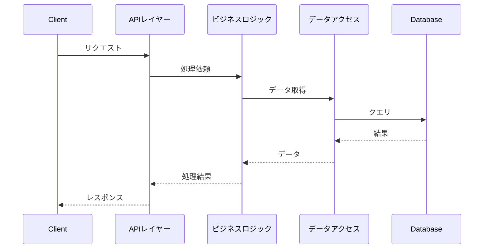

# [API_ID] - API機能設計書

ファイル名: functional_design.md（api/[API_ID]/配下）  
API ID: [API_ID]  
API名: [API_NAME]  
ベースパス: /api/[path]  
バージョン: 1.0.0  
最終更新日: [DATE]

---

## 1. API概要

### 1.1 API名

[API_NAME]

### 1.2 ベースパス

`/api/[path]`

### 1.3 目的

[このAPIが提供する機能の概要]

### 1.4 認証方式

* 認証要否: [要 / 不要]
* 認証方式: [JWT / その他]（認証が必要な場合）

---

## 2. エンドポイント一覧

| No | メソッド | パス | 機能 | 認証要否 |
|----|---------|------|------|---------|
| 1 | [METHOD] | `/api/[path]/[endpoint]` | [機能名] | [要 / 不要] |
| 2 | [METHOD] | `/api/[path]/[endpoint]` | [機能名] | [要 / 不要] |

---

## 3. エンドポイント詳細

### 3.1 [エンドポイント名1]

#### 3.1.1 基本情報

* エンドポイント: `[METHOD] /api/[path]/[endpoint]`
* 機能: [機能の説明]
* 認証: [要 / 不要]

#### 3.1.2 リクエスト

* ヘッダー:
```
Content-Type: application/json
```

* リクエストスキーマ:
| フィールド | 型 | 必須 | 説明 | バリデーション |
|-----------|---|------|------|--------------|
| [field1] | [type] | Yes/No | [説明] | [ルール] |
| [field2] | [type] | Yes/No | [説明] | [ルール] |

* リクエスト例:
```json
{
  "field1": "value1",
  "field2": "value2"
}
```

#### 3.1.3 レスポンス

* 成功時 ([STATUS_CODE]):
* Content-Type: `application/json; charset=UTF-8`

* レスポンススキーマ:
| フィールド | 型 | 説明 |
|-----------|---|------|
| [field1] | [type] | [説明] |
| [field2] | [type] | [説明] |

* レスポンス例:
```json
{
  "field1": "value1",
  "field2": "value2"
}
```

* エラー時:
  * [STATUS_CODE]: [エラーメッセージ]

#### 3.1.4 処理フロー

1. [ステップ1]
2. [ステップ2]
3. [ステップ3]

#### 3.1.5 ビジネスルール

| ルールID | 説明 |
|---------|-------------|
| BR-[XXX]-001 | [ビジネスルールの説明] |
| BR-[XXX]-002 | [ビジネスルールの説明] |

#### 3.1.6 シーケンス図（論理レベル）



注意: 実装クラス名（BookResource、BookService等）は記述しません。論理レベルのコンポーネント名またはレイヤー名を使用します。

---

### 3.2 [エンドポイント名2]

[必要に応じて追加のエンドポイントを記述]

---

## 4. 外部API連携（該当する場合）

### 4.1 [外部API名]

* 連携目的: [目的]
* エンドポイント: [METHOD] [URL]
* 詳細: [external_interface.md](external_interface.md)を参照

---

## 5. ビジネスルール

### 5.1 このAPI固有のビジネスルール

| ルールID | 説明 |
|---------|-------------|
| BR-[XXX]-001 | [ビジネスルールの説明] |
| BR-[XXX]-002 | [ビジネスルールの説明] |

---

## 6. エラーケース

### 6.1 バリデーションエラー

| エラーケース | HTTPステータス | エラーメッセージ |
|------------|--------------|---------------|
| [エラーケース1] | 400 Bad Request | [メッセージ] |

### 6.2 ビジネスエラー

| エラーケース | HTTPステータス | エラーメッセージ |
|------------|--------------|---------------|
| [エラーケース1] | 409 Conflict | [メッセージ] |

### 6.3 システムエラー

| エラーケース | HTTPステータス | エラーメッセージ |
|------------|--------------|---------------|
| [エラーケース1] | 500 Internal Server Error | [メッセージ] |

---

## 7. 参考資料

* [../../system/functional_design.md](../../system/functional_design.md) - システム機能設計書
* [../../system/data_model.md](../../system/data_model.md) - データモデル仕様書
* [behaviors.md](behaviors.md) - API振る舞い仕様書
* [detailed_design.md](detailed_design.md) - API詳細設計書
