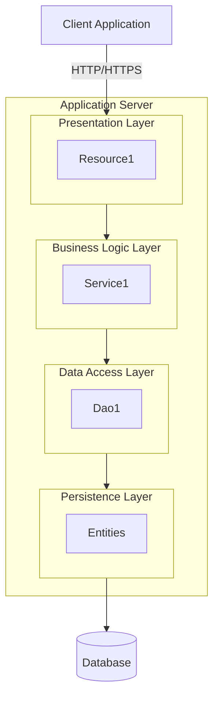
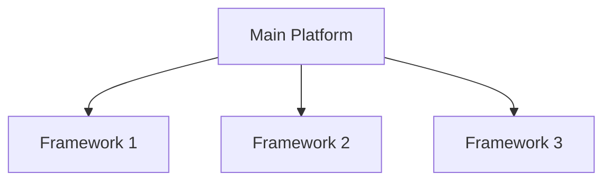
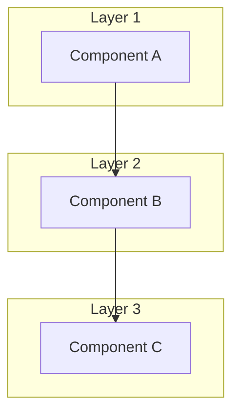
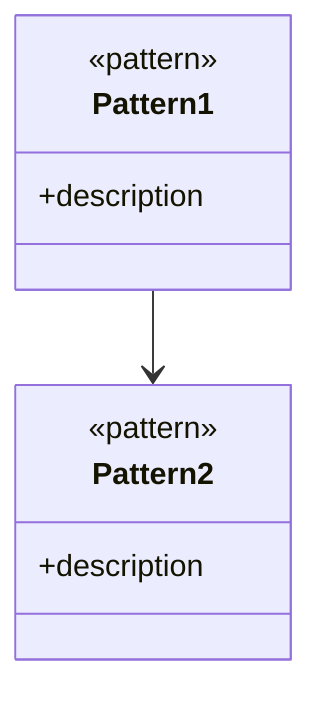
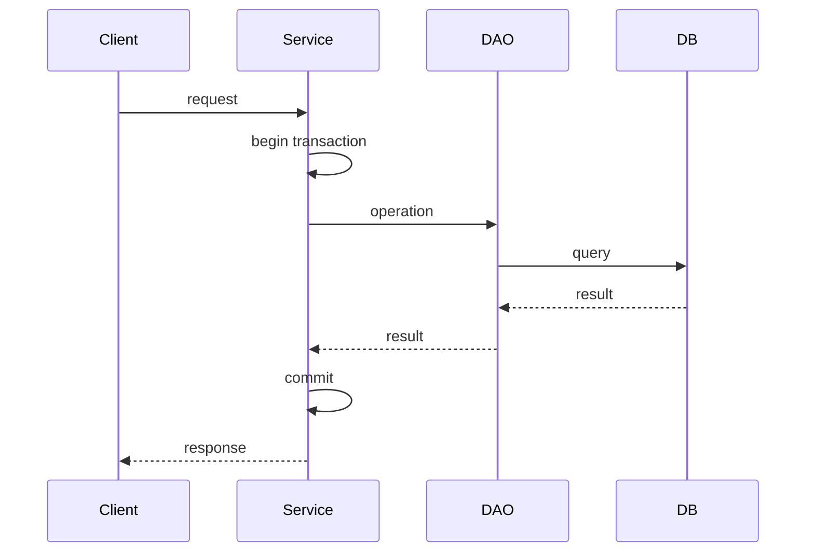
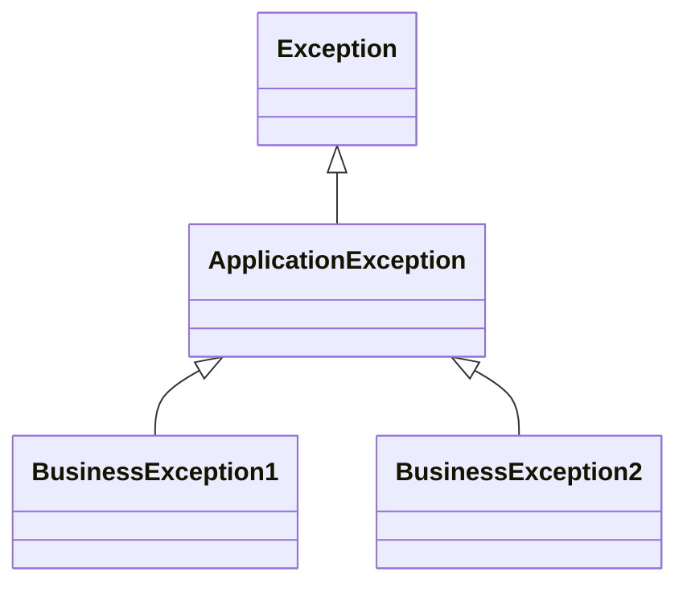
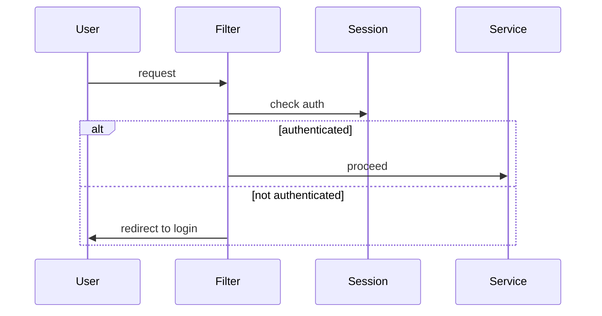
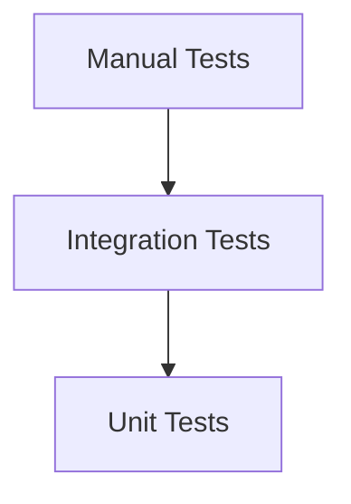

# [PROJECT_NAME] - アーキテクチャ設計書

プロジェクトID: [PROJECT_ID]  
バージョン: 1.0.0  
最終更新日: [DATE]  
ステータス: [STATUS]

* 変更履歴:
  * v1.0.0 ([DATE]): 初版

---

## 1. システム概要

### 1.1 システム名

[SYSTEM_NAME]

### 1.2 アーキテクチャスタイル

* アーキテクチャパターン: [レイヤードアーキテクチャ / マイクロサービス / BFF / その他]
* API設計: [RESTful API / GraphQL / その他]
* データアクセス: [JPA / JDBC / その他]
* 認証方式: [JWT / セッション / OAuth / その他]

---

## 2. 全体アーキテクチャ

### 2.1 システム構成図

[Mermaid図でシステム全体の構成を表示]



注意: 実際のプロジェクトに応じて、より詳細な構成図を記述してください

### 2.2 アーキテクチャパターンの説明

[採用したアーキテクチャパターンの詳細説明]

* BFFパターンの場合:
  * BFF層の役割
  * バックエンドサービスとの関係
  * 責務分担

* マイクロサービスの場合:
  * サービス間通信
  * データ管理の責務分担
  * サービス境界

---

## 3. パッケージ構造

### 3.1 ベースパッケージ

```
[BASE_PACKAGE]
```

### 3.2 パッケージ階層（概要）

```
[BASE_PACKAGE]/
├── api                    # Presentation Layer (JAX-RS Resources)
│   ├── dto               # Data Transfer Objects
│   └── exception         # Exception Mappers
├── service               # Business Logic Layer
├── dao                   # Data Access Layer
├── entity                # Persistence Layer (JPA Entities)
├── security              # Security (JWT, Authentication)
├── exception             # General Exception Mappers
├── common                # Common Classes
└── util                  # Utilities
```

* 詳細なクラス構成: 各API機能の`detailed_design.md`を参照してください。

| API | 詳細設計書 |
|-----|----------|
| [API_NAME_1] | [../api/API_XXX/detailed_design.md](../api/API_XXX/detailed_design.md) |
| [API_NAME_2] | [../api/API_YYY/detailed_design.md](../api/API_YYY/detailed_design.md) |

---

## 4. 技術スタック

### 1.1 コアプラットフォーム

| レイヤー | 技術 | バージョン | 選定理由 |
|-------|-----------|---------|-----------|
| ランタイム | [RUNTIME] | [VERSION] | [REASON] |
| プラットフォーム | [PLATFORM] | [VERSION] | [REASON] |
| アプリサーバー | [SERVER] | [VERSION] | [REASON] |
| データベース | [DATABASE] | [VERSION] | [REASON] |
| ビルドツール | [BUILD_TOOL] | [VERSION] | [REASON] |

### 1.2 フレームワーク仕様

[必要に応じてMermaid図を追加]



| 仕様 | バージョン | 目的 |
|--------------|---------|---------|
| [SPEC_1] | [VERSION] | [PURPOSE] |
| [SPEC_2] | [VERSION] | [PURPOSE] |
| [SPEC_3] | [VERSION] | [PURPOSE] |

### 1.3 追加ライブラリ

| ライブラリ | 目的 | 選定理由 |
|---------|---------|-----------|
| [LIBRARY_1] | [PURPOSE] | [REASON] |
| [LIBRARY_2] | [PURPOSE] | [REASON] |

---

## 2. アーキテクチャ設計

### 2.1 アーキテクチャパターン

[レイヤードアーキテクチャ、マイクロサービス、イベント駆動などの説明]



### 2.2 コンポーネントの責務

| レイヤー | 責務 | 禁止事項 |
|-------|-----------------|-------------------|
| [LAYER_1] | • [RESPONSIBILITY_1]<br/>• [RESPONSIBILITY_2] | • [FORBIDDEN_1]<br/>• [FORBIDDEN_2] |
| [LAYER_2] | • [RESPONSIBILITY_1]<br/>• [RESPONSIBILITY_2] | • [FORBIDDEN_1]<br/>• [FORBIDDEN_2] |
| [LAYER_3] | • [RESPONSIBILITY_1]<br/>• [RESPONSIBILITY_2] | • [FORBIDDEN_1]<br/>• [FORBIDDEN_2] |

---

## 3. デザインパターン

### 3.1 適用パターン

[Mermaid図でパターンの関係を表示]



| パターン | 目的 | 適用箇所 |
|---------|------|---------|
| [PATTERN_1] | [PURPOSE] | [LOCATION] |
| [PATTERN_2] | [PURPOSE] | [LOCATION] |
| [PATTERN_3] | [PURPOSE] | [LOCATION] |

---

## 4. パッケージ構造と命名規則

### 4.1 パッケージ構成

```
[BASE_PACKAGE]/
├── entity/          # [DESCRIPTION]
├── dao/             # [DESCRIPTION]
├── service/         # [DESCRIPTION]
├── bean/            # [DESCRIPTION]
├── util/            # [DESCRIPTION]
└── filter/          # [DESCRIPTION]
```

### 4.2 命名規則

| コンポーネントタイプ | パッケージ | クラス名パターン | 例 |
|------------------|----------|----------------|-----|
| [TYPE_1] | `[package]` | `[Pattern]` | `[Example]` |
| [TYPE_2] | `[package]` | `[Pattern]` | `[Example]` |
| [TYPE_3] | `[package]` | `[Pattern]` | `[Example]` |

---

## 5. 状態管理

### 5.1 状態管理戦略

[セッション、アプリケーションスコープなどの説明]

| スコープ | 用途 | ライフサイクル | 例 |
|---------|------|--------------|-----|
| [SCOPE_1] | [USAGE] | [LIFECYCLE] | [EXAMPLE] |
| [SCOPE_2] | [USAGE] | [LIFECYCLE] | [EXAMPLE] |

---

## 6. トランザクション管理

### 6.1 トランザクション戦略

[トランザクション境界の説明]



---

## 7. 並行制御

### 7.1 並行制御戦略

[楽観的ロック、悲観的ロックなどの説明]

| 戦略 | 適用箇所 | 実装方法 |
|------|---------|---------|
| [STRATEGY_1] | [LOCATION] | [METHOD] |
| [STRATEGY_2] | [LOCATION] | [METHOD] |

---

## 8. エラーハンドリング戦略

### 8.1 例外階層



### 8.2 エラーハンドリングフロー

[エラー処理の流れを説明]

---

## 9. セキュリティアーキテクチャ

### 9.1 認証・認可

| 項目 | 実装方法 | 詳細 |
|------|---------|------|
| 認証 | [METHOD] | [DETAILS] |
| 認可 | [METHOD] | [DETAILS] |
| セッション管理 | [METHOD] | [DETAILS] |

### 9.2 セキュリティフロー



---

## 10. データベース構成

### 10.1 接続設定

| 項目 | 設定値 | 説明 |
|------|--------|------|
| データベース種別 | [DATABASE] | [DESCRIPTION] |
| 接続方式 | JDBC（JPA経由） | - |
| データソース名（JNDI） | [JNDI_NAME] | 例: java:app/jdbc/testdb |
| 接続プール管理 | アプリケーションサーバー | - |
| トランザクション分離レベル | [ISOLATION_LEVEL] | - |

### 10.2 persistence.xml設定

* ファイル: `src/main/resources/META-INF/persistence.xml`
* Persistence Unit名: [PERSISTENCE_UNIT_NAME]
* JNDI名: [JNDI_NAME]

### 10.3 アクセステーブル

本システムがアクセスするテーブル：

| テーブル名 | 用途 | アクセス権限 |
|----------|------|------------|
| [TABLE_1] | [PURPOSE] | READ, WRITE |
| [TABLE_2] | [PURPOSE] | READ |

---

## 11. ログ戦略

### 11.1 ロギング設定

| ログレベル | 用途 | 例 |
|----------|------|-----|
| ERROR | [USAGE] | [EXAMPLE] |
| WARN | [USAGE] | [EXAMPLE] |
| INFO | [USAGE] | [EXAMPLE] |
| DEBUG | [USAGE] | [EXAMPLE] |

---

## 12. ビルド＆デプロイ

### 12.1 ビルドプロセス

```
[BUILD_COMMAND_1]
[BUILD_COMMAND_2]
[BUILD_COMMAND_3]
```

### 12.2 デプロイアーキテクチャ

[デプロイ構成の説明]

---

## 13. テスト戦略

### 13.1 テストピラミッド



### 13.2 テストアプローチ

| テストタイプ | ツール | カバレッジ目標 | 対象 |
|------------|--------|--------------|------|
| [TYPE_1] | [TOOL] | [COVERAGE] | [TARGET] |
| [TYPE_2] | [TOOL] | [COVERAGE] | [TARGET] |

---

## 14. パフォーマンス考慮事項

### 14.1 最適化戦略

| 項目 | 戦略 | 期待効果 |
|------|------|---------|
| [ITEM_1] | [STRATEGY] | [EFFECT] |
| [ITEM_2] | [STRATEGY] | [EFFECT] |

---

## 15. 技術リスクと軽減策

| リスク | 確率 | 影響度 | 軽減策 |
|--------|------|--------|--------|
| [RISK_1] | [PROBABILITY] | [IMPACT] | [MITIGATION] |
| [RISK_2] | [PROBABILITY] | [IMPACT] | [MITIGATION] |

---

## 16. 開発ガイドライン

### 16.1 コーディング規約

* 命名規則:
  * [NAMING_CONVENTION_1]
  * [NAMING_CONVENTION_2]

* コードフォーマット:
  * [FORMAT_RULE_1]
  * [FORMAT_RULE_2]

### 16.2 コミット規約

* コミットメッセージフォーマット:
  ```
  [TYPE]: [SUBJECT]
  
  [BODY]
  
  [FOOTER]
  ```

* コミットタイプ:
  * `feat`: 新機能
  * `fix`: バグ修正
  * `docs`: ドキュメント変更
  * `style`: コードフォーマット
  * `refactor`: リファクタリング
  * `test`: テスト追加・修正
  * `chore`: ビルドプロセス・補助ツール変更

### 16.3 ブランチ戦略

* ブランチモデル: [BRANCH_MODEL] (例: Git Flow, GitHub Flow)
* ブランチ命名規則:
  * `main`: 本番環境
  * `develop`: 開発環境
  * `feature/[FEATURE_NAME]`: 機能開発
  * `bugfix/[BUG_NAME]`: バグ修正
  * `hotfix/[ISSUE_NAME]`: 緊急修正

### 16.4 コードレビュー

* レビュー観点:
  * [REVIEW_POINT_1]
  * [REVIEW_POINT_2]

* 承認ルール:
  * [APPROVAL_RULE]

---

## 17. 将来の拡張（スコープ外）

### 17.1 想定される拡張機能

以下の機能は現在のスコープ外であるが、将来的な拡張の可能性を考慮してアーキテクチャを設計している。

* [FUTURE_FEATURE_1]:
  * 概要: [DESCRIPTION]
  * 拡張ポイント: [EXTENSION_POINT]

* [FUTURE_FEATURE_2]:
  * 概要: [DESCRIPTION]
  * 拡張ポイント: [EXTENSION_POINT]

### 17.2 アーキテクチャの拡張性

* 拡張可能な領域:
  * [EXTENSIBLE_AREA_1]
  * [EXTENSIBLE_AREA_2]

* 拡張時の注意点:
  * [CONSIDERATION_1]
  * [CONSIDERATION_2]

---

## 18. API仕様書（OpenAPI）

### 18.1 本システムが公開するAPI仕様

本システムが外部に公開するAPI仕様については、各APIディレクトリ配下のOpenAPI (YAML) 仕様書を参照してください：

| API | OpenAPI仕様書 | 説明 |
|-----|-------------|------|
| [API_NAME_1] | [../api/API_XXX/openapi.yaml](../api/API_XXX/openapi.yaml) | [DESCRIPTION] |
| [API_NAME_2] | [../api/API_YYY/openapi.yaml](../api/API_YYY/openapi.yaml) | [DESCRIPTION] |

注意: OpenAPI仕様書が不要な場合は、このセクションを「該当なし」とする

---

## 19. 参考資料

### 19.1 公式ドキュメント

* Jakarta EE 10: https://jakarta.ee/specifications/platform/10/
* JAX-RS 3.1: https://jakarta.ee/specifications/restful-ws/3.1/
* JPA 3.1: https://jakarta.ee/specifications/persistence/3.1/
* CDI 4.0: https://jakarta.ee/specifications/cdi/4.0/

### 19.2 関連仕様書

* [requirements.md](requirements.md) - 要件定義書
* [functional_design.md](functional_design.md) - 機能設計書
* [data_model.md](data_model.md) - データモデル仕様書
* [external_interface.md](external_interface.md) - 外部インターフェース仕様書

### 19.3 サンプルコード・リポジトリ

* [SAMPLE_1]: [URL]
* [SAMPLE_2]: [URL]
