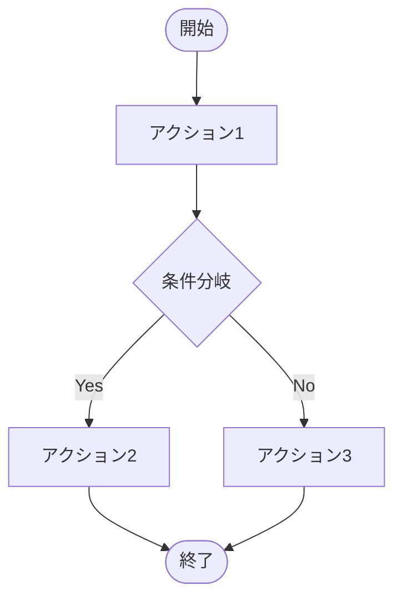

# [PROJECT_NAME] - システム機能設計書

ファイル名: functional_design.md（system/配下）  
プロジェクトID: [PROJECT_ID]  
バージョン: 1.0.0  
最終更新日: [DATE]  
ステータス: [STATUS]

---

## 1. 概要

本文書は、[PROJECT_NAME]システム全体の機能設計を記述する。システム全体のユーザーストーリー、ビジネスルール、システム全体のユーザーフロー、データフローを論理レベルで定義する。

* 機能固有の詳細設計は、各detailed_design/FUNC_XXX/detailed_design.mdを参照すること
* 実装クラス設計（JPAエンティティ、Dao、Service等）、メソッドシグネチャ、アノテーションは詳細設計で記述します

---

## 2. システム概要

### 2.1 システムアーキテクチャ

[システム全体のアーキテクチャ概要、レイヤー構成、主要コンポーネント]

### 2.2 機能一覧

| 機能ID | 機能名 | ベースパス | 説明 | 詳細設計書 |
|--------|------|----------|------|----------|
| FUNC_001 | [機能名1] | /api/[path] | [説明] | [../detailed_design/FUNC_001/detailed_design.md](../detailed_design/FUNC_001/detailed_design.md) |
| FUNC_002 | [機能名2] | /api/[path] | [説明] | [../detailed_design/FUNC_002/detailed_design.md](../detailed_design/FUNC_002/detailed_design.md) |

---

## 3. システム横断的な機能

注意: 機能固有の詳細設計は、各detailed_design/FUNC_XXX/detailed_design.mdを参照してください。

### 3.1 認証

* 認証方式: [JWT / セッション / その他]
* 認証フロー: [認証の流れを論理レベルで記述]
* トークン管理: [トークンの生成、検証、保持方法]
* 有効期限: [EXPIRATION]

### 3.2 ログ処理

* ログレベル: [ERROR, WARN, INFO, DEBUG]
* ログ出力方針: [どのような情報をログに出力するか]

### 3.3 エラーハンドリング

* エラーレスポンス形式: [統一的なエラーレスポンス構造]
* 例外マッピング: [例外とHTTPステータスコードのマッピング]

---

## 4. 機能設計

### 4.1 [機能1]

#### 4.1.1 ユーザーストーリー

```
As a [USER_ROLE]
I want to [ACTION]
So that [BENEFIT]
```

#### 4.1.2 機能フロー

[フロー名1]::
1. [ステップ1]
2. [ステップ2]
3. [ステップ3]

[フロー名2]::
1. [ステップ1]
2. [ステップ2]

#### 4.1.3 関連SPEC参照

この機能に関連する詳細は以下のセクションを参照:

* ビジネスルール: [セクション6](#6-ビジネスルール)（適用箇所列で機能名を確認）
* バリデーションルール: [セクション7](#7-バリデーションルール)（適用箇所列で機能名を確認）
* 例外・エラー処理: [セクション8](#8-例外エラー処理)
* トランザクション管理: [セクション9](#9-トランザクション管理)
* 受入基準: [behaviors.md](behaviors.md#[ANCHOR])（templates/basic_design/behaviors.mdから生成）

---

### 4.2 [機能2]

[必要に応じて機能を追加]

---

## 5. ユーザーフロー（該当する場合）

### 5.1 メインユーザーフロー



### 5.2 [サブフロー名]

[必要に応じて追加のフローを記述]

---

## 6. ビジネスルール

本セクションは、システム全体のビジネスルールを一元管理する。各機能設計（セクション4）から参照される。

### 6.1 認可ルール（権限制御）

| ルールID | ロール | アクセス可能な機能 | 適用箇所 |
|---------|------|----------------|---------|
| AUTH-[XXX]-001 | [ROLE_1] | [FUNCTIONS] | [機能名] |
| AUTH-[XXX]-002 | [ROLE_2] | [FUNCTIONS] | [機能名] |

### 6.2 [カテゴリ1]ルール

| ルールID | 説明 | 適用箇所 |
|---------|------|---------|
| BR-[XXX]-001 | [ルール説明] | [機能名] |
| BR-[XXX]-002 | [ルール説明] | [機能名] |

### 6.3 [カテゴリ2]ルール

| ルールID | 説明 | 適用箇所 |
|---------|------|---------|
| BR-[YYY]-001 | [ルール説明] | [機能名] |

---

## 7. バリデーションルール

本セクションは、システム全体のバリデーションルールを一元管理する。各機能設計（セクション4）から参照される。

### 7.1 共通バリデーション

| バリデーションID | 説明 | エラーコード | 適用箇所 |
|----------------|------|-------------|---------|
| VAL-001 | 必須入力チェック | VAL-001 | 全機能 |
| VAL-002 | 文字数制限 | VAL-002 | 全機能 |
| VAL-003 | メールアドレス形式 | VAL-003 | 全機能 |

### 7.2 個別バリデーション

| バリデーションID | 対象フィールド | 説明 | エラーコード | 適用箇所 |
|----------------|--------------|------|-------------|---------|
| VAL-[XXX]-001 | [FIELD_NAME] | [説明] | VAL-[XXX]-001 | [機能名] |

---

## 8. 例外・エラー処理

本セクションは、システム全体の例外処理とエラーメッセージを一元管理する。各機能設計（セクション4）から参照される。

### 8.1 例外マッピング

| 例外クラス | HTTPステータス | エラーメッセージ | 対処方法 |
|-----------|--------------|----------------|---------|
| [ExceptionClass1] | [STATUS_CODE] | [MESSAGE] | [ACTION] |
| [ExceptionClass2] | [STATUS_CODE] | [MESSAGE] | [ACTION] |

### 8.2 エラーメッセージ一覧

#### 8.2.1 検証エラー

| エラーコード | メッセージ | 発生条件 | 適用箇所 |
|------------|----------|---------|---------|
| [CODE] | [MESSAGE] | [CONDITION] | [機能名] |

#### 8.2.2 ビジネスエラー

| エラーコード | メッセージ | 発生条件 | 適用箇所 |
|------------|----------|---------|---------|
| [CODE] | [MESSAGE] | [CONDITION] | [機能名] |

#### 8.2.3 システムエラー

| エラーコード | メッセージ | 発生条件 | 適用箇所 |
|------------|----------|---------|---------|
| [CODE] | [MESSAGE] | [CONDITION] | [機能名] |

---

## 9. トランザクション管理

本セクションは、システム全体のトランザクション戦略を一元管理する。各機能設計（セクション4）から参照される。

### 9.1 トランザクション境界

| レイヤー | トランザクション境界 | 説明 |
|---------|------------------|------|
| プレゼンテーション層 | なし | トランザクションは持たない |
| ビジネスロジック層 | トランザクション境界 | ビジネスロジックレイヤーでトランザクション管理 |
| データアクセス層 | なし | トランザクションは持たない（ビジネスロジック層から委譲） |

注意: 論理レベルの記述です。実装詳細（@Transactional等のアノテーション）は詳細設計で記述します。

### 9.2 重要なトランザクション処理

| 処理名 | トランザクション範囲 | 並行制御 | 適用箇所 |
|--------|------------------|---------|---------|
| [PROCESS_1] | [SCOPE] | [楽観的ロック / 悲観的ロック / なし] | [機能名] |
| [PROCESS_2] | [SCOPE] | [楽観的ロック / 悲観的ロック / なし] | [機能名] |

---

## 10. セキュリティ考慮事項

### 10.1 パスワード保護

* ハッシュアルゴリズムでハッシュ化
* ソルト付きハッシュ

注意: 具体的なアルゴリズム名（BCrypt等）は詳細設計で記述します。

### 10.2 データ保護

* 機密データの暗号化方式: [暗号化方式]
* 通信の暗号化: HTTPS/TLS

---

