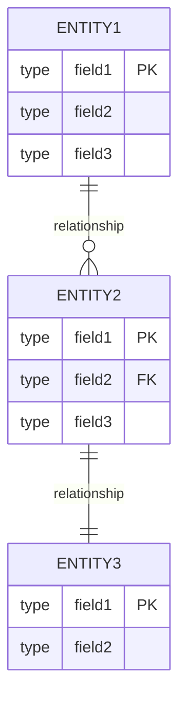

# [PROJECT_NAME] - データモデル仕様書

プロジェクトID: [PROJECT_ID]  
バージョン: 1.0.0  
最終更新日: [DATE]  
ステータス: [STATUS]

* 変更履歴:
  * v1.0.0 ([DATE]): 初版

---

## 1. 概要

本文書は、[PROJECT_NAME]のデータベーススキーマ（RDB論理設計）を記述する。テーブル定義、制約、リレーションを定義する。

* データベース種別: [DATABASE_TYPE] (例: HSQLDB、PostgreSQL、MySQL)
* データベース名: [DATABASE_NAME]

注意: 
* JPAエンティティクラスの設計（@Entity、@Column等のアノテーション、Javaクラス構造）は詳細設計フェーズで実施します
* データソース設定（JNDI名、接続URL、接続プール等）はarchitecture_design.mdに記載します

---

## 2. ER図

### 2.1 全体ER図

---

## 3. テーブル定義

### 3.1 [TABLE_NAME_1] ([テーブル日本語名])

#### 3.1.1 テーブル概要

[テーブルの目的と説明を記述]

#### 3.1.2 テーブル構造

| カラム名 | データ型 | PK | FK | NN | UQ | デフォルト | 説明 |
|---------|---------|----|----|----|----|----------|------|
| [COLUMN_NAME_1] | [TYPE] | ✓ | | ✓ | | IDENTITY | [説明]（自動採番） |
| [COLUMN_NAME_2] | [TYPE] | | | ✓ | | | [説明] |
| [COLUMN_NAME_3] | [TYPE] | | ✓ | ✓ | | | [説明]（外部キー） |

#### 3.1.3 制約

* 主キー: [COLUMN_NAME_1]
* 外部キー:
  * [COLUMN_NAME_3] → [REF_TABLE].[REF_COLUMN]
* 自動採番: IDENTITY（INSERT時に自動生成）

#### 3.1.4 インデックス

* PK_[TABLE_NAME]: [COLUMN_NAME_1]（主キーインデックス）
* IDX_[COLUMN_NAME_3]: [COLUMN_NAME_3]（外部キーインデックス）

---

### 3.2 [TABLE_NAME_2] ([テーブル日本語名])

[必要に応じてテーブルを追加]

---

## 4. インデックス設計

### 4.1 インデックス一覧

| テーブル | インデックス名 | カラム | タイプ | 目的 |
|---------|--------------|--------|--------|------|
| [TABLE_1] | PK_[TABLE_1] | [COLUMN_1] | PRIMARY KEY | 主キー |
| [TABLE_2] | PK_[TABLE_2] | [COLUMN_1] | PRIMARY KEY | 主キー |
| [TABLE_2] | IDX_[COLUMN] | [COLUMN] | INDEX | 検索最適化 |

### 4.2 検索最適化

[頻出検索パターンとインデックス戦略を記述]

---

## 5. データ整合性ルール

### 5.1 外部キー制約

| 子テーブル | 親テーブル | 外部キー | 動作 |
|----------|----------|---------|------|
| [CHILD_TABLE] | [PARENT_TABLE] | [FK_COLUMN] | CASCADE / RESTRICT / SET NULL |

### 5.2 トランザクション分離レベル

* 分離レベル: [ISOLATION_LEVEL]（例: READ_COMMITTED）
* 説明: [説明]

---

## 6. リレーションシップカーディナリティ

| 親テーブル | 子テーブル | リレーションシップ | カーディナリティ | 外部キー |
|-----------|-----------|------------------|----------------|---------|
| [PARENT_TABLE_1] | [CHILD_TABLE_1] | [RELATIONSHIP] | [CARDINALITY] | [FK_COLUMN] |
| [PARENT_TABLE_2] | [CHILD_TABLE_2] | [RELATIONSHIP] | [CARDINALITY] | [FK_COLUMN] |

* カーディナリティの表記:
  * `1:1` - 1対1
  * `1:N` - 1対多
  * `N:M` - 多対多

* 外部キー制約:
  * `ON DELETE CASCADE` - 親レコード削除時に子レコードも削除
  * `ON DELETE SET NULL` - 親レコード削除時に外部キーをNULLに設定
  * `ON DELETE RESTRICT` - 子レコードが存在する場合、親レコードの削除を拒否

---

## 7. データベース設計原則

### 7.1 命名規則

* テーブル名: 英語大文字、単数形（BOOK, ORDER_TRAN）
* カラム名: 英語大文字、スネークケース（BOOK_NAME, ORDER_DATE）
* 主キー: テーブル名 + _ID（BOOK_ID, CUSTOMER_ID）
* 外部キー制約: FK_カラム名（FK_CATEGORY_ID）

### 7.2 正規化

* 第1正規形: 原子性を満たす（繰り返しフィールドなし）
* 第2正規形: 部分関数従属性なし
* 第3正規形: 推移的関数従属性なし

### 7.3 非正規化（該当する場合）

[必要に応じて非正規化の理由と対象カラムを記述]

---

## 8. 参考資料

* [requirements.md](requirements.md) - 要件定義書
* [architecture_design.md](architecture_design.md) - アーキテクチャ設計書
* [functional_design.md](functional_design.md) - 機能設計書