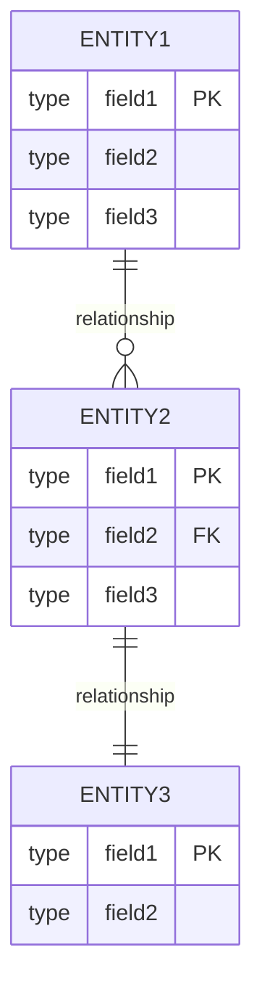

# [PROJECT_NAME] - データモデル仕様書

プロジェクトID: [PROJECT_ID]  
バージョン: 1.0.0  
最終更新日: [DATE]  
ステータス: [STATUS]

* 変更履歴:
  * v1.0.0 ([DATE]): 初版

---

## 1. 概要

本文書は、[PROJECT_NAME]のデータベーススキーマ（論理設計）を記述する。

* データベース: [DATABASE_TYPE]  
* データベース名: [DATABASE_NAME]  
* 接続URL: [CONNECTION_URL]  
* JNDI名: [JNDI_NAME]

注意: JPAエンティティクラスの設計については、functional_design.mdの「クラス設計」セクションを参照してください。

---

## 2. ER図

### 2.1 全体ER図

---

## 3. テーブル定義

### 3.1 [TABLE_NAME_1] ([テーブル日本語名])

[テーブルの目的と説明を記述]

| カラム名 | データ型 | NULL | キー | 説明 |
|---------|---------|------|------|------|
| [COLUMN_NAME_1] | [TYPE] | NO | PK | [説明]（自動採番） |
| [COLUMN_NAME_2] | [TYPE] | NO | - | [説明] |
| [COLUMN_NAME_3] | [TYPE] | YES | FK | [説明] |

* 外部キー:
  * `[COLUMN_NAME]` → `[REF_TABLE]([REF_COLUMN])`

* インデックス:
  * PRIMARY KEY: `[COLUMN_NAME]`
  * UNIQUE KEY: `[COLUMN_NAME]`
  * INDEX: `[COLUMN_NAME]`

* ビジネスルール:
  * [ルール1]
  * [ルール2]

---

### 3.2 [TABLE_NAME_2]

[必要に応じてテーブルを追加]

---

## 4. データ整合性ルール

### 4.1 トランザクション整合性

| ルール | 説明 | 実装方法 |
|--------|------|---------|
| [RULE_1] | [DESCRIPTION] | [IMPLEMENTATION] |
| [RULE_2] | [DESCRIPTION] | [IMPLEMENTATION] |

### 4.2 参照整合性

| 関係 | カスケードルール | 説明 |
|------|--------------|------|
| [TABLE1] → [TABLE2] | [CASCADE/RESTRICT/SET NULL] | [説明] |
| [TABLE2] → [TABLE3] | [CASCADE/RESTRICT/SET NULL] | [説明] |

---

## 5. リレーションシップカーディナリティ

| 親テーブル | 子テーブル | リレーションシップ | カーディナリティ | 外部キー |
|-----------|-----------|------------------|----------------|---------|
| [PARENT_TABLE_1] | [CHILD_TABLE_1] | [RELATIONSHIP] | [CARDINALITY] | [FK_COLUMN] |
| [PARENT_TABLE_2] | [CHILD_TABLE_2] | [RELATIONSHIP] | [CARDINALITY] | [FK_COLUMN] |

* カーディナリティの表記:
  * `1:1` - 1対1
  * `1:N` - 1対多
  * `N:M` - 多対多

* 外部キー制約:
  * `ON DELETE CASCADE` - 親レコード削除時に子レコードも削除
  * `ON DELETE SET NULL` - 親レコード削除時に外部キーをNULLに設定
  * `ON DELETE RESTRICT` - 子レコードが存在する場合、親レコードの削除を拒否

---

## 6. データ整合性制約

### 6.1 一意性制約

| テーブル | カラム | 制約名 | 説明 |
|---------|--------|--------|------|
| [TABLE_1] | [COLUMN_1] | [CONSTRAINT_NAME] | [DESCRIPTION] |
| [TABLE_2] | [COLUMN_2] | [CONSTRAINT_NAME] | [DESCRIPTION] |

### 6.2 CHECK制約

| テーブル | 制約式 | 説明 |
|---------|--------|------|
| [TABLE_1] | [CHECK_EXPRESSION] | [DESCRIPTION] |
| [TABLE_2] | [CHECK_EXPRESSION] | [DESCRIPTION] |

### 8.3 NOT NULL制約

必須項目はテーブル定義のNULL許可列で「いいえ」と記載する。

### 6.4 参照整合性

全ての外部キーには参照整合性制約を定義する。

---

## 7. 参考資料

* [requirements.md](requirements.md) - 要件定義書
* [architecture_design.md](architecture_design.md) - アーキテクチャ設計書
* [functional_design.md](functional_design.md) - 機能設計書