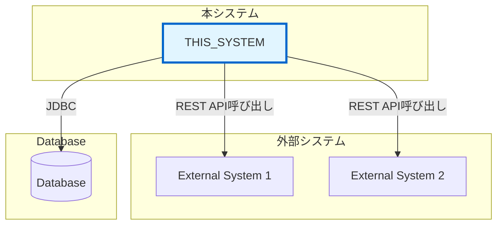

# [PROJECT_NAME] - 外部インターフェース仕様書

プロジェクトID: [PROJECT_ID]  
バージョン: 1.0.0  
最終更新日: [DATE]  
ステータス: [対象外 / 一部連携 / 全面連携]

---

## 1. 概要

本ドキュメントは、**本システムが外部システムを呼び出す際**のインターフェース仕様を記述する。

注意: 本システムが外部に公開するAPI仕様は、各APIディレクトリ配下のOpenAPISPECを参照すること。

### 1.1 システム構成図

[本システムと外部システムの関係を図示する]

注意: 外部システム連携が不要な場合は、このセクションを削除する

### 1.2 システムの役割

| システム | 役割 | 外部連携の有無 |
|---------|------|--------------|
| [THIS_SYSTEM] （本システム） | [ROLE] | [YES/NO] |
| [EXTERNAL_SYSTEM_1] | [ROLE] | [YES/NO] |
| [EXTERNAL_SYSTEM_2] | [ROLE] | [YES/NO] |

---

## 2. 外部システム連携一覧

本システムが呼び出す外部システムの一覧：

| システムID | システム名 | 連携方式 | 目的 | 必須/任意 |
|-----------|----------|---------|------|----------|
| EXT-001 | [SYSTEM_NAME_1] | REST API (HTTP/JSON) | [PURPOSE] | 必須 |
| EXT-002 | [SYSTEM_NAME_2] | REST API (HTTP/JSON) | [PURPOSE] | 必須 |

注意: 外部連携が不要な場合は、「本システムは外部システムを呼び出さない」と記載し、以降のセクション5（外部システム連携詳細）は削除する

---

## 3. 外部システム連携詳細（OpenAPISPECがある場合）

外部システムがOpenAPISPECを提供している場合、それを取り寄せて参照する：

* OpenAPISPECの格納場所: `system/external_interfaces/[SYSTEM_NAME]/`
* 例: `system/external_interfaces/back-office-api/books-api.yaml`

OpenAPISPECがあれば、以下のセクション5は不要。
OpenAPISPECがない場合のみ、セクション5で詳細を記述する。

---

## 4. 外部システム連携詳細（OpenAPISPECがない場合）

以下は外部システムのAPI仕様を記述するテンプレートです。OpenAPISPECがある場合は、このセクションを削除してください。

### 4.X [外部システム名]

#### 4.X.1 システム概要

* システム名: [EXTERNAL_SYSTEM_NAME]
* 提供元: [PROVIDER]
* 目的: [PURPOSE]
* 連携方式: REST API (HTTP/JSON)
* プロトコル: HTTP / HTTPS
* 認証方式: [なし / API Key / OAuth 2.0 / JWT Bearer Token]
* ベースURL: `[BASE_URL]`

#### 4.X.2 提供エンドポイント

##### エンドポイント1: [ENDPOINT_NAME]

* メソッド: `[GET/POST/PUT/DELETE]`
* パス: `[PATH]`
* 説明: [DESCRIPTION]

* リクエスト:
  * パスパラメータ: [PATH_PARAMS]
  * クエリパラメータ: [QUERY_PARAMS]
  * リクエストヘッダー: [HEADERS]
  * リクエストボディ: [BODY_STRUCTURE]

* レスポンス:
  * 200 OK: [RESPONSE_STRUCTURE]
  * 400 Bad Request: [ERROR_STRUCTURE]
  * 401 Unauthorized: [ERROR_STRUCTURE]
  * 404 Not Found: [ERROR_STRUCTURE]

##### エンドポイント2: [ENDPOINT_NAME]

[必要に応じて追加]

---

## 5. 参考資料

* [requirements.md](requirements.md) - 要件定義書
* [architecture_design.md](architecture_design.md) - アーキテクチャ設計書
* [functional_design.md](functional_design.md) - 機能設計書

