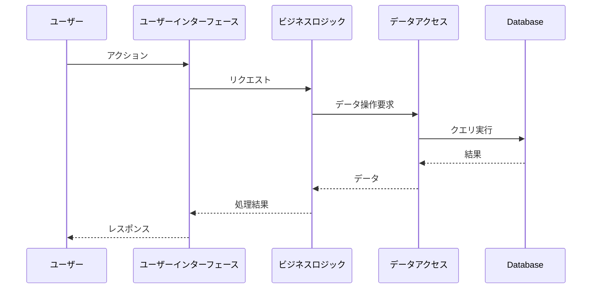
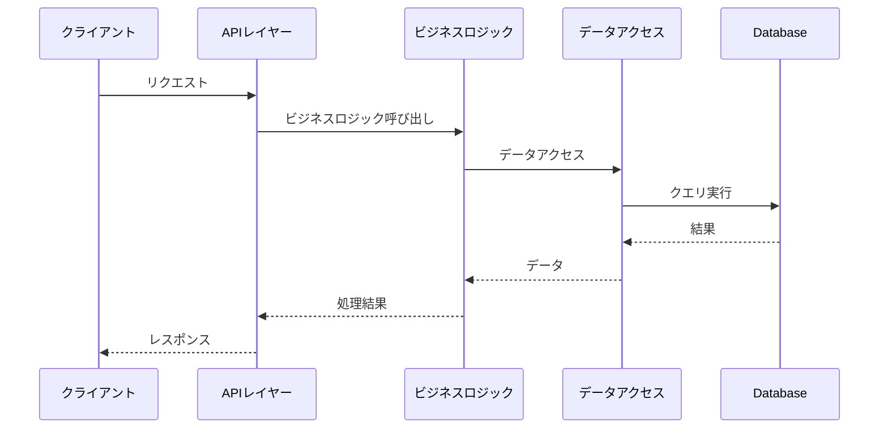

# [PROJECT_NAME] - システム機能設計書

ファイル名: functional_design.md（system/配下）  
プロジェクトID: [PROJECT_ID]  
バージョン: 1.0.0  
最終更新日: [DATE]  
ステータス: [STATUS]

---

## 1. 概要

本文書は、[PROJECT_NAME]システム全体の機能設計、共通サービス、ドメインモデルの機能設計を記述する。システム全体のユーザーストーリー、共通機能のビジネスルール、システム全体のユーザーフロー、データフローを論理レベルで定義する。

* API固有の機能設計は、各api/{api_id}/functional_design.mdを参照すること
* 実装クラス設計（JPAエンティティ、Dao、共通Service等）、メソッドシグネチャ、アノテーションは詳細設計（system/detailed_design.md）で記述します

---

## 2. システム概要

### 2.1 システムアーキテクチャ

[システム全体のアーキテクチャ概要、レイヤー構成、主要コンポーネント]

### 2.2 API一覧

| API ID | API名 | ベースパス | 説明 | 機能設計書 |
|--------|------|----------|------|----------|
| API_001 | [API名1] | /api/[path] | [説明] | [../api/API_001/functional_design.md](../api/API_001/functional_design.md) |
| API_002 | [API名2] | /api/[path] | [説明] | [../api/API_002/functional_design.md](../api/API_002/functional_design.md) |

---

## 3. 共通機能設計

注意: API固有の機能設計は、各api/{api_id}/functional_design.mdを参照してください。

### 3.1 認証・認可

#### 3.1.1 認証方式

* 認証方式: [JWT / セッション / その他]
* 認証フロー: [認証の流れを論理レベルで記述]

#### 3.1.2 認可制御

* ロール定義: [ロール一覧]
* 権限チェック: [権限チェックのロジック]

### 3.2 ログ処理

* ログレベル: [ERROR, WARN, INFO, DEBUG]
* ログ出力方針: [どのような情報をログに出力するか]

### 3.3 エラーハンドリング

* エラーレスポンス形式: [統一的なエラーレスポンス構造]
* 例外マッピング: [例外とHTTPステータスコードのマッピング]

---

## 4. ドメインモデル機能設計

### 4.1 [ドメインモデル1]

#### 2.1.1 ユーザーストーリー

```
As a [USER_ROLE]
I want to [ACTION]
So that [BENEFIT]
```

#### 2.1.2 ビジネスルール

| ルールID | 説明 |
|---------|-------------|
| BR-[XXX] | [ビジネスルールの説明] |
| BR-[XXX] | [ビジネスルールの説明] |

#### 2.1.3 機能フロー

[フロー名1]::
1. [ステップ1]
2. [ステップ2]
3. [ステップ3]

[フロー名2]::
1. [ステップ1]
2. [ステップ2]

#### 2.1.4 受入基準

詳細は [behaviors.md](behaviors.md#[ANCHOR]) を参照

---

### 2.2 機能 [FEATURE_ID_2]: [FEATURE_NAME_2]

[必要に応じて機能を追加]

---

## 3. ユーザーフロー

### 3.1 メインユーザーフロー


### 3.2 [サブフロー名]

[必要に応じて追加のフローを記述]

---

## 4. データフロー

### 4.1 [操作名] - シーケンス図



注意: シーケンス図は論理レベルで記述します。実装クラス名（Resource, Service, Dao等）は使用しません。

---

## 5. 画面遷移

### 5.1 画面遷移図


### 5.2 画面一覧

| 画面ID | 画面名 | ファイル名 | 認証要否 | 説明 |
|--------|--------|----------|---------|------|
| [ID_1] | [NAME] | [FILE] | [YES/NO] | [DESCRIPTION] |
| [ID_2] | [NAME] | [FILE] | [YES/NO] | [DESCRIPTION] |

### 5.3 ナビゲーションルール

| 遷移元 | イベント | 遷移先 | 条件 |
|--------|---------|--------|------|
| [FROM] | [EVENT] | [TO] | [CONDITION] |
| [FROM] | [EVENT] | [TO] | [CONDITION] |

---

## 6. 例外・エラー処理

### 6.1 データ整合性

| シナリオ | 期待される動作 |
|---------|--------------|
| [SCENARIO] | [EXPECTED_BEHAVIOR] |
| [SCENARIO] | [EXPECTED_BEHAVIOR] |

### 6.2 認証・セッション

| シナリオ | 期待される動作 |
|---------|--------------|
| [SCENARIO] | [EXPECTED_BEHAVIOR] |
| [SCENARIO] | [EXPECTED_BEHAVIOR] |

### 6.3 ユーザー操作

| シナリオ | 期待される動作 |
|---------|--------------|
| [SCENARIO] | [EXPECTED_BEHAVIOR] |
| [SCENARIO] | [EXPECTED_BEHAVIOR] |

### 6.4 入力検証

| シナリオ | 期待される動作 |
|---------|--------------|
| [SCENARIO] | [EXPECTED_BEHAVIOR] |
| [SCENARIO] | [EXPECTED_BEHAVIOR] |

---

## 7. エラーメッセージ一覧

### 7.1 検証エラー

| エラーコード | メッセージ | 発生条件 |
|------------|----------|---------|
| [CODE] | [MESSAGE] | [CONDITION] |
| [CODE] | [MESSAGE] | [CONDITION] |

### 7.2 ビジネスエラー

| エラーコード | メッセージ | 発生条件 |
|------------|----------|---------|
| [CODE] | [MESSAGE] | [CONDITION] |
| [CODE] | [MESSAGE] | [CONDITION] |

### 7.3 システムエラー

| エラーコード | メッセージ | 発生条件 |
|------------|----------|---------|
| [CODE] | [MESSAGE] | [CONDITION] |
| [CODE] | [MESSAGE] | [CONDITION] |

---

## 8. ビジネスルール

### 8.1 [カテゴリ1]ルール

| ルールID | 説明 | 適用箇所 |
|---------|------|---------|
| BR-[XXX]-001 | [ルール説明] | [機能名] |
| BR-[XXX]-002 | [ルール説明] | [機能名] |

### 8.2 [カテゴリ2]ルール

| ルールID | 説明 | 適用箇所 |
|---------|------|---------|
| BR-[YYY]-001 | [ルール説明] | [機能名] |

---

## 9. バリデーションルール

### 9.1 共通バリデーション

| バリデーションID | 説明 | エラーコード |
|----------------|------|-------------|
| VAL-001 | 必須入力チェック | VAL-001 |
| VAL-002 | 文字数制限 | VAL-002 |
| VAL-003 | メールアドレス形式 | VAL-003 |

### 9.2 個別バリデーション

| バリデーションID | 対象フィールド | 説明 | エラーコード |
|----------------|--------------|------|-------------|
| VAL-[XXX]-001 | [FIELD_NAME] | [説明] | VAL-[XXX]-001 |

---

## 10. エラーハンドリング

### 10.1 例外マッピング

| 例外クラス | HTTPステータス | エラーメッセージ | 対処方法 |
|-----------|--------------|----------------|---------|
| [ExceptionClass1] | [STATUS_CODE] | [MESSAGE] | [ACTION] |
| [ExceptionClass2] | [STATUS_CODE] | [MESSAGE] | [ACTION] |

---

## 11. トランザクション管理

### 11.1 トランザクション境界

| レイヤー | トランザクション境界 | 説明 |
|---------|------------------|------|
| プレゼンテーション層 | なし | トランザクションは持たない |
| ビジネスロジック層 | トランザクション境界 | ビジネスロジックレイヤーでトランザクション管理 |
| データアクセス層 | なし | トランザクションは持たない（ビジネスロジック層から委譲） |

注意: 論理レベルの記述です。実装詳細（@Transactional等のアノテーション）は詳細設計で記述します。

### 11.2 重要なトランザクション処理

| 処理名 | トランザクション範囲 | 並行制御 |
|--------|------------------|---------|
| [PROCESS_1] | [SCOPE] | [楽観的ロック / 悲観的ロック / なし] |
| [PROCESS_2] | [SCOPE] | [楽観的ロック / 悲観的ロック / なし] |

---

## 12. パフォーマンス考慮事項

### 12.1 N+1問題の回避

| 対象処理 | 対策 |
|---------|------|
| [PROCESS_1] | JOIN FETCH を使用 |
| [PROCESS_2] | BatchFetch を使用 |

### 12.2 インデックスの活用

| テーブル | インデックスカラム | 目的 |
|---------|----------------|------|
| [TABLE_1] | [COLUMN] | [PURPOSE] |

---

## 13. セキュリティ考慮事項

### 13.1 認証トークン

* 認証トークンを使用（例: JWT）
* セキュアな方法で保持（例: HttpOnly Cookie）
* 有効期限: [EXPIRATION]

### 13.2 パスワード保護

* ハッシュアルゴリズムでハッシュ化
* ソルト付きハッシュ

注意: 具体的なアルゴリズム名（BCrypt等）は詳細設計で記述します。

### 13.3 権限制御

| 権限レベル | アクセス可能な機能 |
|----------|----------------|
| [ROLE_1] | [FUNCTIONS] |
| [ROLE_2] | [FUNCTIONS] |

---

## 14. 拡張性

### 14.1 将来の機能拡張

* [FUTURE_FEATURE_1]: [DESCRIPTION]
* [FUTURE_FEATURE_2]: [DESCRIPTION]

### 14.2 外部連携

* [EXTERNAL_SYSTEM_1]: [DESCRIPTION]
* [EXTERNAL_SYSTEM_2]: [DESCRIPTION]

---

## 15. 動的振る舞い

注意: 
* シーケンス図は論理レベルで記述します
* 実装クラス名（BookResource, BookService, BookDao等）は使用しません
* 論理コンポーネント名（「書籍リソース」「書籍サービス」「書籍データアクセス」等）または抽象レイヤー名（「APIレイヤー」「ビジネスロジック」「データアクセス」）を使用します

### 15.1 [処理フロー名]



---

## 16. バッチ処理

### 16.1 バッチ処理一覧

| バッチID | バッチ名 | 実行タイミング | 目的 | 優先度 |
|---------|---------|-------------|------|-------|
| [BATCH_ID_1] | [BATCH_NAME] | [SCHEDULE] | [PURPOSE] | [PRIORITY] |
| [BATCH_ID_2] | [BATCH_NAME] | [SCHEDULE] | [PURPOSE] | [PRIORITY] |

注意: バッチ処理の要件がない場合は、このセクションを「該当なし」として残す。

### 16.2 バッチ詳細設計

#### 16.2.1 バッチ [BATCH_ID_1]: [BATCH_NAME]

* 概要:
[バッチの目的と概要を記述]

* 実行タイミング:
  * スケジュール: [CRON_EXPRESSION] (例: 毎日午前2時)
  * トリガー: [TRIGGER_TYPE] (例: 定時実行、イベント駆動、手動実行)
  * 実行時間見積もり: [ESTIMATED_TIME]

* 入力データ:
  * データソース: [SOURCE] (例: データベーステーブル、外部ファイル、API)
  * 入力形式: [FORMAT] (例: CSV、JSON、XML)
  * 入力条件: [CONDITIONS] (例: 前日分のデータ、未処理フラグのレコード)

* 出力データ:
  * 出力先: [DESTINATION] (例: データベーステーブル、外部ファイル、API)
  * 出力形式: [FORMAT]
  * 出力内容: [CONTENT]

* 処理フロー:


* 処理ステップ:
  1. 初期化処理
   * バッチ実行ログを記録
   * 前回実行状態をチェック
   * 必要なリソースを確保

2. 入力データ読み込み
   * [データ取得ロジック]
   * [フィルタリング条件]

3. データ検証
   * [検証ルール]
   * エラー時の処理

4. メイン処理
   * [ビジネスロジック]
   * トランザクション境界

5. 出力データ書き込み
   * [出力ロジック]
   * コミット単位

6. クリーンアップ
   * 一時ファイル削除
   * リソース解放

* ビジネスルール:
| ルールID | 説明 |
|---------|------|
| BR-[XXX] | [ルール説明] |
| BR-[XXX] | [ルール説明] |

* エラーハンドリング:
  * エラー分類:
  * 致命的エラー: バッチを即座に停止（例: DB接続エラー、ファイル破損）
  * 警告エラー: 該当データをスキップして続行（例: データ検証エラー）
  * リトライ可能エラー: 再試行後に判断（例: 一時的なネットワークエラー）

* エラー時の動作:
  * エラーログをファイルまたはデータベースに記録
  * 管理者に通知（メール、監視ツール）
  * ロールバック処理を実行

* リトライポリシー:
  * リトライ対象: [リトライ対象のエラー種別]
  * リトライ回数: [MAX_RETRY_COUNT] 回
  * リトライ間隔: [RETRY_INTERVAL] (例: 5秒、指数バックオフ)
  * リトライ失敗時: [FALLBACK_ACTION]

* タイムアウト設定:
  * 処理タイムアウト: [TIMEOUT_DURATION] (例: 60分)
  * タイムアウト時の動作: [ACTION] (例: ロールバック、部分コミット)

* トランザクション戦略:
  * トランザクション境界: [SCOPE] (例: バッチ全体、チャンク単位)
  * チャンクサイズ: [CHUNK_SIZE] (例: 1000件ごとにコミット)
  * 分離レベル: [ISOLATION_LEVEL]

* 監視・ログ:
  * 実行ログ:
  * バッチ開始時刻
  * バッチ終了時刻
  * 処理件数（成功/失敗）
  * エラー詳細
  
* パフォーマンスメトリクス:
  * 処理時間
  * スループット（件/秒）
  * メモリ使用量

* アラート条件:
  * 処理時間が閾値を超過
  * エラー率が閾値を超過
  * バッチ実行失敗

* 並行実行制御:
  * 多重起動制御: [POLICY] (例: ロックファイル、データベースフラグ)
  * 依存関係: [DEPENDENCIES] (例: バッチAの完了後に実行)

* テスト観点:
  * 正常系: 想定データでの正常処理
  * 異常系: データ不正、リソース不足、タイムアウト
  * 境界値: 最小/最大データ量、空データ
  * 並行実行: 多重起動の防止確認

---

