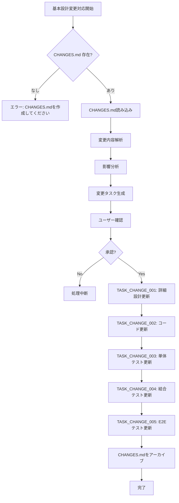

# 基本設計変更対応インストラクション

## パラメータ設定

実行前に以下のパラメータを設定する

```yaml
project_root: "ここにプロジェクトルートのパスを入力"
spec_directory: "ここにSPECディレクトリのパスを入力"
change_spec: "ここに変更差分ファイルのパスを入力（省略可）"
```

* 例
```yaml
project_root: "projects/sdd/person/jsf-person-sdd"
spec_directory: "projects/sdd/person/jsf-person-sdd/specs/baseline"
change_spec: "projects/sdd/person/jsf-person-sdd/specs/baseline/basic_design/CHANGES.md"
```

注意
* パス区切りはOS環境に応じて調整する（Windows: `\`, Unix/Linux/Mac: `/`）
* 以降、`{project_root}` と表記されている箇所は、上記で設定した値に置き換える
* 以降、`{spec_directory}` と表記されている箇所は、上記で設定した値に置き換える
* `change_spec` を省略した場合、デフォルトで `{spec_directory}/basic_design/CHANGES.md` を使用する

---

## 概要

このインストラクションは、基本設計SPEC（requirements/, basic_design/）の変更を検出し、詳細設計・コード・テストを更新するためのものである

### 想定されるユースケース

1. **baseline（初回リリース）での手戻り**
   * 結合テストやE2Eテストで不具合が発覚
   * 基本設計レベルでの修正が必要
   * 変更管理の対象

2. **enhancements（拡張案件）での通常開発**
   * 新機能追加に伴う基本設計の更新
   * 既存機能の仕様変更
   * 段階的な機能拡張

3. **Strutsからのマイグレーション中の設計変更**
   * マイグレーション過程で判明した設計の不整合
   * JSF特有の要件に伴う設計変更
   * 画面設計の見直し

### 重要な方針

* 基本設計SPECの変更は、専用の変更差分ファイル（CHANGES.md）で管理する
* 変更差分ファイルから、影響を受けるファイル（詳細設計、コード、XHTML、テスト）を特定する
* 変更タスクを生成し、既存の開発フローに統合する
* 適用完了後、変更差分ファイルをアーカイブして履歴を保持する

### 変更差分管理の方式

* **マスターファイル**: 基本設計SPEC（functional_design.md、screen_design.md等）は自由に更新可能
* **変更差分ファイル**: 変更内容を明示的に記載した CHANGES.md を作成
* **形式非依存**: Markdown、EXCEL、PDF、Wordなど形式を問わず対応可能

---

## 1. ディレクトリ構造

基本設計変更対応に必要なファイル構造：

```
{spec_directory}/basic_design/
  ├── architecture_design.md (or .xlsx)
  ├── functional_design.md (or .xlsx)
  ├── screen_design.md (or .xlsx)      # JSF特有
  ├── data_model.md (or .xlsx)
  ├── behaviors.md (or .xlsx)
  ├── CHANGES.md                        # アクティブな変更（未適用）
  └── changes_archive/                  # 適用済み変更のアーカイブ
      ├── 20260118_person_edit.md
      └── 20260125_validation_update.md
```

重要：
* **マスターファイル**（functional_design.md、screen_design.md等）: 自由に更新可能
* **CHANGES.md**: 未適用の変更内容を記載（変更差分の唯一の真実の情報源）
* **changes_archive/**: 適用済みの変更を保存（履歴管理）

---

## 2. 変更差分ファイルの読み込み

### 2.1 変更差分ファイルの確認

パラメータで指定された、または規約に基づく変更差分ファイルを確認する：

```
デフォルトパス: {spec_directory}/basic_design/CHANGES.md
```

#### 2.1.1 ファイルが存在しない場合

```
変更差分ファイルが見つかりません: {change_spec}

基本設計を変更した場合は、CHANGES.md を作成してください。

テンプレート:
{spec_directory}/basic_design/CHANGES.md

---
# 基本設計変更記録

## [YYYY-MM-DD] 変更タイトル

### 変更対象
- functional_design.md (または .xlsx)
- screen_design.md (または .xlsx)
- data_model.md (または .xlsx)

### 変更内容

#### functional_design.md の変更

##### セクション「XXX」
**追加**:
- 〇〇を追加

**変更**:
- △△を□□に変更

**削除**:
- ××を削除

### 変更理由
〇〇の問題が発覚したため

### 影響範囲（推定）
- 詳細設計: SCREEN_XXX
- コード: YyyBean, ZzzService
- XHTML: zzz.xhtml
- テスト: 〇〇テストシナリオ追加
---
```

処理を中断する。

#### 2.1.2 ファイルが存在する場合

CHANGES.mdを読み込み、最新の変更エントリを解析する：
* 変更日時
* 変更対象ファイル
* 変更内容（追加/変更/削除）
* 変更理由
* 影響範囲（推定）

### 2.2 変更内容の解析

CHANGES.mdから以下の情報を抽出する：

#### 2.2.1 新規追加

CHANGES.mdの「追加」セクションから：
* 新しい画面（SCREEN）
* 新しいManaged Bean
* 新しいエンティティ（テーブル）
* 新しいサービスクラス
* 新しい振る舞いシナリオ

#### 2.2.2 更新

CHANGES.mdの「変更」セクションから：
* 既存画面のレイアウト変更、UI部品追加
* 既存Managed Beanのメソッド追加・変更
* 既存エンティティのフィールド追加・削除・変更
* 既存サービスのメソッド追加・変更
* 既存振る舞いシナリオの更新

#### 2.2.3 削除

CHANGES.mdの「削除」セクションから：
* 廃止された画面
* 廃止されたManaged Bean
* 廃止されたエンティティ
* 廃止されたサービス
* 削除された振る舞いシナリオ

---

## 3. 影響分析

### 3.1 影響を受けるファイルの特定

変更箇所から、影響を受けるファイルを特定する

#### 3.1.1 詳細設計ファイル

変更の影響を受ける詳細設計ファイルを特定：

```
{spec_directory}/detailed_design/{FUNC_ID}/detailed_design.md
{spec_directory}/detailed_design/{FUNC_ID}/behaviors.md
```

例：
* SCREEN_001_PersonList の仕様変更 → `detailed_design/SCREEN_001_PersonList/detailed_design.md`
* Person エンティティの変更 → `detailed_design/FUNC_001_entity/detailed_design.md`

#### 3.1.2 ソースコードファイル

変更の影響を受けるソースコードファイルを特定：

```
{project_root}/src/main/java/{package}/{ClassName}.java
{project_root}/src/main/webapp/{path}/{screen}.xhtml
{project_root}/src/test/java/{package}/{ClassName}Test.java
```

例：
* PersonService にメソッド追加 → `src/main/java/.../PersonService.java`
* Person エンティティにフィールド追加 → `src/main/java/.../entity/Person.java`
* SCREEN_001_PersonList の変更 → `src/main/java/.../bean/PersonListBean.java`
* SCREEN_001_PersonList の変更 → `src/main/webapp/person/list.xhtml`

#### 3.1.3 テストファイル

変更の影響を受けるテストファイルを特定：

```
{project_root}/src/test/java/{package}/{ClassName}Test.java
{project_root}/src/test/java/{package}/{ClassName}IntegrationTest.java
{project_root}/src/test/java/{package}/{ClassName}E2ETest.java
```

### 3.2 影響範囲のサマリー生成

影響分析の結果をサマリーとして出力：

```markdown
## 変更影響分析サマリー

### 変更概要
- 変更日時: 2026-01-18 14:30:00
- 変更ファイル数: 3
- 影響を受けるコンポーネント数: 8

### 変更詳細

#### 1. functional_design.md の変更
- SCREEN_002_PersonDetail に編集機能追加
- PersonService に updatePerson() メソッド追加

#### 2. screen_design.md の変更
- SCREEN_002_PersonDetail にフォーム編集UI追加

#### 3. data_model.md の変更
- PERSON テーブルに last_updated_at カラム追加

#### 4. behaviors.md の変更
- 人物情報編集シナリオ追加

### 影響を受けるファイル

#### 詳細設計（2ファイル）
- detailed_design/FUNC_001_entity/detailed_design.md
- detailed_design/SCREEN_002_PersonDetail/detailed_design.md

#### ソースコード（6ファイル）
- src/main/java/.../entity/Person.java
- src/main/java/.../service/PersonService.java
- src/main/java/.../dao/PersonDao.java
- src/main/java/.../bean/PersonDetailBean.java
- src/main/webapp/person/detail.xhtml
- src/main/resources/messages_ja.properties (新規メッセージ追加)

#### テスト（3ファイル）
- src/test/java/.../PersonServiceTest.java
- src/test/java/.../PersonServiceIntegrationTest.java
- src/test/java/.../PersonDetailE2ETest.java
```

---

## 4. 変更タスクの生成

### 4.1 変更タスクファイルの作成

影響分析の結果をもとに、変更タスクファイルを生成する

出力先: `{project_root}/tasks/change_tasks.md`

### 4.2 変更タスクファイルのテンプレート

```markdown
# 基本設計変更対応タスク

## メタデータ

* プロジェクト: {project_name}
* 変更日時: {timestamp}
* 変更理由: {reason}
* ベースライン更新日: {baseline_date}

---

## 変更概要

{change_summary}

## 変更元ファイル

{change_spec}

---

## 変更内容（CHANGES.mdから抽出）

{CHANGES.mdの内容をそのまま転記}

---

## 影響分析

### 詳細設計への影響

* [ ] {spec_directory}/detailed_design/{FUNC_ID}/detailed_design.md - {変更内容}
* [ ] {spec_directory}/detailed_design/{FUNC_ID}/behaviors.md - {変更内容}

### コードへの影響

* [ ] {source_file_path} - {変更内容}
* [ ] {xhtml_file_path} - {変更内容}

### テストへの影響

* [ ] {test_file_path} - {変更内容}
* [ ] {test_file_path} - {変更内容}

---

## 更新タスク

### TASK_CHANGE_001: 詳細設計の更新

**対象**: {spec_directory}/detailed_design/{FUNC_ID}/

**変更内容**:
- {変更項目1}
- {変更項目2}

**実行方法**:
```
@agent_skills/struts-to-jsf-migration/instructions/detailed_design.md

パラメータ:
* project_root: {project_root}
* spec_directory: {spec_directory}
* target_type: {FUNC_ID}
```

**注意事項**:
* 既存の詳細設計ファイルを読み込み、差分を反映する
* ユーザーに確認を求める（上書き/部分更新/追加）

---

### TASK_CHANGE_002: コードの更新

**対象**: {source_files} + {xhtml_files}

**変更内容**:
- {Managed Bean名}.java に {メソッド名}() メソッドを追加
- {Entity名}.java に {フィールド名} フィールドを追加
- {画面名}.xhtml に {UI部品} を追加

**実行方法**:
```
@agent_skills/struts-to-jsf-migration/instructions/code_generation.md

パラメータ:
* project_root: {project_root}
* task_file: {project_root}/tasks/{FUNC_ID}.md

注意: 既存タスクファイルを更新して、変更内容を反映すること
```

**注意事項**:
* 既存ファイルを読み込み、部分的に更新する
* ユーザーに確認を求める（再生成/部分修正/追加）
* 詳細設計書も同期して更新する

---

### TASK_CHANGE_003: 単体テストの更新

**対象**: {test_files}

**変更内容**:
- {テストクラス名} に {テストメソッド名} を追加
- 既存テストケースの修正

**実行方法**:
```
@agent_skills/struts-to-jsf-migration/instructions/unit_test_generation.md

パラメータ:
* project_root: {project_root}
* target_type: {FUNC_ID}
```

**注意事項**:
* 既存テストファイルに新しいテストケースを追加
* 変更に伴う既存テストの修正

---

### TASK_CHANGE_004: 結合テストの更新

**対象**: {integration_test_files}

**変更内容**:
- {シナリオ} の結合テストを追加

**実行方法**:
```
@agent_skills/struts-to-jsf-migration/instructions/it_generation.md

パラメータ:
* project_root: {project_root}
* spec_directory: {spec_directory}
```

**注意事項**:
* basic_design/behaviors.md の新しいシナリオをテスト

---

### TASK_CHANGE_005: E2Eテストの更新

**対象**: {e2e_test_files}

**変更内容**:
- {シナリオ} のE2Eテストを追加（Playwright使用）

**実行方法**:
```
@agent_skills/struts-to-jsf-migration/instructions/e2e_test_generation.md

パラメータ:
* project_root: {project_root}
* spec_directory: {spec_directory}
```

**注意事項**:
* requirements/behaviors.md の新しいシナリオをテスト

---

## 実行順序

変更タスクは以下の順序で実行する：

1. **TASK_CHANGE_001**: 詳細設計の更新（基盤）
2. **TASK_CHANGE_002**: コードの更新（実装）
3. **TASK_CHANGE_003**: 単体テストの更新（検証）
4. **TASK_CHANGE_004**: 結合テストの更新（検証）
5. **TASK_CHANGE_005**: E2Eテストの更新（検証）

各タスク完了後、次のタスクに進む前にユーザーの確認を待つ。

---

## 変更差分ファイルのアーカイブ

すべてのタスクが完了したら、CHANGES.mdをアーカイブする：

```bash
# アーカイブディレクトリを作成（存在しない場合）
mkdir -p {spec_directory}/basic_design/changes_archive

# CHANGES.mdをアーカイブに移動（タイムスタンプ付き）
mv {spec_directory}/basic_design/CHANGES.md \
   {spec_directory}/basic_design/changes_archive/YYYYMMDD_変更タイトル.md
```

例：
```bash
mv specs/baseline/basic_design/CHANGES.md \
   specs/baseline/basic_design/changes_archive/20260118_person_edit.md
```

アーカイブ後：
* 次回の変更時には、新しいCHANGES.mdを作成する
* アーカイブされたファイルは履歴として保持される
* アーカイブされたファイルは変更管理の参照用として使用できる
```

---

## 5. ユーザーへの確認

### 5.1 変更内容の説明

変更タスクファイル生成後、ユーザーに以下を説明する：

```
基本設計SPECの変更を検出しました。

変更概要:
- 変更されたファイル: {files}
- 影響を受けるコンポーネント: {components}
- 生成された変更タスク: {task_count}件

変更タスクファイルを生成しました:
{project_root}/tasks/change_tasks.md

このファイルには、以下の情報が含まれています:
1. 変更検出結果（差分）
2. 影響分析（影響を受けるファイル一覧）
3. 更新タスク（実行すべき作業）

次のステップ:
1. change_tasks.md を確認してください
2. 承認後、各タスクを順次実行します
3. すべてのタスク完了後、ベースラインを更新します

続行しますか？ (Y/n)
```

### 5.2 承認後の処理

ユーザーが承認した場合：
1. 各タスクを順次実行する（既存の指示書を呼び出し）
2. 各タスク完了後、ユーザーに確認を求める
3. すべてのタスク完了後、ベースラインを更新する

ユーザーが承認しなかった場合：
* 処理を中断する
* change_tasks.md は残す（後で手動実行可能）

---

## 6. 既存の指示書との統合

### 6.1 詳細設計の更新

`detailed_design.md` を呼び出す：

```yaml
@agent_skills/struts-to-jsf-migration/instructions/detailed_design.md

パラメータ:
* project_root: {project_root}
* spec_directory: {spec_directory}
* target_type: {FUNC_ID}
```

詳細設計書には「既存のdetailed_design.mdの扱いと反復的なブラッシュアップ」セクションがあり（jakarta-ee-api-base版）、既存ファイルへの対応が記載されている。

AIは以下のように動作する：
1. 既存の詳細設計書を読み込む
2. ユーザーに確認（上書き/部分更新/追加/確認）
3. 選択に応じて更新

### 6.2 コード生成の更新

`code_generation.md` を呼び出す：

```yaml
@agent_skills/struts-to-jsf-migration/instructions/code_generation.md

パラメータ:
* project_root: {project_root}
* task_file: {project_root}/tasks/{FUNC_ID}.md
```

コード生成指示書には「既存コードの扱いと反復的な開発」セクションがあり、既存ファイルへの対応が記載されている。

AIは以下のように動作する：
1. 既存ファイル（Java、XHTML）を読み込む
2. ユーザーに確認（再生成/部分修正/追加/確認）
3. 選択に応じて更新
4. 詳細設計書も同期して更新

### 6.3 テスト生成の更新

単体テスト、結合テスト、E2Eテストの各指示書を呼び出す。

テスト生成指示書は、基本的に既存テストファイルへの追加を前提としている。

---

## 7. 注意事項

### 7.1 CHANGES.mdの管理

* **アクティブな変更**: 未適用の変更は `CHANGES.md` に記載
* **アーカイブ**: 適用済みの変更は `changes_archive/` に移動
* **履歴保持**: アーカイブされたファイルは履歴として保持（削除しない）
* **形式非依存**: マスターファイル（functional_design.md、screen_design.md等）はMarkdown、EXCEL、PDF、Word等、任意の形式で管理可能

### 7.2 変更の記載粒度

* **セクション単位**: 変更箇所を明確に記載（セクション名、行番号等）
* **変更種別**: 「追加」「変更」「削除」を明示
* **変更理由**: なぜ変更が必要になったかを記録
* **影響範囲**: 推定される影響範囲を記載（AIが影響分析時に参考にする）

### 7.3 baseline と enhancements の対応

#### baseline（初回リリース）での手戻り

* `{spec_directory}` = `{project_root}/specs/baseline`
* 変更管理の対象（バグ修正、設計の誤り修正）
* CHANGES.mdに変更理由を明記
* 変更履歴をアーカイブとして保存

#### enhancements（拡張案件）での通常開発

* `{spec_directory}` = `{project_root}/specs/enhancements/{feature_name}`
* 新機能追加、既存機能の拡張
* baselineと同様の変更管理フローを適用
* enhancements の basic_design/ にもCHANGES.mdを作成

### 7.4 既存タスクファイルの扱い

変更に伴って既存のタスクファイル（例: `tasks/SCREEN_001_PersonList.md`）を更新する必要がある場合：

1. 既存タスクファイルを読み込む
2. 変更内容を反映（新規タスク追加、既存タスク更新）
3. 更新後のタスクファイルで `code_generation.md` を実行

または、新しいタスクファイルを作成する（例: `tasks/SCREEN_001_PersonList_v2.md`）。

### 7.5 JSF/Facelets特有の注意事項

* XHTMLファイルの変更は、画面設計（screen_design.md）の変更と連動する
* Managed Beanの変更は、機能設計（functional_design.md）の変更と連動する
* JSFライフサイクル、Bean Validation、画面遷移の変更に注意

---

## 8. 実行フロー図



---

## 9. 完了検証

すべてのタスク完了後、以下を確認する：

* [ ] 変更タスクファイル（change_tasks.md）がすべて完了している
* [ ] 詳細設計書が更新されている
* [ ] ソースコード（Java、XHTML）が更新されている
* [ ] テストが更新されている
* [ ] すべてのテストが成功している
* [ ] CHANGES.mdがアーカイブされている
* [ ] 変更履歴が記録されている

完了メッセージ:
```
基本設計変更対応が完了しました。

変更内容:
- 更新された詳細設計: {count}件
- 更新されたソースファイル: {count}件
- 更新されたXHTMLファイル: {count}件
- 更新されたテストファイル: {count}件

CHANGES.mdをアーカイブしました:
{spec_directory}/basic_design/changes_archive/{archive_filename}

次回の変更時には、新しいCHANGES.mdを作成してください。

変更履歴:
{project_root}/tasks/change_tasks.md
```

---

## 参考資料

* [task_breakdown.md](task_breakdown.md) - タスク分解（初回実装用）
* [detailed_design.md](detailed_design.md) - 詳細設計生成
* [code_generation.md](code_generation.md) - コード生成
* [unit_test_generation.md](unit_test_generation.md) - 単体テスト生成
* [it_generation.md](it_generation.md) - 結合テスト生成
* [e2e_test_generation.md](e2e_test_generation.md) - E2Eテスト生成
