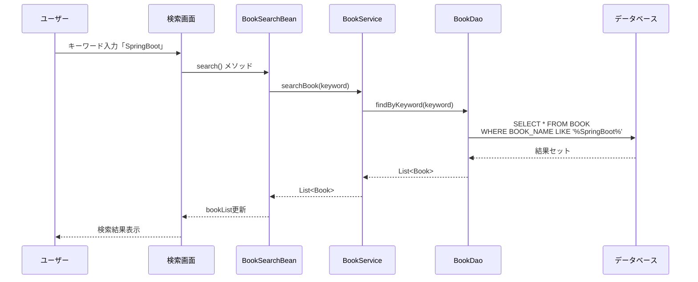

# F-001: 書籍検索・閲覧 - 機能設計書

**機能ID:** F-001  
**機能名:** 書籍検索・閲覧  
**バージョン:** 1.0.0  
**最終更新日:** 2025-12-16

---

## 1. 概要

本文書は、書籍検索・閲覧機能の詳細設計を記述します。

**関連ドキュメント:**
- [../../system/requirements.md](../../system/requirements.md) - システム要件定義書
- [../../system/architecture_design.md](../../system/architecture_design.md) - アーキテクチャ設計書
- [behaviors.md](behaviors.md) - 振る舞い仕様書（Acceptance Criteria）
- [screen_design.md](screen_design.md) - 画面設計書

---

## 2. ユーザーストーリー

```
As a 一般顧客
I want to カテゴリやキーワードで書籍を検索する
So that 目的の書籍を効率的に見つけることができる
```

---

## 3. ビジネスルール

| ルールID | 説明 |
|---------|-------------|
| BR-001 | カテゴリ未選択の場合、全カテゴリが検索対象 |
| BR-002 | キーワード未入力の場合、書籍名と著者の両方を検索 |
| BR-003 | 検索結果は書籍ID昇順でソート |
| BR-004 | 在庫0の書籍も表示（購入不可） |
| BR-005 | カバー画像ファイル名は書籍名の空白をアンダースコアに置換して生成 |
| BR-006 | カバー画像のパスは`resources/covers/{書籍名}.jpg` |
| BR-007 | 画像ファイルが存在しない場合は`no-image.jpg`を表示 |

---

## 4. 機能フロー

### 4.1 検索フロー

1. ユーザーがカテゴリを選択（任意）
2. ユーザーがキーワードを入力（任意）
3. 「検索」ボタンをクリック
4. システムがデータベースを検索
5. 検索結果を一覧表示

### 4.2 表示ルール

- 在庫0の書籍は「在庫なし」と表示
- 各書籍について、カバー画像、書籍名、著者、出版社、価格、在庫状況を表示
- カバー画像は `resources/covers/` 配下のファイルを参照
- 画像ファイル名は書籍名のスペースをアンダースコアに置換して生成（`#{book.bookName.replace(' ', '_')}.jpg`）
- 画像ファイルが存在しない場合は `no-image.jpg` を表示

---

## 5. データフロー



---

## 6. クラス設計

### 6.1 プレゼンテーション層

**SearchParam**
- **責務**: 書籍検索パラメータを保持
- **タイプ**: DTOクラス（Data Transfer Object）
- **フィールド**: 
  - `categoryId` - カテゴリID
  - `keyword` - 検索キーワード

**BookSearchBean**
- **責務**: 書籍検索画面のコントローラー
- **タイプ**: @SessionScoped Bean（検索結果をリダイレクト後も保持するため）
- **フィールド**: 
  - `searchParam` - 検索パラメータ（SearchParam型）
  - `bookList` - 検索結果のリスト（List<Book>）
  - `categoryList` - カテゴリリスト（List<Category>）
- **主要メソッド**: 
  - `init()` - @PostConstruct初期化メソッド。カテゴリリストと初期書籍リストを取得
  - `search()` - 書籍検索を実行し、bookSelect画面へリダイレクト
  - `refreshBookList()` - 書籍リストを最新の状態に更新（在庫数を含む）。bookSelect画面のpreRenderViewイベントから呼び出される
  - `addToCart(Book)` - カートに追加（在庫バージョン番号を含む）

### 6.2 ビジネスロジック層

**BookService**
- **責務**: 書籍検索のビジネスロジック
- **タイプ**: @ApplicationScoped
- **主要メソッド**: 
  - `searchBook(SearchParam)` - 書籍を検索
  - `findBookById(Integer)` - 書籍IDで検索
  - `getAllCategories()` - 全カテゴリを取得

**CategoryService**
- **責務**: カテゴリ管理のビジネスロジック
- **タイプ**: @ApplicationScoped
- **主要メソッド**: 
  - `findAll()` - 全カテゴリを取得
  - `findById(Integer)` - カテゴリIDで検索

### 6.3 データアクセス層

**BookDao**
- **責務**: 書籍エンティティのCRUD操作
- **タイプ**: @ApplicationScoped
- **主要メソッド**: 
  - `findAll()` - 全書籍を取得
  - `findById(Integer)` - 書籍IDで検索
  - `findByKeyword(String)` - キーワードで検索
  - `findByCategoryAndKeyword(Integer, String)` - カテゴリとキーワードで検索

**CategoryDao**
- **責務**: カテゴリエンティティのCRUD操作
- **タイプ**: @ApplicationScoped
- **主要メソッド**: 
  - `findAll()` - 全カテゴリを取得
  - `findById(Integer)` - カテゴリIDで検索

---

## 7. 例外・エラー処理

| シナリオ | 期待される動作 |
|----------|-------------------|
| 在庫0の書籍を検索 | 検索結果に表示、カート追加不可 |
| 検索結果が0件 | 「該当する書籍がありません」メッセージ表示 |
| カテゴリのみ選択 | 選択カテゴリの全書籍を表示 |
| キーワードのみ入力 | 全カテゴリから該当書籍を表示 |

---

## 8. 受入基準

詳細は [behaviors.md](behaviors.md) を参照

