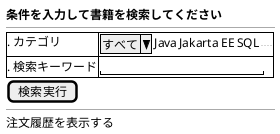
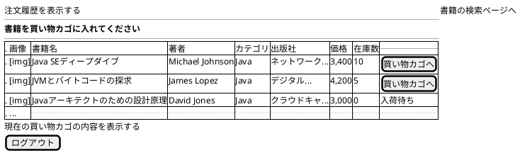

# F-001: 書籍検索・閲覧 - 画面設計書

**機能ID:** F-001  
**機能名:** 書籍検索・閲覧  
**バージョン:** 1.0.0  
**最終更新日:** 2025-12-16  
**フォーマット:** PlantUML (draw.io インポート可能)

---

## 画面一覧

1. [書籍検索画面 (bookSearch.xhtml)](#1-書籍検索画面)
2. [検索結果画面 (bookSelect.xhtml)](#2-検索結果画面)

---

## 1. 書籍検索画面

**ファイル名:** `bookSearch.xhtml`  
**目的:** 書籍検索条件入力

### PlantUML

### レイアウト説明

| エリア | コンポーネント | 説明 |
|--------|--------------|------|
| タイトル | 見出し | "条件を入力して書籍を検索してください" |
| 検索フォーム | カテゴリドロップダウン | カテゴリリストから選択 |
| | キーワード入力 | 書籍名検索用キーワード |
| | 検索実行ボタン | 検索を実行しbookSelect画面へ |
| ナビゲーション | 注文履歴を表示する | orderHistory画面へ |

### 検索ロジック

検索条件の組み合わせ:
- カテゴリ選択 + キーワード入力 → 複合検索（部分一致）
- カテゴリ選択のみ → カテゴリ検索
- キーワード入力のみ → 書籍名検索（部分一致）
- 条件なし → 全書籍取得

検索実行後、bookSelect画面へ遷移

---

## 2. 検索結果画面

**ファイル名:** `bookSelect.xhtml`  
**目的:** 検索結果一覧表示とカート追加

### PlantUML

### レイアウト説明

| カラム | 説明 |
|--------|------|
| 画像 | 書籍カバー画像（サムネイル） |
| 書籍名 | 書籍タイトル |
| 著者 | 著者名 |
| カテゴリ | カテゴリ名 |
| 出版社 | 出版社名 |
| 価格 | カンマ区切りで表示 |
| 在庫数 | 在庫数 |
| 操作 | 「買い物カゴへ」ボタンまたは「入荷待ち」テキスト |

### 画像表示ルール

- **画像配置**: imagesリソースライブラリのcoversフォルダ
- **ファイル名規則**: 書籍名のスペースをアンダースコアに置換 + `.jpg`
- **サイズ**: 高さ5cm、幅は自動調整（アスペクト比維持）
- **画像不在時**: no-image.jpgを表示
- **スタイル**: サムネイル表示、中央配置、角丸、シャドウ付き
- **ホバー効果**: 画像にマウスオーバー時、拡大・シャドウ強化のトランジション効果
- **ポップアップ表示**: テーブル行にマウスオーバー時、画面中央に書籍カバー画像の拡大ポップアップを表示（フェードインアニメーション）

### 動作

- **画面初期化**: 書籍リストを最新の状態に更新（在庫数を含む）
- **買い物カゴへボタン**: 在庫バージョン番号を保存してカートに追加（BR-012）。既存書籍は数量加算（BR-011）。cartView画面へ遷移
- **在庫なし**: ボタンの代わりに「入荷待ち」テキストを表示
- **現在の買い物カゴの内容を表示する**: cartView画面へ遷移
- **ログアウトボタン**: index画面へ遷移

---

## 3. 設計のポイント

- **書籍一覧**: テーブル形式で表示
- **在庫管理**: 在庫が0の場合は「入荷待ち」表示
- **画像表示**: 書籍名から画像ファイル名を生成、存在しない場合はフォールバック画像

