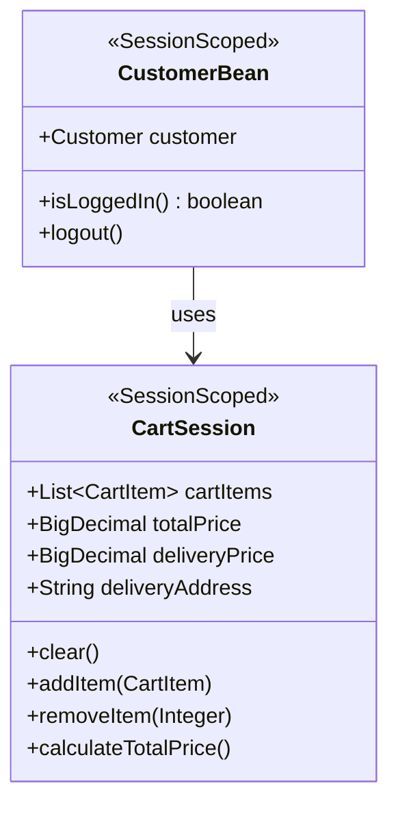

# F-002: ショッピングカート管理 - 機能設計書

**機能ID:** F-002  
**機能名:** ショッピングカート管理  
**バージョン:** 1.0.0  
**最終更新日:** 2025-12-16

---

## 1. 概要

本文書は、ショッピングカート管理機能の詳細設計を記述します。

**関連ドキュメント:**
- [../../system/requirements.md](../../system/requirements.md) - システム要件定義書
- [../../system/architecture_design.md](../../system/architecture_design.md) - アーキテクチャ設計書
- [behaviors.md](behaviors.md) - 振る舞い仕様書（Acceptance Criteria）
- [screen_design.md](screen_design.md) - 画面設計書

---

## 2. ユーザーストーリー

```
As a 一般顧客
I want to 選択した書籍をカートに追加・管理する
So that 購入前に内容を確認・調整できる
```

---

## 3. ビジネスルール

| ルールID | 説明 |
|---------|-------------|
| BR-010 | カート内容はセッション単位で保持（ログアウトまで） |
| BR-011 | 同じ書籍を追加した場合、数量を加算 |
| BR-012 | カート追加時点の在庫バージョン番号を保存（楽観的ロック用） |
| BR-013 | カート内の合計金額は常に自動計算 |

---

## 4. 機能フロー

### 4.1 カート追加フロー

1. 検索結果から書籍を選択
2. 「カートに追加」ボタンをクリック
3. システムが在庫を確認
4. システムが在庫バージョン番号を保存
5. カートに書籍を追加
6. 合計金額を再計算

### 4.2 カート編集フロー

1. カート画面で数量を変更
2. 「更新」ボタンをクリック
3. 合計金額を再計算

### 4.3 カート削除フロー

1. カート画面で「削除」をチェック
2. 「更新」ボタンをクリック
3. カートから書籍を削除
4. 合計金額を再計算

---

## 5. データ保持

### 5.1 セッション保持項目

- 書籍ID
- 書籍名
- 出版社名
- 単価
- 数量
- 在庫バージョン番号
- 小計（単価 × 数量）

---

## 6. クラス設計

### 6.1 プレゼンテーション層

**CartItem**
- **責務**: カート内の書籍情報を保持
- **タイプ**: DTOクラス（Serializable）
- **フィールド**: 
  - `bookId` - 書籍ID
  - `bookName` - 書籍名
  - `publisherName` - 出版社名
  - `price` - 単価
  - `count` - 数量
  - `version` - 在庫バージョン番号（楽観的ロック用）
  - `remove` - 削除フラグ

**CartSession**
- **責務**: セッションスコープでカート状態を管理
- **タイプ**: @SessionScoped Bean
- **フィールド**: 
  - `cartItems` - カートアイテムのリスト
  - `totalPrice` - 合計金額
  - `deliveryPrice` - 配送料金
  - `deliveryAddress` - 配送先住所
- **主要メソッド**: 
  - `clear()` - カートをクリア
  - `addItem(CartItem)` - カートにアイテムを追加
  - `removeItem(Integer bookId)` - カートからアイテムを削除
  - `calculateTotalPrice()` - 合計金額を計算

**CartBean**
- **責務**: カート画面のコントローラー
- **タイプ**: @SessionScoped Bean（リダイレクト後も状態を保持するため）
- **フィールド**: 
  - `bookService` - 書籍サービス
  - `stockDao` - 在庫DAO
  - `cartSession` - カートセッション
  - `customerBean` - 顧客Bean
  - `deliveryFeeService` - 配送料金サービス
  - `globalErrorMessage` - グローバルエラーメッセージ
- **主要メソッド**: 
  - `addBook(Integer bookId, Integer count)` - 書籍をカートに追加し、cartView画面へリダイレクト。在庫バージョン番号を保存（BR-012）
  - `removeSelectedBooks()` - 選択した書籍（remove=true）をカートから削除し、合計金額を再計算
  - `clearCart()` - カート全体をクリアし、cartClear画面へリダイレクト
  - `proceedToOrder()` - 配送先住所を設定し、配送料金を計算して注文画面に進む
  - `viewCart()` - カート画面を表示。カートが空の場合はglobalErrorMessageを設定

---

## 7. セッション状態設計



---

## 8. 例外・エラー処理

| シナリオ | 期待される動作 |
|----------|-------------------|
| 空カートで注文画面へ遷移 | エラーメッセージ表示 |
| カート内の書籍が削除された | 注文時にエラー |
| カート内の価格が変更された | カート追加時の価格で注文 |
| 同じ書籍を複数回追加 | 数量を加算（BR-011） |

---

## 9. 受入基準

詳細は [behaviors.md](behaviors.md) を参照

