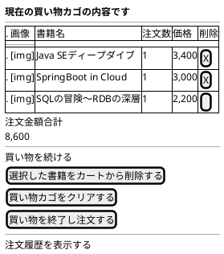

# F-002: ショッピングカート管理 - 画面設計書

**機能ID:** F-002  
**機能名:** ショッピングカート管理  
**バージョン:** 1.0.0  
**最終更新日:** 2025-12-16  
**フォーマット:** PlantUML (draw.io インポート可能)

---

## 画面一覧

1. [カート確認画面 (cartView.xhtml)](#1-カート確認画面)

---

## 1. カート確認画面

**ファイル名:** `cartView.xhtml`  
**目的:** カート内容確認・編集

### PlantUML

### レイアウト説明

| エリア | コンポーネント | 説明 |
|--------|--------------|------|
| タイトル | 見出し | "現在の買い物カゴの内容です" |
| カートテーブル | 画像 | 書籍カバー画像（サムネイル） |
| | 書籍名 | カートアイテムの書籍名 |
| | 注文数 | カートアイテムの数量 |
| | 価格 | カートアイテムの価格（カンマ区切り） |
| | 削除チェックボックス | 削除対象選択用 |
| 価格表示 | 注文金額合計 | カート全体の合計金額 |
| 操作ボタン | 選択した書籍をカートから削除する | 削除実行 |
| | 買い物カゴをクリアする | カート全削除 |
| | 買い物を終了し注文する | 注文画面へ遷移 |
| ナビゲーション | 買い物を続ける | bookSelect画面へ |
| | 注文履歴を表示する | orderHistory画面へ |

### 画像表示ルール

- **画像配置**: imagesリソースライブラリのcoversフォルダ
- **ファイル名規則**: 書籍名のスペースをアンダースコアに置換 + `.jpg`
- **サイズ**: 高さ5cm、幅は自動調整（アスペクト比維持）
- **画像不在時**: no-image.jpgを表示
- **スタイル**: サムネイル表示、中央配置、角丸、シャドウ付き
- **ホバー効果**: 画像にマウスオーバー時、拡大・シャドウ強化のトランジション効果

### 動作

- **画面表示時**: カートが空の場合、エラーメッセージと書籍選択ページへのリンクを表示
- **書籍追加**: 在庫バージョン番号を保存（BR-012）。既存書籍は数量加算（BR-011）
- **削除ボタン**: チェックされた書籍をカートから削除し画面をリフレッシュ
- **カートクリア**: カート全体を空にしてcartClear画面へ遷移
- **注文ボタン**: 配送先住所設定、配送料金計算後、bookOrder画面へ遷移
- **買い物を続ける**: bookSelect画面へ遷移
- **注文履歴表示**: orderHistory画面へ遷移

