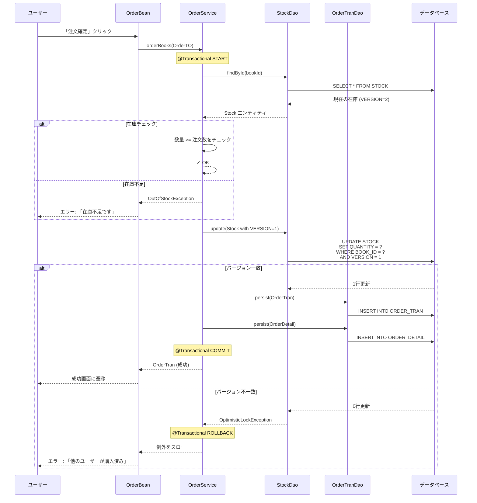

# F-003: 注文処理 - 機能設計書

**機能ID:** F-003  
**機能名:** 注文処理  
**バージョン:** 1.0.0  
**最終更新日:** 2025-12-16

---

## 1. 概要

本文書は、注文処理機能の詳細設計を記述します。

**関連ドキュメント:**
- [../../system/requirements.md](../../system/requirements.md) - システム要件定義書
- [../../system/architecture_design.md](../../system/architecture_design.md) - アーキテクチャ設計書
- [behaviors.md](behaviors.md) - 振る舞い仕様書（Acceptance Criteria）
- [screen_design.md](screen_design.md) - 画面設計書

---

## 2. ユーザーストーリー

```
As a 一般顧客
I want to カート内の書籍を購入し、配送先と決済方法を指定する
So that 書籍を受け取ることができる
```

---

## 3. ビジネスルール

| ルールID | 説明 | 詳細 |
|---------|-------------|---------|
| BR-020 | 配送料金計算ルール | 通常800円、沖縄県1700円、購入金額5000円以上で送料無料 |
| BR-021 | 決済方法選択肢 | 銀行振込、クレジットカード、着払い |
| BR-022 | 在庫チェックタイミング | 注文確定時に全書籍の在庫を確認 |
| BR-023 | 在庫減算タイミング | 在庫チェック後、注文登録前に減算 |
| BR-024 | 楽観的ロック制御 | カート追加時のバージョン番号で在庫更新 |
| BR-025 | トランザクション範囲 | 在庫チェック〜注文登録〜在庫減算は単一トランザクション |

---

## 4. 配送料金計算ルール

```
IF 購入金額 >= 5000円 THEN
    配送料金 = 0円（送料無料）
ELSE IF 配送先住所 が "沖縄県" で始まる THEN
    配送料金 = 1700円
ELSE
    配送料金 = 800円（通常配送）
END IF
```

---

## 5. 楽観的ロック制御

### 5.1 フェーズ 1: カート追加時

- 在庫エンティティからVERSION値を取得
- VERSION値をカートアイテムに保存

### 5.2 フェーズ 2: 注文確定時

- カートアイテムに保存したVERSION値で在庫を更新
- データベースのWHERE句に「AND VERSION = ?」条件を追加
- VERSION値が一致しない場合、OptimisticLockException発生
- 例外発生時、ユーザーにエラーメッセージを表示

### 5.3 フェーズ 3: 正常時

- 在庫数を減算
- VERSION値を自動インクリメント（JPA @Version機能）

---

## 6. 機能フロー

### 6.1 注文入力フロー

1. カート画面で「注文に進む」ボタンをクリック
2. 注文入力画面に遷移
3. 配送先住所を入力
4. 決済方法を選択
5. システムが配送料金を自動計算
6. 注文内容を確認

### 6.2 注文確定フロー

1. 「注文確定」ボタンをクリック
2. システムがトランザクション開始
3. システムが在庫を確認
4. システムが楽観的ロックで在庫を更新
5. システムが注文トランザクションを作成
6. システムが注文明細を作成
7. システムがトランザクションをコミット
8. 注文完了画面に遷移

---

## 7. データフロー



---

## 8. クラス設計

### 8.1 プレゼンテーション層

**OrderBean**
- **責務**: 注文処理のコントローラー
- **スコープ**: @ViewScoped（画面単位のライフサイクル）
- **依存コンポーネント（注入）**: 
  - `cartSession` (CartSession) - カートセッション
  - `customerBean` (CustomerBean) - 顧客情報管理
  - `orderService` (OrderService) - 注文ビジネスロジック
  - `deliveryFeeService` (DeliveryFeeService) - 配送料金計算
- **状態管理フィールド**: 
  - `orderTran` (OrderTran) - 注文トランザクション（注文完了後にセット）
  - `orderTranId` (Integer) - 注文ID（注文成功画面用のパラメータ、`f:viewParam`で受け取る）
- **主要メソッド**: 
  - `calculateDeliveryFee()` - 配送料金を再計算
  - `placeOrder()` - 注文を確定
  - `loadOrderSuccess()` - 注文成功画面用にデータをロード（`f:viewAction`から呼び出し）
- **設計上の注意事項**:
  - 配送先住所と決済方法は`CartSession`で管理（`OrderBean`には独自フィールドを持たない）
  - 配送先住所の取得: `cartSession.getDeliveryAddress()`
  - 決済方法の取得: `cartSession.getSettlementType()`
  - カート関連の初期化は`CartBean.proceedToOrder()`で実施（`OrderBean.init()`は削除済み）

### 8.2 ビジネスロジック層

**OrderService**
- **責務**: 注文処理のビジネスロジック
- **タイプ**: @ApplicationScoped
- **主要メソッド**: 
  - `orderBooks(OrderTO)` - 注文を作成（@Transactional）
  - `getOrderHistory(Integer customerId)` - 注文履歴を取得
  - `getOrderDetail(Long orderTranId)` - 注文詳細を取得

**DeliveryFeeService**
- **責務**: 配送料金計算のビジネスロジック
- **タイプ**: @ApplicationScoped
- **主要メソッド**: 
  - `calculateDeliveryFee(String address, BigDecimal totalPrice)` - 配送料金を計算（注：第1引数は住所、第2引数は総額）
  - `isOkinawa(String address)` - 沖縄県判定
  - `isFreeDelivery(BigDecimal totalPrice)` - 送料無料対象判定

### 8.3 転送オブジェクト

**OrderTO**
- **責務**: 注文情報をレイヤー間で転送
- **タイプ**: Transfer Object
- **フィールド**: 
  - `customerId` - 顧客ID
  - `deliveryAddress` - 配送先住所
  - `deliveryPrice` - 配送料金
  - `settlementCode` - 決済方法コード
  - `cartItems` - カートアイテムのリスト

**OrderHistoryTO**
- **責務**: 注文履歴情報をレイヤー間で転送
- **タイプ**: Transfer Object
- **フィールド**: 
  - `orderTranId` - 注文ID
  - `orderDate` - 注文日
  - `totalPrice` - 合計金額
  - `deliveryPrice` - 配送料金
  - `settlementName` - 決済方法名

**OrderSummaryTO**
- **責務**: 注文サマリー情報をレイヤー間で転送
- **タイプ**: Transfer Object
- **フィールド**: 
  - `orderTran` - 注文トランザクション
  - `orderDetails` - 注文明細のリスト

### 8.4 データアクセス層

**StockDao**
- **責務**: 在庫エンティティのCRUD操作（楽観的ロック付き）
- **タイプ**: @ApplicationScoped
- **主要メソッド**: 
  - `findById(Integer)` - 書籍IDで在庫を検索
  - `update(Stock)` - 在庫を更新（@Version付き）

**OrderTranDao**
- **責務**: 注文トランザクションエンティティのCRUD操作
- **タイプ**: @ApplicationScoped
- **主要メソッド**: 
  - `persist(OrderTran)` - 注文トランザクションを登録
  - `findByCustomerId(Integer)` - 顧客IDで注文履歴を取得
  - `findById(Long)` - 注文IDで検索

**OrderDetailDao**
- **責務**: 注文明細エンティティのCRUD操作
- **タイプ**: @ApplicationScoped
- **主要メソッド**: 
  - `persist(OrderDetail)` - 注文明細を登録
  - `findByOrderTranId(Long)` - 注文IDで明細を取得

---

## 9. 例外・エラー処理

| シナリオ | 期待される動作 |
|----------|-------------------|
| 在庫不足 | OutOfStockException、エラー画面表示 |
| 楽観的ロック競合 | OptimisticLockException、エラー画面表示 |
| 空カートで注文 | エラーメッセージ表示 |
| 配送先住所未入力 | 検証エラー表示 |

---

## 10. 受入基準

詳細は [behaviors.md](behaviors.md) を参照

