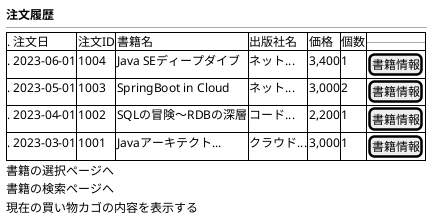
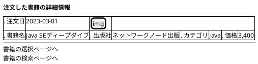

# F-005: 注文履歴参照 - 画面設計書

**機能ID:** F-005  
**機能名:** 注文履歴参照  
**バージョン:** 1.0.0  
**最終更新日:** 2025-12-16  
**フォーマット:** PlantUML (draw.io インポート可能)

---

## 画面一覧

1. [注文履歴画面 (orderHistory.xhtml)](#1-注文履歴画面)
2. [注文詳細画面 (orderDetail.xhtml)](#2-注文詳細画面)

---

## 1. 注文履歴画面

**ファイル名:** `orderHistory.xhtml`  
**目的:** 過去の注文一覧表示

### PlantUML

### レイアウト説明

| カラム | 説明 |
|--------|------|
| 注文日 | 注文確定日 |
| 注文ID | 注文取引ID |
| 書籍名 | 購入した書籍名 |
| 出版社名 | 出版社名 |
| 価格 | 書籍価格 |
| 個数 | 購入数量 |
| 書籍情報 | orderDetail画面へのリンク |

### 動作

- **書籍情報リンク**: orderDetail画面へ遷移（注文取引IDと注文明細IDを渡す）
- **初期表示**: 注文履歴を読み込む
- **ソート順**: 注文日降順（新しい順）

---

## 2. 注文詳細画面

**ファイル名:** `orderDetail.xhtml`  
**目的:** 注文の詳細情報表示

### 画像表示ルール（注文詳細画面のみ）

- **画像配置**: imagesリソースライブラリのcoversフォルダ
- **ファイル名規則**: 書籍名のスペースをアンダースコアに置換 + `.jpg`
- **サイズ**: 高さ5cm、幅は自動調整（アスペクト比維持）
- **画像不在時**: no-image.jpgを表示
- **スタイル**: サムネイル表示、中央配置、角丸、シャドウ付き
- **ホバー効果**: 画像にマウスオーバー時、拡大・シャドウ強化のトランジション効果

### PlantUML

