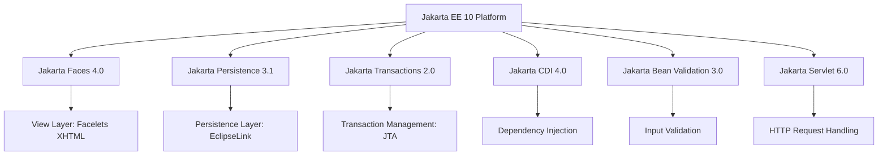
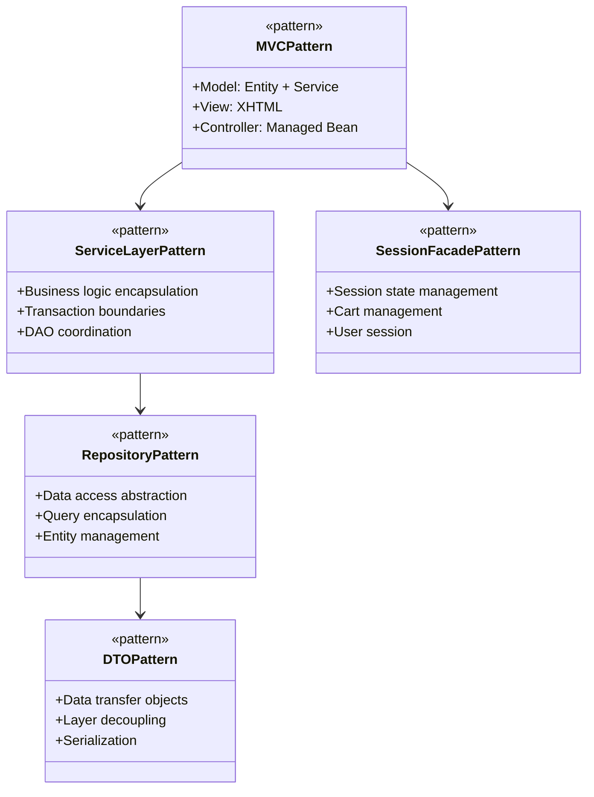
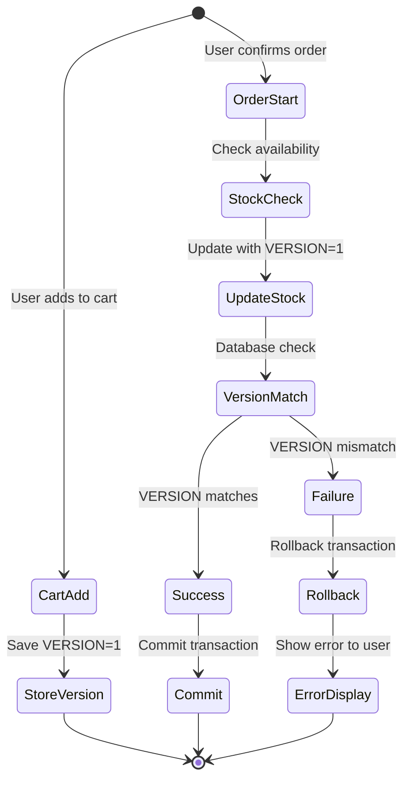
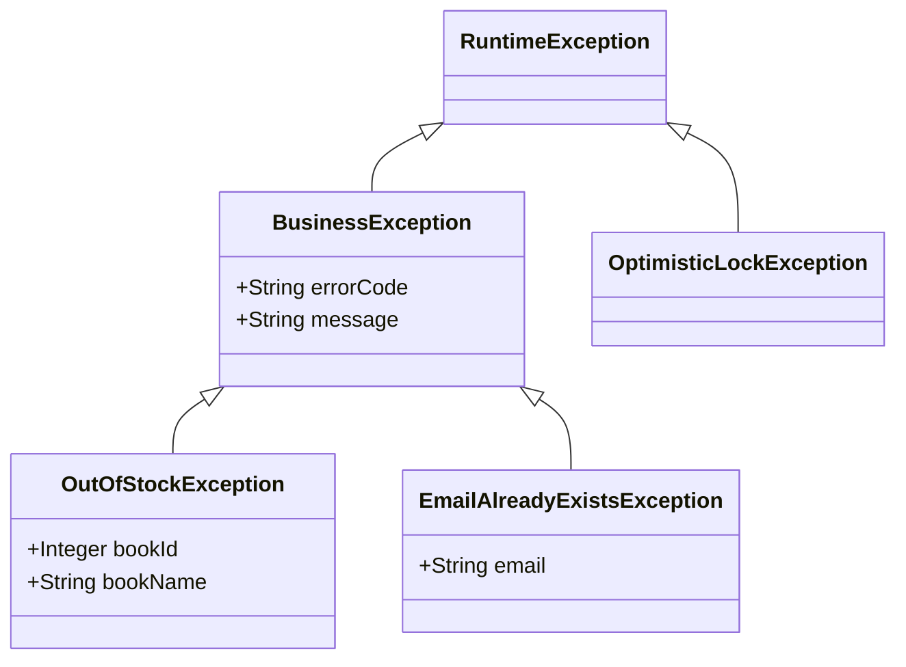
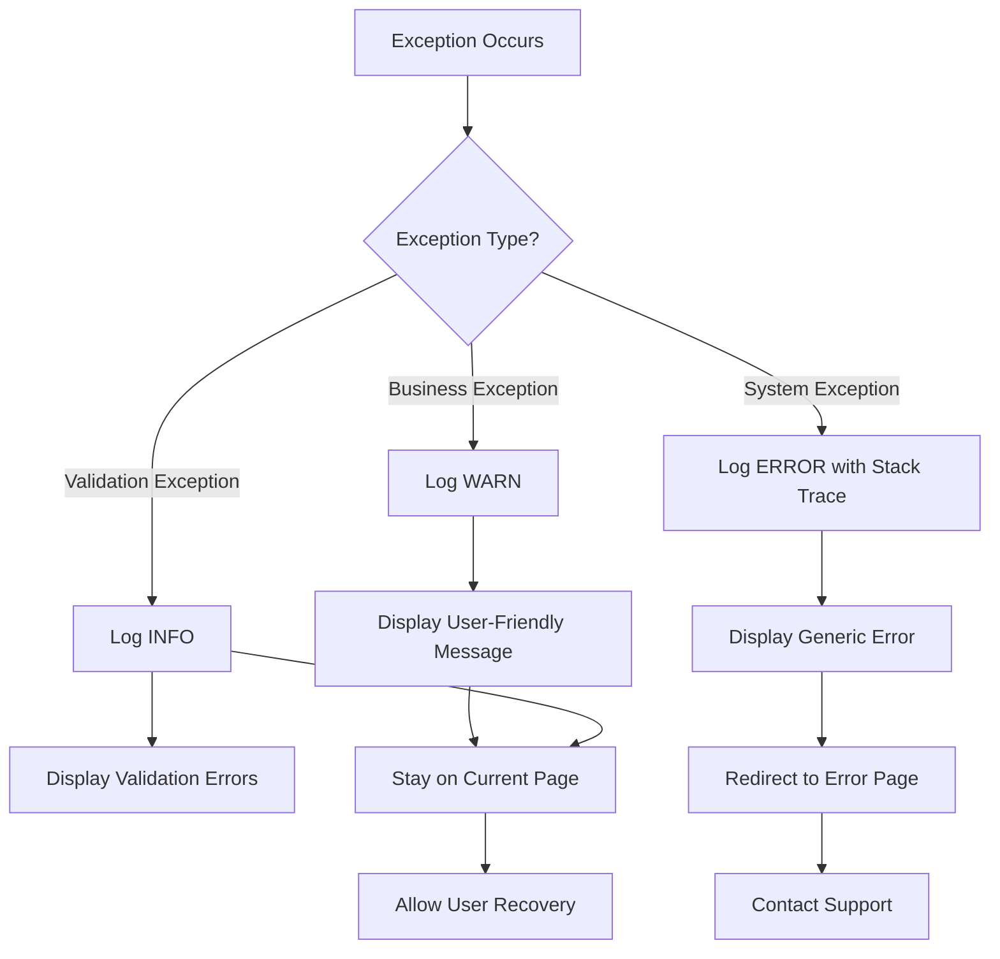
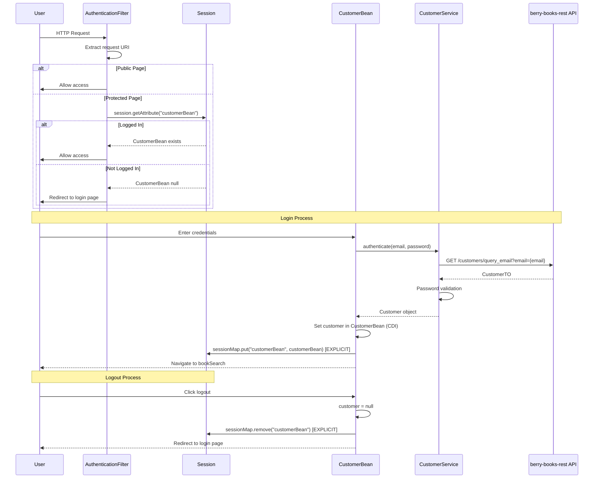

# berry-books - アーキテクチャ設計書

**プロジェクトID:** berry-books  
**バージョン:** 1.3.4  
**最終更新日:** 2025-12-21  
**ステータス:** アーキテクチャ設計完了（セッション管理・スコープ設計・複合主キーマッピング・画面遷移・UI/UX改善）

---

## 1. 技術スタック

### 1.1 コアプラットフォーム

| レイヤー | 技術 | バージョン |
|-------|-----------|---------|
| **ランタイム** | JDK | 21 |
| **プラットフォーム** | Jakarta EE | 10.0 |
| **アプリサーバー** | Payara Server | 6.x |
| **データベース** | HSQLDB | 2.7.x |
| **ビルドツール** | Gradle | 8.x |

### 1.2 Jakarta EE仕様



| 仕様 | バージョン |
|--------------|---------|
| Jakarta Faces (JSF) | 4.0 |
| Jakarta Persistence (JPA) | 3.1 |
| Jakarta Transactions (JTA) | 2.0 |
| Jakarta CDI | 4.0 |
| Jakarta Bean Validation | 3.0 |
| Jakarta Servlet | 6.0 |

### 1.3 追加ライブラリ

| ライブラリ | 用途 |
|---------|---------|
| SLF4J + Log4j2 | ログ出力 |
| JUnit 5 | 単体テスト |
| Mockito | モッキング |
| Playwright | E2Eテスト |
| Jakarta REST Client | berry-books-rest API連携 |

### 1.4 外部API連携

| 連携先 | プロトコル | 目的 |
|--------|----------|------|
| berry-books-rest | REST API (JAX-RS) | CUSTOMERテーブルへのアクセス |

---

## 2. アーキテクチャ設計

### 2.1 レイヤードアーキテクチャ

```mermaid
graph TB
    subgraph "Presentation Layer"
        View[JSF Facelets<br/>XHTML + CSS]
        Controller[Managed Beans<br/>@Named @ViewScoped<br/>@SessionScoped]
    end
    
    subgraph "Business Logic Layer"
        Service[Service Classes<br/>@ApplicationScoped<br/>@Transactional]
    end
    
    subgraph "Data Access Layer"
        DAO[DAO Classes<br/>@ApplicationScoped<br/>EntityManager]
    end
    
    subgraph "Persistence Layer"
        Entity[JPA Entities<br/>@Entity<br/>Relationships]
    end
    
    subgraph "Database Layer"
        DB[(HSQLDB<br/>testdb)]
    end
    
    subgraph "External API Layer"
        RestAPI[berry-books-rest<br/>REST API]
    end
    
    View -->|User Input| Controller
    Controller -->|@Inject| Service
    Service -->|@Inject| DAO
    Service -->|REST Client| RestAPI
    DAO -->|@PersistenceContext| Entity
    Entity -->|JDBC| DB
    RestAPI -->|JDBC| DB
    
    Controller -->|Display Data| View
```

### 2.2 コンポーネントの責務

| レイヤー | 責務 |
|-------|-----------------|
| **View (XHTML)** | UIレンダリング、ユーザー入力の収集、表示フォーマット |
| **Controller (Managed Bean)** | リクエスト処理、ナビゲーション制御、サービス委譲 |
| **Service** | ビジネスロジック、トランザクション境界、複数DAOの連携、REST API呼び出し（顧客管理） |
| **DAO** | CRUD操作、クエリ実行、エンティティライフサイクル管理 |
| **REST Client** | REST API呼び出し、リクエスト/レスポンス変換 |
| **Entity** | データ構造、リレーションシップ、データベースマッピング |

---

## 3. デザインパターン

### 3.1 適用パターン



| パターン | 実装 |
|---------|---------------|
| **MVC** | JSF + Managed Bean + Service |
| **サービスレイヤー** | @ApplicationScoped Service |
| **リポジトリ (DAO)** | EntityManager使用DAO |
| **DTO** | OrderTO (POJO), OrderHistoryTO (Record) |
| **セッションファサード** | @SessionScoped beans |
| **依存性注入** | @Inject (CDI) |
| **楽観的ロック** | @Version (JPA) |
| **トランザクション** | @Transactional |

### 3.2 DTO設計方針

| DTO | 実装方式 | 設計根拠 |
|-----|---------|---------|
| `OrderHistoryTO` | Record | 注文履歴一覧画面用。ORDER_TRANとORDER_DETAILを非正規化。1注文明細=1インスタンス。JOIN FETCHでN+1問題回避 |
| `OrderTO` | POJO | 注文入力からサービス層への複雑なデータ転送 |
| `CartItem` | POJO | カートセッションでの段階的な状態変更が必要 |

---

## 4. パッケージ構造と命名規則

### 4.1 パッケージ編成

```
pro.kensait.berrybooks/
├── common/                      # 共通ユーティリティと定数
│   ├── MessageUtil              # メッセージリソースユーティリティ
│   └── SettlementType          # 決済方法列挙型
│
├── util/                        # 汎用ユーティリティ
│   └── AddressUtil             # 住所処理ユーティリティ
│
├── web/                         # プレゼンテーション層（JSF Managed Beans）
│   ├── book/
│   │   ├── BookSearchBean      # 書籍検索コントローラー
│   │   └── SearchParam         # 検索パラメータホルダー
│   ├── cart/
│   │   ├── CartBean            # ショッピングカートコントローラー
│   │   ├── CartItem            # カートアイテムDTO
│   │   └── CartSession         # カートセッションファサード
│   ├── order/
│   │   ├── OrderBean           # 注文処理コントローラー
│   │   └── OrderHistoryBean    # 注文履歴参照コントローラー
│   ├── customer/
│   │   └── CustomerBean        # 顧客管理コントローラー
│   ├── login/
│   │   └── LoginBean           # ログインコントローラー
│   └── filter/
│       └── AuthenticationFilter # 認証フィルター
│
├── service/                     # ビジネスロジック層
│   ├── book/
│   │   └── BookService         # 書籍ビジネスロジック
│   ├── category/
│   │   └── CategoryService     # カテゴリ管理
│   ├── customer/
│   │   ├── CustomerService     # 顧客管理（REST API経由）
│   │   └── EmailAlreadyExistsException
│   ├── delivery/
│   │   └── DeliveryFeeService  # 配送料金計算
│   └── order/
│       ├── OrderService        # 注文処理
│       ├── OrderServiceIF      # 注文サービスインターフェース
│       ├── OrderTO             # 注文転送オブジェクト
│       ├── OrderHistoryTO      # 注文履歴DTO
│       ├── OrderSummaryTO      # 注文サマリーDTO
│       └── OutOfStockException # 在庫切れ例外
│
├── dao/                         # データアクセス層
│   ├── BookDao                 # 書籍データアクセス
│   ├── CategoryDao             # カテゴリデータアクセス
│   ├── StockDao                # 在庫データアクセス
│   ├── OrderTranDao            # 注文トランザクションデータアクセス
│   └── OrderDetailDao          # 注文明細データアクセス
│
├── client/                      # 外部APIクライアント層
│   └── customer/
│       └── CustomerRestClient   # 顧客管理REST APIクライアント
│
└── entity/                      # 永続化層（JPAエンティティ）
    ├── Book                    # 書籍エンティティ
    ├── Category                # カテゴリエンティティ
    ├── Publisher               # 出版社エンティティ
    ├── Stock                   # 在庫エンティティ（@Version付き）
    ├── Customer                # 顧客エンティティ
    ├── OrderTran               # 注文トランザクションエンティティ
    ├── OrderDetail             # 注文明細エンティティ
    └── OrderDetailPK           # 注文明細複合キー
```

**Webリソース構造（webapp/）:**
```
webapp/
├── resources/                  # 静的リソース
│   ├── css/
│   │   └── style.css          # メインスタイルシート（CSS変数、book-thumbnailなど）
│   └── images/
│       └── covers/            # 書籍カバー画像（.jpg形式）
│           ├── Java_SEディープダイブ.jpg
│           ├── SpringBoot_in_Cloud.jpg
│           ├── no-image.jpg   # フォールバック画像
│           └── ...
├── WEB-INF/
│   ├── web.xml                # デプロイメント記述子
│   └── faces-config.xml       # JSF設定ファイル
├── index.xhtml                # ログイン画面
├── bookSearch.xhtml           # 書籍検索画面
├── bookSelect.xhtml           # 検索結果画面
├── cartView.xhtml             # カート画面
├── bookOrder.xhtml            # 注文入力画面
├── orderSuccess.xhtml         # 注文完了画面
├── orderHistory.xhtml         # 注文履歴画面
├── orderDetail.xhtml          # 注文詳細画面
└── ...
```

### 4.2 命名規則

| コンポーネントタイプ | パターン | 例 |
|---------------|---------|---------|
| Entity | PascalCase 名詞 | `Book`, `OrderTran` |
| DAO | EntityName + Dao | `BookDao`, `StockDao` |
| Service | EntityName + Service | `BookService`, `OrderService` |
| Managed Bean | FeatureName + Bean | `BookSearchBean`, `CartBean` |
| DTO/TO | Purpose + TO | `OrderTO`, `OrderHistoryTO` |
| Exception | ErrorType + Exception | `OutOfStockException` |
| Enum | PascalCase | `SettlementType` |
| Utility | FeatureName + Util | `MessageUtil`, `AddressUtil` |

---

## 5. 状態管理（CDIスコープ）

### 5.1 CDIスコープ

```mermaid
graph LR
    A[@RequestScoped] -->|Single Request| B[Input validation<br/>Simple queries]
    C[@ViewScoped] -->|Single Page<br/>Multiple Ajax| D[Order input<br/>Simple forms]
    E[@SessionScoped] -->|User Session| F[Login state<br/>Shopping cart<br/>Search results]
    G[@ApplicationScoped] -->|Application Lifetime| H[Services<br/>DAOs<br/>Stateless beans]
```

| スコープ | 使用ケース | Serializable必須 |
|-------|-----------|----------------------------|
| @RequestScoped | 入力フォーム、単純なクエリ | いいえ |
| @ViewScoped | 注文入力フォーム | はい |
| @SessionScoped | ログイン状態、ショッピングカート、書籍検索結果 | はい |
| @ApplicationScoped | Services、DAOs、ユーティリティ | いいえ |

**重要な設計変更:**
- `BookSearchBean`は`@SessionScoped`を使用（`@ViewScoped`ではない）
- 理由: `faces-redirect=true`でリダイレクトする場合、`@ViewScoped`では状態が失われる
- `@SessionScoped`により、リダイレクト後も検索結果（`bookList`）が保持される

---

## 6. トランザクション管理

### 6.1 トランザクション境界

```mermaid
graph TD
    A[User Request] --> B{Transaction Required?}
    B -->|Yes| C[@Transactional Service Method]
    B -->|No| D[Non-Transactional Operation]
    
    C --> E[BEGIN TRANSACTION]
    E --> F[Business Logic]
    F --> G[DAO Operations]
    G --> H{Success?}
    H -->|Yes| I[COMMIT]
    H -->|No| J[ROLLBACK]
    I --> K[Return Result]
    J --> L[Throw Exception]
```

### 6.2 トランザクション戦略

**トランザクション境界:**
- サービスレイヤーで `@Transactional`
- RuntimeException で自動ロールバック

**OrderService.orderBooks()の例:**
1. 在庫可用性チェック
2. 在庫更新（楽観的ロック付き）
3. 注文トランザクション作成
4. 注文明細作成

---

## 7. 並行制御（楽観的ロック）

### 7.1 楽観的ロック戦略



### 7.2 実装詳細

**技術仕様:**
- バージョンカラム: `STOCK.VERSION` (BIGINT NOT NULL)
- Stock エンティティに `@Version`
- バージョン不一致時に `OptimisticLockException`

**処理フロー:**
1. カート追加時: VERSION値を取得しカートアイテムに保存
2. 注文確定時: 保存したVERSION値で在庫を更新
3. 成功時: 在庫数を減算、VERSION値を自動インクリメント
4. 失敗時: OptimisticLockException、ユーザーにエラー表示

---

### 7.3 複合主キーとJPAマッピング

ORDER_DETAILテーブルは複合主キー `(ORDER_TRAN_ID, ORDER_DETAIL_ID)` を使用しています。
ORDER_TRAN_IDは複合主キーの一部であると同時に、ORDER_TRANへの外部キーでもあります。

#### 7.3.1 設計方針

- 複合主キー: 注文トランザクションID + 注文明細ID
- 親エンティティ（OrderTran）への関連は遅延ロード（LAZY）
- `@MapsId`で複合主キーと外部キーを統合

#### 7.3.2 複合主キーと外部キーの統合

ORDER_TRAN_IDは複合主キーの一部かつORDER_TRANへの外部キー。

**解決策:**
- `@MapsId`を使用
- 親エンティティへの関連設定で複合主キーのフィールドが自動設定される

#### 7.3.3 データ永続化フロー

1. 複合主キーオブジェクトを生成
2. 注文明細エンティティを生成、複合主キーを設定
3. 親エンティティ（OrderTran）への関連を設定
4. その他のフィールド（書籍ID、価格、数量）を設定
5. エンティティを永続化

### 7.4 注文成功画面でのデータロード

#### 7.4.1 課題

**問題:**
注文完了後、注文成功画面で注文情報（注文番号、注文日時、総合計）が表示されない。

**原因:**
1. リダイレクト時にViewScopedのBean状態が失われる
2. URLパラメータで注文IDを引き継ぐ仕組みがない
3. パラメータから注文データを再取得する仕組みがない

#### 7.4.2 設計方針

**データ引き継ぎ:**
- 注文完了時に注文IDをURLパラメータでリダイレクト
- 遷移先でパラメータ受け取り、データ再取得
- データロードはビューアクションで実行（パラメータ設定後）

#### 7.4.3 コンポーネント責務

- **Backing Bean**: 注文ID受け取り、データロード、リダイレクト時の注文ID付与
- **Service**: 注文IDから注文トランザクションと明細を取得
- **DAO**: JOIN FETCHで一括取得（N+1問題回避）
- **XHTML**: ビューパラメータとビューアクションを定義

---

## 8. エラーハンドリング方針

### 8.1 例外階層



### 8.2 エラーハンドリングフロー



### 8.3 エラーハンドリング方針

| 例外タイプ | ログレベル | アクション |
|-----------|----------|----------|
| ビジネス例外 | WARN | 現在のページに留まる |
| システム例外 | ERROR | エラーページにリダイレクト |
| 検証例外 | INFO | 現在のページに留まる |

---

## 9. セキュリティ

### 9.1 認証フロー



**実装:**
- `AuthenticationFilter`: `@WebFilter`、`urlPatterns="*.xhtml"`
- `LoginBean`: `@SessionScoped`、`loggedIn`フラグで状態管理
- `AuthenticationFilter`は`LoginBean.isLoggedIn()`でチェック

### 9.2 セキュリティ対策

| 対策 | 実装 |
|---------|---------------|
| 認証 | Servlet Filter + Session |
| セッション管理 | HTTP-Only Cookie |
| 入力検証 | Bean Validation |
| パスワード保存 | 平文（⚠️学習用のみ） |
| CSRF保護 | JSF ViewState |
| SQLインジェクション対策 | JPA/JPQL |

### 9.3 セキュリティ制約

**公開ページ（認証不要）:**
- `index.xhtml` (ログインページ)
- `customerInput.xhtml` (登録ページ)
- `customerOutput.xhtml` (登録完了)

**保護ページ（認証必須）:**
- 上記以外の全ページ

---

## 10. データベース構成

### 10.1 永続化構成

**persistence.xml:**

```xml
<persistence-unit name="BerryBooksPU" transaction-type="JTA">
    <jta-data-source>jdbc/HsqldbDS</jta-data-source>
    <properties>
        <property name="jakarta.persistence.schema-generation.database.action" 
                  value="none"/>
        <property name="eclipselink.logging.level" value="FINE"/>
        <property name="eclipselink.logging.parameters" value="true"/>
    </properties>
</persistence-unit>
```

### 10.2 コネクションプール

| パラメータ | 値 | 備考 |
|-----------|-------|-------|
| **JNDI名** | jdbc/HsqldbDS | DataSource JNDI ルックアップ |
| **プール名** | HsqldbPool | コネクションプール識別子 |
| **ドライバ** | org.hsqldb.jdbc.JDBCDriver | HSQLDB JDBC ドライバ |
| **URL** | jdbc:hsqldb:hsql://localhost:9001/testdb | TCP接続 |
| **ユーザー** | SA | デフォルトHSQLDBユーザー |
| **パスワード** | (空) | パスワードなし |
| **最小プールサイズ** | 10 | 最小接続数 |
| **最大プールサイズ** | 50 | 最大接続数 |

### 10.3 データベース制約

- **トランザクション分離レベル**: READ_COMMITTED（デフォルト）
- **接続タイムアウト**: 30秒
- **アイドルタイムアウト**: 300秒

---

## 11. ログ戦略

### 11.1 ログフレームワーク

```
SLF4J (API) → Log4j2 (Implementation)
```

**依存関係:**
- `org.slf4j:slf4j-api:2.0.x` - SLF4J API（ロギングファサード）
- `org.apache.logging.log4j:log4j-core:2.21.x` - Log4j2コア実装
- `org.apache.logging.log4j:log4j-slf4j2-impl:2.21.x` - SLF4J 2.xバインディング

### 11.2 ログレベル

| レベル | 用途 |
|-------|-------|
| ERROR | システムエラー、例外 |
| WARN | ビジネス例外、警告 |
| INFO | メソッド開始点、主要イベント |
| DEBUG | 詳細フロー、パラメータ値 |

### 11.3 ログパターン

```
標準形式:
INFO  [ ClassName#methodName ] message

パラメータ付き:
INFO  [ ClassName#methodName ] param1=value1, param2=value2

例外:
ERROR [ ClassName#methodName ] Error message
java.lang.RuntimeException: ...
    at ...
```

### 11.4 ログ出力方針

**出力対象:**
- 全パブリックサービスメソッドのエントリ
- ビジネス例外の発生
- システム例外の発生（スタックトレース付き）
- 重要な状態変更（在庫更新、注文作成など）

---

## 13. テスト戦略

### 13.1 テストカバレッジ

| レイヤー | カバレッジ目標 | フレームワーク |
|-------|----------------|---------------|
| サービスレイヤー | 80%以上 | JUnit 5 + Mockito |
| DAOレイヤー | 主要メソッド | JUnit 5 |
| E2Eテスト | 主要画面遷移フロー | Playwright |
| 結合テスト | 主要フロー | JUnit 5 |

### 13.2 テスト方針

**単体テスト:**
- サービスレイヤーの全パブリックメソッド
- ビジネスロジックの境界値テスト
- エラーシナリオのテスト

**E2Eテスト:**
- 主要フロー: ログイン → 書籍検索 → カート → 注文 → 履歴参照
- エラーケース（在庫不足、認証エラー等）
- クロスブラウザテスト（Chromium, Firefox, WebKit）

**結合テスト:**
- 業務フローのEnd-to-Endテスト
- 楽観的ロックの動作確認
- トランザクション境界の確認

---

## 12. 開発ガイドライン

- Java 21機能を使用
- 全パブリックサービスメソッドをログ出力
- パブリックAPI用にJavaDoc
- 例外を握りつぶさない


