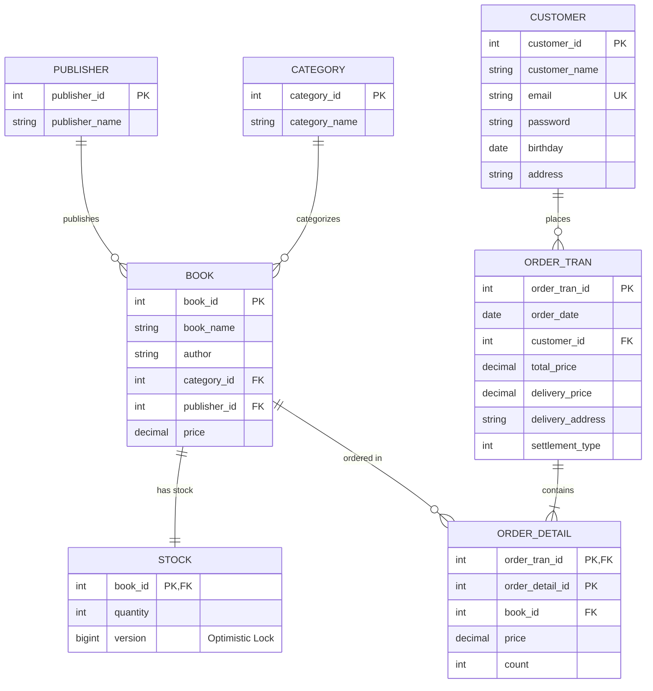
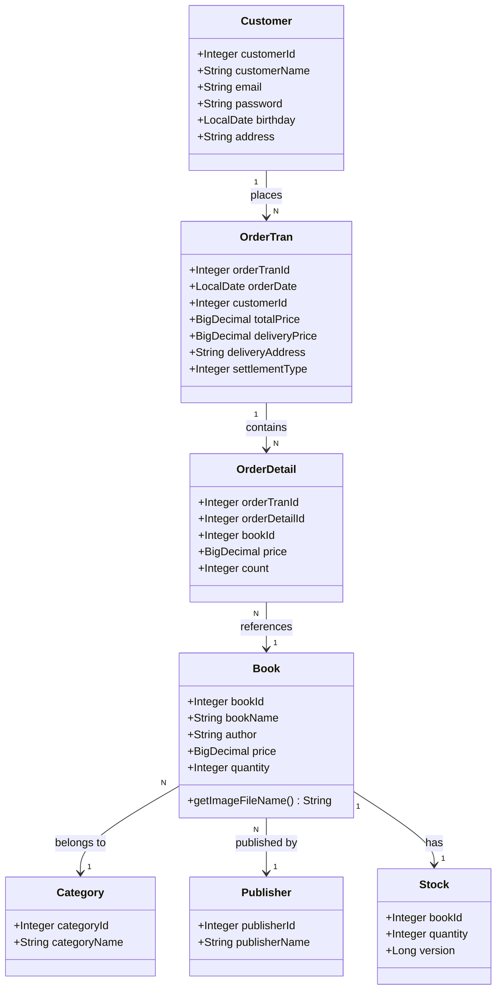
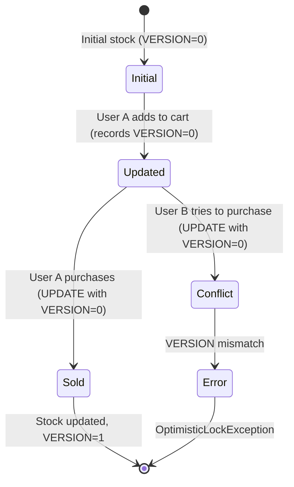
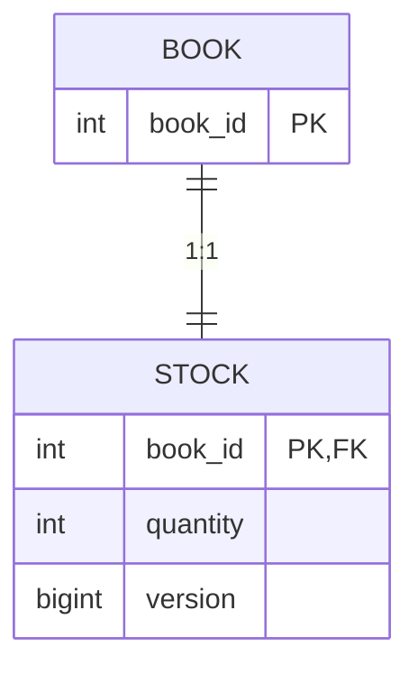
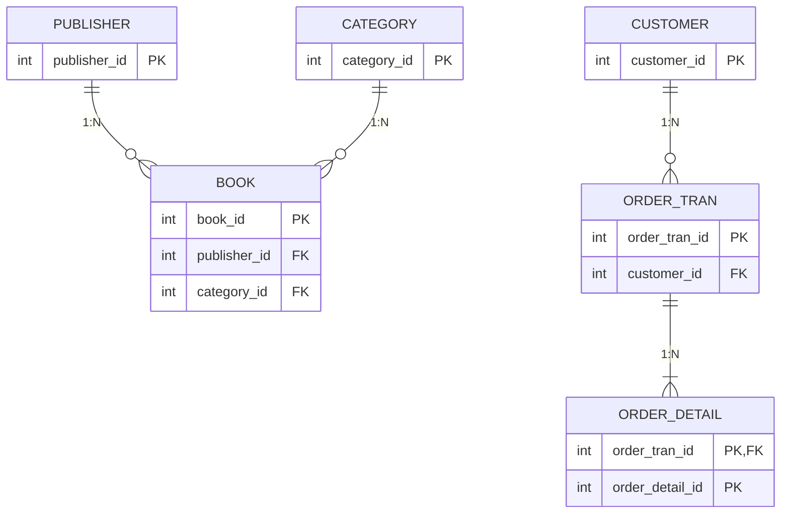
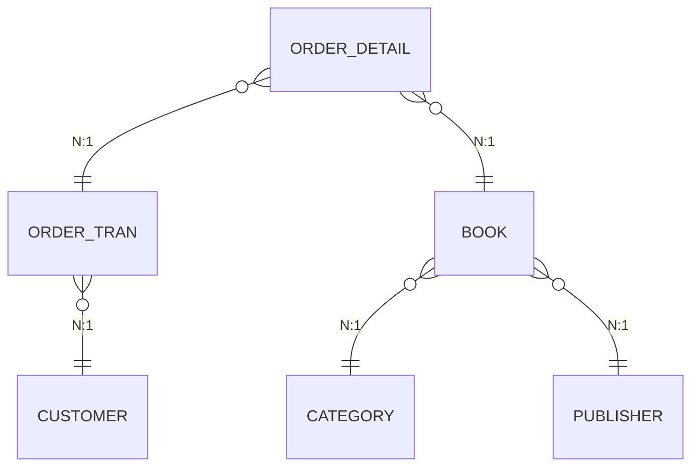
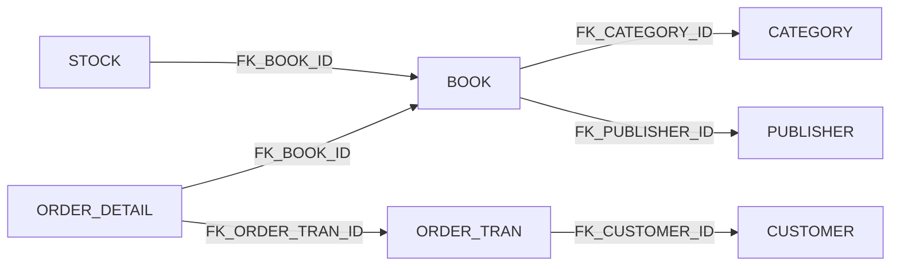
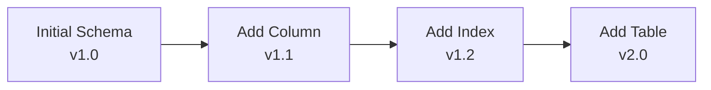

# berry-books - データモデル仕様書

**プロジェクトID:** berry-books  
**バージョン:** 1.1.2  
**最終更新日:** 2025-12-20  
**ステータス:** データモデル完成（DDL実装上の注意・JPA複合主キーマッピング追加）

---

## 1. エンティティ関係図



---

## 2. ドメインモデル



---

## 3. テーブル定義

### 3.1 PUBLISHER (出版社マスタ)

**目的:** 出版社の基本情報を管理

| カラム | 型 | 制約 | 説明 |
|--------|------|-------------|-------------|
| PUBLISHER_ID | INTEGER | PRIMARY KEY, IDENTITY | 出版社ID（自動採番） |
| PUBLISHER_NAME | VARCHAR(30) | NOT NULL | 出版社名 |

**ビジネスルール:**
- 出版社名は必須
- 出版社IDは自動採番（シーケンス）

**サンプルデータ:**
```
1: デジタルフロンティア出版
2: コードブレイクプレス
3: ネットワークノード出版
```

---

### 3.2 CATEGORY (カテゴリマスタ)

**目的:** 書籍のカテゴリを管理

| カラム | 型 | 制約 | 説明 |
|--------|------|-------------|-------------|
| CATEGORY_ID | INTEGER | PRIMARY KEY, IDENTITY | カテゴリID（自動採番） |
| CATEGORY_NAME | VARCHAR(20) | NOT NULL | カテゴリ名 |

**ビジネスルール:**
- カテゴリ名は必須
- カテゴリIDは自動採番（シーケンス）

**サンプルデータ:**
```
1: Java
2: SpringBoot
3: SQL
```

---

### 3.3 BOOK (書籍)

**目的:** 書籍の基本情報を管理

| カラム | 型 | 制約 | 説明 |
|--------|------|-------------|-------------|
| BOOK_ID | INTEGER | PRIMARY KEY, IDENTITY | 書籍ID（自動採番） |
| BOOK_NAME | VARCHAR(80) | NOT NULL | 書籍名 |
| AUTHOR | VARCHAR(40) | NOT NULL | 著者名 |
| CATEGORY_ID | INTEGER | NOT NULL, FK | カテゴリID |
| PUBLISHER_ID | INTEGER | NOT NULL, FK | 出版社ID |
| PRICE | INTEGER | NOT NULL | 価格（円） |

**外部キー:**
- `CATEGORY_ID` → `CATEGORY(CATEGORY_ID)`
- `PUBLISHER_ID` → `PUBLISHER(PUBLISHER_ID)`

**インデックス:**
- `BOOK_ID` にPRIMARY KEY
- `CATEGORY_ID` にINDEX（検索最適化）
- `BOOK_NAME` にINDEX（キーワード検索）

**ビジネスルール:**
- 書籍名、著者名は必須
- 価格は0以上の整数
- カテゴリと出版社は必須（外部キー参照）

**カバー画像の取り扱い:**
- カバー画像ファイルは `webapp/resources/images/covers/` 配下に配置
- 画像ファイル名は書籍名（BOOK_NAME）のスペースをアンダースコアに置換し、拡張子 `.jpg` を付加
- 例: 書籍名 `Java SEディープダイブ` → 画像ファイル名 `Java_SEディープダイブ.jpg`
- 画像ファイルが存在しない場合は、JavaScriptの`onError`イベントで`no-image.jpg`にフォールバック
- 画像ファイル名の生成はビュー層で実装（`#{book.bookName.replace(' ', '_')}.jpg`）

**サンプルデータ:**
```
1, 'Java SEディープダイブ', 'Michael Johnson', 1, 3, 3400
9, 'SpringBoot in Cloud', 'Paul Martin', 2, 3, 3000
```

---

### 3.4 STOCK (在庫)

**目的:** 書籍の在庫数を管理（楽観的ロック対応）

| カラム | 型 | 制約 | 説明 |
|--------|------|-------------|-------------|
| BOOK_ID | INTEGER | PRIMARY KEY, FK | 書籍ID |
| QUANTITY | INTEGER | NOT NULL | 在庫数 |
| VERSION | BIGINT | NOT NULL | バージョン番号（楽観的ロック用） |

**外部キー:**
- `BOOK_ID` → `BOOK(BOOK_ID)`

**ビジネスルール:**
- 在庫数は0以上の整数
- VERSION列はJPAの`@Version`で自動管理
- 更新時にVERSION値をチェックし、不一致の場合は`OptimisticLockException`

**DDL実装上の注意:**
- HSQLDBでは`VERSION BIGINT NOT NULL DEFAULT 0`構文がサポートされていない
- `DEFAULT 0`を削除して`VERSION BIGINT NOT NULL`とする
- 初期値0はINSERT文で明示的に指定する
- 例: `INSERT INTO STOCK (BOOK_ID, QUANTITY, VERSION) VALUES (1, 3, 0);`

**楽観的ロックメカニズム:**
```sql
-- JPAが生成:
UPDATE STOCK 
SET QUANTITY = ?, VERSION = VERSION + 1
WHERE BOOK_ID = ? AND VERSION = ?

-- VERSIONが一致しない場合、0行更新 → 例外
```

**ライフサイクル:**


---

### 3.5 CUSTOMER (顧客)

**目的:** 顧客の基本情報と認証情報を管理

| カラム | 型 | 制約 | 説明 |
|--------|------|-------------|-------------|
| CUSTOMER_ID | INTEGER | PRIMARY KEY, IDENTITY | 顧客ID（自動採番） |
| CUSTOMER_NAME | VARCHAR(30) | NOT NULL | 顧客名 |
| EMAIL | VARCHAR(30) | NOT NULL, UNIQUE | メールアドレス（一意） |
| PASSWORD | VARCHAR(60) | NOT NULL | パスワード（平文、学習用） |
| BIRTHDAY | DATE | NULL | 生年月日 |
| ADDRESS | VARCHAR(120) | NULL | 住所（UTF-8で40文字） |

**一意制約:**
- `EMAIL` UNIQUE (重複登録防止)

**インデックス:**
- `CUSTOMER_ID` にPRIMARY KEY
- `EMAIL` にUNIQUE INDEX（ログイン最適化）

**ビジネスルール:**
- 顧客名、EMAIL、パスワードは必須
- EMAILは一意（重複不可）
- パスワードは平文保存（⚠️ 学習用のみ、本番環境では非推奨）
- 生年月日と住所は任意

**セキュリティ注意:**
```
⚠️ 警告: パスワードは学習目的でのみ平文保存されています。
本番システムでは、パスワードハッシュ化（BCrypt, Argon2等）を必ず使用してください。
```

---

### 3.6 ORDER_TRAN (注文取引)

**目的:** 注文の基本情報を管理

| カラム | 型 | 制約 | 説明 |
|--------|------|-------------|-------------|
| ORDER_TRAN_ID | INTEGER | PRIMARY KEY, IDENTITY | 注文取引ID（自動採番） |
| ORDER_DATE | TIMESTAMP | NOT NULL | 注文日時 |
| CUSTOMER_ID | INTEGER | NOT NULL, FK | 顧客ID |
| TOTAL_PRICE | INTEGER | NOT NULL | 注文金額合計（円） |
| DELIVERY_PRICE | INTEGER | NOT NULL | 配送料金（円） |
| DELIVERY_ADDRESS | VARCHAR(30) | NOT NULL | 配送先住所 |
| SETTLEMENT_TYPE | INTEGER | NOT NULL | 決済方法（1:銀行振込, 2:クレジット, 3:着払い） |

**外部キー:**
- `CUSTOMER_ID` → `CUSTOMER(CUSTOMER_ID)`

**インデックス:**
- `ORDER_TRAN_ID` にPRIMARY KEY
- `CUSTOMER_ID` にINDEX（注文履歴クエリ用）
- `ORDER_DATE` にINDEX（日付時刻範囲クエリ用）

**ビジネスルール:**
- 注文日時は注文確定時のタイムスタンプ
- 注文金額合計は書籍価格の合計
- 配送料金は配送料金計算ロジックの結果（BR-020）
- 決済方法: 1=銀行振込, 2=クレジットカード, 3=着払い

**決済方法参照:**
```
1: 銀行振り込み (BANK_TRANSFER)
2: クレジットカード (CREDIT_CARD)
3: 着払い (CASH_ON_DELIVERY)
```

---

### 3.7 ORDER_DETAIL (注文明細)

**目的:** 注文の詳細（購入書籍）を管理

| カラム | 型 | 制約 | 説明 |
|--------|------|-------------|-------------|
| ORDER_TRAN_ID | INTEGER | PRIMARY KEY (1), FK | 注文取引ID |
| ORDER_DETAIL_ID | INTEGER | PRIMARY KEY (2) | 注文明細ID（注文内連番） |
| BOOK_ID | INTEGER | NOT NULL, FK | 書籍ID |
| PRICE | INTEGER | NOT NULL | 価格（注文時点の書籍価格） |
| COUNT | INTEGER | NOT NULL | 注文数 |

**複合主キー:**
- `(ORDER_TRAN_ID, ORDER_DETAIL_ID)`

**外部キー:**
- `ORDER_TRAN_ID` → `ORDER_TRAN(ORDER_TRAN_ID)`
- `BOOK_ID` → `BOOK(BOOK_ID)`

**インデックス:**
- `(ORDER_TRAN_ID, ORDER_DETAIL_ID)` にPRIMARY KEY
- `BOOK_ID` にINDEX（書籍販売分析用）

**ビジネスルール:**
- ORDER_DETAIL_IDは注文取引内で1から連番
- 価格は注文時点の書籍価格（後から書籍価格が変更されても影響を受けない）
- 注文数は1以上の整数

**ID生成:**
```
注文 1001:
  - 明細 1: 書籍A、数量2
  - 明細 2: 書籍B、数量1
  - 明細 3: 書籍C、数量3

(1001, 1), (1001, 2), (1001, 3)
```

**実装上の注意（JPA）:**
```
ORDER_DETAILエンティティでは複合主キー（@EmbeddedId）を使用しています。
ORDER_TRAN_IDは複合主キーの一部であると同時に、OrderTranへの外部キーでもあります。

JPAマッピングでは、@ManyToOne関係に@MapsId("orderTranId")アノテーションを使用して、
複合主キーのorderTranIdフィールドが@ManyToOne関係から自動的に設定されるように
構成する必要があります。

誤った実装例（insertable=false, updatable=falseを使用）:
  @JoinColumn(name = "ORDER_TRAN_ID", insertable = false, updatable = false)
  
正しい実装例（@MapsIdを使用）:
  @ManyToOne(fetch = FetchType.LAZY)
  @JoinColumn(name = "ORDER_TRAN_ID")
  @MapsId("orderTranId")
  private OrderTran orderTran;

@MapsIdを使用することで、orderTranオブジェクトを設定するだけで、
複合主キーのorderTranIdフィールドが自動的に設定されます。
```

---

## 4. リレーションシップカーディナリティ

### 4.1 1対1リレーションシップ



**リレーションシップ:** BOOK ↔ STOCK (1:1)
- 各書籍は1つの在庫レコードを持つ
- 在庫レコードは1つの書籍に紐づく

---

### 4.2 1対多リレーションシップ



**リレーションシップ:**
1. **PUBLISHER → BOOK** (1:N)
   - 1つの出版社は複数の書籍を出版
   - 各書籍は1つの出版社に属する

2. **CATEGORY → BOOK** (1:N)
   - 1つのカテゴリには複数の書籍が属する
   - 各書籍は1つのカテゴリに属する

3. **CUSTOMER → ORDER_TRAN** (1:N)
   - 1人の顧客は複数の注文を行う
   - 各注文は1人の顧客に属する

4. **ORDER_TRAN → ORDER_DETAIL** (1:N, 必須)
   - 1つの注文は1つ以上の注文明細を持つ
   - 各注文明細は1つの注文に属する

---

### 4.3 多対1リレーションシップ



**リレーションシップ:**
1. **ORDER_DETAIL → BOOK** (N:1)
   - 複数の注文明細が同じ書籍を参照可能
   - 各注文明細は1つの書籍を参照

---

## 5. データ整合性制約

### 5.1 主キー制約

| テーブル | 主キー | タイプ | 生成方法 |
|-------|-------------|------|-----------|
| PUBLISHER | PUBLISHER_ID | IDENTITY | AUTO |
| CATEGORY | CATEGORY_ID | IDENTITY | AUTO |
| BOOK | BOOK_ID | IDENTITY | AUTO |
| STOCK | BOOK_ID | FK | 手動 |
| CUSTOMER | CUSTOMER_ID | IDENTITY | AUTO |
| ORDER_TRAN | ORDER_TRAN_ID | IDENTITY | AUTO |
| ORDER_DETAIL | (ORDER_TRAN_ID, ORDER_DETAIL_ID) | 複合 | 手動（シーケンス） |

---

### 5.2 外部キー制約



**カスケードルール:**
- `ON DELETE RESTRICT` (デフォルト) - 親レコード削除時にエラー
- `ON UPDATE CASCADE` - 親レコード更新時に子も更新（HSQLDBデフォルト）

---

### 5.3 一意制約

| テーブル | カラム | 制約名 | 目的 |
|-------|--------|----------------|---------|
| CUSTOMER | EMAIL | EMAIL_UNIQUE | メールアドレス重複防止 |

---

### 5.4 チェック制約（アプリケーションレベル）

| テーブル | カラム | 検証ルール |
|-------|--------|-----------------|
| BOOK | PRICE | >= 0 |
| STOCK | QUANTITY | >= 0 |
| ORDER_TRAN | TOTAL_PRICE | >= 0 |
| ORDER_TRAN | DELIVERY_PRICE | >= 0 |
| ORDER_TRAN | SETTLEMENT_TYPE | IN (1, 2, 3) |
| ORDER_DETAIL | PRICE | >= 0 |
| ORDER_DETAIL | COUNT | >= 1 |

---

## 6. データアクセスパターン

### 6.1 共通クエリパターン

#### パターン 1: カテゴリとキーワードで書籍検索

```sql
-- 静的クエリ（BookDaoのJPQL）
SELECT b FROM Book b 
WHERE b.category.categoryId = :categoryId 
  AND (b.bookName LIKE :keyword OR b.author LIKE :keyword)

-- 動的クエリ（BookDaoのCriteria API）
CriteriaQueryと動的述語
```

#### パターン 2: 注文履歴と明細（N+1防止）

```sql
-- JOIN FETCHによる即時読み込み
SELECT o FROM OrderTran o 
LEFT JOIN FETCH o.orderDetails 
WHERE o.customerId = :customerId 
ORDER BY o.orderDate DESC
```

#### パターン 3: 楽観的ロックによる在庫更新

```sql
-- JPAが生成:
UPDATE STOCK 
SET QUANTITY = ?, VERSION = VERSION + 1 
WHERE BOOK_ID = ? AND VERSION = ?
```

---

### 6.2 インデックス戦略

**推奨インデックス:**

| テーブル | インデックスカラム | インデックスタイプ | 目的 |
|-------|--------------|------------|---------|
| BOOK | CATEGORY_ID | 非ユニーク | カテゴリ検索 |
| BOOK | BOOK_NAME | 非ユニーク | キーワード検索 |
| CUSTOMER | EMAIL | ユニーク | ログイン認証 |
| ORDER_TRAN | CUSTOMER_ID | 非ユニーク | 注文履歴クエリ |
| ORDER_TRAN | ORDER_DATE | 非ユニーク | 日付範囲クエリ |
| ORDER_DETAIL | BOOK_ID | 非ユニーク | 販売分析 |

---

## 7. データ量見積もり

### 7.1 マスタデータ

| テーブル | 想定行数 | 増加率 |
|-------|--------------|-------------|
| PUBLISHER | 5-10 | 静的 |
| CATEGORY | 9-15 | 低速 |

### 7.2 トランザクションデータ

| テーブル | 想定行数（1年） | 増加率 |
|-------|------------------------|-------------|
| BOOK | 50-100 | 中速 |
| STOCK | 50-100 | BOOKと同じ |
| CUSTOMER | 1,000 | 中速 |
| ORDER_TRAN | 10,000 | 高速 |
| ORDER_DETAIL | 20,000 | 高速（平均2冊/注文） |

---

## 8. サンプルデータ（最小セット）

### 8.1 マスタデータ (PUBLISHER)

```sql
INSERT INTO PUBLISHER (PUBLISHER_ID, PUBLISHER_NAME) VALUES
(1, 'デジタルフロンティア出版'),
(2, 'コードブレイクプレス'),
(3, 'ネットワークノード出版');
```

### 8.2 マスタデータ (CATEGORY)

```sql
INSERT INTO CATEGORY (CATEGORY_ID, CATEGORY_NAME) VALUES
(1, 'Java'),
(2, 'SpringBoot'),
(3, 'SQL');
```

### 8.3 テストデータ (CUSTOMER)

```sql
INSERT INTO CUSTOMER (CUSTOMER_ID, CUSTOMER_NAME, EMAIL, PASSWORD, BIRTHDAY, ADDRESS) VALUES
(1, 'Alice', 'alice@gmail.com', 'password', '1998-04-10', '東京都中央区1-1-1'),
(2, 'Bob', 'bob@gmail.com', 'password', '1988-05-10', '東京都杉並区2-2-2');
```

### 8.4 テストデータ (BOOK)

```sql
INSERT INTO BOOK (BOOK_ID, BOOK_NAME, AUTHOR, CATEGORY_ID, PUBLISHER_ID, PRICE) VALUES
(1,  'Java SEディープダイブ', 'Michael Johnson', 1, 3, 3400),
(9,  'SpringBoot in Cloud', 'Paul Martin', 2, 3, 3000),
(17, 'SQLの冒険～RDBの深層', 'Brian Lee', 3, 2, 2200);
```

### 8.5 テストデータ (STOCK)

```sql
INSERT INTO STOCK (BOOK_ID, QUANTITY, VERSION) VALUES
(1, 3, 0),   -- Java SEディープダイブ
(9, 2, 0),   -- SpringBoot in Cloud
(17, 3, 0);  -- SQLの冒険～RDBの深層
```

---

## 9. データベーススキーマ進化

### 9.1 マイグレーション戦略



**マイグレーションツール:**
- Flyway または Liquibase（本番環境推奨）
- 手動SQLスクリプト（学習用の現アプローチ）

### 9.2 後方互換性

| 変更タイプ | 破壊的変更 | 軽減策 |
|------------|----------------|------------|
| カラム追加（nullable） | いいえ | 安全 |
| カラム追加（not null） | はい | デフォルト値を提供 |
| カラム削除 | はい | 非推奨期間を設ける |
| カラム名変更 | はい | ビューまたはエイリアスを使用 |
| インデックス追加 | いいえ | 安全 |
| インデックス削除 | 場合による | クエリパフォーマンスを確認 |

---

## 10. データアーカイブと保持

### 10.1 保持ポリシー

| テーブル | 保持期間 | アーカイブ戦略 |
|-------|-----------------|-------------------|
| ORDER_TRAN | 5年 | アーカイブテーブルへ移動 |
| ORDER_DETAIL | 5年 | アーカイブテーブルへ移動 |
| CUSTOMER | アカウント削除まで | 論理削除フラグ |
| BOOK | 永続 | アーカイブなし |
| STOCK | 永続 | アーカイブなし |

### 10.2 論理削除パターン

**顧客テーブル用:**
```
-- カラム追加（将来の拡張）:
ALTER TABLE CUSTOMER ADD COLUMN IS_DELETED BOOLEAN DEFAULT FALSE;

-- 論理削除:
UPDATE CUSTOMER SET IS_DELETED = TRUE WHERE CUSTOMER_ID = ?;

-- アクティブ顧客のみクエリ:
SELECT * FROM CUSTOMER WHERE IS_DELETED = FALSE;
```

---

## 11. データセキュリティ考慮事項

### 11.1 機密データ

| テーブル | カラム | 機密性 | 保護方法 |
|-------|--------|-------------|-------------------|
| CUSTOMER | PASSWORD | 高 | ⚠️ 平文（学習用のみ） |
| CUSTOMER | EMAIL | 中 | 一意制約、公開禁止 |
| CUSTOMER | ADDRESS | 中 | 公開禁止 |
| ORDER_TRAN | DELIVERY_ADDRESS | 中 | 顧客のみに表示 |

**本番環境推奨:**
- パスワード: BCrypt または Argon2 ハッシュを使用
- Email: 保存時の暗号化（オプション）
- 個人データ: GDPR/現地規制に準拠

---

## 12. データベースパフォーマンスチューニング

### 12.1 クエリ最適化のヒント

| クエリタイプ | 最適化 |
|-----------|-------------|
| 書籍検索 | CATEGORY_ID、BOOK_NAMEにインデックス使用 |
| 注文履歴 | JOIN FETCHでN+1問題を回避 |
| 在庫更新 | 楽観的ロック（データベースロックなし） |
| 顧客ログイン | EMAILにインデックス（ユニーク） |

### 12.2 JPA最適化

```
# persistence.xml
eclipselink.logging.level=FINE  # 生成されたSQLを監視
eclipselink.cache.shared.default=false  # 学習用に2次キャッシュを無効化
```

---

## 13. テストデータ要件

### 13.1 ユニットテストデータ

**特性:**
- 最小限のデータセット（テーブルあたり1-5行）
- インメモリデータベース（H2またはHSQLDB）
- 分離されたトランザクション

### 13.2 結合テストデータ

**特性:**
- 代表的なデータセット（テーブルあたり10-50行）
- 本番と同じデータベース（HSQLDB）
- 現実的なリレーションシップ

### 13.3 パフォーマンステストデータ

**特性:**
- 大規模データセット（100-1000行）
- 複数の同時ユーザー
- 現実的なアクセスパターン


