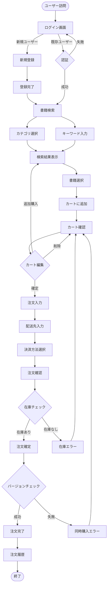
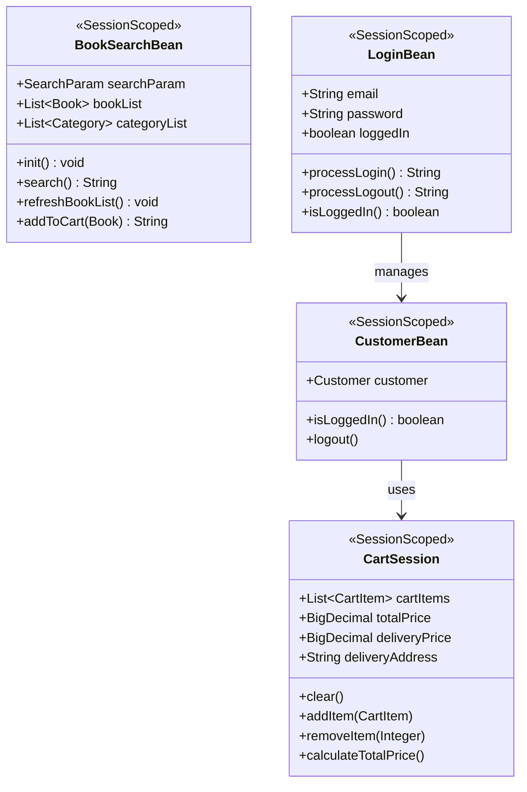

# berry-books - 機能設計書

**プロジェクトID:** berry-books  
**バージョン:** 1.1.3  
**最終更新日:** 2025-12-21  
**ステータス:** 機能設計完了（ビジネスルール・画面遷移・UI/UX改善）

---

## 1. 概要

本文書は、berry-booksシステムの機能設計の概要を記述します。各機能の詳細設計は、機能ごとに分割されたドキュメントを参照してください。

**関連ドキュメント:**
- [requirements.md](requirements.md) - 要件定義書
- [architecture_design.md](architecture_design.md) - アーキテクチャ設計書
- [data_model.md](data_model.md) - データモデル
- [screen_design.md](screen_design.md) - 画面設計書（概要）
- [behaviors.md](behaviors.md) - 振る舞い仕様書（概要）

---

## 2. 機能一覧

| 機能ID | 機能名 | 説明 | 詳細ドキュメント |
|--------|--------|------|-----------------|
| F-001 | 書籍検索・閲覧 | カテゴリやキーワードで書籍を検索し、一覧表示する | [../features/F_001_book_search/functional_design.md](../features/F_001_book_search/functional_design.md) |
| F-002 | ショッピングカート管理 | 選択した書籍をカートに追加・管理する | [../features/F_002_shopping_cart/functional_design.md](../features/F_002_shopping_cart/functional_design.md) |
| F-003 | 注文処理 | カート内の書籍を購入し、配送先と決済方法を指定する | [../features/F_003_order_processing/functional_design.md](../features/F_003_order_processing/functional_design.md) |
| F-004 | 顧客管理・認証 | アカウントを登録してログインする | [../features/F_004_customer_auth/functional_design.md](../features/F_004_customer_auth/functional_design.md) |
| F-005 | 注文履歴参照 | 過去の注文履歴を確認する | [../features/F_005_order_history/functional_design.md](../features/F_005_order_history/functional_design.md) |

---

## 3. 主要ビジネスルール

### 3.1 書籍検索・閲覧（F-001）

| ルールID | 説明 |
|---------|-------------|
| BR-001 | カテゴリ未選択の場合、全カテゴリが検索対象 |
| BR-002 | キーワード未入力の場合、書籍名と著者の両方を検索 |
| BR-003 | 検索結果は書籍ID昇順でソート |
| BR-004 | 在庫0の書籍も表示（購入不可） |
| BR-005 | カバー画像ファイル名は書籍名の空白をアンダースコアに置換して生成 |
| BR-006 | カバー画像のパスは`resources/covers/{書籍名（空白→_）}.jpg` |
| BR-007 | 画像ファイルが存在しない場合は`no-image.jpg`を表示 |
| BR-008 | 検索結果は`@SessionScoped`で保持（リダイレクト後も保持） |

**BR-005 の設計方針:**
- 書籍名が存在しない場合はデフォルト画像（no-image.jpg）を使用
- 書籍名の空白文字をアンダースコアに置換してファイル名を生成
- ファイル拡張子は「.jpg」で統一

**ファイル名の例:**
- 書籍名: `Java SEディープダイブ` → ファイル名: `Java_SEディープダイブ.jpg`
- 書籍名: `SpringBoot in Cloud` → ファイル名: `SpringBoot_in_Cloud.jpg`

### 3.2 ショッピングカート管理（F-002）

| ルールID | 説明 |
|---------|-------------|
| BR-010 | カート内容はセッション単位で保持（ログアウトまで） |
| BR-011 | 同じ書籍を追加した場合、数量を加算 |
| BR-012 | カート追加時点の在庫バージョン番号を保存（楽観的ロック用） |
| BR-013 | カート内の合計金額は常に自動計算 |

### 3.3 注文処理（F-003）

| ルールID | 説明 | 詳細 |
|---------|-------------|---------|
| BR-020 | 配送料金計算ルール | 通常800円、沖縄県1700円、購入金額5000円以上で送料無料 |
| BR-021 | 決済方法選択肢 | 銀行振込、クレジットカード、着払い |
| BR-022 | 在庫チェックタイミング | 注文確定時に全書籍の在庫を確認 |
| BR-023 | 在庫減算タイミング | 在庫チェック後、注文登録前に減算 |
| BR-024 | 楽観的ロック制御 | カート追加時のバージョン番号で在庫更新 |
| BR-025 | トランザクション範囲 | 在庫チェック〜注文登録〜在庫減算は単一トランザクション |
| BR-026 | 配送先住所のデフォルト値 | REST APIから取得したログインユーザーの住所を初期表示 |

**BR-026 の設計方針:**
- 注文入力画面の初期化時にログインユーザーの住所を取得
- 配送先住所フィールドにデフォルト値として設定
- ユーザーは必要に応じて編集可能（入力負荷軽減とUX向上）

### 3.4 顧客管理・認証（F-004）

| ルールID | 説明 |
|---------|-------------|
| BR-030 | メールアドレスは一意（重複不可） |
| BR-031 | パスワードは平文保存（学習用のみ、本番環境では非推奨） |
| BR-032 | セッションタイムアウト: 60分 |
| BR-033 | 公開ページ: ログイン画面、新規登録画面、登録完了画面 |
| BR-034 | 公開ページ以外は認証必須 |

### 3.5 注文履歴参照（F-005）

| ルールID | 説明 |
|---------|-------------|
| BR-040 | 注文履歴は顧客IDでフィルタリング |
| BR-041 | 注文日降順（新しい順）でソート |
| BR-042 | 注文詳細は注文IDで取得 |
| BR-043 | 注文成功画面では注文IDをURLパラメータで受け取り、ビューアクションでデータをロード |
| BR-044 | 検索結果画面では在庫数を無条件で表示し、在庫の有無で購入操作の可否を条件付き表示 |
| BR-045 | ログイン後は検索結果画面（bookSelect）に遷移し、全書籍を一覧表示 |
| BR-046 | 注文詳細画面では決済方法は表示しない |
| BR-047 | 配送料金は注文画面表示時と注文確定時に自動計算（手動計算ボタンなし） |
| BR-048 | カート画面から「買い物を続ける」を選択した場合は検索結果画面（bookSelect）に遷移し、全書籍を表示 |

**BR-043 の設計方針:**
- 注文処理完了時に注文IDをURLパラメータとしてリダイレクト
- ビューパラメータで注文IDを受け取る
- ビューアクションで注文データ（明細含む）をロード
- JSFライフサイクルにおいて、初期化メソッド実行後にパラメータが設定されるため、ビューアクションでデータ取得を行う

**BR-044 の設計方針:**
- 在庫数は常に数値で表示（ユーザーに在庫状況を明示）
- 購入可否は在庫数に応じて動的に切り替え（在庫あり: 購入ボタン、在庫なし: 状態表示）
- 条件付き表示要素は別々のコンテナに配置し、JSFレンダリングの予期しない動作を回避

**BR-045 の設計方針:**
- ログイン成功後は検索画面（bookSearch）ではなく検索結果画面（bookSelect）に直接遷移
- BookSearchBeanの初期化時に全書籍を取得し、bookListに設定
- ユーザーはログイン直後から全書籍を閲覧でき、必要に応じて検索画面で絞り込み可能

**BR-046 の設計方針:**
- 注文詳細画面（orderDetail）では注文情報として「注文日」と「配送先」のみ表示
- 決済方法は注文データには保存されるが、画面表示は不要

**BR-047 の設計方針:**
- 注文画面（bookOrder）表示時: ログインユーザーの住所で配送料金を初期計算
- 注文確定時: 配送先住所が変更されている可能性があるため、配送料金を再計算
- 手動計算ボタンは不要（UX簡素化）

**BR-048 の設計方針:**
- カート画面の「買い物を続ける」「書籍を探す」ボタンはbookSelectに遷移
- ログイン直後と同じ状態（全書籍表示）を提供し、ユーザーが迷わず買い物を継続できる

---

## 4. ユーザーフロー

### 4.1 メインユーザーフロー: 書籍購入フロー

---

## 5. クラス設計概要

### 5.1 主要クラスの責務

本システムの主要クラスとその責務を以下に示します。

#### 5.1.1 共通ユーティリティ (common/)

**MessageUtil**
- **責務**: メッセージリソース（messages.properties）からメッセージを取得
- **タイプ**: ユーティリティクラス（final、static メソッド）

**SettlementType**
- **責務**: 決済方法を表す定数とユーティリティメソッドを提供
- **タイプ**: Enum（列挙型）
- **定数**: BANK_TRANSFER(1), CREDIT_CARD(2), CASH_ON_DELIVERY(3)

#### 5.1.2 プレゼンテーション層 (web/)

各機能のManagedBeanとDTOクラス。詳細は各機能のドキュメントを参照。

#### 5.1.3 ビジネスロジック層 (service/)

各機能のServiceクラス。詳細は各機能のドキュメントを参照。

#### 5.1.4 データアクセス層 (dao/)

各機能のDaoクラス。詳細は各機能のドキュメントを参照。

---

## 6. セッション状態設計

セッションスコープで管理される主要なBeanの構造を以下に示します。

**重要な設計変更:**
- `BookSearchBean`は`@SessionScoped`を使用（以前は`@ViewScoped`）
- 理由: `search()`メソッドが`faces-redirect=true`でリダイレクトするため
- `@ViewScoped`ではリダイレクト後に`bookList`が失われる
- `@SessionScoped`により、リダイレクト後も検索結果が保持される

**BookSearchBeanのメソッド詳細:**
- `init()` - @PostConstructメソッド。カテゴリリストと初期書籍リスト（全書籍）を取得
- `search()` - 検索条件に基づいて書籍を検索し、bookSelect画面へリダイレクト
- `refreshBookList()` - 書籍リストを最新の状態に更新。bookSelect.xhtmlのpreRenderViewイベントから呼び出され、在庫数を最新化
- `addToCart(Book)` - 在庫バージョン番号を含めてカートに書籍を追加

---

## 7. バッチ処理

**該当なし**

本プロジェクト（berry-books）では、バッチ処理の要件は存在しない。全ての処理はオンラインのWebリクエストで実行される。

**補足:**
- 将来的に定期的なデータクリーンアップやレポート生成が必要になった場合は、本セクションにバッチ処理の設計を追加する。

---

## 8. 機能別詳細ドキュメント

各機能の詳細設計は、以下のドキュメントを参照してください。

### F-001: 書籍検索・閲覧
- [機能設計](../features/F_001_book_search/functional_design.md)
- [画面設計](../features/F_001_book_search/screen_design.md)
- [振る舞い仕様](../features/F_001_book_search/behaviors.md)

### F-002: ショッピングカート管理
- [機能設計](../features/F_002_shopping_cart/functional_design.md)
- [画面設計](../features/F_002_shopping_cart/screen_design.md)
- [振る舞い仕様](../features/F_002_shopping_cart/behaviors.md)

### F-003: 注文処理
- [機能設計](../features/F_003_order_processing/functional_design.md)
- [画面設計](../features/F_003_order_processing/screen_design.md)
- [振る舞い仕様](../features/F_003_order_processing/behaviors.md)

### F-004: 顧客管理・認証
- [機能設計](../features/F_004_customer_auth/functional_design.md)
- [画面設計](../features/F_004_customer_auth/screen_design.md)
- [振る舞い仕様](../features/F_004_customer_auth/behaviors.md)

### F-005: 注文履歴参照
- [機能設計](../features/F_005_order_history/functional_design.md)
- [画面設計](../features/F_005_order_history/screen_design.md)
- [振る舞い仕様](../features/F_005_order_history/behaviors.md)
