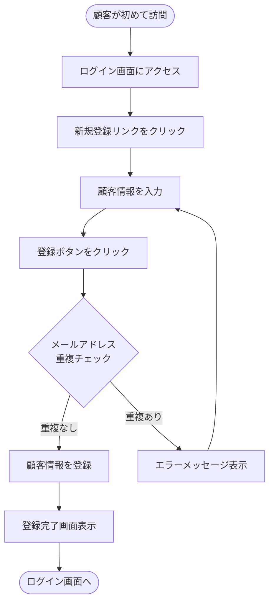
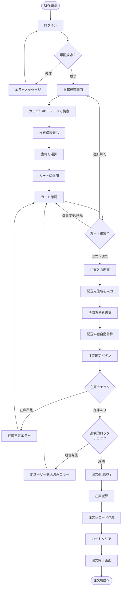
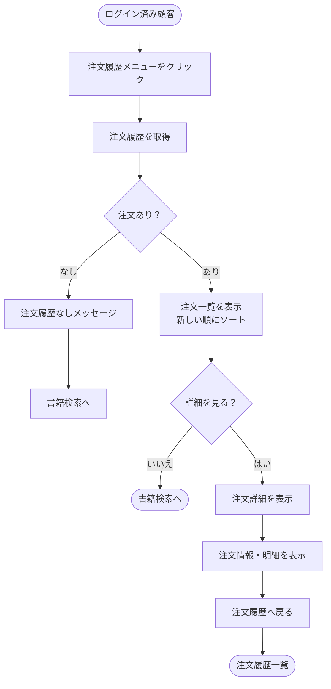
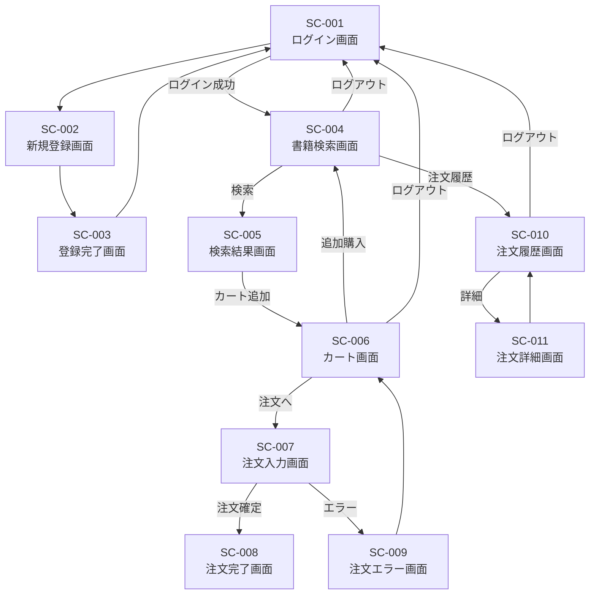

# berry-books - 要件定義書

**プロジェクトID:** berry-books  
**バージョン:** 1.2.0  
**最終更新日:** 2025-12-16  
**ステータス:** 要件確定（REST API連携追加）

---

## 1. プロジェクト概要

### 1.1 構築するもの

berry-booksは、書籍を検索・購入できるオンライン書店Webアプリケーションである。顧客は書籍を閲覧し、ショッピングカートに追加し、注文を確定できる。

### 1.2 プロジェクトの目的

本システムは、顧客が効率的に書籍を検索・購入できるオンライン書店を提供し、在庫管理の自動化と注文処理の効率化を実現することを目的とする。

---

## 2. ビジネス目標と成功指標

### 2.1 ビジネス目標

| 目標 | 説明 |
|------|------|
| オンライン販売チャネル | 書籍のオンライン販売チャネルを提供 |
| 顧客体験の向上 | 顧客の購買体験を向上させる |
| 在庫管理の効率化 | 在庫管理の効率化を実現 |
| 注文履歴の可視化 | 顧客が過去の注文履歴を確認できる |

### 2.2 成功指標

| 指標 | 目標値 |
|------|--------|
| 書籍検索から購入までのコンバージョン率 | 測定・改善 |
| ショッピングカート放棄率 | 最小化 |
| 在庫不整合の発生率 | 0% |
| ユーザーの注文完了率 | 最大化 |

---

## 3. ユーザーペルソナ

### 3.1 一般顧客（エンドユーザー）

**プロフィール:**
- 年齢: 20-50代
- 目的: 技術書・専門書の購入
- デバイス: PC、タブレット
- 技術レベル: 基本的なWeb操作ができる

**ニーズ:**
- 効率的に目的の書籍を見つけたい
- 購入前に在庫状況を確認したい
- 安全に注文処理を完了したい
- 過去の注文履歴を参照したい

**課題:**
- 書籍が多すぎて目的の本を見つけにくい
- 注文確定後に在庫切れが判明する
- 配送料金が明確でない

---

## 4. 対象業務・対象外業務

### 4.1 対象業務

本システムが対象とする業務範囲を以下に示す。

#### 4.1.1 顧客管理業務
- 新規顧客の会員登録
- 顧客認証（ログイン・ログアウト）
- セッション管理

#### 4.1.2 書籍販売業務
- 書籍の検索・閲覧
- ショッピングカートへの追加・編集
- 注文情報の入力
- 注文の確定処理
- 在庫の引き当て・減算

#### 4.1.3 注文管理業務
- 注文履歴の参照
- 注文詳細の確認

#### 4.1.4 配送料金計算業務
- 購入金額に応じた配送料金の自動計算
- 配送先地域（沖縄県）に応じた料金算定

### 4.2 対象外業務

以下の業務は本システムの対象外である。

#### 4.2.1 書籍管理業務
- 書籍マスタの登録・更新・削除
- 在庫の補充処理
- 出版社・カテゴリマスタの管理

#### 4.2.2 決済業務
- 実際の決済処理（決済方法の選択のみ実装）
- クレジットカード決済連携
- 銀行振込の入金確認

#### 4.2.3 配送業務
- 配送業者への配送依頼
- 配送状況の追跡
- 配送完了の通知

#### 4.2.4 マーケティング業務
- メールマガジン配信
- クーポン・キャンペーン管理
- レビュー・評価管理

#### 4.2.5 顧客サポート業務
- 問い合わせ管理
- 返品・交換処理
- パスワードリセット機能

---

## 5. 業務フロー

### 5.1 新規顧客登録フロー

**アクター:** 新規顧客  
**トリガー:** 初回訪問時  
**前提条件:** なし  
**事後条件:** 顧客アカウントがデータベースに登録される

### 5.2 書籍購入フロー

**アクター:** 既存顧客  
**トリガー:** ログイン後、書籍購入を希望するとき  
**前提条件:** 顧客アカウントが存在する、書籍マスタが登録されている  
**事後条件:** 注文が確定し、在庫が減算される

### 5.3 注文履歴参照フロー

**アクター:** 既存顧客  
**トリガー:** 過去の注文を確認したいとき  
**前提条件:** 顧客がログイン済み  
**事後条件:** なし（参照のみ）

---

## 6. 機能一覧

### 6.1 機能体系

本システムは、以下の5つのコア機能で構成される。

| 機能ID | 機能名 | 概要 | 優先度 |
|--------|--------|------|--------|
| F-001 | 書籍検索・閲覧 | カテゴリやキーワードで書籍を検索し、検索結果を一覧表示する | 高 |
| F-002 | ショッピングカート管理 | 選択した書籍をカートに追加・編集・削除する | 高 |
| F-003 | 注文処理 | カート内の書籍を購入し、注文を確定する | 高 |
| F-004 | 顧客管理・認証 | 新規顧客登録とログイン・ログアウト処理を行う | 高 |
| F-005 | 注文履歴参照 | 過去の注文履歴と注文詳細を参照する | 中 |

### 6.2 機能詳細

#### 機能 F-001: 書籍検索・閲覧

**概要:**  
顧客がカテゴリやキーワードで書籍を検索し、検索結果を一覧表示できる機能である。

**主要機能:**
- カテゴリ別検索
- キーワード検索（書籍名・著者名）
- 検索結果の一覧表示
- 書籍詳細情報の表示（在庫状況含む）

**対象画面:**
- SC-004: 書籍検索画面
- SC-005: 検索結果画面

**詳細設計:** [functional_design.md](functional_design.md#21-機能-f-001-書籍検索閲覧)

#### 機能 F-002: ショッピングカート管理

**概要:**  
顧客が選択した書籍をカートに追加し、購入前に内容を確認・調整できる機能である。

**主要機能:**
- カートへの書籍追加
- カート内容の確認
- 数量変更
- カートからの削除
- 合計金額の自動計算

**対象画面:**
- SC-006: カート画面

**詳細設計:** [functional_design.md](functional_design.md#22-機能-f-002-ショッピングカート管理)

#### 機能 F-003: 注文処理

**概要:**  
カート内の書籍を購入し、配送先と決済方法を指定して注文を確定する機能である。

**主要機能:**
- 配送先情報の入力
- 決済方法の選択（銀行振込、クレジットカード、着払い）
- 配送料金の自動計算
- 注文内容の確認
- 注文確定処理
- 在庫の自動減算
- 注文完了通知

**対象画面:**
- SC-007: 注文入力画面
- SC-008: 注文完了画面
- SC-009: 注文エラー画面

**詳細設計:** [functional_design.md](functional_design.md#23-機能-f-003-注文処理)

#### 機能 F-004: 顧客管理・認証

**概要:**  
新規顧客がアカウントを登録し、ログインして書籍を購入できる機能である。

**主要機能:**
- 新規顧客登録
- ログイン・ログアウト
- セッション管理
- 認証必須ページの保護

**対象画面:**
- SC-001: ログイン画面
- SC-002: 新規登録画面
- SC-003: 登録完了画面

**詳細設計:** [functional_design.md](functional_design.md#24-機能-f-004-顧客管理認証)

#### 機能 F-005: 注文履歴参照

**概要:**  
登録顧客が過去の注文履歴を確認し、購入済み書籍と配送状況を把握できる機能である。

**主要機能:**
- 注文履歴一覧の表示
- 注文詳細の確認
- 注文日降順でのソート

**対象画面:**
- SC-010: 注文履歴画面
- SC-011: 注文詳細画面

**詳細設計:** [functional_design.md](functional_design.md#25-機能-f-005-注文履歴参照)

---

## 7. 画面一覧

### 7.1 画面体系

本システムは、以下の11画面で構成される。

| 画面ID | 画面名 | 認証要否 | 機能ID | 備考 |
|--------|--------|---------|--------|------|
| SC-001 | ログイン画面 | 不要 | F-004 | システム起点画面 |
| SC-002 | 新規登録画面 | 不要 | F-004 | 顧客情報入力 |
| SC-003 | 登録完了画面 | 不要 | F-004 | 登録結果表示 |
| SC-004 | 書籍検索画面 | 必要 | F-001 | ログイン後初期画面 |
| SC-005 | 検索結果画面 | 必要 | F-001 | 書籍一覧表示 |
| SC-006 | カート画面 | 必要 | F-002 | カート内容確認 |
| SC-007 | 注文入力画面 | 必要 | F-003 | 配送先・決済方法入力 |
| SC-008 | 注文完了画面 | 必要 | F-003 | 注文確定後 |
| SC-009 | 注文エラー画面 | 必要 | F-003 | 在庫不足・競合エラー |
| SC-010 | 注文履歴画面 | 必要 | F-005 | 注文一覧表示 |
| SC-011 | 注文詳細画面 | 必要 | F-005 | 注文詳細表示 |

**注記:** 詳細なファイル名やクラス名は実装段階の設計書を参照すること。

### 7.2 画面遷移図

### 7.3 画面仕様

各画面の詳細な画面仕様は [screen_design.md](screen_design.md) を参照。

---

## 8. 帳票一覧

本システムでは、帳票出力機能は提供しない。

**対象外となる帳票:**
- 注文確認書
- 納品書
- 領収書
- 請求書
- 出荷指示書

**理由:**  
初期リリースでは帳票出力機能は実装せず、画面表示による確認のみとする。将来的には注文確認書（PDF）のダウンロード機能を追加する予定である。

---

## 9. 外部インターフェース仕様書

本システムは、顧客管理機能について、berry-books-restプロジェクトが提供するREST APIを経由してCUSTOMERテーブルにアクセスします。

### 9.1 berry-books-rest API連携

**連携先:** berry-books-rest プロジェクト

**連携内容:** CUSTOMERテーブルへのアクセス（顧客情報取得、認証、登録）

**連携方式:** REST API (JAX-RS 3.1)

**主要エンドポイント:**
- `GET /customers/{customerId}` - 顧客取得
- `GET /customers/query_email?email={email}` - メールアドレス検索（ログイン用）
- `POST /customers/` - 顧客新規登録

**詳細:** [external_interface.md](external_interface.md) を参照

### 9.2 対象外の外部連携

| 連携先 | 連携内容 | 対象外とした理由 |
|--------|---------|----------------|
| 決済システム | クレジットカード決済、銀行振込API | 初期リリースでは決済方法の選択のみ実装 |
| 配送業者API | 配送依頼、配送状況追跡 | 初期リリースでは配送先住所の入力のみ実装 |
| メールサーバー | 注文確認メール、パスワードリセットメール | 初期リリースではメール送信機能は実装しない |
| 外部書籍API | 書籍情報の取得、在庫連携 | 初期リリースでは書籍マスタは内部管理 |
| 会計システム | 売上データの連携 | 初期リリースでは管理機能は実装しない |

### 9.2 将来的な拡張候補

将来リリースで以下の外部連携を実装する予定である：

1. **決済システム連携**
   - 決済代行サービスとの連携
   - リアルタイム決済処理
   - 決済結果の取得

2. **配送業者API連携**
   - 配送業者システムとのAPI連携
   - 配送依頼の自動送信
   - 配送状況の追跡

3. **メール配信サービス連携**
   - メール配信サービスとの連携
   - 注文確認メールの自動送信
   - パスワードリセットメールの送信

---

## 10. 非機能要件

### 10.1 パフォーマンス要件

| 指標 | 目標値 |
|------|--------|
| 書籍検索レスポンスタイム | 2秒以内 |
| ページ読み込み時間 | 3秒以内 |
| 注文処理完了時間 | 3秒以内 |
| 同時ログインユーザー数 | 50ユーザー |

### 10.2 ユーザビリティ要件

| 要件 | 説明 |
|------|------|
| レスポンシブデザイン | PC、タブレット対応 |
| エラーメッセージ | 明確で理解しやすい日本語メッセージ |
| 操作性 | 3クリック以内で主要機能にアクセス可能 |
| フィードバック | 処理中はローディング表示 |

### 10.3 セキュリティ要件

| 要件 | 説明 |
|------|------|
| 認証 | 全画面で認証必須（公開ページを除く） |
| セッション管理 | セキュアなセッション管理機構を使用 |
| 入力検証 | サーバーサイドで全入力を検証 |
| パスワード保存 | ハッシュ化して保存（初期リリースでは簡易実装） |

**公開ページ（認証不要）:**
- SC-001: ログイン画面
- SC-002: 新規登録画面
- SC-003: 登録完了画面

### 10.4 信頼性要件

| 要件 | 説明 |
|------|------|
| データ整合性 | 楽観的ロックで在庫不整合を防止 |
| トランザクション | 注文処理は単一トランザクションで実行 |
| エラーハンドリング | 全エラーをユーザーに通知 |
| ログ出力 | 全主要処理でログを記録 |

---

## 11. 前提条件・制約事項

### 11.1 前提条件

#### 11.1.1 ビジネス前提

| 項目 | 内容 |
|------|------|
| プロジェクトの目的 | オンライン書店システムの構築 |
| 運用環境 | Webアプリケーションとして提供 |
| サービス提供時間 | 24時間365日 |
| 対象顧客 | 個人顧客（B2C） |

#### 11.1.2 技術前提

| 項目 | 内容 |
|------|------|
| 実行環境 | Webアプリケーションサーバーが利用可能であること |
| データベース | リレーショナルデータベースを使用 |
| ブラウザ | Chrome、Firefox、Edge の最新版 |

#### 11.1.3 データ前提

| 項目 | 内容 |
|------|------|
| 書籍マスタ | 事前に登録されていること |
| カテゴリマスタ | 事前に登録されていること |
| 出版社マスタ | 事前に登録されていること |
| 在庫マスタ | 各書籍の在庫情報が登録されていること |
| 同時アクセスユーザー数 | 最大50ユーザーを想定 |
| データベース構成 | シングルサーバー構成 |

#### 11.1.4 セキュリティ前提

| 項目 | 内容 |
|------|------|
| パスワード保存方式 | ハッシュ化（初期リリースでは簡易実装） |
| セッションタイムアウト | 60分 |
| 通信プロトコル | HTTPS |

### 11.2 制約事項

#### 11.2.1 技術的制約

| 制約 | 内容 | 理由 |
|------|------|------|
| アーキテクチャ | Webアプリケーション方式 | 汎用性とアクセス性 |
| データベース | リレーショナルデータベース | データ整合性の確保 |

#### 11.2.2 機能的制約

| 制約 | 内容 | 理由 |
|------|------|------|
| 決済処理 | 決済方法の選択のみ実装、実際の決済は未実装 | 初期リリースでは外部連携は対象外 |
| メール送信 | 注文確認メール等のメール送信機能は未実装 | 初期リリースでは外部連携は対象外 |
| 管理機能 | 書籍・在庫・顧客の管理画面は未実装 | 初期リリースでは顧客向け機能に集中 |
| モバイル対応 | PC・タブレットのみ対応、スマートフォンは未対応 | 初期リリースではデスクトップ中心 |
| 多言語対応 | 日本語のみ対応 | 初期リリースでは日本国内市場向け |

#### 11.2.3 運用制約

| 制約 | 内容 | 理由 |
|------|------|------|
| 可用性 | シングルサーバー構成 | 初期リリースではコスト優先 |
| バックアップ | 手動バックアップ | 初期リリースでは簡易運用 |
| 監視 | 基本的なログ出力のみ | 初期リリースでは最小限の監視 |
| 同時接続数 | 最大50ユーザー | 初期リリースでは小規模運用 |

#### 11.2.4 ビジネス制約

| 制約 | 内容 |
|------|------|
| 顧客サポート | 問い合わせ対応機能は未実装 |
| 返品・交換 | 返品・交換処理機能は未実装 |
| キャンセル | 注文キャンセル機能は未実装 |
| ポイント制度 | ポイント付与・利用機能は未実装 |
| クーポン | クーポン・割引機能は未実装 |

---

## 12. 成功基準

本プロジェクトが成功したと判断される条件：

### 12.1 機能要件の充足

- [ ] 全5つのコア機能（F-001〜F-005）が実装されている
- [ ] 全11画面（SC-001〜SC-011）が実装されている
- [ ] 全てのユーザーストーリーが実装され、受入基準を満たす
- [ ] 全てのビジネスルール（BR-xxx）が実装されている

### 12.2 非機能要件の充足

- [ ] 書籍検索レスポンスタイムが2秒以内である
- [ ] ページ読み込み時間が3秒以内である
- [ ] 注文処理完了時間が3秒以内である
- [ ] 50同時ユーザーでの動作が確認できる

### 12.3 品質要件の充足

- [ ] 楽観的ロックが正常に動作し、在庫不整合が発生しない
- [ ] 全てのエラーシナリオが適切に処理される
- [ ] 全エラーメッセージ（VAL-xxx、BIZ-xxx、SYS-xxx）が実装されている
- [ ] 主要機能の手動テストが完了している

### 12.4 ドキュメント要件の充足

- [ ] 要件定義書（requirements.md）が完成している
- [ ] 振る舞い仕様書（behaviors.md）が完成している
- [ ] 機能設計書（functional_design.md）が完成している
- [ ] アーキテクチャ設計書（architecture_design.md）が完成している
- [ ] データモデル仕様書（data_model.md）が完成している
- [ ] 画面仕様書（screen_design.md）が完成している
- [ ] 外部インターフェース仕様書（external_interface.md）が完成している

### 12.5 技術要件の充足

- [ ] 楽観的ロック制御が正常に実装されている
- [ ] トランザクション管理が適切に実装されている
- [ ] レイヤードアーキテクチャが実装されている
- [ ] コードの保守性と拡張性が確保されている

---

## 参考資料

本要件定義書に関連する詳細ドキュメント：

- [behaviors.md](behaviors.md) - 振る舞い仕様書（受入基準）
- [functional_design.md](functional_design.md) - 機能設計書（フロー・UI）
- [architecture_design.md](architecture_design.md) - アーキテクチャ設計書
- [data_model.md](data_model.md) - データモデル仕様書
- [screen_design.md](screen_design.md) - 画面仕様書
- [external_interface.md](external_interface.md) - 外部インターフェース仕様書

