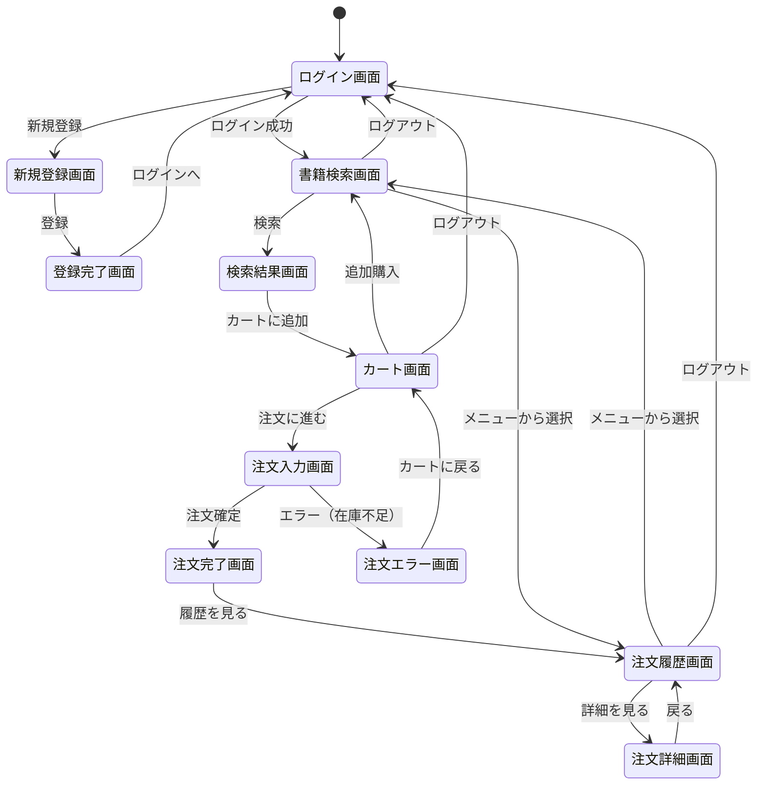
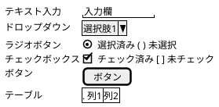

# berry-books - 画面仕様書

**プロジェクトID:** berry-books
**バージョン:** 1.1.3
**最終更新日:** 2025-12-21
**フォーマット:** PlantUML (draw.io インポート可能)

---

## 概要

本文書は、berry-booksシステムの画面設計の概要を記述します。各機能の詳細な画面設計は、機能ごとに分割されたドキュメントを参照してください。

**関連ドキュメント:**
- [requirements.md](requirements.md) - 要件定義書
- [functional_design.md](functional_design.md) - 機能設計書（概要）
- [behaviors.md](behaviors.md) - 振る舞い仕様書（概要）

---

## 画面一覧

| 画面ID | 画面名 | ファイル名 | 認証 | 機能ID | 詳細ドキュメント |
|--------|--------|-----------|------|--------|-----------------|
| SC-001 | ログイン画面 | index.xhtml | 不要 | F-004 | [../features/F_004_customer_auth/screen_design.md](../features/F_004_customer_auth/screen_design.md#1-ログイン画面) |
| SC-002 | 新規登録画面 | customerInput.xhtml | 不要 | F-004 | [../features/F_004_customer_auth/screen_design.md](../features/F_004_customer_auth/screen_design.md#2-新規登録画面) |
| SC-003 | 登録完了画面 | customerOutput.xhtml | 不要 | F-004 | [../features/F_004_customer_auth/screen_design.md](../features/F_004_customer_auth/screen_design.md#3-登録完了画面) |
| SC-004 | 書籍検索画面 | bookSearch.xhtml | 必要 | F-001 | [../features/F_001_book_search/screen_design.md](../features/F_001_book_search/screen_design.md#1-書籍検索画面) |
| SC-005 | 検索結果画面 | bookSelect.xhtml | 必要 | F-001 | [../features/F_001_book_search/screen_design.md](../features/F_001_book_search/screen_design.md#2-検索結果画面) |
| SC-006 | カート画面 | cartView.xhtml | 必要 | F-002 | [../features/F_002_shopping_cart/screen_design.md](../features/F_002_shopping_cart/screen_design.md#1-カート確認画面) |
| SC-007 | 注文入力画面 | bookOrder.xhtml | 必要 | F-003 | [../features/F_003_order_processing/screen_design.md](../features/F_003_order_processing/screen_design.md#1-注文入力画面) |
| SC-008 | 注文完了画面 | orderSuccess.xhtml | 必要 | F-003 | [../features/F_003_order_processing/screen_design.md](../features/F_003_order_processing/screen_design.md#2-注文完了画面) |
| SC-009 | 注文エラー画面 | orderError.xhtml | 必要 | F-003 | [../features/F_003_order_processing/screen_design.md](../features/F_003_order_processing/screen_design.md#3-注文エラー画面) |
| SC-010 | 注文履歴画面 | orderHistory.xhtml | 必要 | F-005 | [../features/F_005_order_history/screen_design.md](../features/F_005_order_history/screen_design.md#1-注文履歴画面) |
| SC-011 | 注文詳細画面 | orderDetail.xhtml | 必要 | F-005 | [../features/F_005_order_history/screen_design.md](../features/F_005_order_history/screen_design.md#2-注文詳細画面) |

---

## 画面遷移図

---

## 共通UI要素

### UIスタイル

本システムは、シンプルでベーシックなHTMLテーブルベースのUIを採用しています。

- **レイアウト**: テーブル、フォーム、リストなどの標準HTML要素
- **スタイリング**: 
  - メインスタイルシート: `webapp/resources/css/style.css`
  - CSS変数によるカラー、フォント、スペーシング等の一元管理
  - クラスベースのスタイル定義で再利用性を確保
- **UI要素の視覚的特徴**:
  - ウェルカムページタイトル: グラデーションテキスト効果
  - 書籍一覧テーブル: 統一されたテーブルスタイル
  - 書籍カバー画像: サムネイル表示（高さ5cm）、ホバー時に拡大効果
  - 画像セル: 中央配置、統一されたパディング
  - 書籍画像ポップアップ: 行にマウスオーバー時、画面中央に拡大表示、フェードインアニメーション
  - 書籍詳細レイアウト: 画像と情報を横並び表示
  - ボタン類: グラデーション背景、ホバー時にシャドウ強化・上方移動
  - カート追加ボタン: 専用スタイル
  - 検索ボタン: 専用スタイル
  - 入荷待ち表示: グレー背景、非アクティブ表示
  - エラーメッセージ: 赤系背景、左ボーダー強調
  - ヘッダーナビゲーション: flexboxによる横並び配置
  - ナビゲーションリンク: プライマリカラー、ホバー時に変形効果
  - カスタムフォーム要素: ラジオボタン、チェックボックスのカスタムデザイン
  - フォーム: 用途別（ログイン、検索、顧客登録、書籍）にスタイル定義
- **カラースキーム**: 
  - プライマリ: ベリーレッド系（`#CF3F4E`）
  - ホバー: より濃い赤系、より明るい赤系
  - 背景: 白（メイン）、ライトグレー（セカンダリ）、オフホワイト（詳細レイアウト）
  - テキスト: ダークグレー（プライマリ）、ミディアムグレー（セカンダリ）
  - ボーダー: ライトピンク系
- **視覚効果とインタラクション**: 
  - ボタン: グラデーション背景、ホバー時にシャドウ強化・上方移動のトランジション
  - 画像: ホバー時に拡大・シャドウ強化のトランジション効果
  - ポップアップ: フェードインアニメーション、中央固定配置
  - リンク: ホバー時に色変更・位置変化
- **ヘッダー/フッター**: 各画面に専用のヘッダー・フッターは設けず、必要なリンクを画面内に配置
- **ナビゲーション**: h:linkとh:commandButtonによる単純な画面遷移

---

## レイアウトとアクセシビリティ

本システムは、基本的なテーブルレイアウトを採用しており、レスポンシブデザインや高度なアクセシビリティ機能は実装していません。標準的なデスクトップブラウザでの表示を前提としています。

---

## 画面初期表示の設計ポリシー

### デフォルト値の自動設定

**注文入力画面（SC-007）- 配送先住所:**
- REST API経由で取得したログインユーザーの住所を自動表示
- `OrderBean.init()`で`customerBean.getCustomer().getAddress()`から取得
- ユーザーの入力負荷を軽減し、UXを向上

**検索結果画面（SC-005）- 書籍カバー画像:**
- **画像リソース配置**: `webapp/resources/images/covers/`ディレクトリ
- **画像ファイル名**: 書籍名のスペースをアンダースコアに置換して生成: `#{book.bookName.replace(' ', '_')}.jpg`
  - 例: 「Java SEディープダイブ」→ 「Java_SEディープダイブ.jpg」
- **画像パス**: `library="images" name="covers/#{book.bookName.replace(' ', '_')}.jpg"`
- **画像サイズ**: 
  - CSSクラス: `.book-thumbnail`
  - 高さ: `5cm`（幅は自動調整、アスペクト比維持）
  - 最大幅: `100%`（セル幅を超えない）
- **フォールバック**: ファイルが存在しない場合は、JavaScriptの`onError`イベントで`no-image.jpg`を表示
- **スタイル**: 角丸（4px）、シャドウ付き、ホバー時に拡大・シャドウ強調

### 条件付き表示の設計方針

**検索結果画面（SC-005）- 在庫数と購入可否の表示:**

| 要素 | 表示条件 | 設計意図 |
|------|---------|---------|
| 在庫数 | 常に表示 | ユーザーに在庫状況を明示する |
| 「カートへ」ボタン | 在庫 > 0 | 在庫がある場合のみ購入操作を許可 |
| 「在庫なし」テキスト | 在庫 = 0 | 購入不可であることを明示 |

**設計のポイント:**
- 在庫数と購入可否の表示を**別々のセル**に配置
- 同じセル内に複数の条件付き表示要素を配置すると、レンダリング処理で予期しない動作が発生する可能性がある
- 条件の排他性を明確にする（在庫あり/なしは相互排他的）

**注文成功画面（SC-008）- 注文情報の表示:**

| 要素 | データソース | 初期化タイミング |
|------|------------|----------------|
| 注文番号 | 注文トランザクション | ビューアクション |
| 注文日時 | 注文トランザクション | ビューアクション |
| 総合計 | 注文トランザクション（商品合計 + 配送料） | ビューアクション |
| 注文明細 | 注文トランザクション（明細リスト） | ビューアクション |

**設計のポイント:**
- ビューメタデータでURLパラメータを受け取る
- ビューアクションでデータ取得処理を実行
- JSFライフサイクルにおいて、初期化メソッドはパラメータ設定前に実行されるため、ビューアクションでデータロードを行う
- 注文データは明細を含めて一括取得（N+1問題回避）

### 画面遷移とナビゲーション設計

**ログイン成功時の遷移:**

| 画面 | 遷移先 | 表示内容 | 設計意図 |
|------|--------|---------|---------|
| ログイン画面（SC-001） | 検索結果画面（SC-005） | 全書籍一覧 | ユーザーが検索操作なしで商品を閲覧できる |

**カート画面からの遷移:**

| ボタン | 遷移先 | 表示内容 | 設計意図 |
|-------|--------|---------|---------|
| 買い物を続ける | 検索結果画面（SC-005） | 全書籍一覧 | ログイン直後と同じ状態で買い物を継続できる |
| 書籍を探す（カート空の場合） | 検索結果画面（SC-005） | 全書籍一覧 | 同上 |

**注文入力画面（SC-007）:**

| 要素 | 実装方式 | 設計意図 |
|------|---------|---------|
| 配送料金 | 自動表示 | CartSessionで保持される配送料を表示 |
| 配送先住所 | 初期値設定 | `CartSession.deliveryAddress`にログインユーザーの住所を設定 |
| 決済方法 | ラジオボタン | 銀行振り込み、クレジットカード、着払いの3択 |
| 注文ボタン | 2つ提供 | 「注文する（方式1）」「注文する（方式2）」で異なる実装を検証 |

**設計のポイント:**
- 配送料金はカート画面で計算済み（`DeliveryFeeService`を使用）
- 顧客情報は`CustomerBean`から取得して自動設定

**注文詳細画面（SC-011）の表示項目:**

| 項目 | 表示/非表示 | 設計意図 |
|------|-----------|---------|
| 注文日 | 表示 | 注文実行日 |
| 書籍名 | 表示 | 購入した書籍の名前 |
| 出版社 | 表示 | 出版社名 |
| カテゴリ | 表示 | 書籍カテゴリ |
| 価格 | 表示 | 書籍単価 |
| 書籍画像 | 表示 | 書籍のカバー画像 |

**設計のポイント:**
- URLパラメータで`tranId`と`detailId`を受け取る
- 注文明細の1つの書籍詳細を表示する画面（明細単位）
- 注文取引全体の情報ではなく、個別書籍の詳細にフォーカス

---

## 機能別画面詳細ドキュメント

各機能の詳細な画面設計は、以下のドキュメントを参照してください。

### F-001: 書籍検索・閲覧
- [画面設計](../features/F_001_book_search/screen_design.md)

### F-002: ショッピングカート管理
- [画面設計](../features/F_002_shopping_cart/screen_design.md)

### F-003: 注文処理
- [画面設計](../features/F_003_order_processing/screen_design.md)

### F-004: 顧客管理・認証
- [画面設計](../features/F_004_customer_auth/screen_design.md)

### F-005: 注文履歴参照
- [画面設計](../features/F_005_order_history/screen_design.md)

---

## 付録: PlantUML 参考情報

### salt記法の基本

