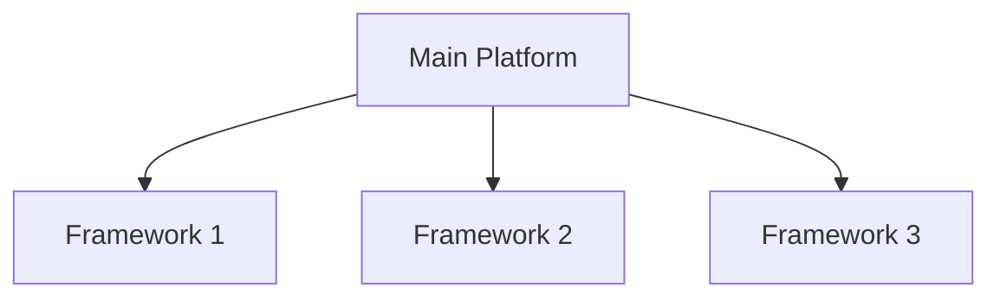
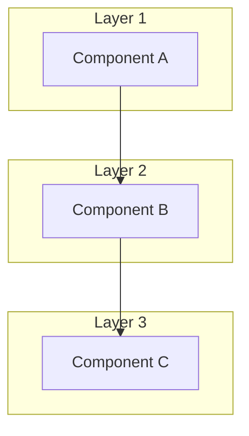
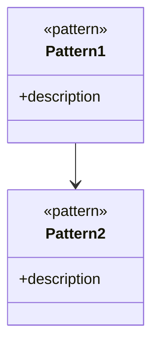
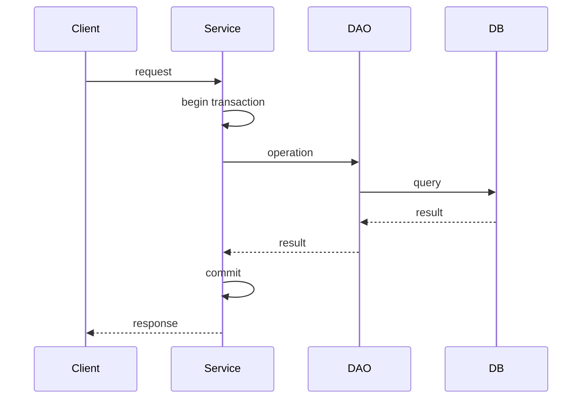
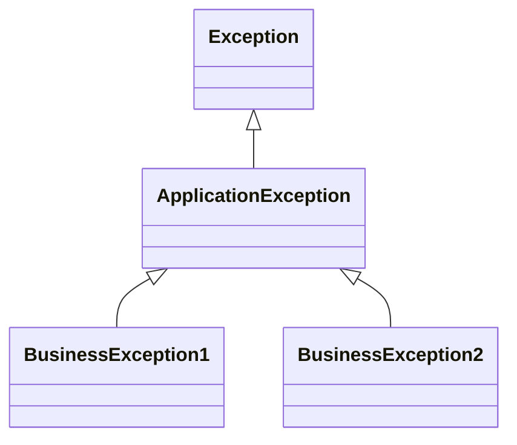
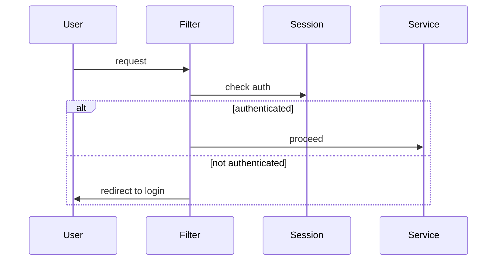
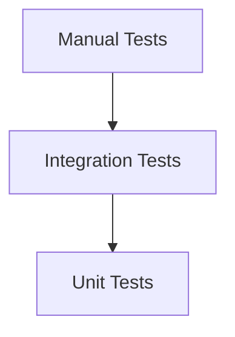

# [PROJECT_NAME] - アーキテクチャ設計書

**プロジェクトID:** [PROJECT_ID]  
**バージョン:** 1.0.0  
**最終更新日:** [DATE]  
**ステータス:** [STATUS]

---

## 1. 技術スタック

### 1.1 コアプラットフォーム

| レイヤー | 技術 | バージョン | 選定理由 |
|-------|-----------|---------|-----------|
| **ランタイム** | [RUNTIME] | [VERSION] | [REASON] |
| **プラットフォーム** | [PLATFORM] | [VERSION] | [REASON] |
| **アプリサーバー** | [SERVER] | [VERSION] | [REASON] |
| **データベース** | [DATABASE] | [VERSION] | [REASON] |
| **ビルドツール** | [BUILD_TOOL] | [VERSION] | [REASON] |

### 1.2 フレームワーク仕様

[必要に応じてMermaid図を追加]



| 仕様 | バージョン | 目的 |
|--------------|---------|---------|
| [SPEC_1] | [VERSION] | [PURPOSE] |
| [SPEC_2] | [VERSION] | [PURPOSE] |
| [SPEC_3] | [VERSION] | [PURPOSE] |

### 1.3 追加ライブラリ

| ライブラリ | 目的 | 選定理由 |
|---------|---------|-----------|
| [LIBRARY_1] | [PURPOSE] | [REASON] |
| [LIBRARY_2] | [PURPOSE] | [REASON] |

---

## 2. アーキテクチャ設計

### 2.1 アーキテクチャパターン

[レイヤードアーキテクチャ、マイクロサービス、イベント駆動などの説明]



### 2.2 コンポーネントの責務

| レイヤー | 責務 | 禁止事項 |
|-------|-----------------|-------------------|
| **[LAYER_1]** | • [RESPONSIBILITY_1]<br/>• [RESPONSIBILITY_2] | • [FORBIDDEN_1]<br/>• [FORBIDDEN_2] |
| **[LAYER_2]** | • [RESPONSIBILITY_1]<br/>• [RESPONSIBILITY_2] | • [FORBIDDEN_1]<br/>• [FORBIDDEN_2] |
| **[LAYER_3]** | • [RESPONSIBILITY_1]<br/>• [RESPONSIBILITY_2] | • [FORBIDDEN_1]<br/>• [FORBIDDEN_2] |

---

## 3. デザインパターン

### 3.1 適用パターン

[Mermaid図でパターンの関係を表示]



| パターン | 目的 | 適用箇所 |
|---------|------|---------|
| [PATTERN_1] | [PURPOSE] | [LOCATION] |
| [PATTERN_2] | [PURPOSE] | [LOCATION] |
| [PATTERN_3] | [PURPOSE] | [LOCATION] |

---

## 4. パッケージ構造と命名規則

### 4.1 パッケージ構成

```
[BASE_PACKAGE]/
├── entity/          # [DESCRIPTION]
├── dao/             # [DESCRIPTION]
├── service/         # [DESCRIPTION]
├── bean/            # [DESCRIPTION]
├── util/            # [DESCRIPTION]
└── filter/          # [DESCRIPTION]
```

### 4.2 命名規則

| コンポーネントタイプ | パッケージ | クラス名パターン | 例 |
|------------------|----------|----------------|-----|
| [TYPE_1] | `[package]` | `[Pattern]` | `[Example]` |
| [TYPE_2] | `[package]` | `[Pattern]` | `[Example]` |
| [TYPE_3] | `[package]` | `[Pattern]` | `[Example]` |

---

## 5. 状態管理

### 5.1 状態管理戦略

[セッション、アプリケーションスコープなどの説明]

| スコープ | 用途 | ライフサイクル | 例 |
|---------|------|--------------|-----|
| [SCOPE_1] | [USAGE] | [LIFECYCLE] | [EXAMPLE] |
| [SCOPE_2] | [USAGE] | [LIFECYCLE] | [EXAMPLE] |

---

## 6. トランザクション管理

### 6.1 トランザクション戦略

[トランザクション境界の説明]



---

## 7. 並行制御

### 7.1 並行制御戦略

[楽観的ロック、悲観的ロックなどの説明]

| 戦略 | 適用箇所 | 実装方法 |
|------|---------|---------|
| [STRATEGY_1] | [LOCATION] | [METHOD] |
| [STRATEGY_2] | [LOCATION] | [METHOD] |

---

## 8. エラーハンドリング戦略

### 8.1 例外階層



### 8.2 エラーハンドリングフロー

[エラー処理の流れを説明]

---

## 9. セキュリティアーキテクチャ

### 9.1 認証・認可

| 項目 | 実装方法 | 詳細 |
|------|---------|------|
| 認証 | [METHOD] | [DETAILS] |
| 認可 | [METHOD] | [DETAILS] |
| セッション管理 | [METHOD] | [DETAILS] |

### 9.2 セキュリティフロー



---

## 10. データベース構成

### 10.1 接続設定

| 項目 | 設定値 | 説明 |
|------|--------|------|
| データベース | [DATABASE] | [DESCRIPTION] |
| 接続プール | [POOL_SIZE] | [DESCRIPTION] |
| トランザクション分離レベル | [ISOLATION_LEVEL] | [DESCRIPTION] |

---

## 11. ログ戦略

### 11.1 ロギング設定

| ログレベル | 用途 | 例 |
|----------|------|-----|
| ERROR | [USAGE] | [EXAMPLE] |
| WARN | [USAGE] | [EXAMPLE] |
| INFO | [USAGE] | [EXAMPLE] |
| DEBUG | [USAGE] | [EXAMPLE] |

---

## 12. ビルド＆デプロイ

### 12.1 ビルドプロセス

```
[BUILD_COMMAND_1]
[BUILD_COMMAND_2]
[BUILD_COMMAND_3]
```

### 12.2 デプロイアーキテクチャ

[デプロイ構成の説明]

---

## 13. テスト戦略

### 13.1 テストピラミッド



### 13.2 テストアプローチ

| テストタイプ | ツール | カバレッジ目標 | 対象 |
|------------|--------|--------------|------|
| [TYPE_1] | [TOOL] | [COVERAGE] | [TARGET] |
| [TYPE_2] | [TOOL] | [COVERAGE] | [TARGET] |

---

## 14. パフォーマンス考慮事項

### 14.1 最適化戦略

| 項目 | 戦略 | 期待効果 |
|------|------|---------|
| [ITEM_1] | [STRATEGY] | [EFFECT] |
| [ITEM_2] | [STRATEGY] | [EFFECT] |

---

## 15. 技術リスクと軽減策

| リスク | 確率 | 影響度 | 軽減策 |
|--------|------|--------|--------|
| [RISK_1] | [PROBABILITY] | [IMPACT] | [MITIGATION] |
| [RISK_2] | [PROBABILITY] | [IMPACT] | [MITIGATION] |

---

## 16. 開発ガイドライン

### 16.1 コーディング規約

- **命名規則:**
  - [NAMING_CONVENTION_1]
  - [NAMING_CONVENTION_2]

- **コードフォーマット:**
  - [FORMAT_RULE_1]
  - [FORMAT_RULE_2]

### 16.2 コミット規約

- **コミットメッセージフォーマット:**
  ```
  [TYPE]: [SUBJECT]
  
  [BODY]
  
  [FOOTER]
  ```

- **コミットタイプ:**
  - `feat`: 新機能
  - `fix`: バグ修正
  - `docs`: ドキュメント変更
  - `style`: コードフォーマット
  - `refactor`: リファクタリング
  - `test`: テスト追加・修正
  - `chore`: ビルドプロセス・補助ツール変更

### 16.3 ブランチ戦略

- **ブランチモデル:** [BRANCH_MODEL] (例: Git Flow, GitHub Flow)
- **ブランチ命名規則:**
  - `main`: 本番環境
  - `develop`: 開発環境
  - `feature/[FEATURE_NAME]`: 機能開発
  - `bugfix/[BUG_NAME]`: バグ修正
  - `hotfix/[ISSUE_NAME]`: 緊急修正

### 16.4 コードレビュー

- **レビュー観点:**
  - [REVIEW_POINT_1]
  - [REVIEW_POINT_2]

- **承認ルール:**
  - [APPROVAL_RULE]

---

## 17. 将来の拡張（スコープ外）

### 17.1 想定される拡張機能

以下の機能は現在のスコープ外であるが、将来的な拡張の可能性を考慮してアーキテクチャを設計している。

- **[FUTURE_FEATURE_1]:**
  - 概要: [DESCRIPTION]
  - 拡張ポイント: [EXTENSION_POINT]

- **[FUTURE_FEATURE_2]:**
  - 概要: [DESCRIPTION]
  - 拡張ポイント: [EXTENSION_POINT]

### 17.2 アーキテクチャの拡張性

- **拡張可能な領域:**
  - [EXTENSIBLE_AREA_1]
  - [EXTENSIBLE_AREA_2]

- **拡張時の注意点:**
  - [CONSIDERATION_1]
  - [CONSIDERATION_2]

---

## 18. 参考資料

### 18.1 公式ドキュメント

- [TECH_STACK_1]: [URL]
- [TECH_STACK_2]: [URL]

### 18.2 関連仕様書

- [SPEC_1]: [LINK]
- [SPEC_2]: [LINK]

### 18.3 サンプルコード・リポジトリ

- [SAMPLE_1]: [URL]
- [SAMPLE_2]: [URL]