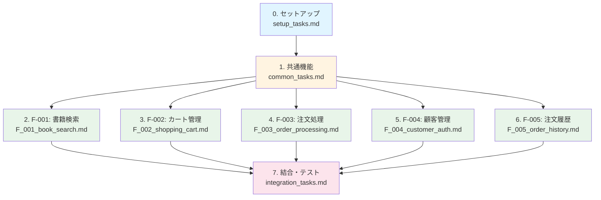

# berry-books - 実装タスクリスト

**プロジェクトID:** berry-books  
**バージョン:** 1.0.0  
**最終更新日:** 2025-12-20  
**ステータス:** タスク分解完了

---

## 全体構成と担当割り当て

### タスク概要

| タスク | タスクファイル | 担当者 | 並行実行 | 想定工数 |
|---------|--------------|--------|---------|---------|
| 0. セットアップ | setup_tasks.md | 全員 | 不可 | 8時間 |
| 1. 共通機能 | common_tasks.md | 共通機能チーム（1-2名） | 一部可能 | 16時間 |
| 2. F-001: 書籍検索・閲覧 | F_001_book_search.md | 担当者A | 可能 | 12時間 |
| 3. F-002: ショッピングカート管理 | F_002_shopping_cart.md | 担当者B | 可能 | 10時間 |
| 4. F-003: 注文処理 | F_003_order_processing.md | 担当者C | 可能 | 16時間 |
| 5. F-004: 顧客管理・認証 | F_004_customer_auth.md | 担当者D | 可能 | 14時間 |
| 6. F-005: 注文履歴参照 | F_005_order_history.md | 担当者E | 可能 | 8時間 |
| 7. 結合・テスト | integration_tasks.md | 全員 | 一部可能 | 12時間 |

**合計想定工数:** 96時間（並行作業により短縮可能）

---

## 実行順序

### フェーズ0: セットアップ（全員で実行）

**前提条件:** なし

**完了条件:** 開発環境が構築され、データベースが初期化されている

**タスクファイル:** [setup_tasks.md](setup_tasks.md)

**担当:** 全員（1回のみ実行）

---

### フェーズ1: 共通機能（共通機能チームが実装）

**前提条件:** セットアップ完了

**完了条件:** 共通エンティティ、共通サービス、共通ユーティリティが実装されている

**タスクファイル:** [common_tasks.md](common_tasks.md)

**担当:** 共通機能チーム（1-2名）

**重要:** このフェーズ完了後、機能別実装を並行実行可能

---

### フェーズ2: 機能別実装（各担当者が並行実行）

**前提条件:** 共通機能完了

**完了条件:** 全5機能が実装されている

**並行実行:** 可能（各機能は独立して実装可能）

#### F-001: 書籍検索・閲覧

**タスクファイル:** [F_001_book_search.md](F_001_book_search.md)

**担当:** 担当者A

**内容:** 書籍検索、検索結果表示、カバー画像表示

#### F-002: ショッピングカート管理

**タスクファイル:** [F_002_shopping_cart.md](F_002_shopping_cart.md)

**担当:** 担当者B

**内容:** カート追加、カート表示、数量変更、削除、セッション管理

#### F-003: 注文処理

**タスクファイル:** [F_003_order_processing.md](F_003_order_processing.md)

**担当:** 担当者C

**内容:** 注文入力、配送料金計算、注文確定、在庫減算、楽観的ロック

#### F-004: 顧客管理・認証

**タスクファイル:** [F_004_customer_auth.md](F_004_customer_auth.md)

**担当:** 担当者D

**内容:** 顧客登録、ログイン、ログアウト、認証フィルター、REST API連携

#### F-005: 注文履歴参照

**タスクファイル:** [F_005_order_history.md](F_005_order_history.md)

**担当:** 担当者E

**内容:** 注文履歴一覧表示、注文詳細表示

---

### フェーズ3: 結合・テスト（全員で実施）

**前提条件:** 全機能実装完了

**完了条件:** 結合テスト、エンドツーエンドテスト完了

**タスクファイル:** [integration_tasks.md](integration_tasks.md)

**担当:** 全員参加

**内容:** 機能間結合テスト、エンドツーエンドテスト、パフォーマンステスト

---

## 依存関係図

---

## タスクファイル一覧

### 必須タスク（順次実行）

1. [セットアップタスク](setup_tasks.md) - 開発環境構築、データベース初期化
2. [共通機能タスク](common_tasks.md) - 共通エンティティ、共通サービス、共通ユーティリティ

### 機能別タスク（並行実行可能）

3. [F-001: 書籍検索・閲覧](F_001_book_search.md) - 書籍検索、検索結果表示
4. [F-002: ショッピングカート管理](F_002_shopping_cart.md) - カート追加、カート管理
5. [F-003: 注文処理](F_003_order_processing.md) - 注文確定、在庫減算、楽観的ロック
6. [F-004: 顧客管理・認証](F_004_customer_auth.md) - 顧客登録、ログイン、認証
7. [F-005: 注文履歴参照](F_005_order_history.md) - 注文履歴表示

### 最終タスク（全員参加）

8. [結合・テストタスク](integration_tasks.md) - 結合テスト、エンドツーエンドテスト

---

## 進捗管理

### タスク完了チェックリスト

- [ ] **フェーズ0: セットアップ** - setup_tasks.md の全タスク完了
- [ ] **フェーズ1: 共通機能** - common_tasks.md の全タスク完了
- [ ] **フェーズ2-1: F-001** - F_001_book_search.md の全タスク完了
- [ ] **フェーズ2-2: F-002** - F_002_shopping_cart.md の全タスク完了
- [ ] **フェーズ2-3: F-003** - F_003_order_processing.md の全タスク完了
- [ ] **フェーズ2-4: F-004** - F_004_customer_auth.md の全タスク完了
- [ ] **フェーズ2-5: F-005** - F_005_order_history.md の全タスク完了
- [ ] **フェーズ3: 結合・テスト** - integration_tasks.md の全タスク完了

### マイルストーン

| マイルストーン | 完了条件 | 想定日数 |
|--------------|---------|---------|
| M1: 環境構築完了 | セットアップ完了 | 1日 |
| M2: 共通基盤完了 | 共通機能完了 | 2日 |
| M3: 全機能実装完了 | 全機能タスク完了 | 10日（並行作業） |
| M4: 品質保証完了 | 結合・テスト完了 | 2日 |

---

## 実装時の注意事項

### 1. 依存関係の遵守

- セットアップ → 共通機能 → 機能別実装 → 結合・テストの順序を守る
- 共通機能が完了するまで、機能別実装を開始しない

### 2. 並行作業の判断

- タスク3〜7（F-001〜F-005）は並行実行可能
- 人員配分は作業者が判断
- コンフリクト発生時はコミュニケーションを密に行う

### 3. 憲章の遵守

- `memory/constitution.md` の開発原則を遵守
- テストカバレッジ80%以上を維持
- アーキテクチャパターン（レイヤードアーキテクチャ）を厳格に守る

### 4. SPEC参照

- 各タスク実行時、必要に応じて対応するSPEC（`specs/baseline/system/`、`specs/baseline/features/`）を参照
- 不明点は実装前にSPECを確認

### 5. 進捗の追跡

- 各タスクファイルのチェックボックスで進捗を管理
- 完了したタスクは必ずチェックボックスをマークする

---

## 参考資料

### SPEC（システム全体）

- [requirements.md](../specs/baseline/system/requirements.md) - 要件定義書
- [architecture_design.md](../specs/baseline/system/architecture_design.md) - アーキテクチャ設計書
- [functional_design.md](../specs/baseline/system/functional_design.md) - 機能設計書
- [behaviors.md](../specs/baseline/system/behaviors.md) - 振る舞い仕様書
- [data_model.md](../specs/baseline/system/data_model.md) - データモデル仕様書
- [screen_design.md](../specs/baseline/system/screen_design.md) - 画面設計書
- [external_interface.md](../specs/baseline/system/external_interface.md) - 外部インターフェース仕様書

### SPEC（個別機能）

- [F_001_book_search/](../specs/baseline/features/F_001_book_search/) - 書籍検索・閲覧
- [F_002_shopping_cart/](../specs/baseline/features/F_002_shopping_cart/) - ショッピングカート管理
- [F_003_order_processing/](../specs/baseline/features/F_003_order_processing/) - 注文処理
- [F_004_customer_auth/](../specs/baseline/features/F_004_customer_auth/) - 顧客管理・認証
- [F_005_order_history/](../specs/baseline/features/F_005_order_history/) - 注文履歴参照

### 開発憲章

- [constitution.md](../memory/constitution.md) - プロジェクト開発憲章

**注意**: 各タスクの「参照SPEC」はMarkdownリンク形式で記述されています。クリックして直接SPECファイルに移動できます。

