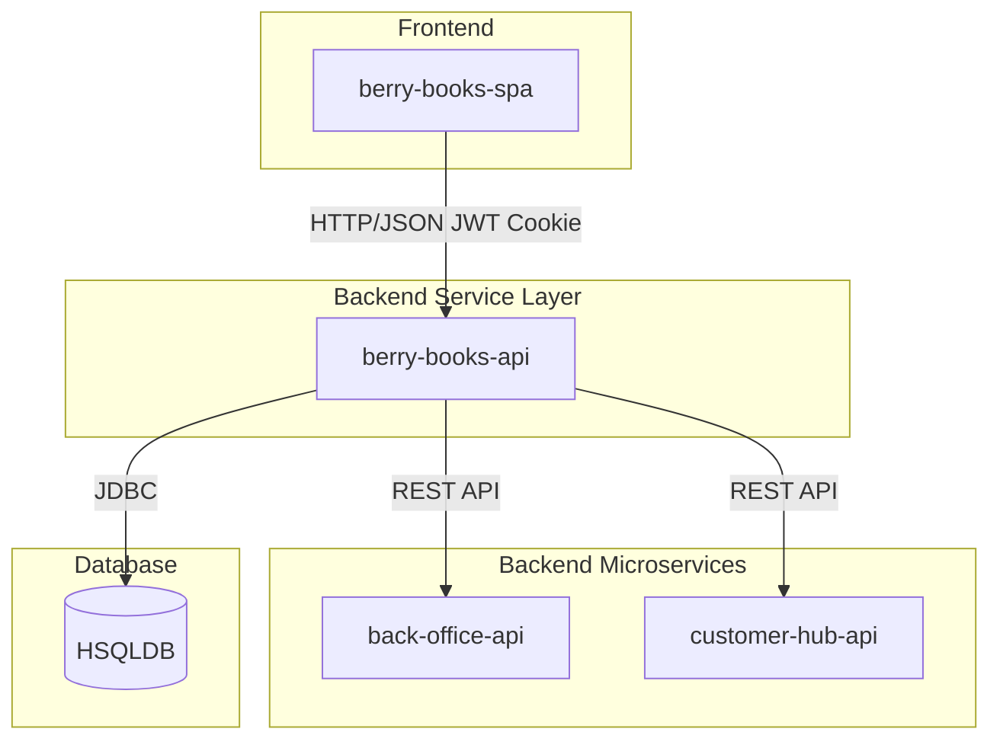

# berry-books-api - アーキテクチャ設計書（共通）

プロジェクトID: berry-books-api  
バージョン: 3.0.0  
最終更新日: 2026-01-17  
ステータス: REST API アーキテクチャ確定

---

## 概要

このドキュメントは、berry-books-apiプロジェクト固有のアーキテクチャ設計を記述する（アジャイル共通SPEC）。

* 共通的な技術スタック、開発ガイドライン、技術的対応方針については、以下を参照すること：
  * [architecture.md](../../../../../agent_skills/jakarta-ee-api-agile/principles/architecture.md) - Jakarta EE APIアーキテクチャ標準
  * [common_rules.md](../../../../../agent_skills/jakarta-ee-api-agile/principles/common_rules.md) - 共通ルール
  * [security.md](../../../../../agent_skills/jakarta-ee-api-agile/principles/security.md) - セキュリティ標準

---

## 1. バックエンドサービスアーキテクチャ

### 1.1 アーキテクチャパターン

berry-books-apiは、フロントエンド（berry-books-spa）の唯一のエントリーポイントとして機能するバックエンドサービスです。マイクロサービスアーキテクチャにおいて、複数のバックエンドサービスを統合し、フロントエンドに最適化されたAPIを提供します。

#### 1.1.1 このパターンの利点

| 利点 | 説明 |
|-----|------|
| フロントエンド最適化 | フロントエンドに必要なデータ形式で直接レスポンス |
| バックエンドの抽象化 | 複数のマイクロサービスの存在を隠蔽 |
| 認証の一元化 | 本システムでJWT認証を管理 |
| API集約 | 複数のバックエンドAPIの呼び出しを1つに集約 |
| 柔軟な拡張 | バックエンドの変更がフロントエンドに影響しない |

#### 1.1.2 マイクロサービス構成

#### 1.1.3 責務分担

| システム | 責務 | 管理するデータ |
|---------|------|--------------|
| berry-books-api | JWT認証、注文管理、配送料金計算、外部API連携、画像配信 | ORDER_TRAN, ORDER_DETAIL |
| back-office-api | 書籍・在庫・カテゴリ管理、楽観的ロック制御 | BOOK, STOCK, CATEGORY, PUBLISHER |
| customer-hub-api | 顧客CRUD、認証情報管理、メール重複チェック | CUSTOMER |

---

## 2. レイヤードアーキテクチャ

* API Layer: AuthenResource, BookResource, CategoryResource, OrderResource, ImageResource
* Security Layer: JwtAuthenFilter, JwtUtil
* Business Logic Layer: OrderService, DeliveryFeeService
* External Integration Layer: BackOfficeRestClient, CustomerHubRestClient
* Data Access Layer: OrderTranDao, OrderDetailDao
* Persistence Layer: OrderTran, OrderDetail, OrderDetailPK

詳細なクラス構成は各ユースケースの detailed_design を参照。アジャイル構成では usecases/{名}/userstory.md および detailed_design/usecases/{名}/ を参照すること。

---

## 3. パッケージ構造

* ベースパッケージ: `pro.kensait.berrybooks`
* api, security, service, dao, entity, external, common, util

---

## 4. トランザクション・並行制御・認証除外

* トランザクション: OrderService で @Transactional。外部在庫API更新と注文DBは結果整合性。
* 楽観的ロック: back-office-api の STOCK で @Version。berry-books-api はバージョン転送と 409 転送。
* 認証除外: /api/auth/login, /api/auth/logout, /api/auth/register, /api/books, /api/images

---

## 5. 参考資料（アジャイル構成）

* [data_model.md](data_model.md) - データモデル仕様書
* [external_interface.md](external_interface.md) - 外部インターフェース仕様書
* usecases/{名}/userstory.md - 各ユースケースのユーザーストーリー・受入基準
* usecases/{名}/behaviors.md - 各ユースケースの振る舞い仕様書
* [README.md](../../README.md) - プロジェクトREADME
* agent_skills/jakarta-ee-api-agile/principles/ - 共通原則・標準
