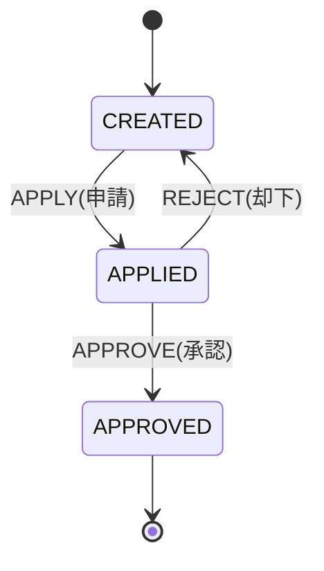

# ワークフロー管理ドメイン - 機能設計書

プロジェクトID: back-office-api  
ドメイン: workflows  
バージョン: 1.0.0  
最終更新日: 2026-02-05

---

## 1. 概要

本ドキュメントは、ワークフロー管理ドメインの機能を定義する。

---

## 2. 機能一覧

### 2.1 ワークフロー管理機能

| 機能ID | 機能名 | 説明 |
|--------|--------|------|
| F-WORKFLOW-001 | ワークフロー作成 | 新規ワークフローを作成（3種類） |
| F-WORKFLOW-002 | ワークフロー更新 | ワークフローを一時保存（CREATED状態のみ） |
| F-WORKFLOW-003 | ワークフロー申請 | ワークフローを申請（CREATED → APPLIED） |
| F-WORKFLOW-004 | ワークフロー承認 | ワークフローを承認（APPLIED → APPROVED） |
| F-WORKFLOW-005 | ワークフロー却下 | ワークフローを却下（APPLIED → CREATED） |
| F-WORKFLOW-006 | ワークフロー一覧取得 | ワークフローの一覧を取得（フィルタリング可） |
| F-WORKFLOW-007 | ワークフロー履歴取得 | 指定したワークフローの全操作履歴を取得 |
| F-WORKFLOW-008 | 書籍マスタ反映 | 承認されたワークフローの内容を書籍マスタに反映 |

---

## 3. API詳細設計

### 3.1 F-WORKFLOW-001: ワークフロー作成

#### 3.1.1 機能概要

新規ワークフローを作成する。3種類のワークフロータイプに対応。

#### 3.1.2 エンドポイント

* メソッド: POST
* パス: `/api/workflows`
* 認証: 必要（JWT）

#### 3.1.3 入力

* 共通:
  * ワークフロータイプ（workflowType）: String
  * 作成者ID（createdBy）: Long
  * 申請理由（applyReason）: String

* ADD_NEW_BOOK:
  * 書籍名（bookName）: String
  * 著者（author）: String
  * 価格（price）: BigDecimal
  * 画像URL（imageUrl）: String
  * カテゴリID（categoryId）: Integer
  * 出版社ID（publisherId）: Integer

* REMOVE_BOOK:
  * 書籍ID（bookId）: Integer

* ADJUST_BOOK_PRICE:
  * 書籍ID（bookId）: Integer
  * 価格（price）: BigDecimal
  * 適用開始日（startDate）: LocalDate
  * 適用終了日（endDate）: LocalDate

#### 3.1.4 処理フロー

1. リクエストボディから入力データを取得
2. 作成者の存在チェック（EmployeeDao）
3. ワークフロータイプのバリデーション
4. 次のワークフローIDを採番（WorkflowDao）
5. Workflowエンティティを生成
   * WORKFLOW_ID: 採番したID
   * STATE: CREATED
   * OPERATION_TYPE: CREATE
   * OPERATED_AT: 現在日時
   * OPERATED_BY: 作成者ID
6. ワークフロータイプごとの項目設定
7. WorkflowDaoでINSERT
8. WorkflowエンティティをWorkflowTOに変換
9. レスポンス生成（201 Created）

#### 3.1.5 出力

* 成功（201 Created）: WorkflowTO
* 失敗（400 Bad Request）: ErrorResponse
* エラー（500 Internal Server Error）: ErrorResponse

#### 3.1.6 関連コンポーネント

* ワークフローリソース（ワークフロー作成）
* ワークフローサービス（ビジネスロジック）
* ワークフローデータアクセス（ID採番、挿入）
* 社員データアクセス（ID検索）

#### 3.1.7 バリデーションルール

* `workflowType`: 必須、列挙型
* `createdBy`: 必須
* `applyReason`: オプション、500文字以内
* ワークフロータイプごとの追加バリデーション

---

### 3.2 F-WORKFLOW-002: ワークフロー更新

#### 3.2.1 機能概要

作成済み（CREATED状態）のワークフローを一時保存する。

#### 3.2.2 エンドポイント

* メソッド: PUT
* パス: `/api/workflows/{workflowId}`
* 認証: 必要（JWT）

#### 3.2.3 入力

* ワークフローID（workflowId）: Long
* 更新者ID（updatedBy）: Long
* 更新内容（ワークフロータイプによって異なる）

#### 3.2.4 処理フロー

1. パスパラメータからワークフローIDを取得
2. 最新の状態を取得（WorkflowDao）
3. ワークフローが存在しない場合 → 404 Not Found
4. 状態チェック：CREATEDでない場合 → 400 Bad Request
5. 更新者の存在チェック（EmployeeDao）
6. 既存のCREATEレコードを直接更新
   * 操作日時のみ更新（操作者は作成者のまま）
   * ワークフロータイプごとの項目を更新
7. EntityManagerのflushで即座に反映
8. WorkflowエンティティをWorkflowTOに変換
9. レスポンス生成

#### 3.2.5 出力

* 成功（200 OK）: WorkflowTO
* 失敗（400 Bad Request）: ErrorResponse
* 失敗（404 Not Found）: ErrorResponse

#### 3.2.6 関連コンポーネント

* ワークフローリソース（ワークフロー更新）
* ワークフローサービス（ビジネスロジック）
* ワークフローデータアクセス（最新レコード取得）
* 永続化メカニズム（即時反映）

---

### 3.3 F-WORKFLOW-004: ワークフロー承認

#### 3.3.1 機能概要

申請済み（APPLIED状態）のワークフローを承認し、書籍マスタに反映する。

#### 3.3.2 エンドポイント

* メソッド: POST
* パス: `/api/workflows/{workflowId}/approve`
* 認証: 必要（JWT）

#### 3.3.3 入力

* ワークフローID（workflowId）: Long
* 操作者ID（operatedBy）: Long
* 操作理由（operationReason）: String（オプション）

#### 3.3.4 処理フロー

1. パスパラメータからワークフローIDを取得
2. 最新の状態を取得（WorkflowDao）
3. ワークフローが存在しない場合 → 404 Not Found
4. 状態チェック：APPLIEDでない場合 → 400 Bad Request
5. 承認権限チェック
   * 承認者の取得（EmployeeDao）
   * 職務ランクチェック：MANAGER以上（JobRankType）
   * 部署チェック：
     * DIRECTOR → 全部署OK
     * MANAGER → 同一部署のみ
   * 権限不足の場合 → 403 Forbidden
6. 新しい操作履歴を作成
   * STATE: APPROVED
   * OPERATION_TYPE: APPROVE
   * OPERATED_AT: 現在日時
   * OPERATED_BY: 承認者ID
   * その他のフィールドは最新の状態からコピー
7. WorkflowDaoでINSERT
8. 書籍マスタへの反映処理
   * ADD_NEW_BOOK → Book + Stock INSERT
   * REMOVE_BOOK → Book論理削除（DELETED=true）
   * ADJUST_BOOK_PRICE → Book価格UPDATE
9. トランザクションコミット（ワークフロー履歴 + 書籍マスタ更新）
10. WorkflowエンティティをWorkflowTOに変換
11. レスポンス生成

#### 3.3.5 出力

* 成功（200 OK）: WorkflowTO
* 失敗（400 Bad Request）: ErrorResponse
* 失敗（403 Forbidden）: ErrorResponse
* 失敗（404 Not Found）: ErrorResponse

#### 3.3.6 関連コンポーネント

* ワークフローリソース（ワークフロー承認）
* ワークフローサービス（承認ロジック）
* ワークフローサービス（承認権限チェック）
* ワークフローサービス（書籍マスタ反映）
* ワークフローデータアクセス（最新レコード取得、挿入）
* 書籍データアクセス（ID検索）
* 永続化メカニズム

---

### 3.4 F-WORKFLOW-008: 書籍マスタ反映

#### 3.4.1 機能概要

承認されたワークフローの内容を書籍マスタ（BOOK, STOCK）に反映する。

#### 3.4.2 入力

* Workflowエンティティ（APPROVED状態）

#### 3.4.3 処理フロー

* ADD_NEW_BOOK（新規書籍追加）:
  1. 新しいBookエンティティを作成
  2. ワークフローから項目を設定
   * bookName, author, price, imageUrl
   * category（データベースから取得）
   * publisher（データベースから取得）
   * deleted: false
  3. 在庫情報も設定（書籍と在庫の結合）
   * quantity: 0
   * version: 0
  4. 永続化してINSERT
  5. BOOK_IDを取得

* REMOVE_BOOK（既存書籍削除）:
  1. BookDaoで対象書籍を取得
  2. 書籍が存在する場合
  3. deletedフラグをtrueに設定
  4. トランザクションコミット時にUPDATE

* ADJUST_BOOK_PRICE（価格改定）:
  1. BookDaoで対象書籍を取得
  2. 書籍が存在する場合
  3. priceフィールドを更新
  4. トランザクションコミット時にUPDATE

#### 3.4.4 出力

なし（副作用としてデータベースを更新）

#### 3.4.5 関連コンポーネント

* ワークフローサービス（書籍マスタ反映処理）
* 書籍データアクセス（ID検索）
* 永続化メカニズム

---

## 4. ビジネスルール

### 4.1 ワークフロールール

#### BR-WORKFLOW-001: ワークフロー状態遷移

* CREATED: 作成・更新可能、申請可能
* APPLIED: 承認・却下可能
* APPROVED: 終了状態（変更不可）
* REJECTED: CREATEDに戻る

#### BR-WORKFLOW-002: 承認権限

* ASSOCIATE（JOB_RANK=1）: 承認不可
* MANAGER（JOB_RANK=2）: 同一部署のワークフローのみ承認可
* DIRECTOR（JOB_RANK=3）: 全部署のワークフロー承認可

#### BR-WORKFLOW-003: 更新権限

* CREATEDのワークフローのみ更新可能
* 作成者本人のみ更新可能（実装上は制限なし、UI側で制御想定）

#### BR-WORKFLOW-004: 閲覧権限

* CREATED: 作成者本人のみ閲覧可
* APPLIED: 作成者本人 + 承認権限がある人
* APPROVED: すべての社員

---

## 5. トランザクション管理

### 5.1 ワークフロー承認

* 以下を1トランザクションで実行:
  1. ワークフロー操作履歴の追加
  2. 書籍マスタへの反映

どちらか一方が失敗した場合、両方ともロールバックされる。

---

## 6. 参考資料

* [../common/architecture_design.md](../common/architecture_design.md) - アーキテクチャ設計書
* [../common/data_model.md](../common/data_model.md) - データモデル仕様書
* [behaviors.md](behaviors.md) - ワークフロー管理ドメインの振る舞い仕様書（結合テスト用）
