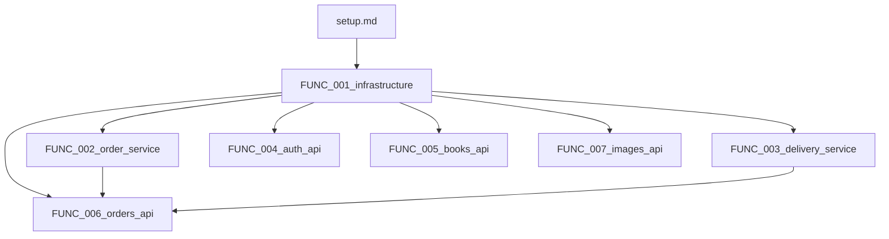

# berry-books-api - 実装タスクリスト

プロジェクトID: berry-books-api  
バージョン: 1.0.0  
最終更新日: 2026-02-04

---

## 全体構成と担当割り当て

### タスク概要

| タスク | タスクファイル | 依存タスク | 並行実行可能 | レベル | 担当者 | 想定工数 |
|---------|--------------|----------|------------|--------|--------|---------|
| 0. Setup | setup.md | - | 不可 | L0 | 全員 | 4時間 |
| 1. FUNC_001 | FUNC_001_infrastructure.md | setup | 不可 | L1 | チームA (3名) | 16時間 |
| 2. FUNC_002 | FUNC_002_order_service.md | FUNC_001 | FUNC_003 | L2 | 担当者A | 8時間 |
| 3. FUNC_003 | FUNC_003_delivery_service.md | FUNC_001 | FUNC_002 | L2 | 担当者B | 4時間 |
| 4. FUNC_004 | FUNC_004_auth_api.md | FUNC_001 | FUNC_005, FUNC_006, FUNC_007 | L3 | 担当者C | 6時間 |
| 5. FUNC_005 | FUNC_005_books_api.md | FUNC_001 | FUNC_004, FUNC_006, FUNC_007 | L3 | 担当者D | 4時間 |
| 6. FUNC_006 | FUNC_006_orders_api.md | FUNC_001, FUNC_002, FUNC_003 | FUNC_004, FUNC_005, FUNC_007 | L3 | 担当者E | 8時間 |
| 7. FUNC_007 | FUNC_007_images_api.md | FUNC_001 | FUNC_004, FUNC_005, FUNC_006 | L3 | 担当者F | 4時間 |

**重要:**
* 「依存タスク」列: このタスクを開始する前に完了している必要があるタスク
* 「並行実行可能」列: このタスクと同時に実行可能な他のタスク
* 「レベル」列: 依存関係グラフから自動計算されたレベル（同じレベルは並行実行可能）

### 実行順序（依存関係グラフから自動決定）

#### レベル0（前提なし）

* setup.md - プロジェクト初期化

#### レベル1（setupに依存）

* FUNC_001_infrastructure.md - 基盤コンポーネント
  * 内容: Entity、DAO、外部API連携クライアント、JWT認証基盤、共通フィルター、例外マッパー
  * 理由: 全ての上位レイヤーがこれらのコンポーネントに依存

#### レベル2（FUNC_001に依存、並行実行可能）

* FUNC_002_order_service.md（依存: FUNC_001 / 並行: FUNC_003）
  * 内容: 注文処理ビジネスロジック
  * 理由: OrderService、OrderTran/OrderDetail DAO、外部API連携を使用

* FUNC_003_delivery_service.md（依存: FUNC_001 / 並行: FUNC_002）
  * 内容: 配送料金計算ビジネスロジック
  * 理由: 独立した計算ロジック、外部依存なし

#### レベル3（並行実行可能）← 並行化のポイント

* FUNC_004_auth_api.md（依存: FUNC_001 / 並行: FUNC_005, FUNC_006, FUNC_007）
  * 内容: 認証API（ログイン、ログアウト、新規登録、現在ユーザー取得）
  * 理由: JWT生成、CustomerHubRestClient使用

* FUNC_005_books_api.md（依存: FUNC_001 / 並行: FUNC_004, FUNC_006, FUNC_007）
  * 内容: 書籍API（一覧、詳細、検索）
  * 理由: BackOfficeRestClientを使用した外部API呼び出し

* FUNC_006_orders_api.md（依存: FUNC_001, FUNC_002, FUNC_003 / 並行: FUNC_004, FUNC_005, FUNC_007）
  * 内容: 注文API（注文作成、注文履歴、注文詳細）
  * 理由: OrderService、DeliveryFeeService、外部API連携を使用

* FUNC_007_images_api.md（依存: FUNC_001 / 並行: FUNC_004, FUNC_005, FUNC_006）
  * 内容: 画像API（書籍カバー画像配信）
  * 理由: WAR内静的リソースの配信、外部依存なし

### タスクファイル一覧（実行順序）

#### レベル0

* [setup.md](setup.md) - セットアップ

#### レベル1

* [FUNC_001_infrastructure.md](FUNC_001_infrastructure.md) - 基盤コンポーネント

#### レベル2

* [FUNC_002_order_service.md](FUNC_002_order_service.md) - 注文サービス
* [FUNC_003_delivery_service.md](FUNC_003_delivery_service.md) - 配送料金サービス

#### レベル3

* [FUNC_004_auth_api.md](FUNC_004_auth_api.md) - 認証API
* [FUNC_005_books_api.md](FUNC_005_books_api.md) - 書籍API
* [FUNC_006_orders_api.md](FUNC_006_orders_api.md) - 注文API
* [FUNC_007_images_api.md](FUNC_007_images_api.md) - 画像API

## 依存関係図

## プロジェクト概要

berry-books-apiは、オンライン書店「Berry Books」のバックエンドサービスです。

* アーキテクチャパターン: マイクロサービスアーキテクチャ、バックエンドサービスパターン
* 責務: JWT認証、注文管理、配送料金計算、外部API連携、画像配信
* 外部連携: customer-hub-api（顧客管理）、back-office-api（書籍・在庫管理）
* 管理データ: ORDER_TRAN、ORDER_DETAIL（注文データのみ）

## 注意事項

* タスク分解の結果として、機能を依存関係に基づいて識別し、実装順序を決定しました
* この識別結果に基づいて、次の詳細設計フェーズでdetailed_design/フォルダ構造を作成します
* 各タスクファイルには、詳細な実装内容とSPEC参照が記載されています
* 実装前に必ず対応するタスクファイルを確認してください

---

## 参考資料

* [../specs/baseline/requirements/requirements.md](../specs/baseline/requirements/requirements.md) - 要件定義書
* [../specs/baseline/basic_design/architecture_design.md](../specs/baseline/basic_design/architecture_design.md) - アーキテクチャ設計書
* [../specs/baseline/basic_design/functional_design.md](../specs/baseline/basic_design/functional_design.md) - 機能設計書
* [../specs/baseline/basic_design/data_model.md](../specs/baseline/basic_design/data_model.md) - データモデル仕様書
* [../specs/baseline/basic_design/behaviors.md](../specs/baseline/basic_design/behaviors.md) - 振る舞い仕様書
* [../specs/baseline/basic_design/external_interface.md](../specs/baseline/basic_design/external_interface.md) - 外部インターフェース仕様書
