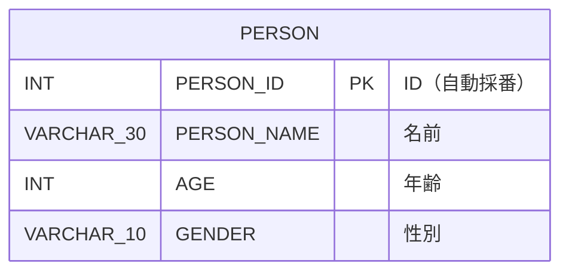

# Person Management System - データモデル仕様書

プロジェクトID: jsf-person
バージョン: 1.0.0
最終更新日: 2026-02-08
ステータス: 基本設計

* 変更履歴:
  * v1.0.0 (2026-02-08): 初版（Struts 1.3.10からの移行SPEC）

---

## 1. 概要

本文書は、Person Management Systemのデータベーススキーマ（RDB論理設計）を記述する。テーブル定義、制約、リレーションを定義する。

* データベース種別: HSQLDB 2.7.x
* データベース名: testdb

注意:
* JPAエンティティクラスの設計（@Entity、@Column等のアノテーション、Javaクラス構造）は詳細設計フェーズで実施します
* データソース設定（JNDI名、接続URL、接続プール等）はarchitecture_design.mdに記載します
* データベーススキーマは既存のStruts 1.3.10プロジェクトから継承し、変更しません

---

## 2. ER図

### 2.1 全体ER図



注意: 現在のシステムは単一テーブル構成です。リレーションシップはありません。

---

## 3. テーブル定義

### 3.1 PERSON（人材情報）

#### 3.1.1 テーブル概要

人材（PERSON）の基本情報を管理するテーブル。人材のID、名前、年齢、性別を保持する。

#### 3.1.2 テーブル構造

| カラム名 | データ型 | PK | FK | NN | UQ | デフォルト | 説明 |
|---------|---------|----|----|----|----|----------|------|
| PERSON_ID | INT | ✓ | | ✓ | | IDENTITY | 人材ID（自動採番） |
| PERSON_NAME | VARCHAR(30) | | | ✓ | | | 人材名 |
| AGE | INT | | | ✓ | | | 年齢 |
| GENDER | VARCHAR(10) | | | ✓ | | | 性別（"male" または "female"） |

#### 3.1.3 制約

* 主キー: PERSON_ID
* 外部キー: なし
* 自動採番: PERSON_IDはIDENTITY（INSERT時に自動生成）
* NOT NULL制約: すべてのカラムが必須

#### 3.1.4 インデックス

* PK_PERSON: PERSON_ID（主キーインデックス）

#### 3.1.5 DDLスクリプト

```sql
-- PERSONテーブル
CREATE TABLE PERSON (
    PERSON_ID   INT GENERATED BY DEFAULT AS IDENTITY PRIMARY KEY, -- ID
    PERSON_NAME VARCHAR(30) NOT NULL,        -- 名前
    AGE         INT NOT NULL,                -- 年齢
    GENDER      VARCHAR(10) NOT NULL         -- 性別
);
```

#### 3.1.6 サンプルデータ

```sql
-- 一括削除
DELETE FROM PERSON;

-- PERSONテーブル
INSERT INTO PERSON (PERSON_ID, PERSON_NAME, AGE, GENDER) VALUES(1, 'Alice', 35, 'female');
INSERT INTO PERSON (PERSON_ID, PERSON_NAME, AGE, GENDER) VALUES(2, 'Bob', 20, 'male');
INSERT INTO PERSON (PERSON_ID, PERSON_NAME, AGE, GENDER) VALUES(3, 'Carol', 30, 'female');
```

---

## 4. インデックス設計

### 4.1 インデックス一覧

| テーブル | インデックス名 | カラム | タイプ | 目的 |
|---------|--------------|--------|--------|------|
| PERSON | PK_PERSON | PERSON_ID | PRIMARY KEY | 主キー |

### 4.2 検索最適化

現在のシステムでは、主キー検索（PERSON_ID）と全件取得のみ実装されています。特定のカラムでの検索や絞り込みは実装されていないため、追加のインデックスは不要です。

---

## 5. データ整合性ルール

### 5.1 外部キー制約

現在のシステムには外部キー制約はありません。

### 5.2 トランザクション分離レベル

* 分離レベル: READ_COMMITTED（デフォルト）
* 説明: コミットされたデータのみ読み取り、ダーティリードを防止

---

## 6. リレーションシップカーディナリティ

現在のシステムには他のテーブルとのリレーションシップはありません。

---

## 7. データベース設計原則

### 7.1 命名規則

* テーブル名: 英語大文字、単数形（PERSON）
* カラム名: 英語大文字、スネークケース（PERSON_NAME, AGE）
* 主キー: テーブル名 + _ID（PERSON_ID）

### 7.2 正規化

* 第1正規形: 満たしている（繰り返しフィールドなし）
* 第2正規形: 満たしている（部分関数従属性なし）
* 第3正規形: 満たしている（推移的関数従属性なし）

### 7.3 非正規化

現在のシステムでは非正規化は行われていません。

---

## 8. 参考資料

* [architecture_design.md](architecture_design.md) - アーキテクチャ設計書
* [functional_design.md](functional_design.md) - 機能設計書
* [../person_management/functional_design.md](../person_management/functional_design.md) - 人材管理機能設計書
