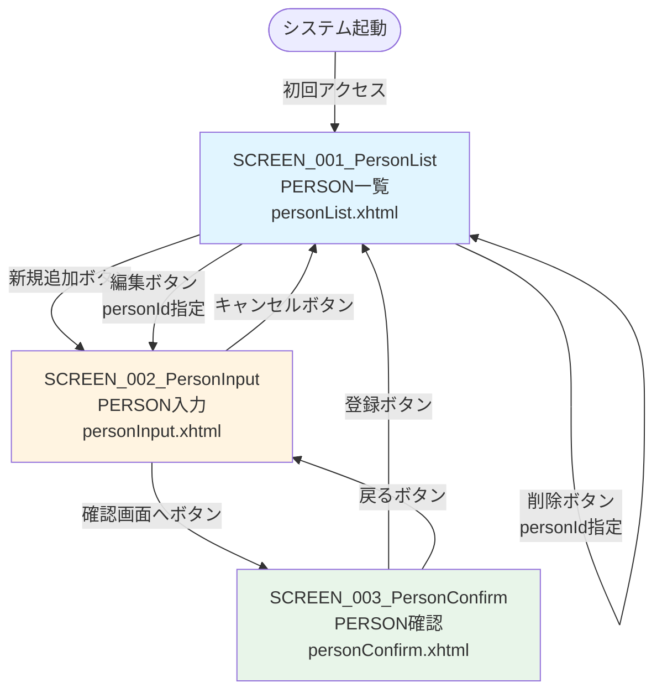

# person_management - 機能設計書（画面グループ）

画面グループ名: person_management
バージョン: 1.0.0
最終更新日: 2026-02-08
ステータス: 基本設計

---

## 1. 概要

本文書は、person_management画面グループの機能設計を記述する。画面一覧、画面遷移、画面の役割と機能を論理レベルで定義する。

* 実装クラス設計（Managed Bean、Service、Dao等）、メソッドシグネチャ、アノテーションは詳細設計（detailed_design/FUNC_XXX/detailed_design.md）で記述する
* 共通機能（認証、セキュリティ、共通Service等）はcommonドメインを参照すること
* JSFは画面中心のサーバーサイドMVCフレームワーク
* 画面グループ: 関連する画面群（一覧、入力、確認等）をまとめたもの

---

## 2. 画面一覧

### 2.1 画面リスト

* SCREEN_001_PersonList: PERSON一覧
  * URL: /personList.xhtml
  * 目的: 登録されている全PERSON情報を一覧表示する
  * 主要機能: 全PERSON取得、新規追加、編集、削除

* SCREEN_002_PersonInput: PERSON入力
  * URL: /personInput.xhtml
  * 目的: PERSON情報を入力または編集する
  * 主要機能: PERSON情報の入力フォーム、バリデーション

* SCREEN_003_PersonConfirm: PERSON確認
  * URL: /personConfirm.xhtml
  * 目的: 入力したPERSON情報を確認する
  * 主要機能: 入力内容の表示、登録実行、戻る

---

## 3. 画面遷移図

### 3.1 全体画面遷移

### 3.2 画面遷移詳細

* PERSON一覧（personList.xhtml）
  * → PERSON入力（personInput.xhtml）: "新規追加"リンクをクリック
  * → PERSON入力（personInput.xhtml?personId=xxx）: "編集"リンクをクリック（既存データを表示）
  * → PERSON一覧（personList.xhtml）: "削除"リンクをクリック（削除後にリダイレクト）

* PERSON入力（personInput.xhtml）
  * → PERSON確認（personConfirm.xhtml）: "確認画面へ"ボタンをクリック
  * → PERSON一覧（personList.xhtml）: "キャンセル"ボタンをクリック

* PERSON確認（personConfirm.xhtml）
  * → PERSON一覧（personList.xhtml）: "登録"ボタンをクリック（登録後にリダイレクト）
  * → PERSON入力（personInput.xhtml）: "戻る"ボタンをクリック（history.back()）

### 3.3 画面遷移のパターン

* 通常遷移（Forward）
  * PERSON入力 → PERSON確認
  * データはSession ScopeまたはView Scopeで引き継ぐ（Strutsではsession scope使用）

* リダイレクト遷移（Redirect）
  * PERSON確認 → PERSON一覧（登録後）
  * PERSON一覧 → PERSON一覧（削除後）
  * 戻り値に "?faces-redirect=true" を付加

* ブラウザ履歴を使用した戻る
  * PERSON確認 → PERSON入力（戻るボタン）
  * JavaScript: history.back()

---

## 4. 画面機能詳細

注意: 以下は論理レベルの記述です。実装クラス（Managed Bean、Service、Dao）の詳細は詳細設計書（detailed_design/FUNC_XXX/detailed_design.md）を参照してください。

### 4.1 SCREEN_001_PersonList（PERSON一覧）

#### 4.1.1 画面の役割

登録されている全PERSON情報を一覧表示し、新規追加、編集、削除の操作を提供する。

#### 4.1.2 画面初期表示

1. PersonServiceを使用して全PERSONを取得する
2. 取得したPERSONリストをPERSON_IDの昇順でソートする
3. 一覧テーブルに表示する

#### 4.1.3 画面機能

##### 4.1.3.1 新規追加

* トリガー: "新規追加"リンクをクリック
* 処理内容:
  1. PERSON入力画面に遷移する
  2. フォームは空の状態で表示される（新規追加モード）
* 画面遷移: PERSON入力（personInput.xhtml）
* データ受け渡し: なし（新規追加モード）

##### 4.1.3.2 編集

* トリガー: 各行の"編集"リンクをクリック
* 処理内容:
  1. クリックした行のPERSON_IDをパラメータとして渡す
  2. PERSON入力画面に遷移する
  3. PERSON入力画面でIDから既存データを取得して表示する（編集モード）
* 画面遷移: PERSON入力（personInput.xhtml?personId=xxx）
* データ受け渡し: URLパラメータ（personId）

##### 4.1.3.3 削除

* トリガー: 各行の"削除"リンクをクリック
* 処理内容:
  1. JavaScriptで削除確認ダイアログを表示する（confirm）
  2. OKをクリックした場合、PersonServiceを使用してPERSONを削除する
  3. PERSON一覧画面にリダイレクトする
* 画面遷移: PERSON一覧（personList.xhtml）（リダイレクト）
* データ受け渡し: URLパラメータ（personId）

#### 4.1.4 ビジネスルール

* 全PERSONをPERSON_IDの昇順で表示する
* データが0件の場合でもエラーとせず、空の一覧を表示する

#### 4.1.5 エラーハンドリング

* データ取得エラー: エラーメッセージを表示し、空の一覧を表示する
* 削除エラー: エラーメッセージを表示し、一覧を再表示する

---

### 4.2 SCREEN_002_PersonInput（PERSON入力）

#### 4.2.1 画面の役割

PERSON情報を入力または編集するためのフォームを提供する。新規追加モードと編集モードの2つのモードがある。

#### 4.2.2 画面初期表示

* 新規追加モード（personId パラメータなし）:
  1. フォームを空の状態で表示する
  2. PERSON_IDはnull

* 編集モード（personId パラメータあり）:
  1. URLパラメータからPERSON_IDを取得する
  2. PersonServiceを使用してIDから既存PERSONを取得する
  3. 取得したPERSON情報をフォームに設定して表示する

#### 4.2.3 画面機能

##### 4.2.3.1 確認画面へ

* トリガー: "確認画面へ"ボタンをクリック
* 処理内容:
  1. 入力内容をフォームから取得する
  2. バリデーションを実行する（Bean Validation）
  3. バリデーション成功時、PERSON確認画面に遷移する
  4. バリデーション失敗時、エラーメッセージを表示して画面にとどまる
* 画面遷移: PERSON確認（personConfirm.xhtml）
* データ受け渡し: Session Scopeまたはflash Scope（フォームデータ）

##### 4.2.3.2 キャンセル

* トリガー: "キャンセル"ボタンをクリック
* 処理内容:
  1. 入力内容を破棄する
  2. PERSON一覧画面に遷移する
* 画面遷移: PERSON一覧（personList.xhtml）
* データ受け渡し: なし

#### 4.2.4 ビジネスルール

* 名前（PERSON_NAME）: 必須、最大30文字
* 年齢（AGE）: 必須、整数値
* 性別（GENDER）: 必須、"male" または "female"

#### 4.2.5 エラーハンドリング

* バリデーションエラー: フィールドごとにエラーメッセージを表示
* データ取得エラー（編集モード）: エラーメッセージを表示し、一覧画面に戻る

---

### 4.3 SCREEN_003_PersonConfirm（PERSON確認）

#### 4.3.1 画面の役割

入力したPERSON情報を確認し、登録または戻る操作を提供する。

#### 4.3.2 画面初期表示

1. Session ScopeまたはFlash ScopeからPersonFormデータを取得する
2. 取得したデータを確認画面に表示する
3. 性別の値（"male" / "female"）を日本語（"男性" / "女性"）に変換して表示する

#### 4.3.3 画面機能

##### 4.3.3.1 登録

* トリガー: "登録"ボタンをクリック
* 処理内容:
  1. フォームデータをPersonエンティティに変換する
  2. PERSON_IDがnullの場合は新規追加、PERSON_IDがある場合は更新を実行する
  3. PersonServiceを使用してデータベースに保存する
  4. PERSON一覧画面にリダイレクトする
* 画面遷移: PERSON一覧（personList.xhtml）（リダイレクト）
* データ受け渡し: なし

##### 4.3.3.2 戻る

* トリガー: "戻る"ボタンをクリック
* 処理内容:
  1. JavaScript history.back()を使用してPERSON入力画面に戻る
  2. 入力内容は保持される
* 画面遷移: PERSON入力（personInput.xhtml）（history.back()）
* データ受け渡し: Session Scope（既存データを保持）

#### 4.3.4 ビジネスルール

* 新規追加の場合、PERSON_IDはnullで、データベース側で自動採番される
* 更新の場合、PERSON_IDは既存の値を使用する
* 性別の値は"male"または"female"で保存される

#### 4.3.5 エラーハンドリング

* 登録エラー: エラーメッセージを表示し、入力画面に戻る
* データベースエラー: エラーメッセージを表示し、一覧画面に戻る

---

## 5. Managed Bean設計（論理レベル）

注意: 実装クラス名、メソッドシグネチャ、アノテーションは詳細設計書で記述します。

### 5.1 PersonListBean

* 責務: PERSON一覧画面の画面状態管理とアクション処理
* スコープ: ViewScoped（推奨）
* 主要プロパティ:
  * personList: List<Person>型、表示するPERSONリスト
* 主要アクションメソッド:
  * init(): 画面初期表示時に全PERSONを取得する
  * deletePerson(personId): 指定IDのPERSONを削除する

### 5.2 PersonInputBean

* 責務: PERSON入力画面の画面状態管理とアクション処理
* スコープ: ViewScoped（推奨）
* 主要プロパティ:
  * personId: Integer型、編集対象のPERSON_ID（新規追加時はnull）
  * personName: String型、人材名
  * age: Integer型、年齢
  * gender: String型、性別
* 主要アクションメソッド:
  * init(): 画面初期表示時に編集モードの場合は既存データを取得する
  * confirm(): 確認画面に遷移する
  * cancel(): 一覧画面に戻る

### 5.3 PersonConfirmBean

* 責務: PERSON確認画面の画面状態管理とアクション処理
* スコープ: ViewScoped（推奨）
* 主要プロパティ:
  * personForm: PersonForm型、確認するPERSON情報（Session Scopeから取得）
* 主要アクションメソッド:
  * register(): PERSONを登録または更新する
  * back(): JavaScript history.back()で入力画面に戻る

---

## 6. ビジネスロジック設計（論理レベル）

注意: 実装クラス名、メソッドシグネチャは詳細設計書で記述します。

### 6.1 PersonService

* 責務: PERSONのビジネスロジック
* 主要機能:
  * getAllPersons(): 全PERSONを取得する
  * getPersonById(personId): IDでPERSONを取得する
  * addPerson(person): PERSONを新規追加する
  * updatePerson(person): PERSONを更新する
  * deletePerson(personId): PERSONを削除する

### 6.2 トランザクション管理

* トランザクション境界: Service層
* 例外時の動作: 自動ロールバック

---

## 7. データモデル

注意: テーブル定義の詳細はcommon/data_model.mdを参照してください。JPAエンティティクラス設計は詳細設計で記述します。

### 7.1 使用するエンティティ

* PERSON: 人材情報を管理するテーブル
  * 主要フィールド: PERSON_ID, PERSON_NAME, AGE, GENDER

---

## 8. セキュリティ要件

### 8.1 認証・認可

* 認証要件: 不要（現在のシステムでは認証機能なし）
* 認可要件: なし
* 保護が必要な画面: なし

注意: JSF移行時に必要に応じてセキュリティ機能を追加することができます。

### 8.2 入力検証

* バリデーション: Bean Validation（@NotNull、@Size等）
* サニタイゼーション: XSS対策（Faceletsの自動エスケープ）、SQLインジェクション対策（JPQLパラメータバインディング）

---

## 9. 非機能要件

### 9.1 パフォーマンス

* 応答時間: 一般的なレスポンス時間
* 大量データ対策: 現在のシステムでは全件取得のみ。将来的にページネーションを検討可能

### 9.2 ユーザビリティ

* エラーメッセージ: 明確で分かりやすいメッセージ
* 操作性: 直感的なボタン配置、入力補助（プレースホルダー等）

---

## 10. 参考資料

* [screen_design.md](screen_design.md) - 画面設計書（レイアウト、入力項目詳細）
* [behaviors.md](behaviors.md) - 振る舞い仕様書（E2Eテスト用）
* [../common/functional_design.md](../common/functional_design.md) - 共通機能設計書
* [../common/data_model.md](../common/data_model.md) - データモデル仕様書
* [../common/architecture_design.md](../common/architecture_design.md) - アーキテクチャ設計書
