# 認証API 機能設計書

## 1. API概要

### 1.1 API名

認証API（Authentication API）

### 1.2 ベースパス

`/api/auth`

### 1.3 目的

社員の認証（ログイン/ログアウト）およびユーザー情報取得機能を提供する。

### 1.4 認証方式

* ログイン: 社員コード + パスワード
* セッション管理: JWT (JSON Web Token) + HttpOnly Cookie

## 2. エンドポイント一覧

| No | メソッド | パス | 機能 | 認証要否 |
|----|---------|------|------|---------|
| 1 | POST | `/api/auth/login` | ログイン | 不要 |
| 2 | POST | `/api/auth/logout` | ログアウト | 不要 |
| 3 | GET | `/api/auth/me` | 現在のユーザー情報取得 | 必要（未実装） |

## 3. エンドポイント詳細

### 3.1 ログイン

#### 3.1.1 基本情報

* エンドポイント: `POST /api/auth/login`
* 機能: 社員コードとパスワードで認証し、JWTトークンを発行
* 認証: 不要

#### 3.1.2 リクエスト

* ヘッダー:
```
Content-Type: application/json
```

* リクエストスキーマ:
| フィールド | 型 | 必須 | 説明 | バリデーション |
|-----------|---|------|------|--------------|
| employeeCode | String | Yes | 社員コード | 必須、最大20文字 |
| password | String | Yes | パスワード | 必須、最大100文字 |

#### 3.1.3 レスポンス

* 成功（200 OK）:
* ヘッダー:
```
Set-Cookie: back-office-jwt=<JWT_TOKEN>; Path=/; Max-Age=86400; HttpOnly
Content-Type: application/json; charset=UTF-8
```

* レスポンススキーマ:
| フィールド | 型 | 説明 |
|-----------|---|------|
| employeeId | Long | 社員ID |
| employeeCode | String | 社員コード |
| employeeName | String | 社員名 |
| email | String | メールアドレス |
| jobRank | Integer | 職務ランク（1: ASSOCIATE, 2: MANAGER, 3: DIRECTOR） |
| departmentId | Long | 部署ID |
| departmentName | String | 部署名 |

* 失敗（401 Unauthorized）: 社員コードまたはパスワードが正しくありません
* 失敗（500 Internal Server Error）: ログイン処理中にエラーが発生しました

#### 3.1.4 処理フロー

1. リクエストボディのバリデーション
2. 社員コードで社員情報を検索
3. 社員が存在しない場合 → 401 Unauthorized
4. パスワード照合
   * ハッシュ化パスワード：ハッシュアルゴリズムで検証
   * 平文パスワード：文字列比較（開発環境のみ）
5. パスワードが一致しない場合 → 401 Unauthorized
6. JWT生成
   * Payload: employeeId, employeeCode, departmentId
   * 署名アルゴリズム: HMAC-SHA256
   * 有効期限: 24時間
7. HttpOnly Cookieを生成
   * Cookie名: アプリケーション固有の名前
   * Value: JWT文字列
   * HttpOnly: true
   * Secure: 本番環境ではtrue
   * MaxAge: 24時間（秒単位）
8. レスポンス生成（LoginResponse + Set-Cookie）

#### 3.1.5 ビジネスルール

* BR-AUTH-001: パスワードはハッシュ化または平文で保存
  * ハッシュ化パスワード：ハッシュアルゴリズムで照合
  * 平文パスワード：開発環境のみサポート（本番環境では非推奨）
* BR-AUTH-002: JWT有効期限はデフォルト24時間
  * 設定により変更可能
* BR-AUTH-003: 認証失敗時はセキュリティ上、詳細な理由を返さない
  * 社員コード不存在もパスワード不一致も同じエラーメッセージ

#### 3.1.6 JWT構造

* ヘッダー: alg=HS256, typ=JWT
* ペイロード:

| クレーム | 説明 |
|---------|------|
| sub | Subject（社員ID） |
| employeeCode | 社員コード |
| departmentId | 部署ID |
| iat | Issued At（発行日時） |
| exp | Expiration（有効期限） |

* シグネチャ: HMACSHA256で署名

#### 3.1.7 関連コンポーネント

* 認証リソース（ログイン処理）
* 社員データアクセス（社員コード検索）
* JWTユーティリティ（トークン生成、Cookie名取得、有効期限取得）
* パスワードハッシュ検証

---

### 3.2 ログアウト

#### 3.2.1 基本情報

* エンドポイント: `POST /api/auth/logout`
* 機能: JWTトークンを無効化（Cookieを削除）
* 認証: 不要（Cookie削除のみ）

#### 3.2.2 リクエスト

* ヘッダー: なし
* ボディ: なし

#### 3.2.3 レスポンス

* 成功（200 OK）:
* ヘッダー:
```
Set-Cookie: back-office-jwt=; Path=/; Max-Age=0; HttpOnly
```

ボディ: なし（空のレスポンス）

#### 3.2.4 処理フロー

1. HttpOnly Cookieを削除
   * Name: `back-office-jwt`
   * Value: 空文字
   * MaxAge: 0（即座に削除）
2. 空のレスポンスを返却

#### 3.2.5 ビジネスルール

* BR-AUTH-004: ログアウトは単にCookieを削除するのみ
  * JWTトークン自体は無効化されない（ステートレス設計）
  * 有効期限まではトークンは技術的には有効
  * Cookieが削除されるためブラウザから送信されなくなる

#### 3.2.6 関連コンポーネント

* 認証リソース（ログアウト処理）
* JWTユーティリティ（Cookie名取得）

---

### 3.3 現在のユーザー情報取得

#### 3.3.1 基本情報

* エンドポイント: `GET /api/auth/me`
* 機能: 現在ログイン中のユーザー情報を取得
* 認証: 必要（JWT）
* ステータス: 未実装

#### 3.3.2 リクエスト

* ヘッダー:
```
Cookie: back-office-jwt=<JWT_TOKEN>
```

* ボディ: なし

#### 3.3.3 レスポンス

* 現在（501 Not Implemented）: この機能は未実装です

* 将来の実装予定（200 OK）: 社員情報を返却

#### 3.3.4 処理フロー（実装予定）

1. CookieからJWTトークンを抽出
2. JWTトークンを検証
3. トークンが無効の場合 → 401 Unauthorized
4. JWTから社員IDを取得
5. 社員IDで社員情報を検索
6. 社員が存在しない場合 → 404 Not Found
7. レスポンス生成（LoginResponse）

#### 3.3.5 TODO

* JWT認証フィルタの実装後に以下を行う:
  * JWT認証フィルタで認証済みの社員IDをSecurityContextに設定
  * `getCurrentUser()`メソッドでSecurityContextから社員IDを取得
  * 社員情報をデータベースから取得して返却

#### 3.3.6 関連コンポーネント

* 認証リソース（ユーザー情報取得）
* JWTユーティリティ（トークン抽出、検証、社員ID取得）（将来）
* 社員データアクセス（ID検索）（将来）

---

## 4. セキュリティ考慮事項

### 5.1 パスワード保護

* ハッシュ化: ハッシュアルゴリズムでハッシュ化
* ソルト: 自動生成
* ストレッチング: ハッシュの反復回数（デフォルト10回）
* 平文パスワード: 開発環境のみサポート（本番環境では非推奨）

### 5.2 JWT保護

* 署名: HMAC-SHA256で署名
* 秘密鍵: 最低32文字以上（`jwt.secret-key`）
* 有効期限: 24時間（`jwt.expiration-ms`）
* Cookie: HttpOnly属性でXSS対策
* Secure属性: 本番環境ではtrueに設定（HTTPS必須）

### 5.3 認証失敗時の対応

* エラーメッセージ: 詳細な理由を返さない（列挙攻撃対策）
* ログ: 認証失敗をWARNレベルでログ出力
* レート制限: 現状未実装（将来的に検討）

### 5.4 CSRF対策

* Cookie: SameSite属性の設定を検討
* トークン: 現状未実装、将来的にCSRFトークンの実装を検討

---

## 5. エラーハンドリング

### 6.1 エラーケース

| エラー内容 | HTTPステータス | レスポンス |
|-----------|---------------|-----------|
| 社員コードが存在しない | 401 Unauthorized | 社員コードまたはパスワードが正しくありません |
| パスワードが不一致 | 401 Unauthorized | 社員コードまたはパスワードが正しくありません |
| リクエストボディのバリデーションエラー | 400 Bad Request | バリデーションエラーメッセージ |
| 予期しないエラー | 500 Internal Server Error | ログイン処理中にエラーが発生しました |
| 未実装機能 | 501 Not Implemented | この機能は未実装です |

### 6.2 ログ出力

* INFOレベル:
```
[ AuthenResource ] login: employeeCode=E0001
[ AuthenResource ] logout
[ AuthenResource ] getCurrentUser
```

* WARNレベル:
```
[ AuthenResource ] login: Employee not found: E0001
[ AuthenResource ] login: Password mismatch: E0001
```

* ERRORレベル:
```
[ AuthenResource ] login: Unexpected error
例外情報 ...
```

---

## 6. 設定

### 7.1 MicroProfile Config

* ファイル: `microprofile-config.properties`

```properties
# JWT秘密鍵（本番環境では環境変数で上書き）

jwt.secret-key=BackOfficeSecretKeyForJWT2024MustBe32CharactersOrMore

# JWT有効期限（ミリ秒）
# デフォルト: 24時間 = 86400000

jwt.expiration-ms=86400000

# JWT Cookie名

jwt.cookie-name=back-office-jwt
```

### 7.2 環境変数（本番環境）

* 本番環境では以下の環境変数を設定してデフォルト値を上書き:

```bash
export JWT_SECRET_KEY="ProductionSecretKeyMustBeVeryStrong"
export JWT_EXPIRATION_MS=86400000
export JWT_COOKIE_NAME="back-office-jwt"
```

---

## 8. テスト仕様

### 8.1 正常系テスト

| テストケース | 入力 | 期待結果 |
|------------|------|---------|
| 正しい社員コードとパスワード | employeeCode="E0001", password="password" | 200 OK + JWT Cookie |
| ハッシュ化パスワード | employeeCode="E0001", password="hashedPassword" | 200 OK + JWT Cookie |
| ログアウト | なし | 200 OK + Cookie削除 |

### 8.2 異常系テスト

| テストケース | 入力 | 期待結果 |
|------------|------|---------|
| 存在しない社員コード | employeeCode="INVALID" | 401 Unauthorized |
| 間違ったパスワード | employeeCode="E0001", password="wrong" | 401 Unauthorized |
| 社員コードが空 | employeeCode="" | 400 Bad Request |
| パスワードが空 | password="" | 400 Bad Request |
| 未実装機能の呼び出し | GET /api/auth/me | 501 Not Implemented |

---

## 8. パフォーマンス要件

* ログインレスポンスタイム: 500ms以内
  * データベースクエリ: 100ms以内
  * パスワード照合（BCrypt）: 200ms以内
  * JWT生成: 50ms以内
* ログアウトレスポンスタイム: 50ms以内

---

## 10. 動的振る舞い

### 9.1 ログインシーケンス

#### 9.1.1 正常系: ログイン成功

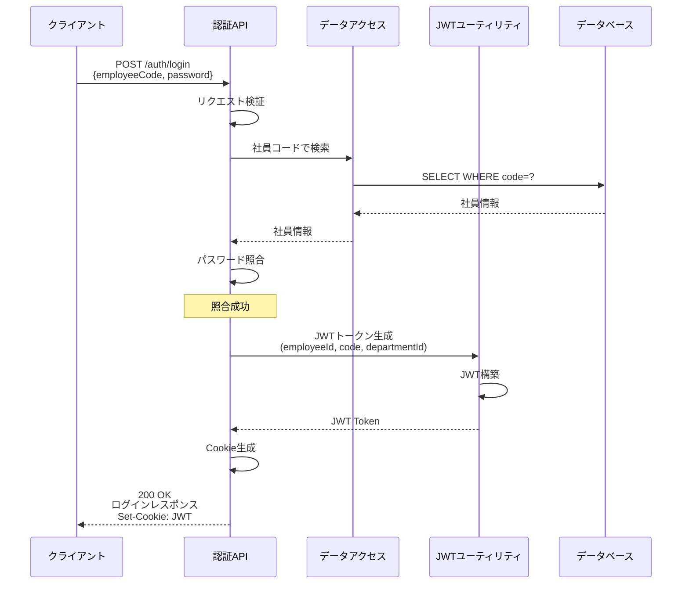

#### 9.1.2 異常系: 社員コード不存在

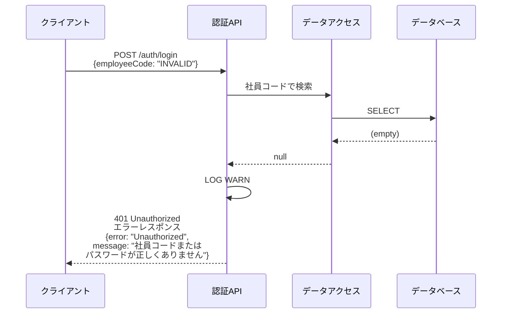

#### 9.1.3 異常系: パスワード不一致

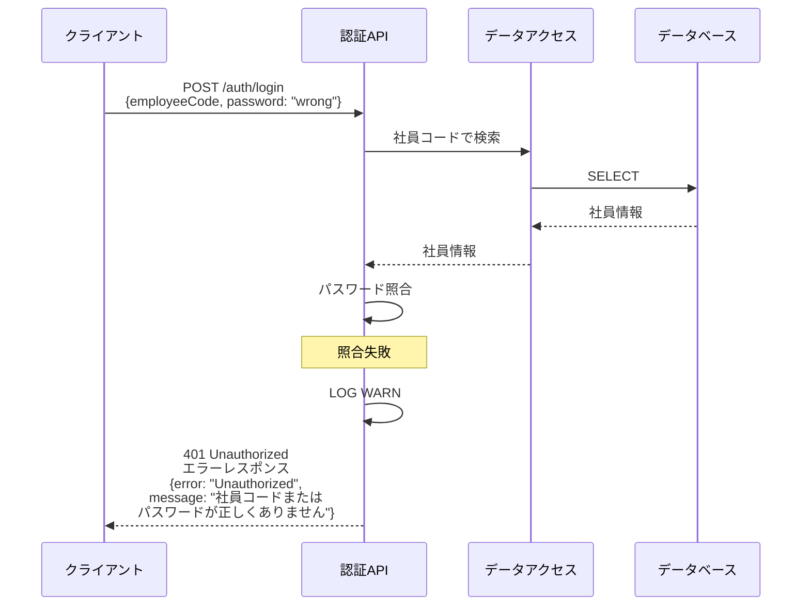

### 9.2 ログアウトシーケンス

```mermaid
sequenceDiagram
    participant Client as クライアント
    participant API as 認証API

    Client->>API: POST /auth/logout
    API->>API: Cookie削除用Cookie生成 (MaxAge=0)
    Note over API: Cookie削除
    API-->>Client: 200 OK<br/>Set-Cookie: JWT=; MaxAge=0
```

### 9.3 ユーザー情報取得シーケンス（将来の実装）

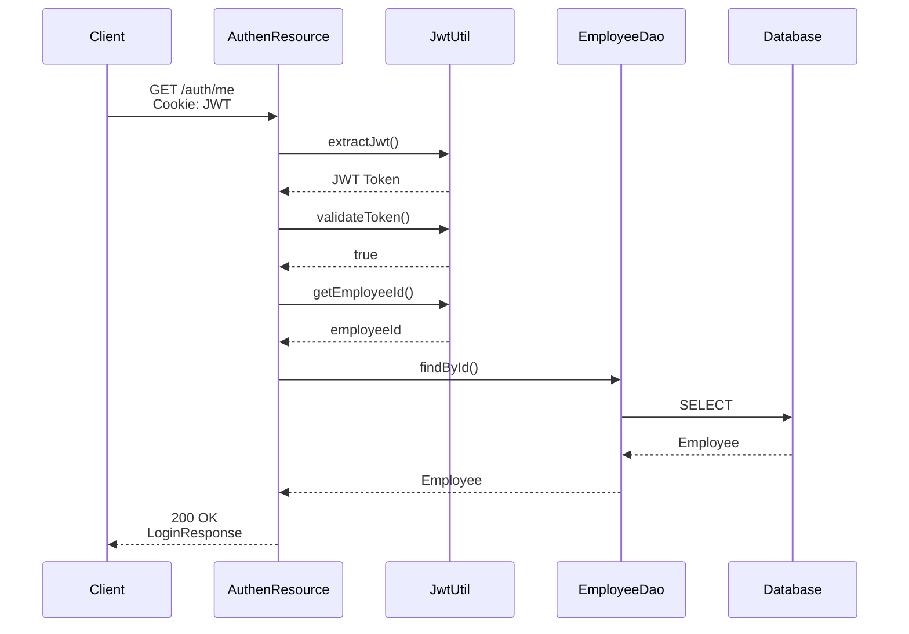

### 9.4 認証フローチャート

#### 9.4.1 ログイン処理フローチャート

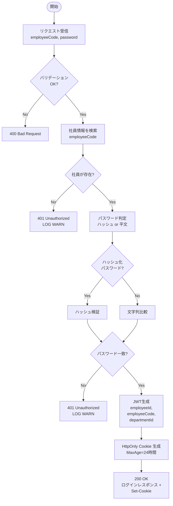

#### 9.4.2 パスワード照合フローチャート

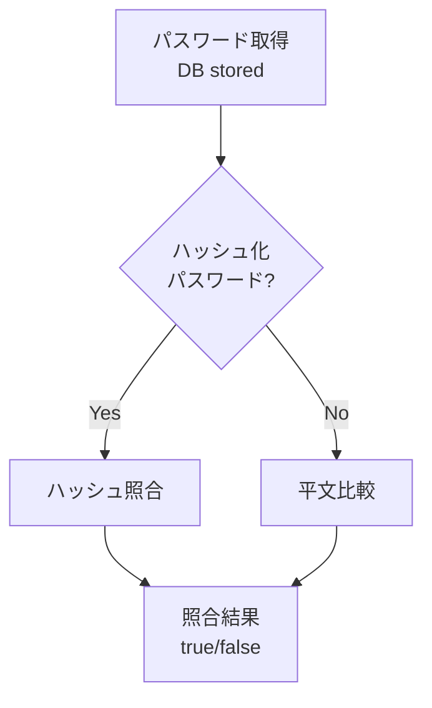

### 9.5 状態遷移図

#### 10.5.1 セッション状態遷移図

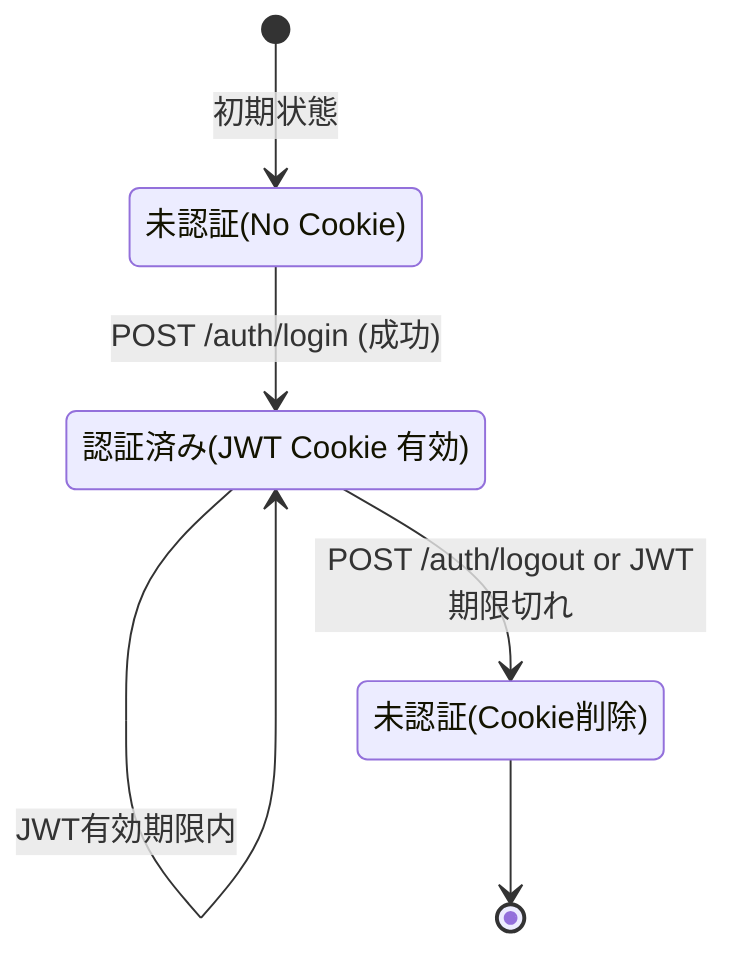

* 備考:
  * ログアウト時はCookieを削除するだけで、JWTトークン自体は無効化されない
  * トークンは有効期限まで技術的には有効（ステートレス設計）
  * Cookieが削除されればブラウザから送信されなくなる

#### 10.5.2 JWT状態遷移図

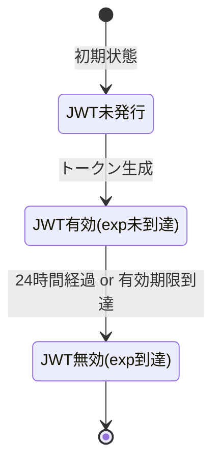

### 9.6 エラーハンドリングフローチャート

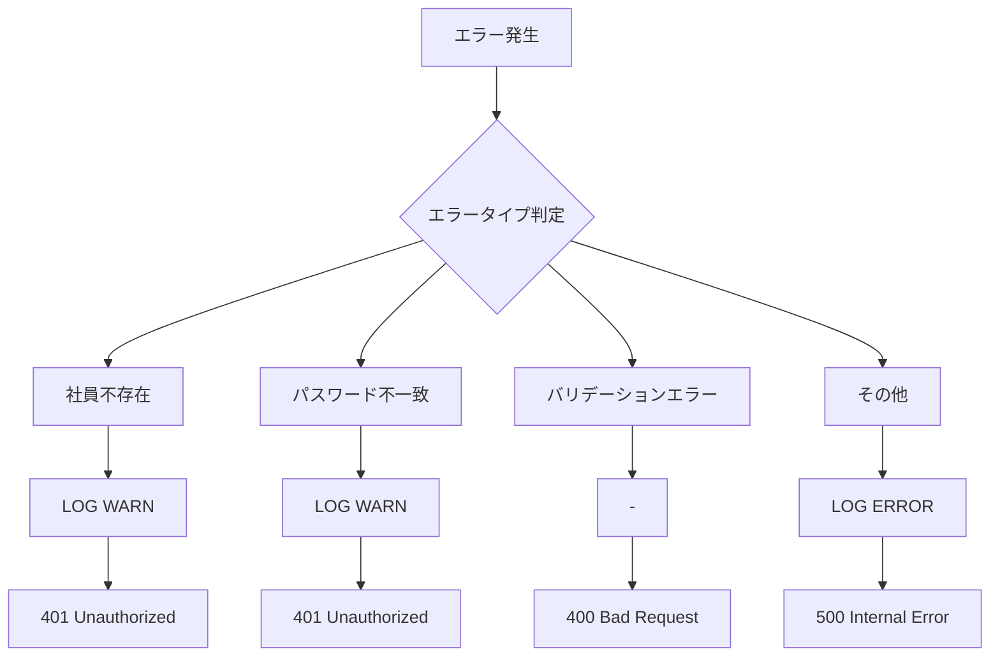

---

## 10. 将来の拡張

### 11.1 JWT認証フィルタ

* すべてのAPIエンドポイントで認証を要求する場合、以下を実装:
  * JAX-RS認証フィルタ（`JwtAuthenFilter`）でCookieからJWTを抽出
  * JWTを検証
  * 有効な場合、`AuthenContext`（`@RequestScoped` CDI Bean）に社員情報を設定
  * 無効な場合、401 Unauthorizedを返す

* 実装予定シーケンス:

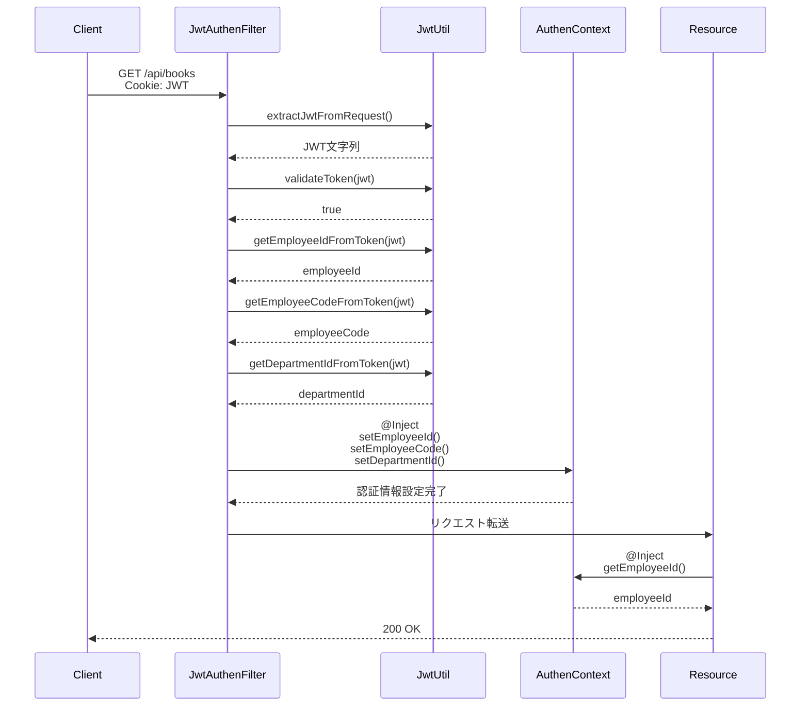

### 11.2 リフレッシュトークン

* 長期間のログインを維持する場合、リフレッシュトークンを実装:
  * アクセストークン（短期間: 1時間）
  * リフレッシュトークン（長期間: 7日間）
  * リフレッシュトークンでアクセストークンを再発行

* 実装予定シーケンス:

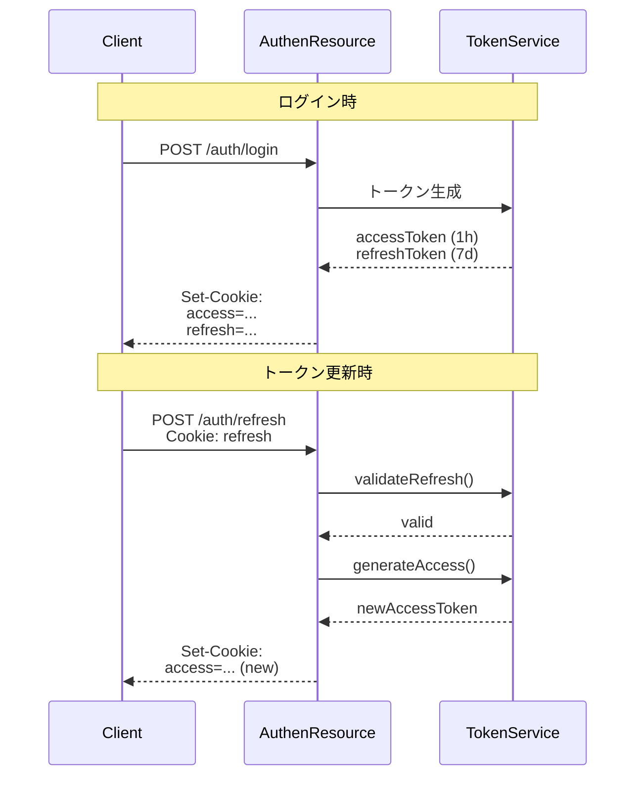

### 11.3 多要素認証（MFA）

* セキュリティ強化のため、多要素認証を実装:
  * TOTP（Time-based One-Time Password）
  * SMS認証
  * メール認証

### 11.4 ソーシャルログイン

* 外部認証プロバイダーとの連携:
  * OAuth 2.0
  * OpenID Connect
