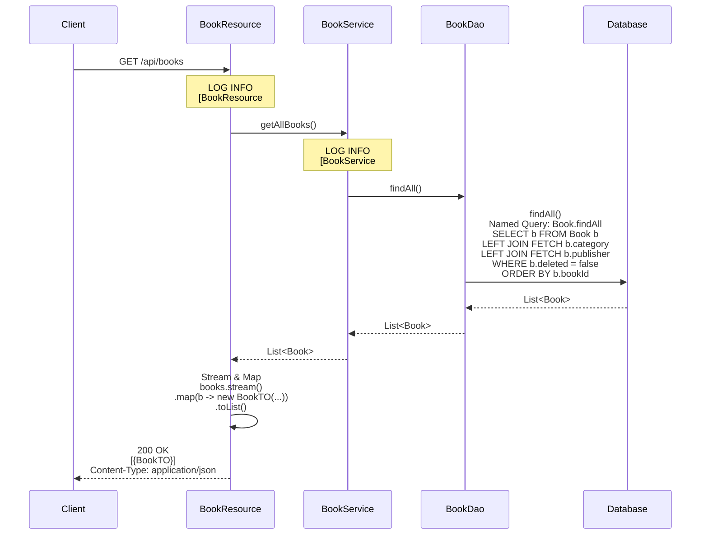
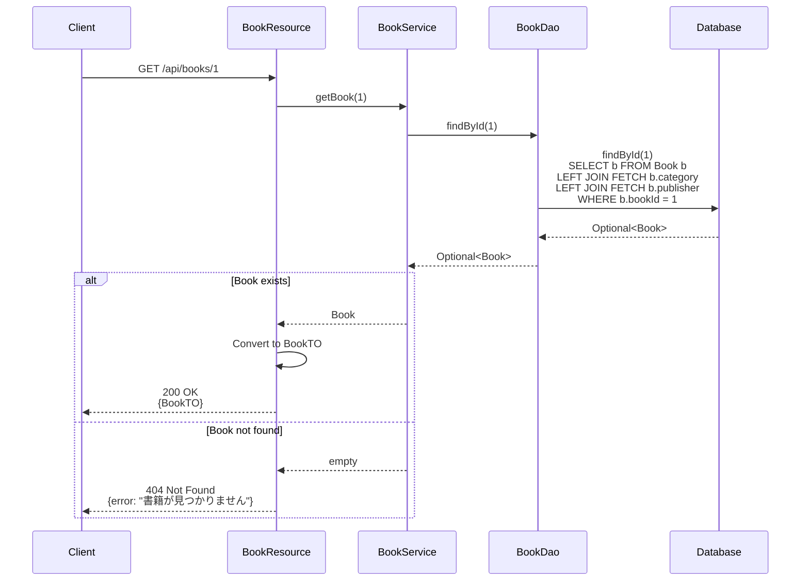
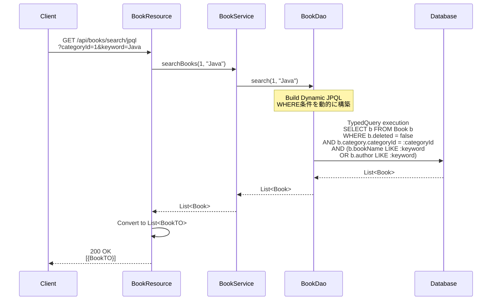
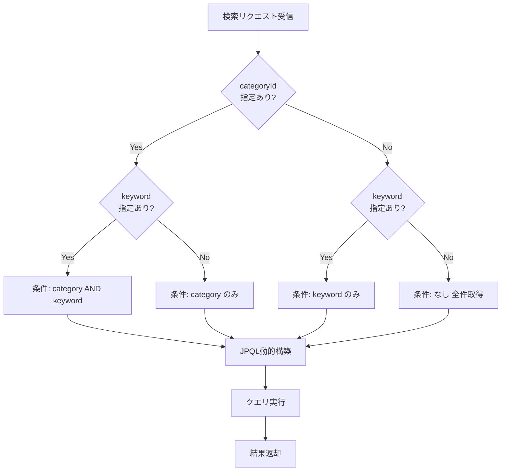
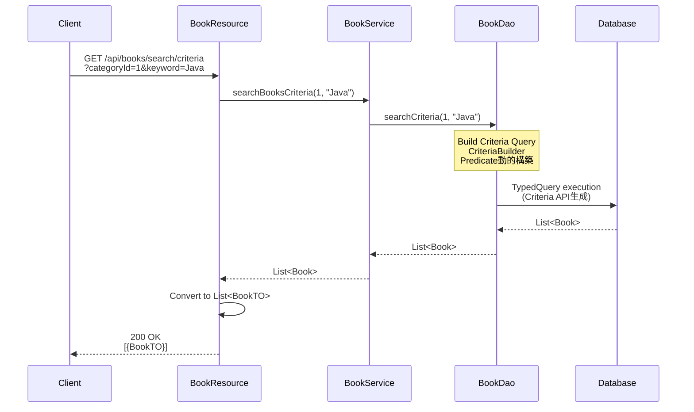
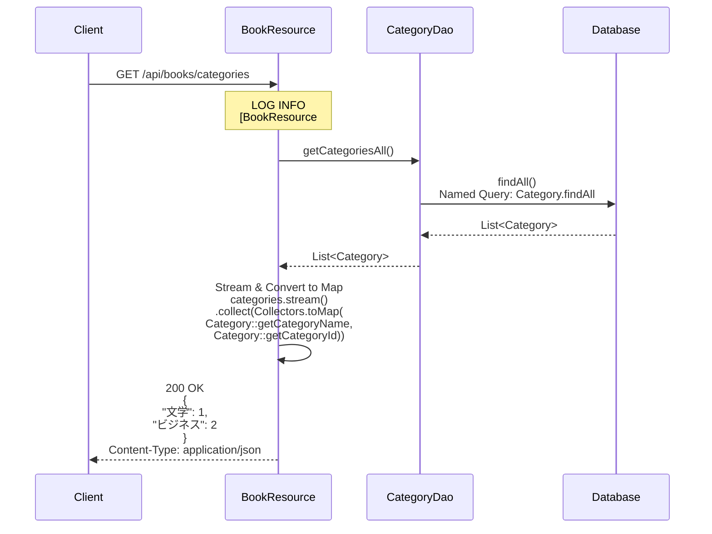
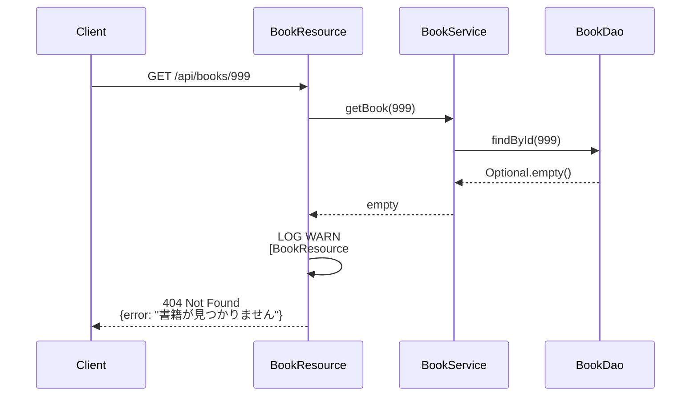

# 書籍API 機能設計書

## 1. API概要

### 1.1 API名
書籍API（Books API）

### 1.2 ベースパス
`/api/books`

### 1.3 目的
書籍マスタ情報の参照機能を提供する。書籍一覧取得、詳細取得、検索機能（カテゴリ・キーワード）を含む。

### 1.4 認証要否
現状は認証不要（将来的にJWT認証フィルタ実装時に認証必須となる予定）

## 2. エンドポイント一覧

| No | メソッド | パス | 機能 | 認証要否 |
|----|---------|------|------|---------|
| 1 | GET | `/api/books` | 書籍一覧取得 | 不要（将来:必要） |
| 2 | GET | `/api/books/{id}` | 書籍詳細取得 | 不要（将来:必要） |
| 3 | GET | `/api/books/search` | 書籍検索（デフォルト） | 不要（将来:必要） |
| 4 | GET | `/api/books/search/jpql` | 書籍検索（JPQL） | 不要（将来:必要） |
| 5 | GET | `/api/books/search/criteria` | 書籍検索（Criteria API） | 不要（将来:必要） |
| 6 | GET | `/api/books/categories` | カテゴリ一覧取得 | 不要（将来:必要） |

## 3. エンドポイント詳細

### 3.1 書籍一覧取得

#### 3.1.1 基本情報
* エンドポイント: `GET /api/books`
* 機能: すべての書籍情報（在庫情報含む）を取得
* 認証: 不要（将来:必要）

#### 3.1.2 リクエスト

**ヘッダー**: なし

**クエリパラメータ**: なし

**ボディ**: なし

#### 3.1.3 レスポンス

成功（200 OK）:
```json
[
  {
    "bookId": 1,
    "bookName": "サンプル書籍",
    "author": "著者名",
    "price": 2500,
    "imageUrl": "http://example.com/image.jpg",
    "quantity": 10,
    "version": 1,
    "category": {
      "categoryId": 1,
      "categoryName": "文学"
    },
    "publisher": {
      "publisherId": 1,
      "publisherName": "出版社A"
    }
  },
  {
    "bookId": 2,
    "bookName": "別の書籍",
    "author": "別の著者",
    "price": 3000,
    "imageUrl": "http://example.com/image2.jpg",
    "quantity": 5,
    "version": 2,
    "category": {
      "categoryId": 2,
      "categoryName": "ビジネス"
    },
    "publisher": {
      "publisherId": 2,
      "publisherName": "出版社B"
    }
  }
]
```

レスポンススキーマ:
| フィールド | 型 | 説明 |
|-----------|---|------|
| bookId | Integer | 書籍ID |
| bookName | String | 書籍名 |
| author | String | 著者名 |
| price | BigDecimal | 価格（円） |
| imageUrl | String | 画像URL |
| quantity | Integer | 在庫数 |
| version | Long | バージョン（楽観的ロック用） |
| category | CategoryInfo | カテゴリ情報 |
| category.categoryId | Integer | カテゴリID |
| category.categoryName | String | カテゴリ名 |
| publisher | PublisherInfo | 出版社情報 |
| publisher.publisherId | Integer | 出版社ID |
| publisher.publisherName | String | 出版社名 |

#### 3.1.4 処理フロー

1. BookServiceを呼び出し（`getBooksAll()`）
2. BookDaoで全書籍を取得（JPQL: `SELECT b FROM Book b`）
3. Bookエンティティのリストを取得
4. 各BookエンティティをBookTOに変換
   - カテゴリ情報をネスト構造で設定
   - 出版社情報をネスト構造で設定
   - 在庫情報（quantity, version）を設定
5. BookTOのリストをJSON形式でレスポンス

#### 3.1.5 ビジネスルール

* BR-BOOK-001: 削除済み書籍（deleted=true）も含む
  - UIで絞り込む場合はクライアント側で実施
  - または将来的にクエリパラメータで制御
* BR-BOOK-002: 在庫情報はSecondaryTableで結合
  - BOOKテーブルとSTOCKテーブルを自動結合

#### 3.1.6 関連コンポーネント

* `BookResource#getAllBooks()`
* `BookService#getBooksAll()`
* `BookDao#findAll()`

---

### 3.2 書籍詳細取得

#### 3.2.1 基本情報
* エンドポイント: `GET /api/books/{id}`
* 機能: 指定した書籍IDの詳細情報を取得
* 認証: 不要（将来:必要）

#### 3.2.2 リクエスト

パスパラメータ:
| パラメータ | 型 | 必須 | 説明 |
|-----------|---|------|------|
| id | Integer | Yes | 書籍ID |

例:
* `/api/books/1`
* `/api/books/123`

#### 3.2.3 レスポンス

成功（200 OK）:
```json
{
  "bookId": 1,
  "bookName": "サンプル書籍",
  "author": "著者名",
  "price": 2500,
  "imageUrl": "http://example.com/image.jpg",
  "quantity": 10,
  "version": 1,
  "category": {
    "categoryId": 1,
    "categoryName": "文学"
  },
  "publisher": {
    "publisherId": 1,
    "publisherName": "出版社A"
  }
}
```

失敗（404 Not Found）:
```json
{
  "error": "書籍が見つかりません"
}
```

#### 3.2.4 処理フロー

1. パスパラメータから書籍IDを取得
2. BookServiceを呼び出し（`getBook(bookId)`）
3. BookDaoで指定IDの書籍を取得（`EntityManager.find()`）
4. 書籍が見つからない場合 → 404 Not Found
5. BookエンティティをBookTOに変換
6. JSON形式でレスポンス

#### 3.2.5 ビジネスルール

* BR-BOOK-003: 削除済み書籍も取得可能
  - DELETEDフラグで除外しない
* BR-BOOK-004: 存在しない書籍IDは404エラー

#### 3.2.6 関連コンポーネント

* `BookResource#getBookById()`
* `BookService#getBook()`
* `BookDao#findById()`

---

### 3.3 書籍検索（デフォルト）

#### 3.3.1 基本情報
* エンドポイント: `GET /api/books/search`
* 機能: カテゴリとキーワードで書籍を検索（内部的にJPQLを使用）
* 認証: 不要（将来:必要）

#### 3.3.2 リクエスト

クエリパラメータ:
| パラメータ | 型 | 必須 | 説明 |
|-----------|---|------|------|
| categoryId | Integer | No | カテゴリID（0または未指定で全カテゴリ） |
| keyword | String | No | 検索キーワード（書籍名または著者名で部分一致） |

例:
* `/api/books/search?categoryId=1&keyword=サンプル`
* `/api/books/search?categoryId=1`
* `/api/books/search?keyword=サンプル`
* `/api/books/search` （全件取得）

#### 3.3.3 レスポンス

成功（200 OK）:
```json
[
  {
    "bookId": 1,
    "bookName": "サンプル書籍",
    "author": "著者名",
    "price": 2500,
    "imageUrl": "http://example.com/image.jpg",
    "quantity": 10,
    "version": 1,
    "category": {
      "categoryId": 1,
      "categoryName": "文学"
    },
    "publisher": {
      "publisherId": 1,
      "publisherName": "出版社A"
    }
  }
]
```

#### 3.3.4 処理フロー

1. クエリパラメータからcategoryIdとkeywordを取得
2. 検索条件に応じてBookServiceのメソッドを呼び分け:
   - categoryId + keyword → `searchBook(categoryId, keyword)`
   - categoryIdのみ → `searchBook(categoryId)`
   - keywordのみ → `searchBook(keyword)`
   - 条件なし → `getBooksAll()`
3. BookDaoで対応するJPQLクエリを実行
4. Bookエンティティのリストを取得
5. 各BookエンティティをBookTOに変換
6. JSON形式でレスポンス

#### 3.3.5 ビジネスルール

* BR-BOOK-005: categoryId=0は全カテゴリとして扱う
* BR-BOOK-006: keywordは部分一致検索（LIKE '%keyword%'）
* BR-BOOK-007: 書籍名と著者名の両方を検索対象とする

#### 3.3.6 クエリロジック

カテゴリ + キーワード指定時:
* 対象エンティティ: Book
* WHERE条件:
  - categoryIdがパラメータ値と一致
  - AND (書籍名がキーワードに部分一致 OR 著者名がキーワードに部分一致)

カテゴリのみ指定時:
* 対象エンティティ: Book
* WHERE条件:
  - categoryIdがパラメータ値と一致

キーワードのみ指定時:
* 対象エンティティ: Book
* WHERE条件:
  - 書籍名がキーワードに部分一致 OR 著者名がキーワードに部分一致

#### 3.3.7 関連コンポーネント

* `BookResource#searchBooks()`
* `BookResource#searchBooksJpql()` （内部で呼び出し）
* `BookService#searchBook(...)` （複数のオーバーロード）
* `BookDao#query()`, `BookDao#queryByCategory()`, `BookDao#queryByKeyword()`

---

### 3.4 書籍検索（JPQL）

#### 3.4.1 基本情報
* エンドポイント: `GET /api/books/search/jpql`
* 機能: カテゴリとキーワードで書籍を検索（静的クエリ: JPQL）
* 認証: 不要（将来:必要）

#### 3.4.2 リクエスト/レスポンス

`/api/books/search`と同じ

#### 3.4.3 処理フロー

`/api/books/search`と同じ（明示的にJPQLを使用）

#### 3.4.4 ビジネスルール

`/api/books/search`と同じ

#### 3.4.5 用途

* パフォーマンステスト: JPQLとCriteria APIの比較
* 開発・デバッグ: 静的クエリの動作確認

#### 3.4.6 関連コンポーネント

* `BookResource#searchBooksJpql()`
* `BookService#searchBook(...)`
* `BookDao#query()`, `BookDao#queryByCategory()`, `BookDao#queryByKeyword()`

---

### 3.5 書籍検索（Criteria API）

#### 3.5.1 基本情報
* エンドポイント: `GET /api/books/search/criteria`
* 機能: カテゴリとキーワードで書籍を検索（動的クエリ: Criteria API）
* 認証: 不要（将来:必要）

#### 3.5.2 リクエスト

クエリパラメータ:
| パラメータ | 型 | 必須 | 説明 |
|-----------|---|------|------|
| categoryId | Integer | No | カテゴリID（0または未指定で全カテゴリ） |
| keyword | String | No | 検索キーワード（書籍名または著者名で部分一致） |

例:
* `/api/books/search/criteria?categoryId=1&keyword=サンプル`
* `/api/books/search/criteria?categoryId=1`
* `/api/books/search/criteria?keyword=サンプル`
* `/api/books/search/criteria` （全件取得）

#### 3.5.3 レスポンス

`/api/books/search`と同じ

#### 3.5.4 処理フロー

1. クエリパラメータからcategoryIdとkeywordを取得
2. BookServiceを呼び出し（`searchBookWithCriteria(categoryId, keyword)`）
3. BookDaoでCriteria APIを使用して動的にクエリを構築
   - `CriteriaBuilder`でクエリを構築
   - categoryIdが指定されている場合、条件を追加
   - keywordが指定されている場合、LIKE条件を追加（OR）
4. クエリを実行してBookエンティティのリストを取得
5. 各BookエンティティをBookTOに変換
6. JSON形式でレスポンス

#### 3.5.5 ビジネスルール

`/api/books/search`と同じ

#### 3.5.6 動的クエリ構築ロジック

クエリ構築手順:
1. Criteria APIを使用してクエリビルダーを初期化
2. 対象エンティティとしてBookを指定
3. 動的に述語（Predicate）のリストを構築:
   - **カテゴリ条件**: categoryIdがnullでなく、かつ0でない場合、等価条件を追加
   - **キーワード条件**: keywordがnullでなく、かつ空でない場合:
     - 書籍名の部分一致条件を作成
     - 著者名の部分一致条件を作成
     - 上記2条件をOR結合して追加
4. すべての述語をAND結合してWHERE句を構成
5. クエリを実行して結果リストを返却

動的クエリの特徴:
* パラメータの有無に応じて条件を動的に追加
* 複数条件はANDで結合、書籍名と著者名の検索はORで結合
* タイプセーフなクエリ構築が可能

#### 3.5.7 用途

* 動的クエリ: 検索条件が多い場合や複雑な条件の場合
* タイプセーフ: コンパイル時にエラーチェック
* パフォーマンス比較: JPQLとの比較

#### 3.5.8 関連コンポーネント

* `BookResource#searchBooksCriteria()`
* `BookService#searchBookWithCriteria()`
* `BookDao#searchWithCriteria()`

---

### 3.6 カテゴリ一覧取得（書籍API経由）

#### 3.6.1 基本情報
* エンドポイント: `GET /api/books/categories`
* 機能: カテゴリの一覧をMap形式で取得
* 認証: 不要（将来:必要）

#### 3.6.2 リクエスト

**ヘッダー**: なし

**クエリパラメータ**: なし

**ボディ**: なし

#### 3.6.3 レスポンス

成功（200 OK）:
```json
{
  "文学": 1,
  "ビジネス": 2,
  "技術": 3,
  "歴史": 4
}
```

**備考**: カテゴリ名をキー、カテゴリIDを値とするMap形式

#### 3.6.4 処理フロー

1. CategoryServiceを呼び出し（`getCategoryMap()`）
2. CategoryDaoで全カテゴリを取得
3. カテゴリ名とカテゴリIDのMapに変換
4. JSON形式でレスポンス

#### 3.6.5 ビジネスルール

* BR-BOOK-008: レスポンスはMap形式（後方互換性のため）
* BR-BOOK-009: カテゴリAPIの`/api/categories`とは異なる形式

#### 3.6.6 用途

* 後方互換性: 既存のUIが使用
* 将来的には`/api/categories`の使用を推奨

#### 3.6.7 関連コンポーネント

* `BookResource#getAllCategories()`
* `CategoryService#getCategoryMap()`
* `CategoryDao#findAll()`

---

## 4. データ転送オブジェクト（DTO）

### 4.1 BookTO

**パッケージ**: `pro.kensait.backoffice.api.dto`

**構造種別**: データ転送オブジェクト（ネスト構造を含む）

フィールド構成:

| フィールド名 | 型 | 説明 |
|------------|---|------|
| bookId | Integer | 書籍ID |
| bookName | String | 書籍名 |
| author | String | 著者名 |
| price | BigDecimal | 価格 |
| imageUrl | String | 画像URL |
| quantity | Integer | 在庫数 |
| version | Long | 楽観的ロックバージョン |
| category | CategoryInfo | カテゴリ情報（ネスト） |
| publisher | PublisherInfo | 出版社情報（ネスト） |

ネスト構造 - CategoryInfo:

| フィールド名 | 型 | 説明 |
|------------|---|------|
| categoryId | Integer | カテゴリID |
| categoryName | String | カテゴリ名 |

ネスト構造 - PublisherInfo:

| フィールド名 | 型 | 説明 |
|------------|---|------|
| publisherId | Integer | 出版社ID |
| publisherName | String | 出版社名 |

---

## 5. ビジネスルールまとめ

### 5.1 検索ルール

| ルールID | ルール内容 |
|---------|-----------|
| BR-BOOK-001 | 削除済み書籍（deleted=true）も検索対象に含む |
| BR-BOOK-002 | 在庫情報はSecondaryTableで自動結合 |
| BR-BOOK-003 | 削除済み書籍も詳細取得可能 |
| BR-BOOK-004 | 存在しない書籍IDは404エラー |
| BR-BOOK-005 | categoryId=0は全カテゴリとして扱う |
| BR-BOOK-006 | keywordは部分一致検索（LIKE '%keyword%'） |
| BR-BOOK-007 | 書籍名と著者名の両方を検索対象とする |
| BR-BOOK-008 | カテゴリ一覧はMap形式でレスポンス（後方互換性） |
| BR-BOOK-009 | `/api/categories`とは異なる形式 |

### 5.2 データ結合ルール

* BOOK + STOCK: SecondaryTableで自動結合
* BOOK → CATEGORY: ManyToOneで結合
* BOOK → PUBLISHER: ManyToOneで結合

---

## 6. エラーハンドリング

### 6.1 エラーケース

| エラー内容 | HTTPステータス | レスポンス |
|-----------|---------------|-----------|
| 書籍が見つからない | 404 Not Found | {"error": "書籍が見つかりません"} |
| 予期しないエラー | 500 Internal Server Error | エラーメッセージ |

### 6.2 ログ出力

INFOレベル:
```
[ BookResource#getAllBooks ]
[ BookResource#getBookById ] id: 1
[ BookResource#searchBooks ] categoryId: 1, keyword: サンプル
[ BookService#getBooksAll ]
[ BookService#getBook ]
[ BookService#searchBook(categoryId, keyword) ]
[ BookService#searchBookWithCriteria ]
```

---

## 7. パフォーマンス考慮事項

### 7.1 N+1問題の回避

* SecondaryTable: BOOKとSTOCKを1回のクエリで取得
* ManyToOne: カテゴリと出版社を自動的にJOIN取得

### 7.2 インデックスの活用

* BOOK.CATEGORY_ID: カテゴリ検索用インデックス
* BOOK.PUBLISHER_ID: 出版社検索用インデックス
* BOOK.DELETED: 論理削除フィルタ用インデックス

### 7.3 パフォーマンス目標

| 操作 | 目標レスポンスタイム |
|------|---------------------|
| 一覧取得（全件） | 200ms以内 |
| 詳細取得 | 100ms以内 |
| 検索（条件あり） | 500ms以内 |

---

## 8. テスト仕様

### 8.1 正常系テスト

| テストケース | 入力 | 期待結果 |
|------------|------|---------|
| 全件取得 | なし | 200 OK + 全書籍リスト |
| 詳細取得（存在） | id=1 | 200 OK + 書籍詳細 |
| 検索（カテゴリ+キーワード） | categoryId=1, keyword="サンプル" | 200 OK + フィルタされた書籍リスト |
| 検索（カテゴリのみ） | categoryId=1 | 200 OK + カテゴリ1の書籍リスト |
| 検索（キーワードのみ） | keyword="サンプル" | 200 OK + キーワードマッチの書籍リスト |
| 検索（条件なし） | なし | 200 OK + 全書籍リスト |
| カテゴリ一覧 | なし | 200 OK + カテゴリMap |

### 8.2 異常系テスト

| テストケース | 入力 | 期待結果 |
|------------|------|---------|
| 詳細取得（存在しない） | id=99999 | 404 Not Found |
| 不正なID形式 | id="abc" | 400 Bad Request |

### 8.3 JPQL vs Criteria API比較テスト

| テストケース | JPQL結果 | Criteria API結果 | 期待 |
|------------|---------|-----------------|------|
| 同一条件で検索 | 結果セットA | 結果セットB | A == B |

---

## 9. 将来の拡張

### 9.1 ページネーション

大量データ対応のため、ページネーションを実装:
```
GET /api/books?page=1&size=20
```

レスポンス:
```json
{
  "content": [...],
  "page": 1,
  "size": 20,
  "totalElements": 100,
  "totalPages": 5
}
```

### 9.2 ソート機能

ソート条件の指定:
```
GET /api/books?sort=bookName,asc&sort=price,desc
```

### 9.3 フィルタの拡張

* 価格範囲: `priceMin`, `priceMax`
* 在庫状況: `inStock=true`
* 削除フラグ: `includeDeleted=false`

### 9.4 集計機能

* カテゴリ別の書籍数
* 在庫切れ書籍の一覧
* 価格帯別の書籍分布

---

## 10. セキュリティ考慮事項

### 10.1 認証・認可

現状は認証不要だが、将来的にJWT認証フィルタを実装:
* すべてのエンドポイントで認証必須
* 職務ランクに応じたアクセス制御（現状は全社員が参照可能）

### 10.2 SQLインジェクション対策

* JPAの名前付きパラメータ使用
* Criteria APIのタイプセーフなクエリ構築
* ユーザー入力の直接的なSQL組み立ては行わない

### 10.3 データ保護

* 削除済み書籍も参照可能（論理削除）
* 機密情報は含まれない（価格、在庫数は公開情報）

---

## 11. 動的振る舞い

### 11.1 書籍一覧取得シーケンス



### 11.2 書籍詳細取得シーケンス



### 11.3 書籍検索シーケンス（JPQL）



### 11.4 検索条件分岐フローチャート



### 11.5 書籍検索シーケンス（Criteria API）



### 11.6 カテゴリ一覧取得シーケンス



### 11.7 エラーハンドリングシーケンス



### 11.8 データフロー全体図

```mermaid
graph TD
    Client[Client]
    Resource[BookResource<br/>- getAllBooks<br/>- getBook<br/>- searchBooks]
    Service[BookService<br/>- getAllBooks<br/>- getBook<br/>- searchBooks]
    BookDao[BookDao<br/>- findAll<br/>- findById<br/>- search]
    CategoryDao[CategoryDao<br/>- findAll]
    DB[Database<br/>- BOOK table<br/>- CATEGORY table<br/>- PUBLISHER table<br/>- STOCK table]
    
    Client -->|HTTP GET<br/>/api/books| Resource
    Resource -->|@Inject| Service
    Service -->|@Inject| BookDao
    Resource -->|@Inject| CategoryDao
    BookDao -->|EntityManager / JPQL| DB
    CategoryDao -->|EntityManager / JPQL| DB
```
