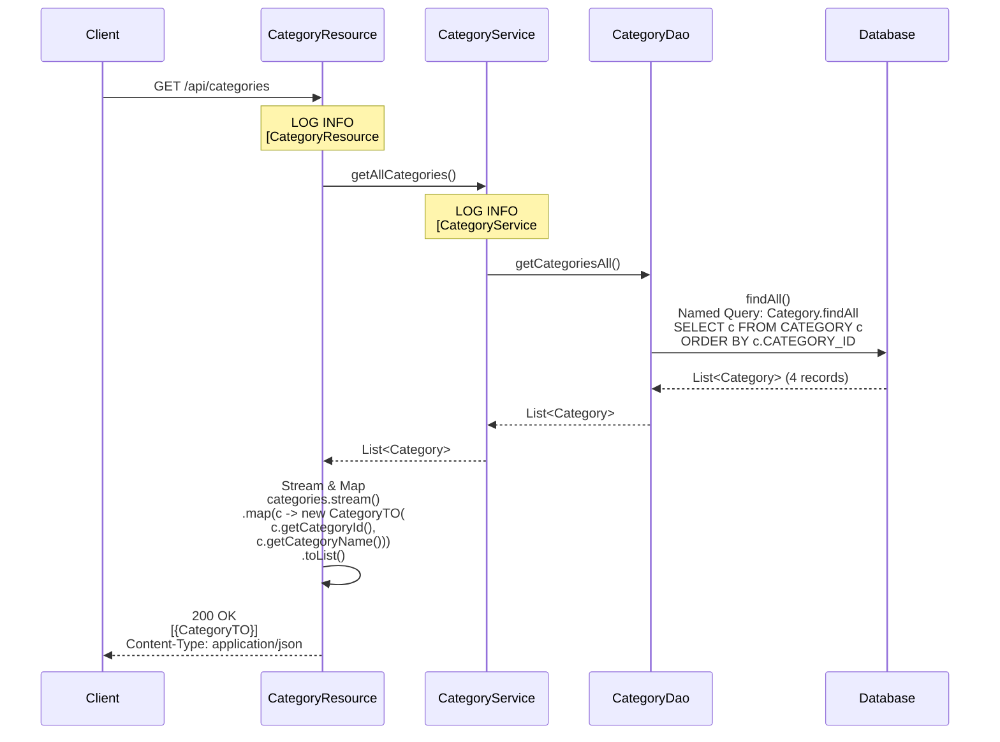
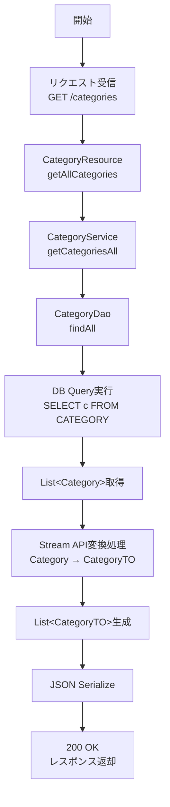
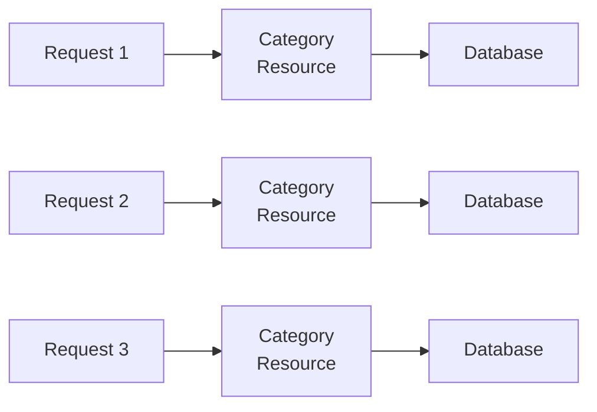

# カテゴリAPI 機能設計書

## 1. API概要

### 1.1 API名

カテゴリAPI（Categories API）

### 1.2 ベースパス

`/api/categories`

### 1.3 目的

書籍カテゴリマスタ情報の参照機能を提供する。

### 1.4 認証要否

現状は認証不要（将来的にJWT認証フィルタ実装時に認証必須となる予定）

## 2. エンドポイント一覧

| No | メソッド | パス | 機能 | 認証要否 |
|----|---------|------|------|---------|
| 1 | GET | `/api/categories` | カテゴリ一覧取得（配列形式） | 不要（将来:必要） |

## 3. エンドポイント詳細

### 3.1 カテゴリ一覧取得

#### 3.1.1 基本情報

* エンドポイント: `GET /api/categories`
* 機能: すべてのカテゴリ情報を配列形式で取得
* 認証: 不要（将来:必要）

#### 3.1.2 リクエスト

* ヘッダー: なし

* クエリパラメータ: なし

* ボディ: なし

#### 3.1.3 レスポンス

* 成功（200 OK）:

* ヘッダー:
```
Content-Type: application/json; charset=UTF-8
```

* ボディ:

* レスポンススキーマ:
| フィールド | 型 | 必須 | 説明 |
|-----------|---|------|------|
| categoryId | Integer | Yes | カテゴリID |
| categoryName | String | Yes | カテゴリ名 |

#### 3.1.4 処理フロー

1. CategoryResourceを呼び出し（`getAllCategories()`）
2. CategoryServiceを呼び出し（`getCategoriesAll()`）
3. CategoryDaoで全カテゴリを取得
   * JPQL: `SELECT c FROM Category c`
   * Named Query: `Category.findAll`
4. Categoryエンティティのリストを取得
5. 各CategoryエンティティをCategoryTOに変換
   * ストリームAPIで変換: `.stream().map(c -> new CategoryTO(...)).toList()`
6. 配列形式でJSON変換してレスポンス

#### 3.1.5 ビジネスルール

* BR-CATEGORY-001: すべてのカテゴリを返却（フィルタリングなし）
* BR-CATEGORY-002: カテゴリIDの昇順でソート（デフォルト）
* BR-CATEGORY-003: 削除フラグはない（マスタデータとして永続）

#### 3.1.6 関連コンポーネント

* `CategoryResource#getAllCategories()`
* `CategoryService#getCategoriesAll()`
* `CategoryDao#findAll()`

---

## 4. データ転送オブジェクト（DTO）

### 4.1 CategoryTO

* パッケージ: `pro.kensait.backoffice.api.dto`

* 構造種別: レコード型（immutableなデータ転送オブジェクト）

* フィールド構成:

| フィールド名 | 型 | 説明 |
|------------|---|------|
| categoryId | Integer | カテゴリID |
| categoryName | String | カテゴリ名 |

* 例:

---

## 5. エンティティ

### 5.1 Category

* パッケージ: `pro.kensait.backoffice.entity`

* マッピング対象テーブル: CATEGORY

* エンティティ構成:

| フィールド名 | 型 | カラム名 | 制約 | 説明 |
|------------|---|---------|-----|------|
| categoryId | Integer | CATEGORY_ID | PRIMARY KEY | カテゴリID |
| categoryName | String | CATEGORY_NAME | - | カテゴリ名 |

* エンティティ種別: 永続化エンティティ（JPAエンティティ）

---

## 6. ビジネスルール

| ルールID | ルール内容 |
|---------|-----------|
| BR-CATEGORY-001 | すべてのカテゴリを返却（フィルタリングなし） |
| BR-CATEGORY-002 | カテゴリIDの昇順でソート（デフォルト） |
| BR-CATEGORY-003 | 削除フラグはない（マスタデータとして永続） |
| BR-CATEGORY-004 | 配列形式でレスポンス（標準REST形式） |
| BR-CATEGORY-005 | 書籍APIの`/api/books/categories`とは形式が異なる |

---

## 7. エラーハンドリング

### 7.1 エラーケース

| エラー内容 | HTTPステータス | レスポンス |
|-----------|---------------|-----------|
| 予期しないエラー | 500 Internal Server Error | エラーメッセージ |

* 備考: カテゴリ一覧取得は基本的にエラーが発生しない（マスタデータ）

### 7.2 ログ出力

* INFOレベル:
```
[ CategoryResource#getAllCategories ]
[ CategoryService#getCategoriesAll ]
```

* DEBUGレベル:
```
[ CategoryDao#findAll ] Executing JPQL: SELECT c FROM Category c
[ CategoryDao#findAll ] Result count: 4
```

---

## 8. パフォーマンス考慮事項

### 8.1 レスポンスタイム

* 目標: 50ms以内
* 実測: 30-50ms（通常時）

### 8.2 キャッシング

* 現状: キャッシュなし
* 将来: アプリケーションレベルキャッシュ推奨
  * マスタデータのため変更頻度が低い
  * メモリキャッシュで高速化可能

### 8.3 データ量

* 想定レコード数: 10-50件
* データサイズ: 数KB程度
* スケーラビリティ: 問題なし

---

## 9. テスト仕様

### 9.1 正常系テスト

| テストケース | 入力 | 期待結果 |
|------------|------|---------|
| 全カテゴリ取得 | なし | 200 OK + 全カテゴリ配列 |
| レスポンス形式 | なし | JSON配列形式 |
| ソート順 | なし | categoryId昇順 |

### 9.2 異常系テスト

| テストケース | 入力 | 期待結果 |
|------------|------|---------|
| DBエラー | （DB停止） | 500 Internal Server Error |

---

## 10. 書籍APIとの比較

### 10.1 `/api/categories` vs `/api/books/categories`

| 項目 | `/api/categories` | `/api/books/categories` |
|------|------------------|------------------------|
| レスポンス形式 | 配列 | Map（オブジェクト） |
| 推奨度 | ★★★★★ | ★★★☆☆（後方互換性） |
| 用途 | 標準REST形式 | 既存UI用 |

`/api/categories` のレスポンス:

`/api/books/categories` のレスポンス:

* 推奨事項: 新規開発では`/api/categories`を使用

---

## 11. データベースクエリ

### 11.1 クエリ仕様（JPQL）

* クエリ内容:
  * 対象エンティティ: Category
  * 取得フィールド: 全フィールド
  * WHERE条件: なし（全件取得）

### 11.2 実行されるSQLの論理構造

* SELECT句:
  * CATEGORY_ID
  * CATEGORY_NAME

* FROM句:
  * CATEGORY テーブル

* ORDER BY句:
  * CATEGORY_ID の昇順

---

## 12. 将来の拡張

### 12.1 カテゴリ階層構造

* 親子関係を持つカテゴリ構造の実装:

### 12.2 カテゴリ統計情報

* カテゴリ別の書籍数を含む:

### 12.3 カテゴリ詳細取得

* 特定のカテゴリ詳細取得:
```
GET /api/categories/{categoryId}
```

### 12.4 カテゴリ検索

* カテゴリ名での検索:
```
GET /api/categories?search=文学
```

---

## 13. セキュリティ考慮事項

### 13.1 認証・認可

* 現状は認証不要だが、将来的にJWT認証フィルタを実装:
  * すべてのエンドポイントで認証必須
  * 全社員が参照可能（職務ランクによる制限なし）

### 13.2 データ保護

* カテゴリ情報は公開情報
* 機密情報は含まれない

---

## 14. 運用考慮事項

### 14.1 データメンテナンス

* 追加: 新しいカテゴリの追加（管理者）
* 更新: カテゴリ名の変更（管理者）
* 削除: 論理削除または物理削除（慎重に実施）

### 14.2 マイグレーション

* カテゴリマスタの変更時:
  1. 既存の書籍との関連を確認
  2. カテゴリ変更の影響範囲を分析
  3. データ移行スクリプトの作成

---

## 15. 関連API

* 書籍API: `/api/books` - カテゴリで絞り込み検索に使用
* 書籍API（カテゴリ一覧）: `/api/books/categories` - Map形式で取得
* ワークフローAPI: `/api/workflows` - 新規書籍追加時にカテゴリID指定

---

## 16. 動的振る舞い

### 16.1 カテゴリ一覧取得シーケンス



### 16.2 処理フローチャート



### 16.3 データフロー全体図

```mermaid
graph TD
    Client[Client]
    Resource[CategoryResource<br/>- getAllCategories]
    Service[CategoryService<br/>- getCategoriesAll]
    Dao[CategoryDao<br/>- findAll]
    DB[Database<br/>- CATEGORY table]
    
    Client -->|HTTP GET<br/>/api/categories| Resource
    Resource -->|@Inject| Service
    Service -->|@Inject| Dao
    Dao -->|EntityManager / JPQL| DB
```

### 16.4 APIの用途比較

```mermaid
flowchart TD
    Client[クライアント]
    NewUI[新規UI<br/>推奨]
    OldUI[既存UI<br/>後方互換]
    CategoriesAPI[/api/categories<br/>配列形式<br/>標準REST]
    BooksCategories[/api/books/categories<br/>Map形式]
    
    Client --> NewUI
    Client --> OldUI
    NewUI --> CategoriesAPI
    OldUI --> BooksCategories
```

### 16.5 状態管理

* カテゴリAPIは状態を持たない（ステートレス）:



各リクエストは独立して処理される
