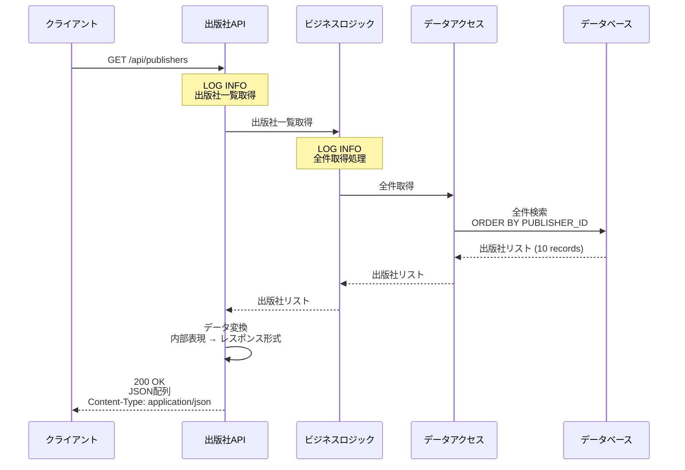
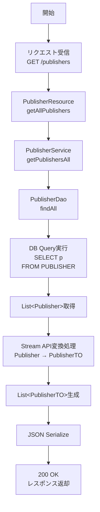
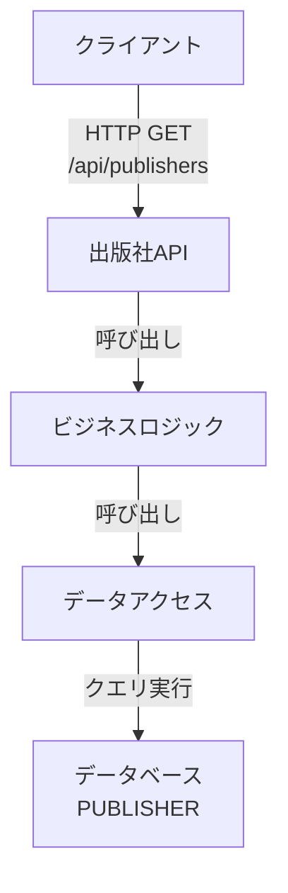
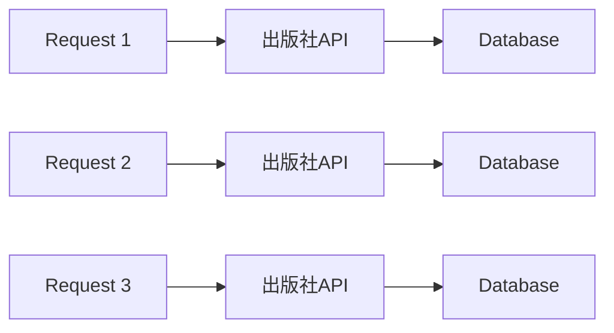

# 出版社API 機能設計書

## 1. API概要

### 1.1 API名

出版社API（Publishers API）

### 1.2 ベースパス

`/api/publishers`

### 1.3 目的

出版社マスタ情報の参照機能を提供する。

### 1.4 認証要否

現状は認証不要（将来的にJWT認証フィルタ実装時に認証必須となる予定）

## 2. エンドポイント一覧

| No | メソッド | パス | 機能 | 認証要否 |
|----|---------|------|------|---------|
| 1 | GET | `/api/publishers` | 出版社一覧取得（配列形式） | 不要（将来:必要） |

## 3. エンドポイント詳細

### 3.1 出版社一覧取得

#### 3.1.1 基本情報

* エンドポイント: `GET /api/publishers`
* 機能: すべての出版社情報を配列形式で取得
* 認証: 不要（将来:必要）

#### 3.1.2 リクエスト

* ヘッダー: なし
* クエリパラメータ: なし
* ボディ: なし

#### 3.1.3 レスポンス

* 成功（200 OK）:

* ヘッダー:
```
Content-Type: application/json; charset=UTF-8
```

* レスポンススキーマ:
| フィールド | 型 | 必須 | 説明 |
|-----------|---|------|------|
| publisherId | Integer | Yes | 出版社ID |
| publisherName | String | Yes | 出版社名 |

#### 3.1.4 処理フロー

1. 出版社リソースを呼び出し
2. 出版社サービスを呼び出し
3. 出版社データアクセスで全出版社を取得
   * 全出版社を取得
4. Publisherエンティティのリストを取得
5. 各PublisherエンティティをPublisherTOに変換
   * データ変換: Publisher → PublisherTO
6. 配列形式でJSON変換してレスポンス

#### 3.1.5 ビジネスルール

* BR-PUBLISHER-001: すべての出版社を返却（フィルタリングなし）
* BR-PUBLISHER-002: 出版社IDの昇順でソート（デフォルト）
* BR-PUBLISHER-003: 削除フラグはない（マスタデータとして永続）

#### 3.1.6 関連コンポーネント

* 出版社リソース（出版社一覧取得）
* 出版社サービス（ビジネスロジック）
* 出版社データアクセス（全件取得）

---

## 4. ビジネスルール

| ルールID | ルール内容 |
|---------|-----------|
| BR-PUBLISHER-001 | すべての出版社を返却（フィルタリングなし） |
| BR-PUBLISHER-002 | 出版社IDの昇順でソート（デフォルト） |
| BR-PUBLISHER-003 | 削除フラグはない（マスタデータとして永続） |
| BR-PUBLISHER-004 | 配列形式でレスポンス（標準REST形式） |

---

## 5. エラーハンドリング

### 7.1 エラーケース

| エラー内容 | HTTPステータス | レスポンス |
|-----------|---------------|-----------|
| 予期しないエラー | 500 Internal Server Error | エラーメッセージ |

* 備考: 出版社一覧取得は基本的にエラーが発生しない（マスタデータ）

### 7.2 ログ出力

* INFOレベル:
```
[ PublisherResource ] getAllPublishers
[ PublisherService ] getPublishersAll
```

* DEBUGレベル:
```
[ PublisherDao ] 全出版社取得実行
[ PublisherDao ] 取得件数: 10
```

---

## 6. パフォーマンス考慮事項

### 8.1 レスポンスタイム

* 目標: 50ms以内
* 実測: 30-50ms（通常時）

### 8.2 キャッシング

* 現状: キャッシュなし
* 将来: アプリケーションレベルキャッシュ推奨
  * マスタデータのため変更頻度が低い
  * メモリキャッシュで高速化可能

### 8.3 データ量

* 想定レコード数: 10-100件
* データサイズ: 数KB程度
* スケーラビリティ: 問題なし

---

## 7. テスト仕様

### 9.1 正常系テスト

| テストケース | 入力 | 期待結果 |
|------------|------|---------|
| 全出版社取得 | なし | 200 OK + 全出版社配列 |
| レスポンス形式 | なし | JSON配列形式 |
| ソート順 | なし | publisherId昇順 |

### 9.2 異常系テスト

| テストケース | 入力 | 期待結果 |
|------------|------|---------|
| DBエラー | （DB停止） | 500 Internal Server Error |

---

## 10. データベースクエリ

### 10.1 クエリ仕様

* クエリ内容:
  * 対象エンティティ: Publisher
  * 取得フィールド: 全フィールド
  * WHERE条件: なし（全件取得）

### 10.2 実行されるクエリの論理構造

* SELECT句:
  * PUBLISHER_ID
  * PUBLISHER_NAME

* FROM句:
  * PUBLISHER テーブル

* ORDER BY句:
  * PUBLISHER_ID の昇順

---

## 9. 将来の拡張

### 11.1 出版社詳細取得

* 特定の出版社詳細取得:
```
GET /api/publishers/{publisherId}
```

* レスポンス: 詳細情報（address, phone, bookCount等を含む）

### 11.2 出版社検索

* 出版社名での検索:
```
GET /api/publishers?search=出版社A
```

### 11.3 出版社統計情報

* 出版社別の書籍数を含む統計情報（bookCount, activeBookCount）

### 11.4 出版社CRUD操作

* 作成: `POST /api/publishers`
* 更新: `PUT /api/publishers/{publisherId}`
* 削除: `DELETE /api/publishers/{publisherId}`

---

## 12. セキュリティ考慮事項

### 12.1 認証・認可

* 現状は認証不要だが、将来的にJWT認証フィルタを実装:
  * すべてのエンドポイントで認証必須
  * 全社員が参照可能（職務ランクによる制限なし）

### 12.2 データ保護

* 出版社情報は公開情報
* 機密情報は含まれない

---

## 11. 運用考慮事項

### 13.1 データメンテナンス

* 追加: 新しい出版社の追加（管理者）
* 更新: 出版社名の変更（管理者）
* 削除: 論理削除または物理削除（慎重に実施）

### 13.2 マイグレーション

* 出版社マスタの変更時:
  1. 既存の書籍との関連を確認
  2. 出版社変更の影響範囲を分析
  3. データ移行スクリプトの作成

### 13.3 データ整合性

* 出版社削除時は関連書籍の確認が必要
* 外部キー制約により参照整合性を保証

---

## 12. 関連API

* 書籍API: `/api/books` - 出版社で絞り込み可能
* ワークフローAPI: `/api/workflows` - 新規書籍追加時に出版社ID指定

---

## 15. カテゴリAPIとの類似点

* カテゴリAPIと出版社APIは構造が非常に似ている:

| 項目 | カテゴリAPI | 出版社API |
|------|-----------|----------|
| エンドポイント | `/api/categories` | `/api/publishers` |
| データモデル | Category | Publisher |
| レスポンス形式 | 配列 | 配列 |
| 処理フロー | 同じ | 同じ |
| パフォーマンス | 同等 | 同等 |
| キャッシング | 推奨 | 推奨 |

* 共通設計パターン:
  * マスタデータの参照API
  * シンプルな一覧取得
  * 配列形式のレスポンス
  * ステートレス設計

---

## 14. 動的振る舞い

### 14.1 出版社一覧取得シーケンス



### 16.2 処理フローチャート



### 14.3 データフロー全体図



### 14.4 状態管理

* 出版社APIは状態を持たない（ステートレス）:



各リクエストは独立して処理される
