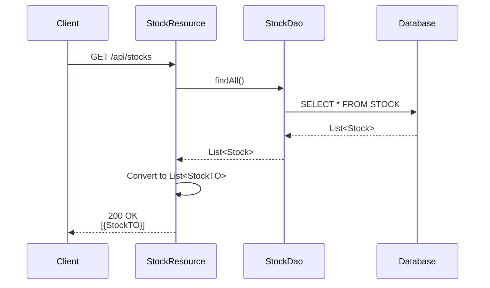
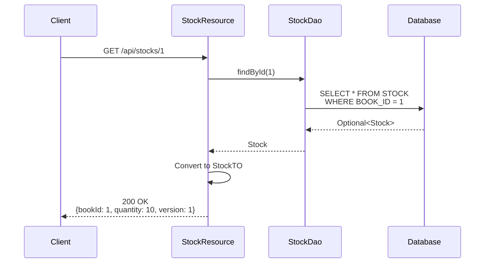
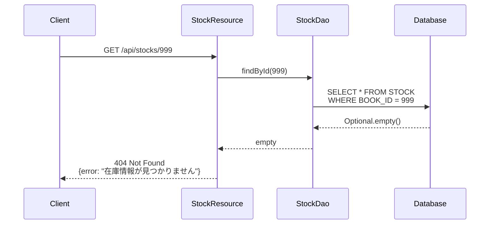
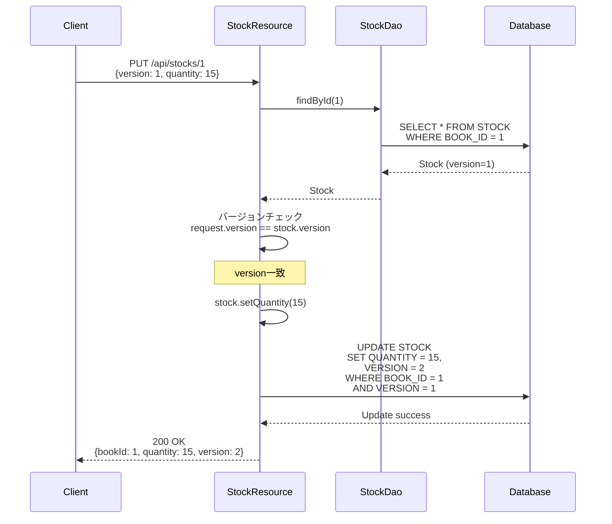
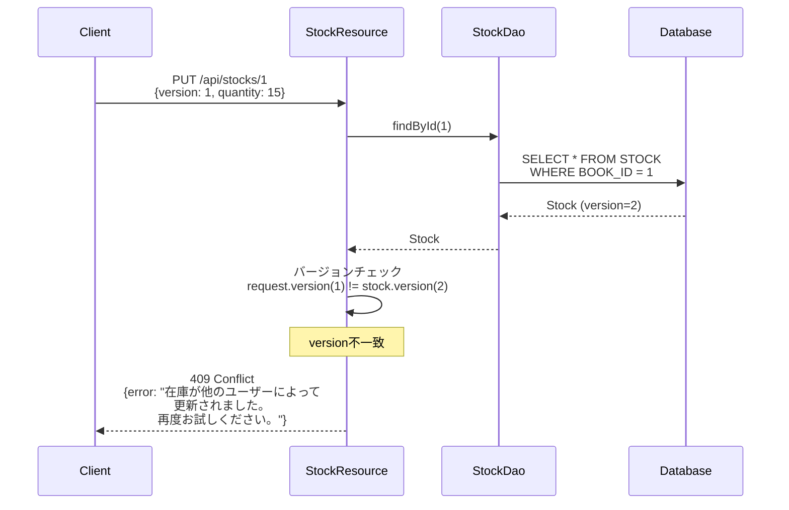
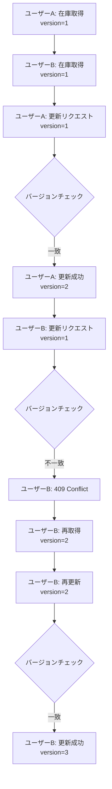
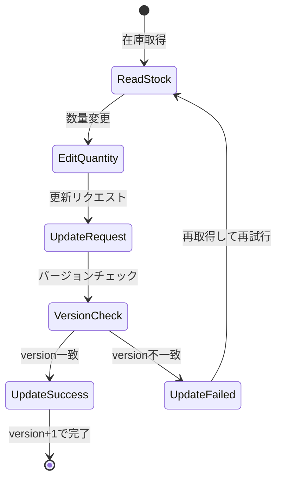

# 在庫API 機能設計書

## 1. API概要

* API名: 在庫API（Stocks API）
* ベースパス: `/api/stocks`
* 目的: 書籍在庫情報の参照・更新機能を提供（楽観的ロック対応）

## 2. エンドポイント一覧

| メソッド | パス | 機能 |
|---------|------|------|
| GET | `/api/stocks` | 在庫一覧取得 |
| GET | `/api/stocks/{bookId}` | 在庫情報取得 |
| PUT | `/api/stocks/{bookId}` | 在庫更新（楽観的ロック） |

## 3. エンドポイント詳細

### 3.1 在庫一覧取得

* エンドポイント: `GET /api/stocks`
* 認証: 不要（将来:必要）

レスポンス（200 OK）:
```json
[
  {
    "bookId": 1,
    "quantity": 10,
    "version": 1
  },
  {
    "bookId": 2,
    "quantity": 5,
    "version": 2
  }
]
```

---

### 3.2 在庫情報取得

* エンドポイント: `GET /api/stocks/{bookId}`
* 認証: 不要（将来:必要）

レスポンス（200 OK）:
```json
{
  "bookId": 1,
  "quantity": 10,
  "version": 1
}
```

レスポンス（404 Not Found）:
```json
{
  "error": "在庫情報が見つかりません"
}
```

---

### 3.3 在庫更新（楽観的ロック）

* エンドポイント: `PUT /api/stocks/{bookId}`
* 認証: 不要（将来:必要）

リクエスト:
```json
{
  "version": 1,
  "quantity": 15
}
```

処理フロー:
1. パスパラメータから書籍IDを取得
2. StockDaoで在庫情報を取得
3. 在庫が存在しない → 404 Not Found
4. **バージョンチェック**: リクエストのversionとDBのversionを比較
5. バージョンが一致しない → 409 Conflict（楽観的ロック失敗）
6. 在庫数を更新（`stock.setQuantity()`）
7. JPA `@Version`により自動的にversionがインクリメント
8. トランザクションコミット時にUPDATE実行

レスポンス（200 OK）:
```json
{
  "bookId": 1,
  "quantity": 15,
  "version": 2
}
```

レスポンス（409 Conflict）:
```json
{
  "error": "在庫が他のユーザーによって更新されました。再度お試しください。"
}
```

## 4. 楽観的ロックの仕組み

### 4.1 エンティティのバージョン管理

**エンティティ**: Stock

**マッピング対象テーブル**: STOCK

フィールド構成:

| フィールド名 | 型 | カラム名 | 制約 | 説明 |
|------------|---|---------|-----|------|
| bookId | Integer | BOOK_ID | PRIMARY KEY | 書籍ID |
| quantity | Integer | QUANTITY | - | 在庫数 |
| version | Long | VERSION | VERSION管理 | 楽観的ロック用バージョン番号 |

楽観的ロック仕様:
* versionフィールドをバージョン管理用として指定
* 更新時に自動的にバージョンチェックが行われる
* バージョン不一致時は楽観的ロック例外が発生

### 4.2 UPDATE時のバージョンチェック

実行されるSQLの論理構造:

**UPDATE対象テーブル**: STOCK

SET句:
* QUANTITY = (新しい在庫数)
* VERSION = VERSION + 1

WHERE句:
* BOOK_ID = (対象の書籍ID)
* VERSION = (クライアントが保持しているバージョン番号)

バージョンチェックの動作:
* WHERE句のVERSION条件により、バージョンが一致しない場合はUPDATE対象が0件となる
* 更新件数が0の場合、永続化フレームワークは楽観的ロック例外を発生させる

### 4.3 並行更新の例

```
時刻   ユーザーA                           ユーザーB
t1    在庫取得 (id=1, qty=10, ver=1)
t2                                       在庫取得 (id=1, qty=10, ver=1)
t3    数量変更 (qty=15)
t4    PUT /stocks/1 {ver:1, qty:15}
t5    → 成功 (ver=2に更新)
t6                                       数量変更 (qty=20)
t7                                       PUT /stocks/1 {ver:1, qty:20}
t8                                       → 409 Conflict (ver不一致)
t9                                       最新情報を再取得 (ver=2)
t10                                      PUT /stocks/1 {ver:2, qty:20}
t11                                      → 成功 (ver=3に更新)
```

## 5. ビジネスルール

| ルールID | ルール内容 |
|---------|-----------|
| BR-STOCK-001 | 在庫更新時はバージョン番号を必ず指定 |
| BR-STOCK-002 | バージョンが一致しない場合は409 Conflict |
| BR-STOCK-003 | クライアント側で再取得して再試行 |
| BR-STOCK-004 | 在庫数は0以上の整数 |
| BR-STOCK-005 | 負の値は許可しない |

## 6. DTO

### 6.1 StockTO

**パッケージ**: `pro.kensait.backoffice.api.dto`

**構造種別**: データ転送オブジェクト

フィールド構成:

| フィールド名 | 型 | 説明 |
|------------|---|------|
| bookId | Integer | 書籍ID |
| quantity | Integer | 在庫数 |
| version | Long | 楽観的ロック用バージョン番号 |

### 6.2 StockUpdateRequest

**パッケージ**: `pro.kensait.backoffice.api.dto`

**構造種別**: リクエストデータ転送オブジェクト

フィールド構成:

| フィールド名 | 型 | 必須 | 説明 |
|------------|---|-----|------|
| version | Long | Yes | 楽観的ロック用バージョン番号 |
| quantity | Integer | Yes | 新しい在庫数 |

## 7. エラーハンドリング

| エラー | HTTPステータス | メッセージ |
|-------|---------------|-----------|
| 在庫が見つからない | 404 Not Found | 在庫情報が見つかりません |
| バージョン不一致 | 409 Conflict | 在庫が他のユーザーによって更新されました |
| 予期しないエラー | 500 Internal Server Error | 在庫更新中にエラーが発生しました |

## 8. 関連コンポーネント

* `StockResource#updateStock()`
* `StockDao#findById()`
* JPA `@Version`
* `OptimisticLockExceptionMapper`

## 9. テスト仕様

### 9.1 正常系

| テストケース | 期待結果 |
|------------|---------|
| 在庫更新（正しいバージョン） | 200 OK + versionインクリメント |

### 9.2 異常系

| テストケース | 期待結果 |
|------------|---------|
| 在庫更新（古いバージョン） | 409 Conflict |
| 存在しない書籍ID | 404 Not Found |

## 10. パフォーマンス要件

* 在庫更新レスポンスタイム: 200ms以内
* 楽観的ロック失敗時の再試行: クライアント側で実装

---

## 11. 動的振る舞い

### 11.1 在庫一覧取得シーケンス



### 11.2 在庫情報取得シーケンス（正常）



### 11.3 在庫情報取得シーケンス（Not Found）



### 11.4 在庫更新シーケンス（成功）



### 11.5 在庫更新シーケンス（楽観的ロック失敗）



### 11.6 並行更新フローチャート



### 11.7 状態遷移図



