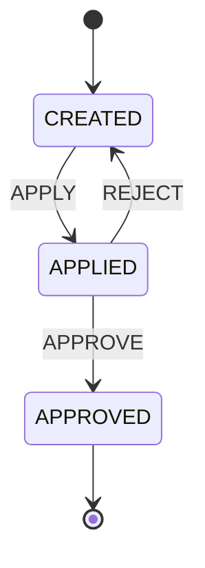
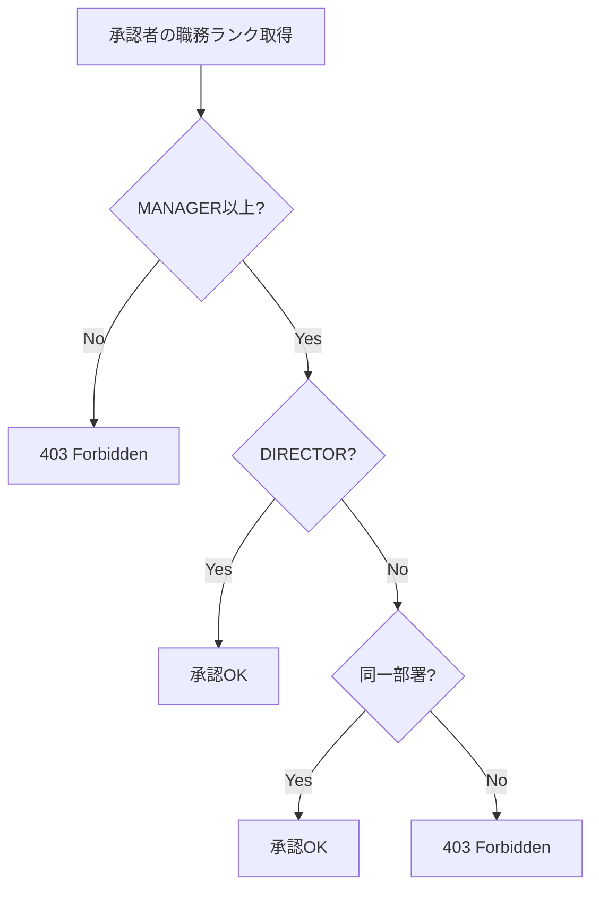
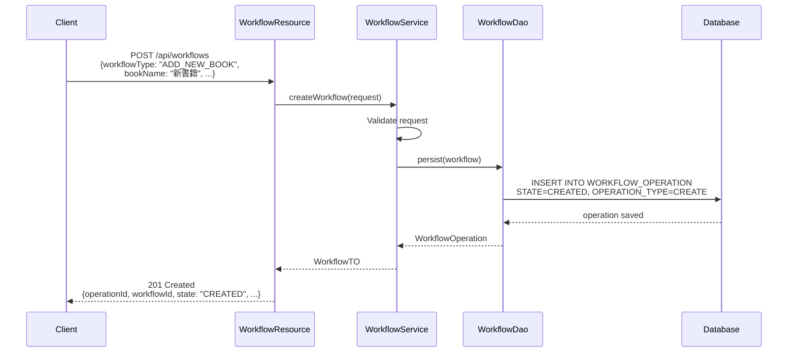
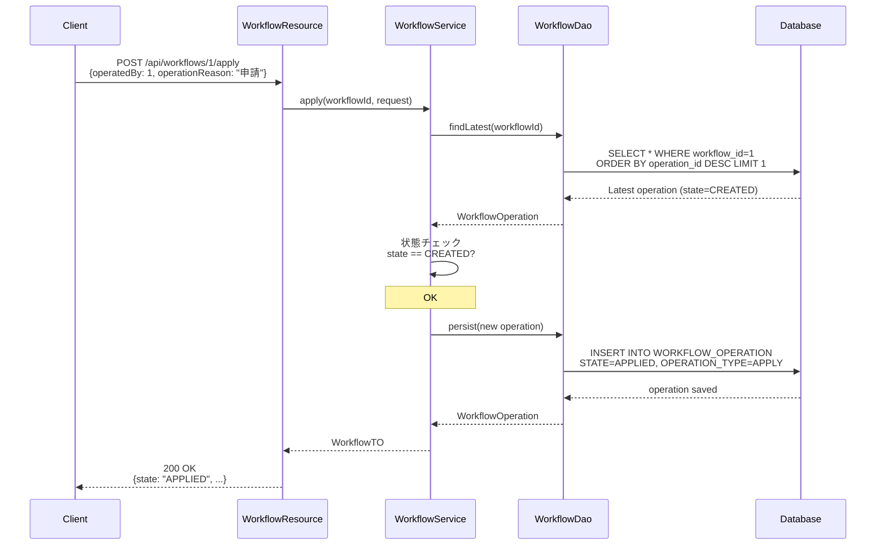
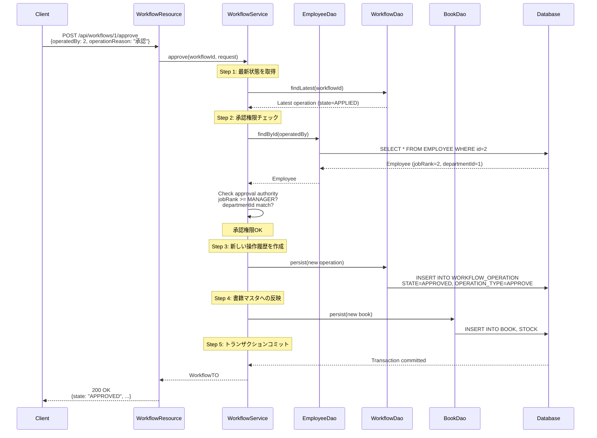
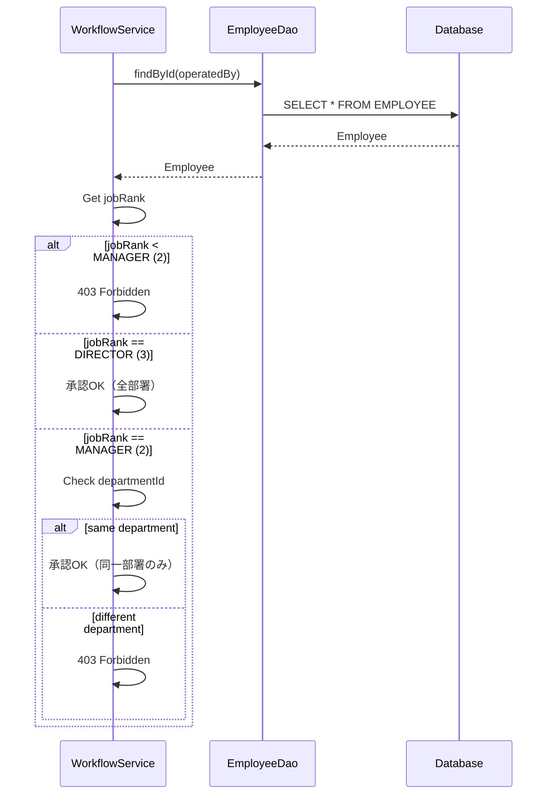
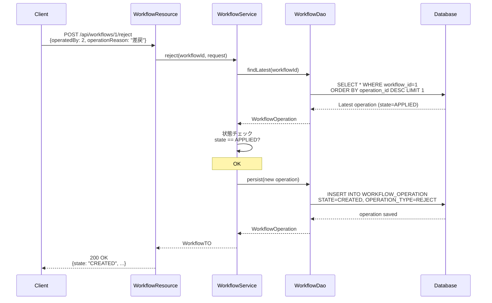
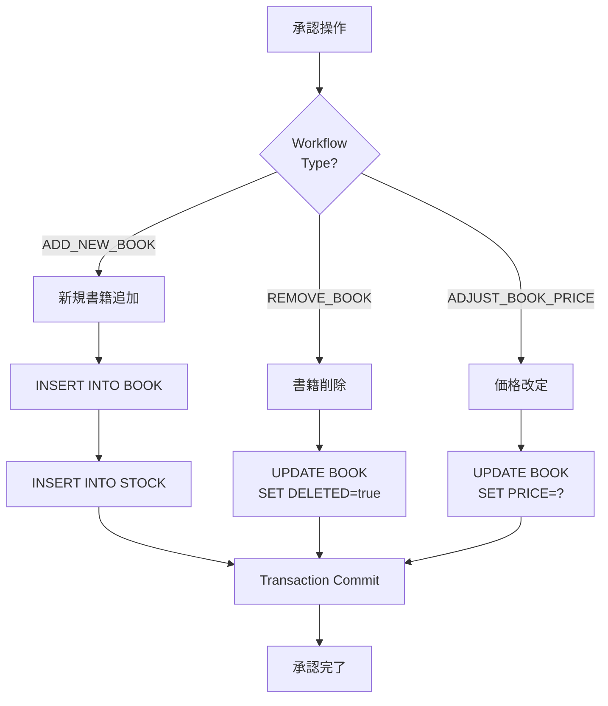

# ワークフローAPI 機能設計書

## 1. API概要

* API名: ワークフローAPI（Workflows API）
* ベースパス: `/api/workflows`
* 目的: 書籍マスタ変更のワークフロー管理（申請・承認フロー）

## 2. エンドポイント一覧

| メソッド | パス | 機能 |
|---------|------|------|
| POST | `/api/workflows` | ワークフロー作成 |
| PUT | `/api/workflows/{workflowId}` | ワークフロー更新（一時保存） |
| GET | `/api/workflows` | ワークフロー一覧取得 |
| GET | `/api/workflows/{workflowId}/history` | ワークフロー履歴取得 |
| POST | `/api/workflows/{workflowId}/apply` | ワークフロー申請 |
| POST | `/api/workflows/{workflowId}/approve` | ワークフロー承認 |
| POST | `/api/workflows/{workflowId}/reject` | ワークフロー却下 |

## 3. ワークフロータイプ

| タイプ | 説明 | 必須フィールド |
|-------|------|---------------|
| ADD_NEW_BOOK | 新規書籍追加 | bookName, author, price, categoryId, publisherId |
| REMOVE_BOOK | 既存書籍削除 | bookId |
| ADJUST_BOOK_PRICE | 書籍価格改定 | bookId, price, startDate, endDate |

## 4. ワークフロー状態遷移



| 状態 | 説明 | 可能な操作 |
|------|------|-----------|
| CREATED | 作成済み | UPDATE, APPLY |
| APPLIED | 申請中 | APPROVE, REJECT |
| APPROVED | 承認済み | なし（終了） |

## 5. エンドポイント詳細

### 5.1 ワークフロー作成

* エンドポイント: `POST /api/workflows`

* リクエスト（新規書籍追加）:

* レスポンス（201 Created）:

### 5.2 ワークフロー承認

* エンドポイント: `POST /api/workflows/{workflowId}/approve`

* リクエスト:

* 処理フロー:
  1. 最新の状態を取得（APPLIEDか？）
  2. 承認権限チェック
   * 職務ランク: MANAGER以上
   * 部署: DIRECTORは全部署、MANAGERは同一部署のみ
3. 新しい操作履歴を作成（STATE=APPROVED）
4. 書籍マスタへの反映
   * ADD_NEW_BOOK → Book + Stock INSERT
   * REMOVE_BOOK → Book論理削除（DELETED=true）
   * ADJUST_BOOK_PRICE → Book価格UPDATE
5. トランザクションコミット（ワークフロー + 書籍マスタ）

* レスポンス（200 OK）: WorkflowTO

* レスポンス（403 Forbidden）:

## 6. 承認権限ルール

### 6.1 職務ランク

| ランク | 値 | 権限 |
|-------|---|------|
| ASSOCIATE | 1 | 承認不可 |
| MANAGER | 2 | 同一部署のみ承認可 |
| DIRECTOR | 3 | 全部署承認可 |

### 6.2 承認権限チェックフローチャート



## 7. ワークフロー履歴

* ワークフローの操作履歴は全て保存される（監査目的）:

| 操作 | STATE | OPERATION_TYPE |
|------|-------|---------------|
| 作成 | CREATED | CREATE |
| 更新 | CREATED | CREATE（同じ行を更新） |
| 申請 | APPLIED | APPLY |
| 承認 | APPROVED | APPROVE |
| 却下 | CREATED | REJECT |

* 例:
```
OPERATION_ID  WORKFLOW_ID  STATE     OPERATION_TYPE  OPERATED_AT
1             1            CREATED   CREATE          2025-01-01 10:00
2             1            APPLIED   APPLY           2025-01-01 11:00
3             1            APPROVED  APPROVE         2025-01-01 15:00
```

## 8. 書籍マスタ反映（承認時）

### 8.1 ADD_NEW_BOOK

* 書籍テーブルへの挿入処理:
  * 対象テーブル: BOOK
  * 挿入カラム: BOOK_NAME, AUTHOR, PRICE, CATEGORY_ID, PUBLISHER_ID, IMAGE_URL, DELETED
  * 初期値: DELETEDはfalse

* 在庫テーブルへの挿入処理（自動実行）:
  * 対象テーブル: STOCK
  * 挿入カラム: BOOK_ID, QUANTITY, VERSION
  * 初期値: QUANTITY=0, VERSION=0
  * 備考: SecondaryTableマッピングにより自動的に実行される

### 8.2 REMOVE_BOOK

* 書籍の論理削除処理:
  * 対象テーブル: BOOK
  * 更新カラム: DELETED = true
  * WHERE条件: BOOK_IDが対象書籍ID
  * 備考: 物理削除は行わず、論理削除フラグを設定する
  * 論理削除後、書籍はAPIレスポンス（一覧・検索）から除外される
  * 詳細取得APIでは引き続き参照可能

### 8.3 ADJUST_BOOK_PRICE

* 書籍価格の更新処理:
  * 対象テーブル: BOOK
  * 更新カラム: PRICE = 新しい価格
  * WHERE条件: BOOK_IDが対象書籍ID

## 9. トランザクション管理

* 承認処理は1トランザクション:
  1. ワークフロー履歴INSERT
  2. 書籍マスタ更新

どちらか失敗した場合、両方ロールバック。

## 10. DTO

### 10.1 WorkflowCreateRequest

* パッケージ: `pro.kensait.backoffice.api.dto`

* 構造種別: リクエストデータ転送オブジェクト

* フィールド構成:

| フィールド名 | 型 | 説明 |
|------------|---|------|
| workflowType | String | ワークフロー種別 |
| createdBy | Long | 作成者の社員ID |
| bookId | Integer | 書籍ID |
| bookName | String | 書籍名 |
| author | String | 著者名 |
| price | BigDecimal | 価格 |
| imageUrl | String | 画像URL |
| categoryId | Integer | カテゴリID |
| publisherId | Integer | 出版社ID |
| applyReason | String | 申請理由 |
| startDate | LocalDate | 開始日 |
| endDate | LocalDate | 終了日 |

### 10.2 WorkflowTO

* パッケージ: `pro.kensait.backoffice.api.dto`

* 構造種別: データ転送オブジェクト

* 主要フィールド構成:

| フィールド名 | 型 | 説明 |
|------------|---|------|
| operationId | Long | 操作ID |
| workflowId | Long | ワークフローID |
| workflowType | String | ワークフロー種別 |
| state | String | 状態 |
| bookId | Integer | 書籍ID |
| bookName | String | 書籍名 |
| operationType | String | 操作種別 |
| operatedBy | Long | 操作者の社員ID |
| operatorName | String | 操作者名 |
| operatedAt | LocalDateTime | 操作日時 |

* 備考: その他のフィールドも含む（詳細は実装参照）

## 11. ビジネスルール

| ルールID | ルール内容 |
|---------|-----------|
| BR-WORKFLOW-001 | CREATED状態のみ更新可能 |
| BR-WORKFLOW-002 | CREATED状態から申請可能 |
| BR-WORKFLOW-003 | APPLIED状態から承認・却下可能 |
| BR-WORKFLOW-004 | APPROVED状態は終了（変更不可） |
| BR-WORKFLOW-005 | 却下するとCREATED状態に戻る |
| BR-WORKFLOW-006 | 承認時に書籍マスタに反映 |
| BR-WORKFLOW-007 | すべての操作履歴を保存 |

## 12. エラーハンドリング

| エラー | HTTPステータス | メッセージ |
|-------|---------------|-----------|
| ワークフローが見つからない | 404 Not Found | ワークフローが見つかりません |
| 不正な状態遷移 | 400 Bad Request | 現在の状態では操作できません |
| 承認権限不足 | 403 Forbidden | 承認権限がありません |

## 13. 関連コンポーネント

* `WorkflowResource`
* `WorkflowService`
* `WorkflowDao`
* `EmployeeDao`
* `BookDao`

## 14. パフォーマンス要件

* ワークフロー一覧取得: 500ms以内
* 承認処理: 1秒以内

---

## 15. 動的振る舞い

### 15.1 ワークフロー作成シーケンス（新規書籍追加）



### 15.2 ワークフロー申請シーケンス



### 15.3 ワークフロー承認シーケンス



### 15.4 承認権限チェックシーケンス



### 15.5 ワークフロー却下シーケンス



### 15.6 書籍マスタ反映フローチャート



