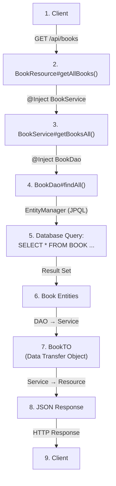
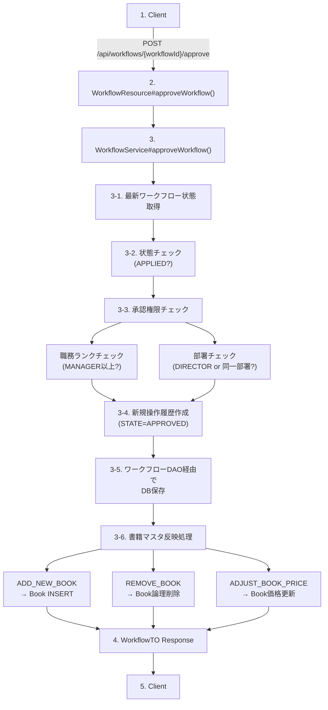
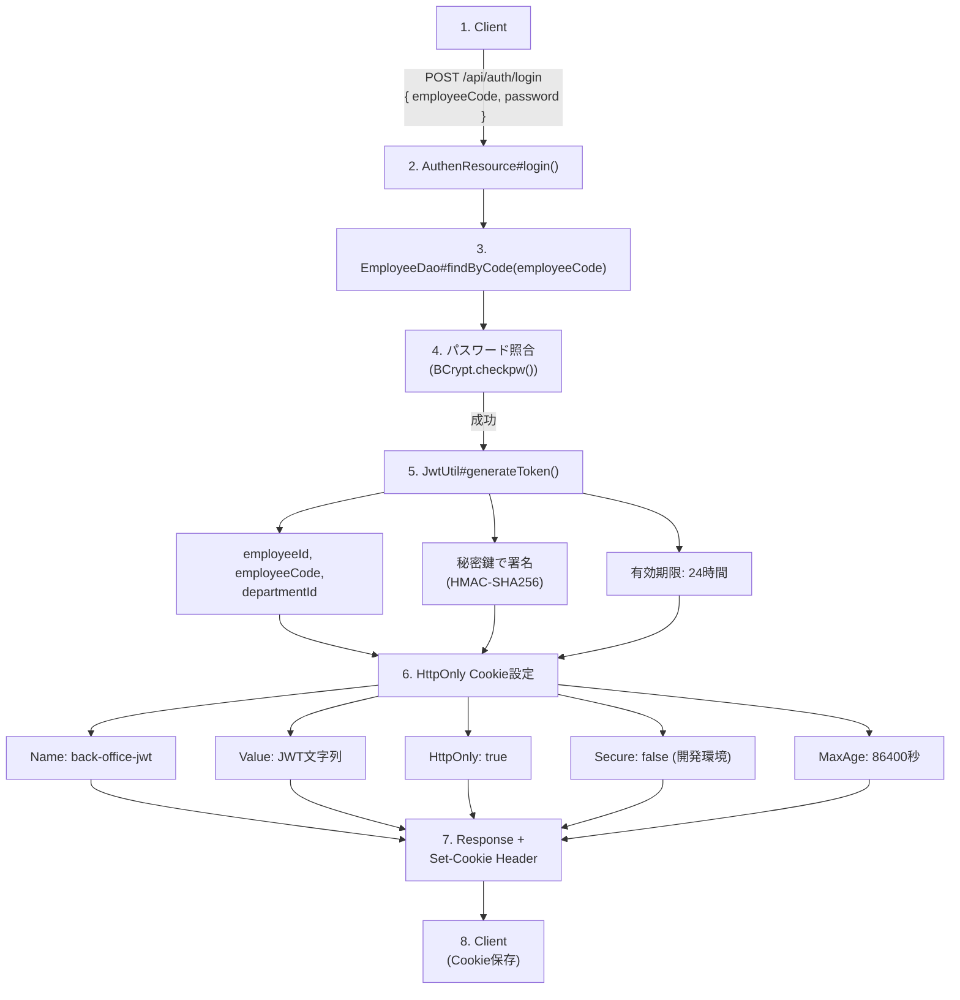

# アーキテクチャ設計書

## 1. システム概要

### 1.1 システム名
Books Stock API - バックオフィス書籍在庫管理システム

### 1.2 アーキテクチャスタイル
* アーキテクチャパターン: レイヤードアーキテクチャ（階層型アーキテクチャ）
* API設計: RESTful API
* データアクセス: JPA（Jakarta Persistence API）
* 認証方式: JWT（JSON Web Token）+ Cookie認証

## 2. 全体アーキテクチャ

### 2.1 システム構成図

```mermaid
flowchart TD
    Client["Client Application<br/>(Browser / Mobile App / etc.)"]
    
    subgraph Payara["Application Server (Payara)"]
        subgraph Presentation["Presentation Layer (API Resources)"]
            AuthenResource["AuthenResource"]
            BookResource["BookResource"]
            CategoryResource["CategoryResource"]
            PublisherResource["PublisherResource"]
            StockResource["StockResource"]
            WorkflowResource["WorkflowResource"]
        end
        
        subgraph Business["Business Logic Layer (Services)"]
            BookService["BookService"]
            CategoryService["CategoryService"]
            PublisherService["PublisherService"]
            WorkflowService["WorkflowService"]
        end
        
        subgraph DataAccess["Data Access Layer (DAO)"]
            BookDao["BookDao"]
            CategoryDao["CategoryDao"]
            PublisherDao["PublisherDao"]
            StockDao["StockDao"]
            WorkflowDao["WorkflowDao"]
            EmployeeDao["EmployeeDao"]
            DepartmentDao["DepartmentDao"]
        end
        
        subgraph Persistence["Persistence Layer (JPA Entities)"]
            Entities["Book, Category, Publisher, Stock<br/>Employee, Department, Workflow"]
        end
        
        subgraph CrossCutting["Cross-Cutting Concerns"]
            JwtUtil["JwtUtil (Security)"]
            ExceptionMappers["Exception Mappers"]
            MessageUtil["MessageUtil"]
        end
    end
    
    DB[("Database (HSQLDB)<br/>BOOK, CATEGORY, PUBLISHER<br/>STOCK, EMPLOYEE, DEPARTMENT<br/>WORKFLOW")]
    
    Client -->|HTTP/HTTPS (REST API)<br/>JSON形式| Presentation
    Presentation --> Business
    Business --> DataAccess
    DataAccess -->|JPA| Persistence
    Persistence -->|JDBC| DB
```

## 3. パッケージ構造

### 3.1 ベースパッケージ

```
pro.kensait.backoffice
```

### 3.2 パッケージ階層（概要）

```
pro.kensait.backoffice
├── api                    # Presentation Layer (JAX-RS Resources)
│   ├── dto               # Data Transfer Objects
│   └── exception         # Exception Mappers
├── service               # Business Logic Layer
├── dao                   # Data Access Layer
├── entity                # Persistence Layer (JPA Entities)
├── security              # Security (JWT, Authentication)
├── exception             # General Exception Mappers
├── common                # Common Classes
└── util                  # Utilities
```

**詳細なクラス構成**: 各API機能の`detailed_design.md`を参照してください。

| API | 詳細設計書 |
|-----|----------|
| 認証API | [API_001_auth/detailed_design.md](../api/API_001_auth/detailed_design.md) |
| 書籍API | [API_002_books/detailed_design.md](../api/API_002_books/detailed_design.md) |
| カテゴリAPI | [API_003_categories/detailed_design.md](../api/API_003_categories/detailed_design.md) |
| 出版社API | [API_004_publishers/detailed_design.md](../api/API_004_publishers/detailed_design.md) |
| 在庫API | [API_005_stocks/detailed_design.md](../api/API_005_stocks/detailed_design.md) |
| ワークフローAPI | [API_006_workflows/detailed_design.md](../api/API_006_workflows/detailed_design.md) |

### 3.3 パッケージング規約

| レイヤー | パッケージ | 責務 | 命名規則 |
|---------|-----------|------|---------|
| **Presentation** | `api` | REST APIエンドポイント | `*Resource` |
| | `api.dto` | データ転送オブジェクト | `*Request`, `*Response`, `*TO` |
| | `api.exception` | API例外ハンドリング | `*ExceptionMapper` |
| **Business Logic** | `service.*` | ビジネスロジック | `*Service` |
| **Data Access** | `dao` | データアクセス | `*Dao` |
| **Persistence** | `entity` | JPAエンティティ | エンティティ名 |
| **Cross-Cutting** | `security` | セキュリティ | 用途に応じた命名 |
| | `exception` | 汎用例外ハンドリング | `*ExceptionMapper` |
| | `common` | 共通機能 | 用途に応じた命名 |
| | `util` | ユーティリティ | `*Util` |

## 4. レイヤー設計

### 4.1 Presentation Layer（プレゼンテーション層）

**責務**: クライアントからのHTTPリクエストを受け取り、レスポンスを返す

主要コンポーネント:
* `ApplicationConfig`: JAX-RSアプリケーション設定（ベースパス: `/api`）
* `AuthenResource`: 認証API（`/api/auth`）
* `BookResource`: 書籍API（`/api/books`）
* `CategoryResource`: カテゴリAPI（`/api/categories`）
* `PublisherResource`: 出版社API（`/api/publishers`）
* `StockResource`: 在庫API（`/api/stocks`）
* `WorkflowResource`: ワークフローAPI（`/api/workflows`）

設計方針:
* JAX-RS（`@Path`, `@GET`, `@POST`, `@PUT`, `@DELETE`）を使用
* DTOオブジェクトでリクエスト/レスポンスをマッピング
* ビジネスロジックはServiceレイヤーに委譲
* 例外処理はException Mapperで統一的に処理

### 4.2 Business Logic Layer（ビジネスロジック層）

**責務**: ビジネスルール、業務ロジックの実装

主要コンポーネント:
* `BookService`: 書籍検索ロジック
* `CategoryService`: カテゴリ管理ロジック
* `PublisherService`: 出版社管理ロジック
* `WorkflowService`: ワークフロー管理ロジック（状態遷移、承認権限チェック、書籍マスタ反映）

設計方針:
* `@ApplicationScoped`でCDI管理
* `@Transactional`でトランザクション境界を制御
* ビジネスルールの検証と実行
* DAOレイヤーを使用してデータアクセス

### 4.3 Data Access Layer（データアクセス層）

**責務**: データベースへのCRUD操作

主要コンポーネント:
* `BookDao`: 書籍データアクセス
* `CategoryDao`: カテゴリデータアクセス
* `PublisherDao`: 出版社データアクセス
* `StockDao`: 在庫データアクセス
* `WorkflowDao`: ワークフローデータアクセス
* `EmployeeDao`: 社員データアクセス
* `DepartmentDao`: 部署データアクセス

設計方針:
* JPA（`EntityManager`）を使用
* JPQL、Named Query、Criteria APIによるクエリ実行
* エンティティとDTOの変換

### 4.4 Persistence Layer（永続化層）

**責務**: データベーステーブルとJavaオブジェクトのマッピング

主要エンティティ:
* `Book`: 書籍情報（BOOK + STOCK結合）
* `Category`: カテゴリ情報
* `Publisher`: 出版社情報
* `Stock`: 在庫情報（楽観的ロック対応）
* `Employee`: 社員情報
* `Department`: 部署情報
* `Workflow`: ワークフロー履歴情報

設計方針:
* JPA `@Entity`アノテーションによるマッピング
* `@ManyToOne`, `@OneToMany`によるリレーションシップ
* `@SecondaryTable`による複数テーブルマッピング（Bookエンティティ）
* `@Version`による楽観的ロック

### 4.5 Cross-Cutting Concerns（横断的関心事）

セキュリティ:
* `JwtUtil`: JWT生成・検証
* パスワード認証: BCryptハッシュ

例外処理:
* `GenericExceptionMapper`: 一般的な例外ハンドリング
* `OptimisticLockExceptionMapper`: 楽観的ロック例外ハンドリング
* `WorkflowExceptionMapper`: ワークフロー例外ハンドリング
* `NotFoundExceptionMapper`: 404エラーハンドリング

メッセージ管理:
* `MessageUtil`: プロパティファイルからのメッセージ取得
* `messages.properties`: 日本語メッセージ
* `ValidationMessages_ja.properties`: バリデーションメッセージ

## 5. 技術スタック

### 5.1 フレームワーク・ライブラリ

| 技術 | バージョン | 用途 |
|------|-----------|------|
| Jakarta EE | 10 | エンタープライズJavaプラットフォーム |
| JAX-RS | 3.1 | RESTful Webサービス |
| JPA (Jakarta Persistence) | 3.1 | ORM（Object-Relational Mapping） |
| CDI (Context and Dependency Injection) | 4.0 | 依存性注入 |
| Bean Validation | 3.0 | バリデーション |
| MicroProfile Config | 3.0 | 設定管理 |
| SLF4J | 2.x | ロギングファサード |
| BCrypt | 0.10.x | パスワードハッシュ化 |
| JJWT | 0.12.x | JWT生成・検証 |

### 5.2 実行環境

| コンポーネント | 製品/技術 |
|---------------|----------|
| Application Server | Payara Server 6.x |
| Database | HSQLDB 2.x |
| JDK | Java 17+ |

### 5.3 設定ファイル

| ファイル | 用途 |
|---------|------|
| `persistence.xml` | JPA設定（データソース、プロパティ） |
| `microprofile-config.properties` | MicroProfile設定（JWT設定） |
| `beans.xml` | CDI設定 |
| `web.xml` | Webアプリケーション設定 |

## 6. データフロー

### 6.1 典型的なリクエストフロー（書籍一覧取得の例）



### 6.2 ワークフロー承認フロー



## 7. セキュリティアーキテクチャ

### 7.1 認証フロー



### 7.2 JWT構造

```json
{
  "header": {
    "alg": "HS256",
    "typ": "JWT"
  },
  "payload": {
    "sub": "123",  // employeeId
    "employeeCode": "E0001",
    "departmentId": 1,
    "iat": 1234567890,  // 発行日時
    "exp": 1234654290   // 有効期限
  },
  "signature": "..."
}
```

### 7.3 権限制御

| 職務ランク | 値 | 権限 |
|-----------|---|------|
| ASSOCIATE | 1 | 書籍参照、ワークフロー作成 |
| MANAGER | 2 | ASSOCIATE権限 + 同一部署のワークフロー承認 |
| DIRECTOR | 3 | MANAGER権限 + 全部署のワークフロー承認 |

## 8. トランザクション設計

### 8.1 トランザクション境界
* Serviceレイヤーのメソッドを`@Transactional`でマーク
* デフォルト: `@Transactional(TxType.REQUIRED)`
* JTAトランザクションマネージャーによる管理

### 8.2 楽観的ロック
* `Stock`エンティティに`@Version`フィールド
* 更新時にバージョンチェック
* 競合発生時は`OptimisticLockException`をスロー

### 8.3 ワークフロートランザクション
* ワークフロー承認時は以下を1トランザクションで実行:
  1. 操作履歴の追加（WORKFLOW INSERT）
  2. 書籍マスタへの反映（BOOK UPDATE/INSERT/DELETE）
* ロールバック時は両方とも取り消される

## 9. エラーハンドリング

### 9.1 例外マッピング

| Exception | HTTP Status | Mapper |
|-----------|-------------|--------|
| `IllegalArgumentException` | 400 Bad Request | GenericExceptionMapper |
| `NotFoundException` | 404 Not Found | NotFoundExceptionMapper |
| `OptimisticLockException` | 409 Conflict | OptimisticLockExceptionMapper |
| `WorkflowNotFoundException` | 404 Not Found | WorkflowExceptionMapper |
| `InvalidWorkflowStateException` | 400 Bad Request | WorkflowExceptionMapper |
| `UnauthorizedApprovalException` | 403 Forbidden | WorkflowExceptionMapper |
| 一般的な例外 | 500 Internal Server Error | GenericExceptionMapper |

### 9.2 エラーレスポンス形式

```json
{
  "error": "エラータイプ",
  "message": "エラーメッセージ（日本語）"
}
```

## 10. ログ設計

### 10.1 ログレベル
* INFO: API呼び出しログ、重要な処理の開始/終了
* WARN: 楽観的ロック失敗、認証失敗など
* ERROR: 予期しないエラー、システムエラー
* DEBUG: 詳細なデバッグ情報

### 10.2 ログ形式
```
[クラス名#メソッド名] ログメッセージ: パラメータ=値, ...
```

例:
```
[ AuthenResource#login ] employeeCode: E0001
[ WorkflowService#approveWorkflow ] workflowId=123
```

## 11. パフォーマンス考慮事項

### 11.1 データベースアクセス
* N+1問題の回避: JOINによる一括取得、JPQL `JOIN FETCH`の活用
* Bookエンティティ: `@SecondaryTable`でBOOK + STOCK結合
* インデックス: 主キー、外部キー、検索条件フィールド

### 11.2 キャッシング
現状はキャッシング未実装。将来的な実装候補:
* JPAセカンドレベルキャッシュ（Category, Publisherなどの参照マスタ）
* アプリケーションレベルキャッシュ（メモリキャッシュ）

### 11.3 接続プール
* アプリケーションサーバーの接続プール機能を使用
* JNDI名: `jdbc/HsqldbDS`

## 12. デプロイメント構成

### 12.1 デプロイメント形式
* WARファイル形式
* Payara Serverにデプロイ

### 12.2 設定の外部化
* `microprofile-config.properties`: デフォルト設定
* 環境変数: 本番環境での設定上書き（JWT秘密鍵など）
* システムプロパティ: 起動時のオプション設定

## 13. 拡張性・保守性

### 13.1 レイヤーの分離
* 各レイヤーは疎結合
* インターフェース（暗黙的にServiceとDAOで分離）
* DTOによるAPI仕様とエンティティの分離

### 13.2 依存性注入
* CDIによる依存性注入
* テスト時のモック化が容易

### 13.3 設定の一元管理
* MicroProfile Configによる設定管理
* プロパティファイルで設定を外部化

## 14. 今後の拡張予定

### 14.1 認証フィルタの実装
* JWT認証フィルタ（`@PreMatching`）
* 現在のログインユーザー情報取得エンドポイントの有効化

### 14.2 監査ログ
* すべてのAPI呼び出しの監査ログ
* ワークフロー操作ログの強化

### 14.3 通知機能
* ワークフロー申請時のメール通知
* ワークフロー承認/却下時の通知

## 15. 参考資料

* Jakarta EE 10 Specification: https://jakarta.ee/specifications/platform/10/
* JAX-RS 3.1 Specification: https://jakarta.ee/specifications/restful-ws/3.1/
* JPA 3.1 Specification: https://jakarta.ee/specifications/persistence/3.1/
* MicroProfile Config: https://microprofile.io/specifications/microprofile-config/
