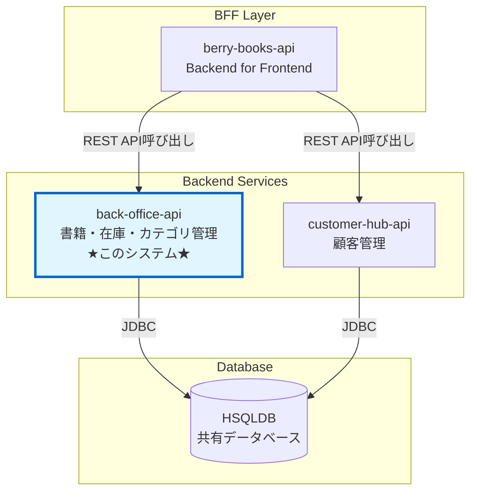

# 外部インターフェース仕様書

## 1. 概要

本ドキュメントは、Books Stock API（back-office-api）が外部システムを呼び出す際のインターフェース仕様を定義する。

## 2. 外部システム連携状況

Books Stock API（back-office-api）は、現時点では外部システムとの連携を行わない独立したバックエンドサービスとして設計されている。

### 2.1 システムの役割

| システム | 役割 | 外部連携の有無 |
|---------|------|--------------|
| back-office-api （本システム） | 書籍・在庫・カテゴリ・出版社・ワークフローの管理 データベースへの直接アクセス | なし（呼び出される側のみ） |
| berry-books-api | BFF（Backend for Frontend） 本システムのAPIを呼び出す | あり（本システムを呼び出す） |
| customer-hub-api | 顧客管理 データベースへの直接アクセス | なし |

### 2.2 本システムが公開するAPI仕様について

本システムが外部に公開するAPI仕様については、各APIディレクトリ配下のOpenAPI (YAML) 仕様書を参照してください：

| API | OpenAPI仕様書 | 説明 |
|-----|-------------|------|
| 認証API | [API_001_auth/openapi.yaml](../api/API_001_auth/openapi.yaml) | ログイン・ログアウト機能 |
| 書籍API | [API_002_books/openapi.yaml](../api/API_002_books/openapi.yaml) | 書籍情報の参照・検索 |
| カテゴリAPI | [API_003_categories/openapi.yaml](../api/API_003_categories/openapi.yaml) | カテゴリ情報の参照 |
| 出版社API | [API_004_publishers/openapi.yaml](../api/API_004_publishers/openapi.yaml) | 出版社情報の参照 |
| 在庫API | [API_005_stocks/openapi.yaml](../api/API_005_stocks/openapi.yaml) | 在庫情報の参照・更新 |
| ワークフローAPI | [API_006_workflows/openapi.yaml](../api/API_006_workflows/openapi.yaml) | 書籍変更ワークフロー管理 |

## 3. データベース接続

本システムはデータベース（HSQLDB）に接続してデータの永続化を行う。

### 3.1 接続情報

| 項目 | 値 |
|------|---|
| データベース種別 | HSQLDB 2.7.x |
| 接続方式 | JDBC（JPA経由） |
| データソース名 | java:app/jdbc/testdb |
| 接続プール管理 | アプリケーションサーバー（Payara Server） |

### 3.2 アクセステーブル

本システムがアクセスするテーブル：

| テーブル名 | 用途 | アクセス権限 |
|----------|------|------------|
| BOOK | 書籍マスタ | READ, WRITE |
| CATEGORY | カテゴリマスタ | READ |
| PUBLISHER | 出版社マスタ | READ |
| STOCK | 在庫情報 | READ, WRITE |
| EMPLOYEE | 社員マスタ | READ |
| DEPARTMENT | 部署マスタ | READ |
| WORKFLOW | ワークフロー | READ, WRITE |
| WORKFLOW_HISTORY | ワークフロー履歴 | READ, WRITE |

詳細なデータモデルについては [data_model.md](data_model.md) を参照してください。

## 4. 参考資料

* [アーキテクチャ設計書](architecture_design.md) - システム全体のアーキテクチャ
* [データモデル](data_model.md) - データベーススキーマの詳細
* [システム要件定義](requirements.md) - システム要件
