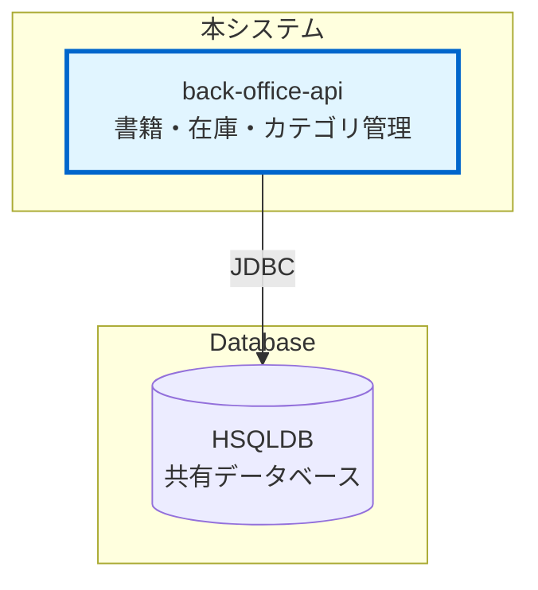

# 外部インターフェース仕様書

## 1. 概要

本ドキュメントは、Books Stock API（back-office-api）が外部システムを呼び出す際のインターフェース仕様を定義する。

## 2. 外部システム連携状況

Books Stock API（back-office-api）は、外部システムを呼び出さない独立したバックエンドサービスとして設計されている。

### 2.1 外部システム呼び出し

本システムは外部システムを呼び出さない。

---

## 3. 参考資料

* [アーキテクチャ設計書](architecture_design.md) - システム全体のアーキテクチャ
* [データモデル](data_model.md) - データベーススキーマの詳細
* [システム要件定義](requirements.md) - システム要件
