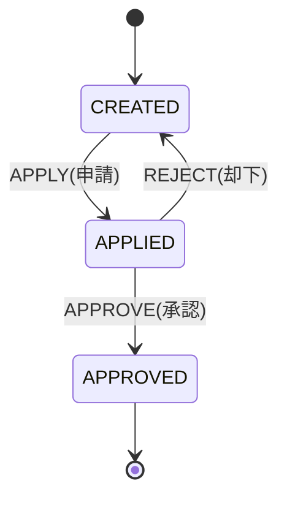
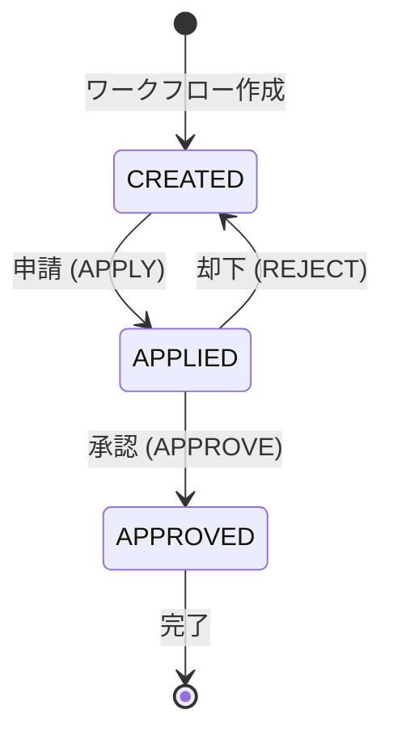

# 機能設計書

## 1. 概要

本ドキュメントは、Books Stock API - バックオフィス書籍在庫管理システムの機能詳細を定義する。

## 2. 機能一覧

### 2.1 認証機能

| 機能ID | 機能名 | 説明 |
|--------|--------|------|
| F-AUTH-001 | ログイン | 社員コードとパスワードで認証し、JWTトークンを発行 |
| F-AUTH-002 | ログアウト | JWTトークンを無効化 |
| F-AUTH-003 | ユーザー情報取得 | 現在ログイン中のユーザー情報を取得（未実装） |

### 2.2 書籍管理機能

| 機能ID | 機能名 | 説明 |
|--------|--------|------|
| F-BOOK-001 | 書籍一覧取得 | すべての書籍情報を取得 |
| F-BOOK-002 | 書籍詳細取得 | 指定した書籍IDの詳細情報を取得 |
| F-BOOK-003 | 書籍検索（JPQL） | カテゴリとキーワードで書籍を検索（静的クエリ） |
| F-BOOK-004 | 書籍検索（Criteria API） | カテゴリとキーワードで書籍を検索（動的クエリ） |
| F-BOOK-005 | カテゴリ一覧取得 | 書籍カテゴリのマップ形式一覧を取得 |

### 2.3 カテゴリ管理機能

| 機能ID | 機能名 | 説明 |
|--------|--------|------|
| F-CATEGORY-001 | カテゴリ一覧取得 | カテゴリの配列形式一覧を取得 |

### 2.4 出版社管理機能

| 機能ID | 機能名 | 説明 |
|--------|--------|------|
| F-PUBLISHER-001 | 出版社一覧取得 | 出版社の配列形式一覧を取得 |

### 2.5 在庫管理機能

| 機能ID | 機能名 | 説明 |
|--------|--------|------|
| F-STOCK-001 | 在庫一覧取得 | すべての在庫情報を取得 |
| F-STOCK-002 | 在庫情報取得 | 指定した書籍IDの在庫情報を取得 |
| F-STOCK-003 | 在庫更新 | 在庫数を更新（楽観的ロック対応） |

### 2.6 ワークフロー管理機能

| 機能ID | 機能名 | 説明 |
|--------|--------|------|
| F-WORKFLOW-001 | ワークフロー作成 | 新規ワークフローを作成（3種類） |
| F-WORKFLOW-002 | ワークフロー更新 | ワークフローを一時保存（CREATED状態のみ） |
| F-WORKFLOW-003 | ワークフロー申請 | ワークフローを申請（CREATED → APPLIED） |
| F-WORKFLOW-004 | ワークフロー承認 | ワークフローを承認（APPLIED → APPROVED） |
| F-WORKFLOW-005 | ワークフロー却下 | ワークフローを却下（APPLIED → CREATED） |
| F-WORKFLOW-006 | ワークフロー一覧取得 | ワークフローの一覧を取得（フィルタリング可） |
| F-WORKFLOW-007 | ワークフロー履歴取得 | 指定したワークフローの全操作履歴を取得 |
| F-WORKFLOW-008 | 書籍マスタ反映 | 承認されたワークフローの内容を書籍マスタに反映 |

## 3. 機能詳細設計

### 3.1 F-AUTH-001: ログイン

#### 3.1.1 機能概要

社員コードとパスワードによる認証を行い、成功時はJWTトークンを発行してHttpOnly Cookieに設定する。

#### 3.1.2 入力

* 社員コード（employeeCode）: String
* パスワード（password）: String

#### 3.1.3 処理フロー

1. リクエストから社員コードとパスワードを取得
2. 社員コードで社員情報をデータベースから検索
3. 社員が存在しない場合 → 401 Unauthorized
4. パスワード照合
   * ハッシュ化パスワード：ハッシュアルゴリズムで検証
   * 平文パスワード：文字列比較（開発環境のみ）
5. パスワードが一致しない場合 → 401 Unauthorized
6. JWT生成
   * Payload: employeeId, employeeCode, departmentId
   * 署名: HMAC-SHA256
   * 有効期限: 24時間
7. HttpOnly Cookieを生成
   * Cookie名: アプリケーション固有の名前
   * Value: JWT文字列
   * HttpOnly: true
   * Secure: 本番環境ではtrue
   * MaxAge: 24時間（秒単位）
8. レスポンス生成（社員情報 + Set-Cookie）

#### 3.1.4 出力

* 成功（200 OK）: LoginResponse + Set-Cookie
* 失敗（401 Unauthorized）: ErrorResponse
* エラー（500 Internal Server Error）: ErrorResponse

#### 3.1.5 関連コンポーネント

* 認証リソース（ログイン処理）
* 社員データアクセス（社員コード検索）
* JWTユーティリティ（トークン生成）
* パスワードハッシュ検証

### 3.2 F-AUTH-002: ログアウト

#### 3.2.1 機能概要

現在のJWTトークンを無効化する（Cookieを削除）。

#### 3.2.2 入力

なし

#### 3.2.3 処理フロー

1. HttpOnly Cookieを削除（MaxAge=0）
2. レスポンス生成（Set-Cookie）

#### 3.2.4 出力

* 成功（200 OK）: 空のレスポンス + Set-Cookie（削除用）

#### 3.2.5 関連コンポーネント

* 認証リソース（ログアウト処理）

### 3.3 F-BOOK-001: 書籍一覧取得

#### 3.3.1 機能概要

すべての書籍情報（在庫情報含む）を取得する。

#### 3.3.2 入力

なし

#### 3.3.3 処理フロー

1. BookServiceを呼び出し
2. BookDaoで全書籍を取得（JPQL）
3. BookエンティティをBookTOに変換
   * カテゴリ情報（CategoryInfo）
   * 出版社情報（PublisherInfo）
   * 在庫情報（quantity, version）
4. リスト形式でレスポンス生成

#### 3.3.4 出力

* 成功（200 OK）: BookTOのリスト

#### 3.3.5 関連コンポーネント

* 書籍リソース（書籍一覧取得）
* 書籍サービス（ビジネスロジック）
* 書籍データアクセス（全件取得）

### 3.4 F-BOOK-002: 書籍詳細取得

#### 3.4.1 機能概要

指定した書籍IDの詳細情報を取得する。

#### 3.4.2 入力

* 書籍ID（bookId）: Integer

#### 3.4.3 処理フロー

1. パスパラメータから書籍IDを取得
2. BookServiceを呼び出し
3. BookDaoで指定IDの書籍を取得
4. 書籍が存在しない場合 → 404 Not Found
5. BookエンティティをBookTOに変換
6. レスポンス生成

#### 3.4.4 出力

* 成功（200 OK）: BookTO
* 失敗（404 Not Found）: ErrorResponse

#### 3.4.5 関連コンポーネント

* 書籍リソース（書籍詳細取得）
* 書籍サービス（ビジネスロジック）
* 書籍データアクセス（ID検索）

### 3.5 F-BOOK-003: 書籍検索（JPQL）

#### 3.5.1 機能概要

カテゴリIDとキーワードで書籍を検索する（静的クエリ使用）。

#### 3.5.2 入力

* カテゴリID（categoryId）: Integer（オプション）
* キーワード（keyword）: String（オプション）

#### 3.5.3 処理フロー

1. クエリパラメータから検索条件を取得
2. 検索条件に応じてBookServiceのメソッドを呼び分け
   * カテゴリID + キーワード → `searchBook(categoryId, keyword)`
   * カテゴリIDのみ → `searchBook(categoryId)`
   * キーワードのみ → `searchBook(keyword)`
   * 条件なし → `getBooksAll()`
3. BookDaoでJPQLクエリ実行
4. BookエンティティをBookTOに変換
5. リスト形式でレスポンス生成

#### 3.5.4 出力

* 成功（200 OK）: BookTOのリスト

#### 3.5.5 関連コンポーネント

* 書籍リソース（書籍検索）
* 書籍サービス（検索ロジック）
* 書籍データアクセス（動的検索）

### 3.6 F-STOCK-003: 在庫更新

#### 3.6.1 機能概要

指定した書籍IDの在庫数を更新する。楽観的ロックで排他制御。

#### 3.6.2 入力

* 書籍ID（bookId）: Integer
* バージョン（version）: Long
* 在庫数（quantity）: Integer

#### 3.6.3 処理フロー

1. パスパラメータから書籍IDを取得
2. リクエストボディからバージョンと在庫数を取得
3. StockDaoで指定IDの在庫情報を取得
4. 在庫が存在しない場合 → 404 Not Found
5. バージョンチェック
   * 現在のバージョンとリクエストのバージョンが一致しない → 409 Conflict
6. 在庫数を更新
7. 楽観的ロックメカニズムによりバージョンが自動インクリメント
8. トランザクションコミット時にUPDATE実行
9. 更新後の在庫情報をレスポンス

#### 3.6.4 出力

* 成功（200 OK）: StockTO（更新後、versionがインクリメント）
* 失敗（404 Not Found）: ErrorResponse
* 失敗（409 Conflict）: ErrorResponse

#### 3.6.5 関連コンポーネント

* 在庫リソース（在庫更新）
* 在庫データアクセス（ID検索）
* 楽観的ロックメカニズム

### 3.7 F-WORKFLOW-001: ワークフロー作成

#### 3.7.1 機能概要

新規ワークフローを作成する。3種類のワークフロータイプに対応。

#### 3.7.2 入力

* 共通:
  * ワークフロータイプ（workflowType）: String
  * 作成者ID（createdBy）: Long
  * 申請理由（applyReason）: String

* ADD_NEW_BOOK:
  * 書籍名（bookName）: String
  * 著者（author）: String
  * 価格（price）: BigDecimal
  * 画像URL（imageUrl）: String
  * カテゴリID（categoryId）: Integer
  * 出版社ID（publisherId）: Integer

* REMOVE_BOOK:
  * 書籍ID（bookId）: Integer

* ADJUST_BOOK_PRICE:
  * 書籍ID（bookId）: Integer
  * 価格（price）: BigDecimal
  * 適用開始日（startDate）: LocalDate
  * 適用終了日（endDate）: LocalDate

#### 3.7.3 処理フロー

1. リクエストボディから入力データを取得
2. 作成者の存在チェック（EmployeeDao）
3. ワークフロータイプのバリデーション
4. 次のワークフローIDを採番（WorkflowDao）
5. Workflowエンティティを生成
   * WORKFLOW_ID: 採番したID
   * STATE: CREATED
   * OPERATION_TYPE: CREATE
   * OPERATED_AT: 現在日時
   * OPERATED_BY: 作成者ID
6. ワークフロータイプごとの項目設定
7. WorkflowDaoでINSERT
8. WorkflowエンティティをWorkflowTOに変換
9. レスポンス生成（201 Created）

#### 3.7.4 出力

* 成功（201 Created）: WorkflowTO
* 失敗（400 Bad Request）: ErrorResponse
* エラー（500 Internal Server Error）: ErrorResponse

#### 3.7.5 関連コンポーネント

* ワークフローリソース（ワークフロー作成）
* ワークフローサービス（ビジネスロジック）
* ワークフローデータアクセス（ID採番、挿入）
* 社員データアクセス（ID検索）

### 3.8 F-WORKFLOW-002: ワークフロー更新

#### 3.8.1 機能概要

作成済み（CREATED状態）のワークフローを一時保存する。

#### 3.8.2 入力

* ワークフローID（workflowId）: Long
* 更新者ID（updatedBy）: Long
* 更新内容（ワークフロータイプによって異なる）

#### 3.8.3 処理フロー

1. パスパラメータからワークフローIDを取得
2. 最新の状態を取得（WorkflowDao）
3. ワークフローが存在しない場合 → 404 Not Found
4. 状態チェック：CREATEDでない場合 → 400 Bad Request
5. 更新者の存在チェック（EmployeeDao）
6. 既存のCREATEレコードを直接更新
   * 操作日時のみ更新（操作者は作成者のまま）
   * ワークフロータイプごとの項目を更新
7. EntityManagerのflushで即座に反映
8. WorkflowエンティティをWorkflowTOに変換
9. レスポンス生成

#### 3.8.4 出力

* 成功（200 OK）: WorkflowTO
* 失敗（400 Bad Request）: ErrorResponse
* 失敗（404 Not Found）: ErrorResponse

#### 3.8.5 関連コンポーネント

* ワークフローリソース（ワークフロー更新）
* ワークフローサービス（ビジネスロジック）
* ワークフローデータアクセス（最新レコード取得）
* 永続化メカニズム（即時反映）

### 3.9 F-WORKFLOW-004: ワークフロー承認

#### 3.9.1 機能概要

申請済み（APPLIED状態）のワークフローを承認し、書籍マスタに反映する。

#### 3.9.2 入力

* ワークフローID（workflowId）: Long
* 操作者ID（operatedBy）: Long
* 操作理由（operationReason）: String（オプション）

#### 3.9.3 処理フロー

1. パスパラメータからワークフローIDを取得
2. 最新の状態を取得（WorkflowDao）
3. ワークフローが存在しない場合 → 404 Not Found
4. 状態チェック：APPLIEDでない場合 → 400 Bad Request
5. 承認権限チェック
   * 承認者の取得（EmployeeDao）
   * 職務ランクチェック：MANAGER以上（JobRankType）
   * 部署チェック：
     * DIRECTOR → 全部署OK
     * MANAGER → 同一部署のみ
   * 権限不足の場合 → 403 Forbidden
6. 新しい操作履歴を作成
   * STATE: APPROVED
   * OPERATION_TYPE: APPROVE
   * OPERATED_AT: 現在日時
   * OPERATED_BY: 承認者ID
   * その他のフィールドは最新の状態からコピー
7. WorkflowDaoでINSERT
8. 書籍マスタへの反映処理
   * ADD_NEW_BOOK → Book + Stock INSERT
   * REMOVE_BOOK → Book論理削除（DELETED=true）
   * ADJUST_BOOK_PRICE → Book価格UPDATE
9. トランザクションコミット（ワークフロー履歴 + 書籍マスタ更新）
10. WorkflowエンティティをWorkflowTOに変換
11. レスポンス生成

#### 3.9.4 出力

* 成功（200 OK）: WorkflowTO
* 失敗（400 Bad Request）: ErrorResponse
* 失敗（403 Forbidden）: ErrorResponse
* 失敗（404 Not Found）: ErrorResponse

#### 3.9.5 関連コンポーネント

* ワークフローリソース（ワークフロー承認）
* ワークフローサービス（承認ロジック）
* ワークフローサービス（承認権限チェック）
* ワークフローサービス（書籍マスタ反映）
* ワークフローデータアクセス（最新レコード取得、挿入）
* 書籍データアクセス（ID検索）
* 永続化メカニズム

### 3.10 F-WORKFLOW-008: 書籍マスタ反映

#### 3.10.1 機能概要

承認されたワークフローの内容を書籍マスタ（BOOK, STOCK）に反映する。

#### 3.10.2 入力

* Workflowエンティティ（APPROVED状態）

#### 3.10.3 処理フロー

* ADD_NEW_BOOK（新規書籍追加）:
  1. 新しいBookエンティティを作成
  2. ワークフローから項目を設定
   * bookName, author, price, imageUrl
   * category（データベースから取得）
   * publisher（データベースから取得）
   * deleted: false
3. 在庫情報も設定（書籍と在庫の結合）
   * quantity: 0
   * version: 0
4. 永続化してINSERT
5. BOOK_IDを取得

* REMOVE_BOOK（既存書籍削除）:
  1. BookDaoで対象書籍を取得
  2. 書籍が存在する場合
  3. deletedフラグをtrueに設定
  4. トランザクションコミット時にUPDATE

* ADJUST_BOOK_PRICE（価格改定）:
  1. BookDaoで対象書籍を取得
  2. 書籍が存在する場合
  3. priceフィールドを更新
  4. トランザクションコミット時にUPDATE

#### 3.10.4 出力

なし（副作用としてデータベースを更新）

#### 3.10.5 関連コンポーネント

* ワークフローサービス（書籍マスタ反映処理）
* 書籍データアクセス（ID検索）
* 永続化メカニズム

## 4. ビジネスルール

### 4.1 認証・認可ルール

#### BR-AUTH-001: パスワード照合

* ハッシュ化パスワード：ハッシュアルゴリズムで検証
* 平文パスワード：文字列比較（開発環境のみ、本番環境では非推奨）

#### BR-AUTH-002: JWT有効期限

* デフォルト：24時間
* 設定により変更可能

### 4.2 ワークフロールール

#### BR-WORKFLOW-001: ワークフロー状態遷移

* CREATED: 作成・更新可能、申請可能
* APPLIED: 承認・却下可能
* APPROVED: 終了状態（変更不可）
* REJECTED: CREATEDに戻る

#### BR-WORKFLOW-002: 承認権限

* ASSOCIATE（JOB_RANK=1）: 承認不可
* MANAGER（JOB_RANK=2）: 同一部署のワークフローのみ承認可
* DIRECTOR（JOB_RANK=3）: 全部署のワークフロー承認可

#### BR-WORKFLOW-003: 更新権限

* CREATEDのワークフローのみ更新可能
* 作成者本人のみ更新可能（実装上は制限なし、UI側で制御想定）

#### BR-WORKFLOW-004: 閲覧権限

* CREATED: 作成者本人のみ閲覧可
* APPLIED: 作成者本人 + 承認権限がある人
* APPROVED: すべての社員

### 4.3 在庫管理ルール

#### BR-STOCK-001: 楽観的ロック

* 在庫更新時はバージョン番号を必ず指定
* バージョンが一致しない場合は409 Conflictを返す
* クライアント側で再取得して再試行

#### BR-STOCK-002: 在庫数の範囲

* 0以上の整数
* 負の値は許可しない

### 4.4 書籍管理ルール

#### BR-BOOK-001: 論理削除

* 書籍の削除は論理削除（DELETEDフラグ）で実施
* 論理削除された書籍はAPIレスポンス（一覧・検索）から除外される
* 書籍詳細取得APIでは論理削除された書籍も参照可能
* 物理削除は実施しない（データ保持・履歴保持のため）

#### BR-BOOK-002: 新規書籍の初期在庫

* ワークフロー承認時の新規書籍追加では在庫数を0で作成
* 在庫数は別途在庫更新APIで変更

## 5. バリデーションルール

### 5.1 共通バリデーション

* 必須項目チェック：NULL不可、空白不可
* 文字列長チェック：最小長、最大長
* 数値範囲チェック：最小値、最大値
* 形式チェック：パターンマッチング、メール形式

### 5.2 個別バリデーション

#### LoginRequest

* `employeeCode`: 必須、20文字以内
* `password`: 必須、100文字以内

#### StockUpdateRequest

* `version`: 必須
* `quantity`: 必須、0以上

#### WorkflowCreateRequest

* `workflowType`: 必須、列挙型
* `createdBy`: 必須
* `applyReason`: オプション、500文字以内
* ワークフロータイプごとの追加バリデーション

## 6. エラーハンドリング

### 6.1 例外マッピング

| 例外クラス | HTTPステータス | メッセージ |
|-----------|---------------|-----------|
| `IllegalArgumentException` | 400 Bad Request | 引数が不正です |
| リソース未検出例外 | 404 Not Found | リソースが見つかりません |
| 楽観的ロック例外 | 409 Conflict | 他のユーザーによって更新されました |
| ワークフロー未検出例外 | 404 Not Found | ワークフローが見つかりません |
| `InvalidWorkflowStateException` | 400 Bad Request | 状態が不正です |
| `UnauthorizedApprovalException` | 403 Forbidden | 承認権限がありません |
| その他の例外 | 500 Internal Server Error | 内部エラーが発生しました |

## 7. トランザクション管理

### 7.1 トランザクション境界

* サービスレイヤーでトランザクション境界を定義
* デフォルト：既存トランザクションがあれば参加、なければ新規作成
* 例外発生時は自動ロールバック

### 7.2 重要なトランザクション処理

#### ワークフロー承認

* 以下を1トランザクションで実行:
  1. ワークフロー操作履歴の追加
  2. 書籍マスタへの反映

どちらか一方が失敗した場合、両方ともロールバックされる。

#### 在庫更新

1. 在庫情報の取得
2. バージョンチェック
3. 在庫数の更新
4. コミット時にバージョンが再チェックされる

## 8. パフォーマンス考慮事項

### 8.1 N+1問題の回避

* 書籍エンティティは在庫と結合して取得
* 関連エンティティは必要に応じて結合取得

### 8.2 インデックスの活用

* 検索条件に使用されるカラムにインデックスを作成
* 外部キーカラムにもインデックスを作成

## 9. セキュリティ考慮事項

### 9.1 認証トークン

* JWTはHttpOnly Cookieで保持
* JavaScriptからアクセス不可（XSS対策）

### 9.2 パスワード保護

* BCryptでハッシュ化（不可逆変換）
* ソルト自動生成

### 9.3 権限制御

* 職務ランクによる操作制限
* 部署による閲覧・承認制限

## 10. 拡張性

### 10.1 将来の機能拡張

* JWT認証フィルタの実装
* メール通知機能
* バッチ処理（価格改定の自動適用）
* 監査ログの強化
* ファイルアップロード（書籍画像）

### 10.2 外部連携

* 在庫管理システムとの連携
* 会計システムとの連携
* 通知サービスとの連携

---

## 11. 動的振る舞い

### 11.1 ワークフロー全体像

