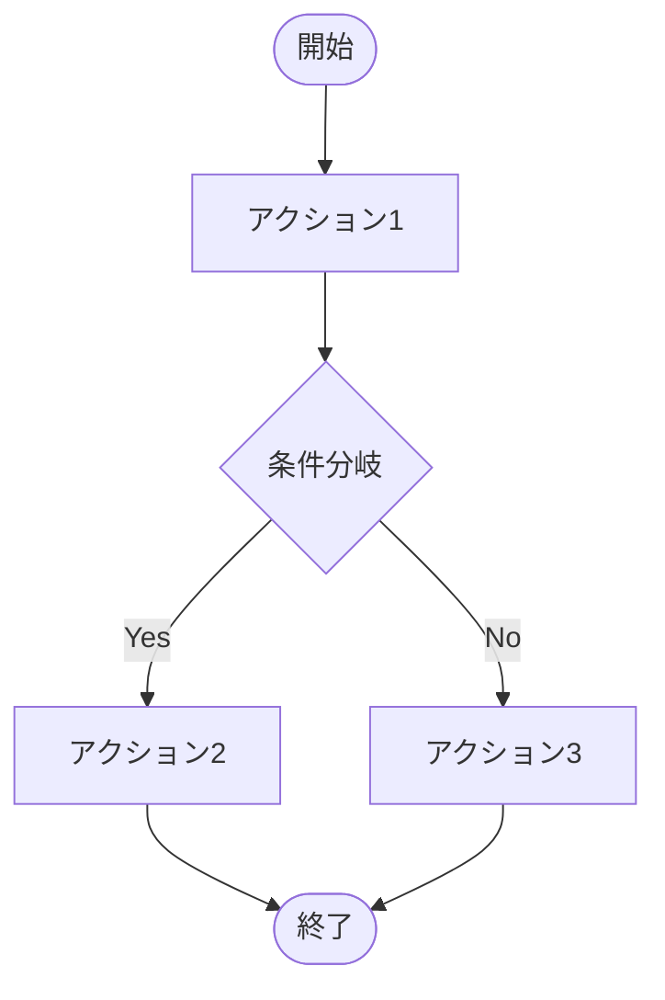
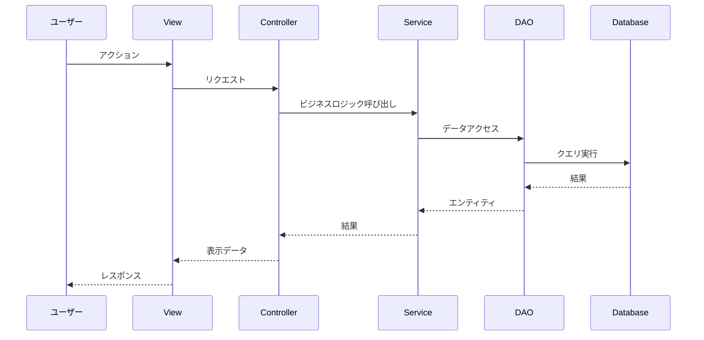
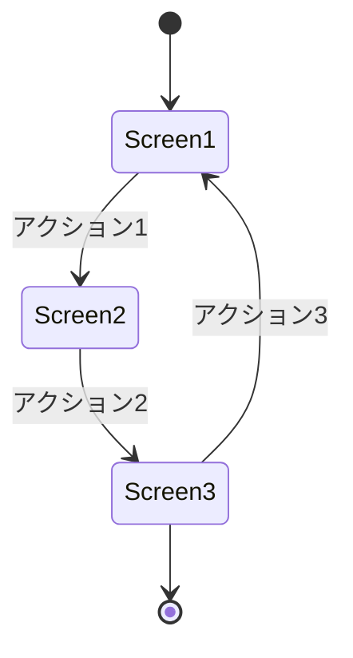
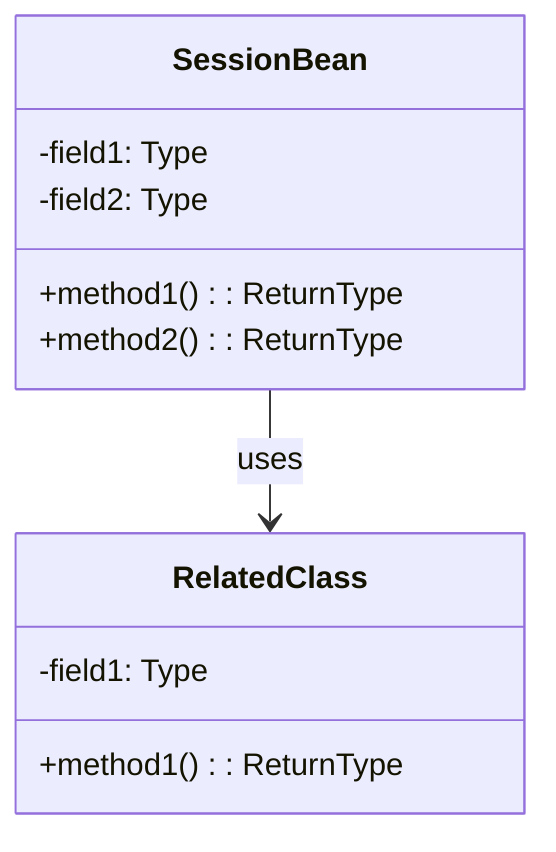
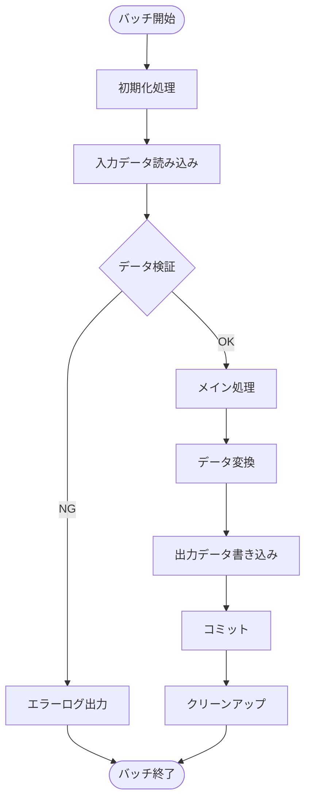

# [PROJECT_NAME] - 機能設計書

**プロジェクトID:** [PROJECT_ID]  
**バージョン:** 1.0.0  
**最終更新日:** [DATE]  
**ステータス:** [STATUS]

---

## 1. 概要

本文書は、[PROJECT_NAME]システムの各機能の詳細設計を記述する。各機能について、ユーザーストーリー、ビジネスルール、ユーザーフロー、データフロー、画面遷移、例外・エラー処理を定義する。

---

## 2. 機能詳細設計

### 2.1 機能 [FEATURE_ID_1]: [FEATURE_NAME_1]

#### 2.1.1 ユーザーストーリー

```
As a [USER_ROLE]
I want to [ACTION]
So that [BENEFIT]
```

#### 2.1.2 ビジネスルール

| ルールID | 説明 |
|---------|-------------|
| BR-[XXX] | [ビジネスルールの説明] |
| BR-[XXX] | [ビジネスルールの説明] |

#### 2.1.3 機能フロー

[フロー名1]::
1. [ステップ1]
2. [ステップ2]
3. [ステップ3]

[フロー名2]::
1. [ステップ1]
2. [ステップ2]

#### 2.1.4 受入基準

詳細は [behaviors.md](behaviors.md#[ANCHOR]) を参照

---

### 2.2 機能 [FEATURE_ID_2]: [FEATURE_NAME_2]

[必要に応じて機能を追加]

---

## 3. ユーザーフロー

### 3.1 メインユーザーフロー



### 3.2 [サブフロー名]

[必要に応じて追加のフローを記述]

---

## 4. データフロー

### 4.1 [操作名] - シーケンス図



---

## 5. 画面遷移

### 5.1 画面遷移図



### 5.2 画面一覧

| 画面ID | 画面名 | ファイル名 | 認証要否 | 説明 |
|--------|--------|----------|---------|------|
| [ID_1] | [NAME] | [FILE] | [YES/NO] | [DESCRIPTION] |
| [ID_2] | [NAME] | [FILE] | [YES/NO] | [DESCRIPTION] |

### 5.3 ナビゲーションルール

| 遷移元 | イベント | 遷移先 | 条件 |
|--------|---------|--------|------|
| [FROM] | [EVENT] | [TO] | [CONDITION] |
| [FROM] | [EVENT] | [TO] | [CONDITION] |

---

## 6. 例外・エラー処理

### 6.1 データ整合性

| シナリオ | 期待される動作 |
|---------|--------------|
| [SCENARIO] | [EXPECTED_BEHAVIOR] |
| [SCENARIO] | [EXPECTED_BEHAVIOR] |

### 6.2 認証・セッション

| シナリオ | 期待される動作 |
|---------|--------------|
| [SCENARIO] | [EXPECTED_BEHAVIOR] |
| [SCENARIO] | [EXPECTED_BEHAVIOR] |

### 6.3 ユーザー操作

| シナリオ | 期待される動作 |
|---------|--------------|
| [SCENARIO] | [EXPECTED_BEHAVIOR] |
| [SCENARIO] | [EXPECTED_BEHAVIOR] |

### 6.4 入力検証

| シナリオ | 期待される動作 |
|---------|--------------|
| [SCENARIO] | [EXPECTED_BEHAVIOR] |
| [SCENARIO] | [EXPECTED_BEHAVIOR] |

---

## 7. エラーメッセージ一覧

### 7.1 検証エラー

| エラーコード | メッセージ | 発生条件 |
|------------|----------|---------|
| [CODE] | [MESSAGE] | [CONDITION] |
| [CODE] | [MESSAGE] | [CONDITION] |

### 7.2 ビジネスエラー

| エラーコード | メッセージ | 発生条件 |
|------------|----------|---------|
| [CODE] | [MESSAGE] | [CONDITION] |
| [CODE] | [MESSAGE] | [CONDITION] |

### 7.3 システムエラー

| エラーコード | メッセージ | 発生条件 |
|------------|----------|---------|
| [CODE] | [MESSAGE] | [CONDITION] |
| [CODE] | [MESSAGE] | [CONDITION] |

---

## 8. クラス設計

### 8.1 主要クラスの責務

#### 8.1.1 共通レイヤー

クラス: [CLASS_NAME]:
* **責務:** [RESPONSIBILITY]
* **タイプ:** [TYPE] (例: Enum, Utility, etc.)
* **主要フィールド:**
  - `[field1]`: [DESCRIPTION]
  - `[field2]`: [DESCRIPTION]
* **主要メソッド:**
  - `[method1]([params])`: [DESCRIPTION]
  - `[method2]([params])`: [DESCRIPTION]

#### 8.1.2 プレゼンテーションレイヤー

クラス: [CLASS_NAME]:
* **責務:** [RESPONSIBILITY]
* **タイプ:** @[SCOPE] Managed Bean
* **主要フィールド:**
  - `[field1]`: [DESCRIPTION]
  - `[field2]`: [DESCRIPTION]
* **主要メソッド:**
  - `[method1]()`: [DESCRIPTION]
  - `[method2]()`: [DESCRIPTION]

#### 8.1.3 サービスレイヤー

クラス: [CLASS_NAME]:
* **責務:** [RESPONSIBILITY]
* **タイプ:** @ApplicationScoped Service
* **主要フィールド:**
  - `[field1]`: [DESCRIPTION]
* **主要メソッド:**
  - `[method1]([params])`: [DESCRIPTION]
  - `[method2]([params])`: [DESCRIPTION]

#### 8.1.4 DAOレイヤー

クラス: [CLASS_NAME]:
* **責務:** [RESPONSIBILITY]
* **タイプ:** @ApplicationScoped DAO
* **主要フィールド:**
  - `EntityManager em`
* **主要メソッド:**
  - `[method1]([params])`: [DESCRIPTION]
  - `[method2]([params])`: [DESCRIPTION]

### 8.2 セッション状態設計



セッションスコープBeanの説明::
* [BEAN_NAME]: [DESCRIPTION]
  - フィールド: [FIELDS]
  - ライフサイクル: [LIFECYCLE]

---

## 9. バッチ処理

### 9.1 バッチ処理一覧

| バッチID | バッチ名 | 実行タイミング | 目的 | 優先度 |
|---------|---------|-------------|------|-------|
| [BATCH_ID_1] | [BATCH_NAME] | [SCHEDULE] | [PURPOSE] | [PRIORITY] |
| [BATCH_ID_2] | [BATCH_NAME] | [SCHEDULE] | [PURPOSE] | [PRIORITY] |

**注意:** バッチ処理の要件がない場合は、このセクションを「該当なし」として残す。

### 9.2 バッチ詳細設計

#### 9.2.1 バッチ [BATCH_ID_1]: [BATCH_NAME]

概要::
[バッチの目的と概要を記述]

実行タイミング::
* **スケジュール:** [CRON_EXPRESSION] (例: 毎日午前2時)
* **トリガー:** [TRIGGER_TYPE] (例: 定時実行、イベント駆動、手動実行)
* **実行時間見積もり:** [ESTIMATED_TIME]

入力データ::
* **データソース:** [SOURCE] (例: データベーステーブル、外部ファイル、API)
* **入力形式:** [FORMAT] (例: CSV、JSON、XML)
* **入力条件:** [CONDITIONS] (例: 前日分のデータ、未処理フラグのレコード)

出力データ::
* **出力先:** [DESTINATION] (例: データベーステーブル、外部ファイル、API)
* **出力形式:** [FORMAT]
* **出力内容:** [CONTENT]

処理フロー::



処理ステップ::
1. **初期化処理**
   - バッチ実行ログを記録
   - 前回実行状態をチェック
   - 必要なリソースを確保

2. **入力データ読み込み**
   - [データ取得ロジック]
   - [フィルタリング条件]

3. **データ検証**
   - [検証ルール]
   - エラー時の処理

4. **メイン処理**
   - [ビジネスロジック]
   - トランザクション境界

5. **出力データ書き込み**
   - [出力ロジック]
   - コミット単位

6. **クリーンアップ**
   - 一時ファイル削除
   - リソース解放

ビジネスルール::
| ルールID | 説明 |
|---------|------|
| BR-[XXX] | [ルール説明] |
| BR-[XXX] | [ルール説明] |

エラーハンドリング::
* **エラー分類:**
  - **致命的エラー:** バッチを即座に停止（例: DB接続エラー、ファイル破損）
  - **警告エラー:** 該当データをスキップして続行（例: データ検証エラー）
  - **リトライ可能エラー:** 再試行後に判断（例: 一時的なネットワークエラー）

* **エラー時の動作:**
  - エラーログをファイルまたはデータベースに記録
  - 管理者に通知（メール、監視ツール）
  - ロールバック処理を実行

リトライポリシー::
* **リトライ対象:** [リトライ対象のエラー種別]
* **リトライ回数:** [MAX_RETRY_COUNT] 回
* **リトライ間隔:** [RETRY_INTERVAL] (例: 5秒、指数バックオフ)
* **リトライ失敗時:** [FALLBACK_ACTION]

タイムアウト設定::
* **処理タイムアウト:** [TIMEOUT_DURATION] (例: 60分)
* **タイムアウト時の動作:** [ACTION] (例: ロールバック、部分コミット)

トランザクション戦略::
* **トランザクション境界:** [SCOPE] (例: バッチ全体、チャンク単位)
* **チャンクサイズ:** [CHUNK_SIZE] (例: 1000件ごとにコミット)
* **分離レベル:** [ISOLATION_LEVEL]

監視・ログ::
* **実行ログ:**
  - バッチ開始時刻
  - バッチ終了時刻
  - 処理件数（成功/失敗）
  - エラー詳細
  
* **パフォーマンスメトリクス:**
  - 処理時間
  - スループット（件/秒）
  - メモリ使用量

* **アラート条件:**
  - 処理時間が閾値を超過
  - エラー率が閾値を超過
  - バッチ実行失敗

並行実行制御::
* **多重起動制御:** [POLICY] (例: ロックファイル、データベースフラグ)
* **依存関係:** [DEPENDENCIES] (例: バッチAの完了後に実行)

テスト観点::
* 正常系: 想定データでの正常処理
* 異常系: データ不正、リソース不足、タイムアウト
* 境界値: 最小/最大データ量、空データ
* 並行実行: 多重起動の防止確認

---

