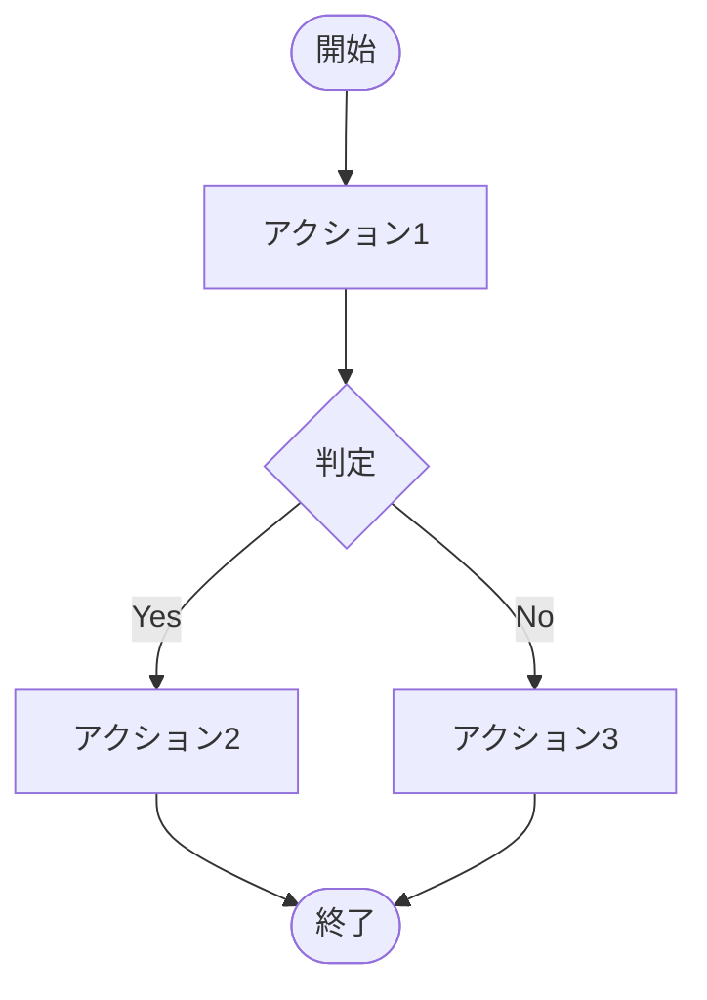

# [PROJECT_NAME] - 要件定義書

プロジェクトID: [PROJECT_ID]  
バージョン: 1.0.0  
最終更新日: [DATE]  
ステータス: [STATUS]

---

## 1. プロジェクト概要

### 1.1 構築するもの

[何を構築するかの簡潔な説明。システムの目的と主要な機能を1-2段落で記述する。]

### 1.2 プロジェクトの目的

[なぜこのシステムを構築するのか。ビジネス的な背景と目的を記述する。]

---

## 2. ビジネス目標と成功指標

### 2.1 ビジネス目標

| 目標 | 説明 |
|------|------|
| [目標1] | [説明1] |
| [目標2] | [説明2] |
| [目標3] | [説明3] |

### 2.2 成功指標

| 指標 | 目標値 |
|------|--------|
| [指標1] | [目標値1] |
| [指標2] | [目標値2] |
| [指標3] | [目標値3] |

---

## 3. ユーザーペルソナ

### 3.1 [ペルソナ名1]

* プロフィール:
  * 年齢: [年齢層]
  * 目的: [主な利用目的]
  * デバイス: [使用デバイス]
  * 技術レベル: [技術レベルの説明]

* ニーズ:
  * [ニーズ1]
  * [ニーズ2]
  * [ニーズ3]

* 課題:
  * [課題1]
  * [課題2]
  * [課題3]

### 3.2 [ペルソナ名2]

[必要に応じて追加のペルソナを記述]

---

## 4. 対象業務・対象外業務

### 4.1 対象業務

本システムが対象とする業務範囲を以下に示す。

#### 4.1.1 [業務名1]
* [業務内容1]
* [業務内容2]
* [業務内容3]

#### 4.1.2 [業務名2]
* [業務内容1]
* [業務内容2]

### 4.2 対象外業務

以下の業務は本システムの対象外である。

#### 4.2.1 [対象外業務名1]
* [対象外の理由や内容]

#### 4.2.2 [対象外業務名2]
* [対象外の理由や内容]

---

## 5. 業務フロー

### 5.1 [業務フロー名1]



アクター: [誰が]  
トリガー: [いつ、何をきっかけに]  
前提条件: [前提条件]  
事後条件: [事後条件]

### 5.2 [業務フロー名2]

[必要に応じて業務フローを追加]

---

## 6. 機能一覧

### 6.1 機能体系

本システムは、以下の機能で構成される。

| 機能ID | 機能名 | 概要 | 優先度 |
|--------|--------|------|--------|
| F-001 | [機能名1] | [概要1] | 高 |
| F-002 | [機能名2] | [概要2] | 高 |
| F-003 | [機能名3] | [概要3] | 中 |

### 6.2 機能詳細

#### 機能 F-001: [機能名1]

* 概要:
[機能の簡潔な説明]

* 主要機能:
  * [サブ機能1]
  * [サブ機能2]
  * [サブ機能3]

* 対象画面:
  * SC-001: [画面名1]
  * SC-002: [画面名2]

詳細設計: [functional_design.md](functional_design.md#[セクション])

#### 機能 F-002: [機能名2]

[必要に応じて機能を追加]

---

## 7. 画面一覧

### 7.1 画面体系

本システムは、以下の画面で構成される。

| 画面ID | 画面名 | 認証要否 | 機能ID | 備考 |
|--------|--------|---------|--------|------|
| SC-001 | [画面名1] | 不要 | F-001 | [備考] |
| SC-002 | [画面名2] | 必要 | F-002 | [備考] |
| SC-003 | [画面名3] | 必要 | F-002 | [備考] |

注記: 詳細なファイル名やクラス名は実装段階の設計書を参照すること。

### 7.2 画面遷移図

```mermaid
graph TD
    SC001[SC-001<br/>[画面名1]] --> SC002[SC-002<br/>[画面名2]]
    SC002 --> SC003[SC-003<br/>[画面名3]]
    SC003 --> SC001
```

### 7.3 画面仕様

各画面の詳細な画面仕様は [screen_design.md](screen_design.md) を参照。

---

## 8. 帳票一覧

本システムでは、帳票出力機能は提供しない。

* 対象外となる帳票:
  * [帳票名1]
  * [帳票名2]
  * [帳票名3]

* 理由:
[対象外とした理由]

---

## 9. 外部インターフェース仕様書

本システムでは、外部システムとの連携は行わない。

### 9.1 対象外の外部連携

| 連携先 | 連携内容 | 対象外とした理由 |
|--------|---------|----------------|
| [連携先1] | [連携内容1] | [理由1] |
| [連携先2] | [連携内容2] | [理由2] |
| [連携先3] | [連携内容3] | [理由3] |

### 9.2 将来的な拡張候補

将来リリースで以下の外部連携を実装する予定である：

1. [連携先1]
   * [連携内容や目的]

2. [連携先2]
   * [連携内容や目的]

詳細は [external_interface.md](external_interface.md) を参照。

---

## 10. 非機能要件

### 10.1 パフォーマンス要件

| 項目 | 要件 |
|------|------|
| [項目1] | [要件1] |
| [項目2] | [要件2] |
| [項目3] | [要件3] |

### 10.2 ユーザビリティ要件

| 要件 | 説明 |
|------|------|
| [要件1] | [説明1] |
| [要件2] | [説明2] |

### 10.3 セキュリティ要件

| 要件 | 説明 |
|------|------|
| [要件1] | [説明1] |
| [要件2] | [説明2] |
| [要件3] | [説明3] |

* 公開ページ（認証不要）:
  * SC-001: [画面名1]
  * SC-002: [画面名2]

### 10.4 信頼性要件

| 要件 | 説明 |
|------|------|
| [要件1] | [説明1] |
| [要件2] | [説明2] |

---

## 11. 前提条件・制約事項

### 11.1 前提条件

#### 11.1.1 ビジネス前提

| 項目 | 内容 |
|------|------|
| プロジェクトの目的 | [目的] |
| 運用環境 | [環境] |
| サービス提供時間 | [時間] |
| 対象顧客 | [顧客] |

#### 11.1.2 技術前提

| 項目 | 内容 |
|------|------|
| 実行環境 | [環境] |
| データベース | [DB] |
| ブラウザ | [ブラウザ] |

#### 11.1.3 データ前提

| 項目 | 内容 |
|------|------|
| [マスタ名1] | [説明1] |
| [マスタ名2] | [説明2] |
| 同時アクセスユーザー数 | [想定数] |

#### 11.1.4 セキュリティ前提

| 項目 | 内容 |
|------|------|
| パスワード保存方式 | [方式] |
| セッションタイムアウト | [時間] |
| 通信プロトコル | [プロトコル] |

### 11.2 制約事項

#### 11.2.1 技術的制約

| 制約 | 内容 | 理由 |
|------|------|------|
| [制約1] | [内容1] | [理由1] |
| [制約2] | [内容2] | [理由2] |

#### 11.2.2 機能的制約

| 制約 | 内容 | 理由 |
|------|------|------|
| [制約1] | [内容1] | [理由1] |
| [制約2] | [内容2] | [理由2] |

#### 11.2.3 運用制約

| 制約 | 内容 | 理由 |
|------|------|------|
| [制約1] | [内容1] | [理由1] |
| [制約2] | [内容2] | [理由2] |

#### 11.2.4 ビジネス制約

| 制約 | 内容 |
|------|------|
| [制約1] | [内容1] |
| [制約2] | [内容2] |

---

## 12. 成功基準

本プロジェクトが成功したと判断される条件：

### 12.1 機能要件の充足

* [ ] 全機能が実装されている
* [ ] 全画面が実装されている
* [ ] 全てのユーザーストーリーが実装され、受入基準を満たす
* [ ] 全てのビジネスルールが実装されている

### 12.2 非機能要件の充足

* [ ] パフォーマンス要件を満たしている
* [ ] ユーザビリティ要件を満たしている
* [ ] セキュリティ要件を満たしている
* [ ] 信頼性要件を満たしている

### 12.3 品質要件の充足

* [ ] 全てのエラーシナリオが適切に処理される
* [ ] 全エラーメッセージが実装されている
* [ ] 主要機能のテストが完了している

### 12.4 ドキュメント要件の充足

* [ ] 要件定義書（requirements.md）が完成している
* [ ] 振る舞い仕様書（behaviors.md）が完成している
* [ ] 機能設計書（functional_design.md）が完成している
* [ ] アーキテクチャ設計書（architecture_design.md）が完成している
* [ ] データモデル仕様書（data_model.md）が完成している
* [ ] 画面仕様書（screen_design.md）が完成している
* [ ] 外部インターフェース仕様書（external_interface.md）が完成している

### 12.5 技術要件の充足

* [ ] [技術要件1]
* [ ] [技術要件2]
* [ ] [技術要件3]

---

## 参考資料

本要件定義書に関連する詳細ドキュメント：

* [behaviors.md](behaviors.md) - 振る舞い仕様書（受入基準）
* [functional_design.md](functional_design.md) - 機能設計書（フロー・UI）
* [architecture_design.md](architecture_design.md) - アーキテクチャ設計書
* [data_model.md](data_model.md) - データモデル仕様書
* [screen_design.md](screen_design.md) - 画面仕様書
* [external_interface.md](external_interface.md) - 外部インターフェース仕様書
* [tasks.md](tasks.md) - 実装タスク

