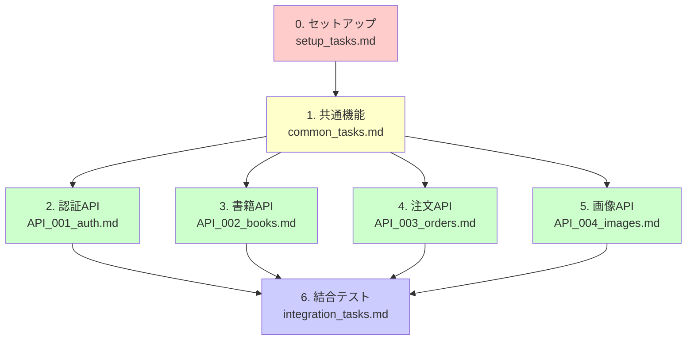

# berry-books-api - 実装タスクリスト

**プロジェクト名**: berry-books-api REST API  
**バージョン**: 2.0.0  
**最終更新日**: 2025-12-27

---

## 全体構成と担当割り当て

### タスク概要

| タスク | タスクファイル | 担当者 | 並行実行 | 想定工数 |
|---------|--------------|--------|---------|---------|
| 0. セットアップ | setup_tasks.md | 全員 | 不可 | 2時間 |
| 1. 共通機能 | common_tasks.md | 共通機能チーム | 一部可能 | 8時間 |
| 2. 認証API | API_001_auth.md | 担当者A | 可能 | 6時間 |
| 3. 書籍API | API_002_books.md | 担当者B | 可能 | 5時間 |
| 4. 注文API | API_003_orders.md | 担当者C | 可能 | 7時間 |
| 5. 画像API | API_004_images.md | 担当者D | 可能 | 2時間 |
| 6. 結合テスト | integration_tasks.md | 全員 | 一部可能 | 6時間 |

**合計想定工数**: 36時間（並行実行により大幅に短縮可能）

---

## 実行順序

### フェーズ1: セットアップ（全員で実行）
1. タスク0: セットアップ（全員が実行前に1回だけ）

### フェーズ2: 共通機能実装（共通機能チームが実装）
2. タスク1: 共通機能（Entity、共通Service、JWT認証基盤、共通DTO等）

### フェーズ3: API別実装（各担当者が並行実行） ← **ここが並行化のポイント**
3. タスク2～5: API別実装
   - API_001_auth（認証API）
   - API_002_books（書籍API）
   - API_003_orders（注文API）
   - API_004_images（画像API）

### フェーズ4: 結合テスト（全員で実施）
4. タスク6: 結合テスト（API間結合、E2Eテスト、パフォーマンステスト等）

---

## タスクファイル一覧

- [セットアップタスク](setup_tasks.md)
- [共通機能タスク](common_tasks.md)
- [認証APIのタスク](API_001_auth.md)
- [書籍APIのタスク](API_002_books.md)
- [注文APIのタスク](API_003_orders.md)
- [画像APIのタスク](API_004_images.md)
- [結合テストタスク](integration_tasks.md)

---

## 依存関係図

---

## 並行実行の推奨

以下のタスクは並行実行可能です：

### フェーズ3: API別実装（同時並行実行可能）

| API | タスクファイル | 担当者 | 独立性 |
|-----|--------------|--------|--------|
| 認証API | API_001_auth.md | 担当者A | 外部API連携あり |
| 書籍API | API_002_books.md | 担当者B | 完全独立 |
| 注文API | API_003_orders.md | 担当者C | 完全独立 |
| 画像API | API_004_images.md | 担当者D | 完全独立 |

**注意事項:**
- 各APIは共通機能（Entity、共通Service、JWT認証基盤）に依存
- 共通機能の実装完了後に、各APIの実装を開始してください

---

## 開発環境要件

| 項目 | 要件 |
|------|------|
| JDK | 21以上 |
| Jakarta EE | 10 |
| アプリケーションサーバー | Payara Server 6.x |
| データベース | HSQLDB 2.7.x |
| ビルドツール | Gradle 8.x |

---

## 品質基準（憲章より）

### テストカバレッジ基準
- サービス層のユニットテストカバレッジ: **80%以上**
- 主要APIのE2Eテスト: **完了**

### パフォーマンス基準
- APIレスポンスタイム: **500ms以内**（95パーセンタイル）
- スループット: **100 req/sec以上**

### セキュリティ基準
- JWT認証: HttpOnly Cookie使用
- パスワード: BCryptハッシュ化
- 入力検証: Bean Validation使用

---

## 参考資料

### プロジェクト憲章
- [constitution.md](../principles/constitution.md) - プロジェクト開発憲章

### システム仕様書
- [requirements.md](../specs/baseline/system/requirements.md) - 要件定義書
- [architecture_design.md](../specs/baseline/system/architecture_design.md) - アーキテクチャ設計書
- [functional_design.md](../specs/baseline/system/functional_design.md) - 機能設計書
- [data_model.md](../specs/baseline/system/data_model.md) - データモデル仕様書
- [behaviors.md](../specs/baseline/system/behaviors.md) - 振る舞い仕様書
- [external_interface.md](../specs/baseline/system/external_interface.md) - 外部インターフェース仕様書

### API単位仕様書
- [API_001_auth](../specs/baseline/api/API_001_auth/functional_design.md) - 認証API
- [API_002_books](../specs/baseline/api/API_002_books/functional_design.md) - 書籍API
- [API_003_orders](../specs/baseline/api/API_003_orders/functional_design.md) - 注文API
- [API_004_images](../specs/baseline/api/API_004_images/functional_design.md) - 画像API
