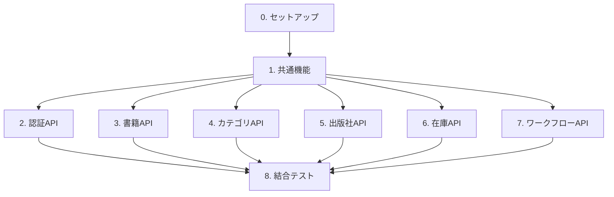

# Books Stock API - バックオフィス書籍在庫管理システム 実装タスクリスト

## 全体構成と担当割り当て

### タスク概要
| タスク | タスクファイル | 担当者 | 並行実行 | 想定工数 |
|---------|--------------|--------|---------|---------|
| 0. セットアップ | [setup_tasks.md](setup_tasks.md) | 全員 | 不可 | 2時間 |
| 1. 共通機能 | [common_tasks.md](common_tasks.md) | 共通機能チーム | 一部可能 | 8時間 |
| 2. 認証API | [API_001_auth.md](API_001_auth.md) | 担当者A | 可能 | 4時間 |
| 3. 書籍API | [API_002_books.md](API_002_books.md) | 担当者B | 可能 | 6時間 |
| 4. カテゴリAPI | [API_003_categories.md](API_003_categories.md) | 担当者C | 可能 | 2時間 |
| 5. 出版社API | [API_004_publishers.md](API_004_publishers.md) | 担当者D | 可能 | 2時間 |
| 6. 在庫API | [API_005_stocks.md](API_005_stocks.md) | 担当者E | 可能 | 4時間 |
| 7. ワークフローAPI | [API_006_workflows.md](API_006_workflows.md) | 担当者F | 可能 | 10時間 |
| 8. 結合テスト | [integration_tasks.md](integration_tasks.md) | 全員 | 一部可能 | 6時間 |

**合計想定工数**: 44時間

### 実行順序
1. **タスク0: セットアップ**（全員で実行）
   - プロジェクト初期化、データベース設定、アプリケーションサーバー設定
2. **タスク1: 共通機能**（共通機能チームが実装）
   - 全エンティティ（Book, Stock, Category, Publisher, Employee, Department, Workflow）
   - 全DAO（BookDao, BookDaoCriteria, StockDao, CategoryDao, PublisherDao, EmployeeDao, DepartmentDao, WorkflowDao）
   - 共通DTO、例外ハンドラ、ユーティリティクラス
3. **タスク2～7: API別実装**（各担当者が並行実行） ← **並行化のポイント**
   - 各APIは独立して実装可能
   - 共通機能完了後に開始
4. **タスク8: 結合テスト**（全員で実施）
   - API間結合テスト、E2E APIテスト、並行処理テスト

### タスクファイル一覧
- [セットアップタスク](setup_tasks.md)
- [共通機能タスク](common_tasks.md)
- [認証APIのタスク](API_001_auth.md)
- [書籍APIのタスク](API_002_books.md)
- [カテゴリAPIのタスク](API_003_categories.md)
- [出版社APIのタスク](API_004_publishers.md)
- [在庫APIのタスク](API_005_stocks.md)
- [ワークフローAPIのタスク](API_006_workflows.md)
- [結合テストタスク](integration_tasks.md)

## 依存関係図

## プロジェクト概要

### プロジェクト名
Books Stock API - バックオフィス書籍在庫管理システム

### アーキテクチャパターン
レイヤードアーキテクチャ（Presentation、Business Logic、Data Access、Entity）

### 技術スタック
- **Jakarta EE**: 10
- **JAX-RS**: 3.1（RESTful Webサービス）
- **JPA**: 3.1（ORM）
- **CDI**: 4.0（依存性注入）
- **Bean Validation**: 3.0
- **MicroProfile Config**: 3.0
- **Application Server**: Payara Server 6.x
- **Database**: HSQLDB 2.x
- **JDK**: Java 17+

### 主要機能
1. **認証機能**: JWT + HttpOnly Cookie認証
2. **書籍管理**: 一覧取得、詳細取得、検索（JPQL/Criteria API）
3. **カテゴリ管理**: カテゴリ一覧取得
4. **出版社管理**: 出版社一覧取得
5. **在庫管理**: 在庫参照・更新（楽観的ロック対応）
6. **ワークフロー管理**: 書籍マスタ変更の申請・承認フロー

### 重要な実装要件
- **楽観的ロック**: Stockエンティティに`@Version`アノテーション必須
- **2種類の書籍検索**: JPQL検索とCriteria API検索の両方を実装
- **全エンティティ実装**: Book、Stock、Category、Publisher、Employee、Department、Workflowすべて実装
- **論理削除**: 書籍の削除は論理削除（DELETEDフラグ）で対応
- **トランザクション管理**: ワークフロー承認時は履歴追加と書籍マスタ反映を1トランザクションで実行

## 開発原則（憲章遵守）

本プロジェクトは「berry-books 仕様駆動開発憲章」に準拠します：

1. **仕様ファースト開発**: すべての実装は仕様書に基づいて行う
2. **アーキテクチャの一貫性**: レイヤーアーキテクチャを厳格に守る
3. **テスト駆動品質**: すべてのビジネスロジックに対して単体テストを作成
4. **ドキュメント品質の追求**: コードとSPECドキュメントを常に最新の状態に保つ

## 注意事項

### タスク実装時の注意
- 各タスクの「参照SPEC」に記載されたドキュメントを必ず参照すること
- タスクIDはアンダースコア区切り（例: `T_SETUP_001`）
- 並行実行可能なタスクには`[P]`マークが付与されている
- 依存関係のあるタスクは順次実行すること

### SPEC参照について
- すべてのタスクにMarkdownリンク形式でSPEC参照が記載されている
- リンクをクリックすることで直接SPECファイルに移動できる
- 実装時は必ず該当セクションを確認すること

### 並行実行について
- セットアップタスクは全員で実行（並行実行不可）
- 共通機能タスクは一部並行実行可能（エンティティ単位で分割可能）
- API別タスクは完全に並行実行可能（各APIは独立）
- 結合テストは一部並行実行可能（テストケース単位で分割可能）
