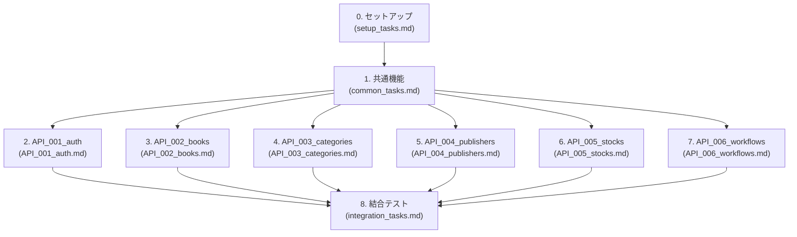

# back-office-api-sdd - 実装タスクリスト

**プロジェクト名:** Books Stock API - バックオフィス書籍在庫管理システム  
**アーキテクチャ:** マイクロサービス（レイヤードアーキテクチャ）  
**生成日:** 2025-01-10

---

## 全体構成と担当割り当て

### タスク概要

| タスク | タスクファイル | 担当者 | 並行実行 | 想定工数 |
|---------|--------------|--------|---------|---------|
| 0. セットアップ | [setup_tasks.md](setup_tasks.md) | 全員 | 不可 | 2時間 |
| 1. 共通機能 | [common_tasks.md](common_tasks.md) | 共通機能チーム | 一部可能 | 16時間 |
| 2. API_001_auth | [API_001_auth.md](API_001_auth.md) | 担当者A | 可能 | 8時間 |
| 3. API_002_books | [API_002_books.md](API_002_books.md) | 担当者B | 可能 | 12時間 |
| 4. API_003_categories | [API_003_categories.md](API_003_categories.md) | 担当者C | 可能 | 4時間 |
| 5. API_004_publishers | [API_004_publishers.md](API_004_publishers.md) | 担当者D | 可能 | 4時間 |
| 6. API_005_stocks | [API_005_stocks.md](API_005_stocks.md) | 担当者E | 可能 | 6時間 |
| 7. API_006_workflows | [API_006_workflows.md](API_006_workflows.md) | 担当者F | 可能 | 16時間 |
| 8. 結合テスト | [integration_tasks.md](integration_tasks.md) | 全員 | 一部可能 | 8時間 |

**合計想定工数:** 76時間

---

## 実行順序

### Phase 0: セットアップ（全員で実行）
1. **タスク0: セットアップ** - プロジェクト初期化、データベース設定、アプリケーションサーバー設定

### Phase 1: 共通機能（共通機能チームが実装）
2. **タスク1: 共通機能** - エンティティ、DAO、DTO、ユーティリティ、例外ハンドラー、セキュリティ基盤

### Phase 2: API別実装（各担当者が並行実行） ← ここが並行化のポイント
3. **タスク2: API_001_auth** - 認証API（ログイン、ログアウト）
4. **タスク3: API_002_books** - 書籍API（一覧、検索、詳細）
5. **タスク4: API_003_categories** - カテゴリAPI（一覧）
6. **タスク5: API_004_publishers** - 出版社API（一覧）
7. **タスク6: API_005_stocks** - 在庫API（一覧、取得、更新）
8. **タスク7: API_006_workflows** - ワークフローAPI（作成、更新、申請、承認、却下）

### Phase 3: 結合テスト（全員で実施）
9. **タスク8: 結合テスト** - API間結合テスト、E2Eテスト、パフォーマンステスト

---

## タスクファイル一覧

### セットアップ
- [setup_tasks.md](setup_tasks.md) - プロジェクト初期化、開発環境セットアップ

### 共通機能
- [common_tasks.md](common_tasks.md) - エンティティ、DAO、共通機能、セキュリティ基盤

### API別実装
- [API_001_auth.md](API_001_auth.md) - 認証API
- [API_002_books.md](API_002_books.md) - 書籍API（JPQL + Criteria API）
- [API_003_categories.md](API_003_categories.md) - カテゴリAPI
- [API_004_publishers.md](API_004_publishers.md) - 出版社API
- [API_005_stocks.md](API_005_stocks.md) - 在庫API（楽観的ロック）
- [API_006_workflows.md](API_006_workflows.md) - ワークフローAPI

### 結合テスト
- [integration_tasks.md](integration_tasks.md) - API間結合テスト、E2Eテスト

---

## 依存関係図



---

## 重要な注意事項

### アーキテクチャ方針
- **マイクロサービスパターン**: 全エンティティを実装
- **楽観的ロック**: Stock エンティティに`@Version`を実装
- **2種類の検索実装**: BookDao（JPQL）とBookDaoCriteria（Criteria API）
- **CORS対応**: CorsFilterを実装

### 実装優先順位
1. **セットアップ**: 最初に必ず実行
2. **共通機能**: API実装の前提となる共通コンポーネント
3. **API実装**: 並行実行可能（担当者割り当て後）
4. **結合テスト**: 全API実装完了後

### 品質基準
- **テストカバレッジ**: サービス層は80%以上
- **ログ出力**: 全API呼び出しでINFOレベルログ出力
- **エラーハンドリング**: 統一的なエラーレスポンス形式

---

## プロジェクト情報

### 技術スタック
- Jakarta EE 10
- JAX-RS 3.1 (RESTful API)
- JPA 3.1 (Hibernate実装)
- Payara Server 6
- HSQLDB 2.7.x
- JUnit 5, Mockito

### ベースパッケージ
```
pro.kensait.backoffice
├── api                    # JAX-RS Resources
│   ├── dto               # Data Transfer Objects
│   └── exception         # Exception Mappers
├── service               # Business Logic
├── dao                   # Data Access Objects
├── entity                # JPA Entities
├── security              # JWT, BCrypt
├── common                # Common Classes
└── util                  # Utilities
```

### データベース構成
- BOOK（書籍マスタ）
- STOCK（在庫マスタ）- 楽観的ロック対応
- CATEGORY（カテゴリマスタ）
- PUBLISHER（出版社マスタ）
- EMPLOYEE（社員マスタ）
- DEPARTMENT（部署マスタ）
- WORKFLOW（ワークフロー履歴）

---

## 開発開始前の確認事項

- [ ] HSQLDB サーバーが起動している
- [ ] Payara Server が起動している
- [ ] JDK 17以上がインストールされている
- [ ] Gradle 8.x以上がインストールされている
- [ ] 仕様書（specs/）を確認した
- [ ] 憲章（principles/constitution.md）を確認した

---

## 関連ドキュメント

### 仕様書
- [requirements.md](../specs/baseline/system/requirements.md) - 要件定義書
- [architecture_design.md](../specs/baseline/system/architecture_design.md) - アーキテクチャ設計書
- [functional_design.md](../specs/baseline/system/functional_design.md) - 機能設計書
- [data_model.md](../specs/baseline/system/data_model.md) - データモデル設計書
- [behaviors.md](../specs/baseline/system/behaviors.md) - 振る舞い仕様書

### API別仕様書
- [API_001_auth/](../specs/baseline/api/API_001_auth/) - 認証API
- [API_002_books/](../specs/baseline/api/API_002_books/) - 書籍API
- [API_003_categories/](../specs/baseline/api/API_003_categories/) - カテゴリAPI
- [API_004_publishers/](../specs/baseline/api/API_004_publishers/) - 出版社API
- [API_005_stocks/](../specs/baseline/api/API_005_stocks/) - 在庫API
- [API_006_workflows/](../specs/baseline/api/API_006_workflows/) - ワークフローAPI

### 憲章
- [constitution.md](../../agent_skills/jakarta-ee-standard/principles/constitution.md) - Jakarta EE開発憲章

---

**生成ツール:** Jakarta EE Standard Agent Skills - Task Generation  
**バージョン:** 1.0.0
