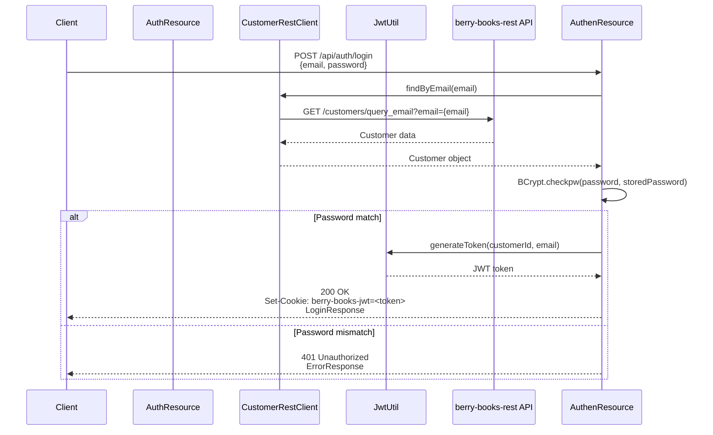

# API_001_auth - 認証API機能設計書

* API ID: API_001_auth  
* API名: 認証API  
* ベースパス: `/api/auth`  
* バージョン: 2.0.0  
* 最終更新日: 2025-12-27

---

## 1. 概要

認証APIは、ユーザーのログイン、ログアウト、新規登録、現在のログインユーザー情報取得を提供する。JWT（JSON Web Token）ベースの認証を使用し、HttpOnly Cookieでトークンを管理する。

* 認証方式: JWT（HttpOnly Cookie）
* 外部連携: berry-books-rest API（顧客情報管理）

---

## 2. エンドポイント一覧

| メソッド | エンドポイント | 説明 | 認証 |
|---------|--------------|------|-----|
| POST | `/api/auth/login` | ログイン（JWT Cookie発行） | 不要 |
| POST | `/api/auth/logout` | ログアウト（Cookie削除） | 不要 |
| POST | `/api/auth/register` | 新規登録 | 不要 |
| GET | `/api/auth/me` | 現在のログインユーザー情報取得 | 必須 |

---

## 3. API仕様

### 3.1 ログイン

#### 3.1.1 エンドポイント

```
POST /api/auth/login
```

#### 3.1.2 概要

メールアドレスとパスワードで認証し、JWT Cookieを発行する。

#### 3.1.3 リクエスト

* Content-Type: `application/json`

* リクエストボディ:


| フィールド | 型 | 必須 | 検証ルール |
|----------|---|------|----------|
| email | string | ✓ | メールアドレス形式、最大30文字 |
| password | string | ✓ | 最小1文字、最大60文字 |

#### 3.1.4 レスポンス

* 成功時 (200 OK):

* Set-Cookie: `berry-books-jwt=<JWT Token>; Path=/; Max-Age=86400; HttpOnly`


* エラー時 (401 Unauthorized):


#### 3.1.5 ビジネスルール

| ルールID | 説明 |
|---------|-------------|
| BR-AUTH-001 | メールアドレスが存在しない場合、401エラー |
| BR-AUTH-002 | パスワードが一致しない場合、401エラー |
| BR-AUTH-003 | パスワードはBCryptハッシュまたは平文（開発環境）で照合 |
| BR-AUTH-004 | JWTの有効期限は24時間（設定可能） |
| BR-AUTH-005 | JWT Cookieは HttpOnly, Path=/, MaxAge=86400 |

#### 3.1.6 シーケンス図



---

### 3.2 ログアウト

#### 3.2.1 エンドポイント

```
POST /api/auth/logout
```

#### 3.2.2 概要

JWT Cookieを削除（MaxAge=0）してログアウトする。

#### 3.2.3 リクエスト

* Content-Type: `application/json`

* リクエストボディ: なし

#### 3.2.4 レスポンス

* 成功時 (200 OK):

* Set-Cookie: `berry-books-jwt=; Path=/; Max-Age=0; HttpOnly`


---

### 3.3 新規登録

#### 3.3.1 エンドポイント

```
POST /api/auth/register
```

#### 3.3.2 概要

新規顧客を登録し、JWT Cookieを発行する。

#### 3.3.3 リクエスト

* Content-Type: `application/json`

* リクエストボディ:


| フィールド | 型 | 必須 | 検証ルール |
|----------|---|------|----------|
| customerName | string | ✓ | 最大30文字 |
| password | string | ✓ | 最小1文字、最大60文字 |
| email | string | ✓ | メールアドレス形式、最大30文字、一意制約 |
| birthday | string (date) | - | YYYY-MM-DD形式 |
| address | string | - | 最大120文字、都道府県名から始まること |

#### 3.3.4 レスポンス

* 成功時 (200 OK):

* Set-Cookie: `berry-books-jwt=<JWT Token>; Path=/; Max-Age=86400; HttpOnly`


* エラー時 (409 Conflict):


* エラー時 (400 Bad Request):


#### 3.3.5 ビジネスルール

| ルールID | 説明 |
|---------|-------------|
| BR-AUTH-010 | メールアドレスが既に存在する場合、409エラー |
| BR-AUTH-011 | パスワードはBCryptでハッシュ化して保存 |
| BR-AUTH-012 | 住所は都道府県名から始まること（AddressUtil.startsWithValidPrefecture()） |
| BR-AUTH-013 | 登録成功時、自動的にJWT Cookieを発行してログイン状態にする |

---

### 3.4 現在のログインユーザー情報取得

#### 3.4.1 エンドポイント

```
GET /api/auth/me
```

#### 3.4.2 概要

JWT Cookieから顧客情報を取得する。認証必須。

#### 3.4.3 リクエスト

* Cookie: `berry-books-jwt=<JWT Token>`

* リクエストボディ: なし

#### 3.4.4 レスポンス

* 成功時 (200 OK):


* エラー時 (401 Unauthorized):


---

## 4. データ転送オブジェクト (DTO)

### 4.1 LoginRequest

* 構造種別: レコード型（immutableなデータ転送オブジェクト）

* フィールド構成:

| フィールド名 | 型 | 制約 | 説明 |
|------------|---|------|------|
| email | String | NotBlank, Email形式 | メールアドレス |
| password | String | NotBlank | パスワード |

### 4.2 LoginResponse

* 構造種別: レコード型（immutableなデータ転送オブジェクト）

* フィールド構成:

| フィールド名 | 型 | 説明 |
|------------|---|------|
| customerId | Integer | 顧客ID |
| customerName | String | 顧客名 |
| email | String | メールアドレス |
| birthday | LocalDate | 生年月日 |
| address | String | 住所 |

### 4.3 RegisterRequest

* 構造種別: レコード型（immutableなデータ転送オブジェクト）

* フィールド構成:

| フィールド名 | 型 | 制約 | 説明 |
|------------|---|------|------|
| customerName | String | NotBlank, Size(max=30) | 顧客名 |
| password | String | NotBlank | パスワード |
| email | String | NotBlank, Email形式, Size(max=30) | メールアドレス |
| birthday | LocalDate | - | 生年月日 |
| address | String | Size(max=120) | 住所 |

### 4.4 ErrorResponse

* 構造種別: レコード型（immutableなデータ転送オブジェクト）

* フィールド構成:

| フィールド名 | 型 | 説明 |
|------------|---|------|
| status | int | HTTPステータスコード |
| error | String | エラー種別 |
| message | String | エラーメッセージ |
| path | String | リクエストパス |

---

## 5. エラーハンドリング

### 5.1 エラーメッセージ一覧

| エラーコード | HTTPステータス | メッセージ | 発生条件 |
|------------|--------------|----------|---------|
| AUTH-001 | 401 | メールアドレスまたはパスワードが正しくありません | メールアドレスが存在しない、またはパスワード不一致 |
| AUTH-002 | 401 | 認証が必要です | JWT Cookie未設定、またはJWT無効 |
| AUTH-003 | 409 | 指定されたメールアドレスは既に登録されています | メールアドレス重複 |
| AUTH-004 | 400 | 住所は都道府県名から始めてください | 住所が都道府県名から始まらない |
| AUTH-005 | 400 | Bean Validationエラー | 必須項目未入力、形式不正 |

---

## 6. セキュリティ考慮事項

### 6.1 JWT設定

* 設定ファイル: `src/main/resources/META-INF/microprofile-config.properties`

```properties
# JWT秘密鍵（本番環境では環境変数で上書きすること）

jwt.secret-key=BerryBooksSecretKeyForJWT2024MustBe32CharactersOrMore

# JWT有効期限（ミリ秒）デフォルト: 24時間

jwt.expiration-ms=86400000

# JWT Cookie名

jwt.cookie-name=berry-books-jwt
```

### 6.2 パスワードハッシュ化

* アルゴリズム: BCrypt
* Cost: 10（デフォルト）
* ハッシュ長: 60文字

* ハッシュ化処理:
  * BCryptアルゴリズムを使用して平文パスワードをハッシュ化
  * ソルト生成はBCryptが自動的に実行
  * 戻り値: ハッシュ化されたパスワード文字列（60文字）

### 6.3 Cookie設定

| 属性 | 値 | 目的 |
|-----|-----|------|
| HttpOnly | true | XSS攻撃対策（JavaScriptからアクセス不可） |
| Secure | false（開発環境）、true（本番環境） | HTTPS通信のみでCookie送信 |
| Path | / | 全パスでCookieを送信 |
| MaxAge | 86400（24時間） | Cookie有効期限 |

---

## 7. 関連ドキュメント

* [behaviors.md](behaviors.md) - 認証APIの受入基準
* [../../system/functional_design.md](../../system/functional_design.md) - 全体機能設計書
* [../../system/architecture_design.md](../../system/architecture_design.md) - アーキテクチャ設計書
* [../../system/external_interface.md](../../system/external_interface.md) - 外部API連携仕様

