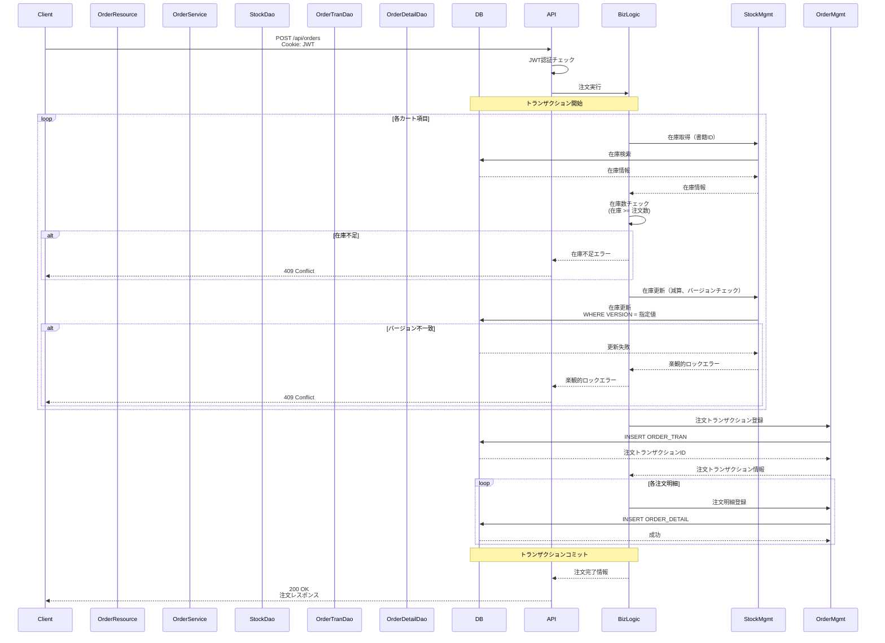

# API_003_orders - 注文API機能設計書

* API ID: API_003_orders  
* API名: 注文API  
* ベースパス: `/api/orders`  
* バージョン: 2.0.0  
* 最終更新日: 2025-12-27

---

## 1. 概要

注文APIは、注文作成、注文履歴取得、注文詳細取得、注文明細取得を提供する。注文作成と注文履歴取得は認証必須。

* 認証要否: 注文作成・注文履歴は必須、注文詳細・注文明細は不要

---

## 2. エンドポイント一覧

| メソッド | エンドポイント | 説明 | 認証 |
|---------|--------------|------|-----|
| POST | `/api/orders` | 注文作成 | 必須 |
| GET | `/api/orders/history` | 注文履歴取得 | 必須 |
| GET | `/api/orders/{tranId}` | 注文詳細取得 | 不要 |
| GET | `/api/orders/{tranId}/details/{detailId}` | 注文明細取得 | 不要 |

---

## 3. API仕様

### 3.1 注文作成

#### 3.1.1 エンドポイント

```
POST /api/orders
```

#### 3.1.2 概要

カート内の書籍を注文する。認証必須。在庫引き当て、在庫減算、注文レコード作成を実行する。

#### 3.1.3 リクエスト

* Content-Type: `application/json`
* Cookie: `berry-books-jwt=<JWT Token>`
* リクエストボディ:

| フィールド | 型 | 必須 | 説明 |
|----------|---|------|------|
| cartItems | array | ✓ | カート内の書籍リスト |
| cartItems[].bookId | integer | ✓ | 書籍ID |
| cartItems[].bookName | string | ✓ | 書籍名 |
| cartItems[].publisherName | string | ✓ | 出版社名 |
| cartItems[].price | integer | ✓ | 価格 |
| cartItems[].count | integer | ✓ | 注文数 |
| cartItems[].version | integer | ✓ | 在庫バージョン（楽観的ロック用） |
| totalPrice | integer | ✓ | 商品合計金額 |
| deliveryPrice | integer | ✓ | 配送料金 |
| deliveryAddress | string | ✓ | 配送先住所 |
| settlementType | integer | ✓ | 決済方法（1:銀行振込, 2:クレジットカード, 3:着払い） |

#### 3.1.4 レスポンス

* 成功時 (200 OK):

* エラー時 (409 Conflict - 在庫不足):

* エラー時 (409 Conflict - 楽観的ロック競合):

* エラー時 (401 Unauthorized):

#### 3.1.5 ビジネスルール

| ルールID | 説明 |
|---------|-------------|
| BR-ORDER-001 | 注文作成は認証必須（JWT Cookie） |
| BR-ORDER-002 | 在庫数が注文数より少ない場合、在庫不足エラー（409） |
| BR-ORDER-003 | 在庫のバージョンが一致しない場合、楽観的ロックエラー（409） |
| BR-ORDER-004 | 注文処理は単一トランザクション |
| BR-ORDER-005 | 注文作成時に在庫を減算 |
| BR-ORDER-006 | 配送料金は購入金額に応じて計算 |
| BR-ORDER-007 | 沖縄県の場合、配送料金が異なる |

#### 3.1.6 シーケンス図



---

### 3.2 注文履歴取得

#### 3.2.1 エンドポイント

```
GET /api/orders/history
```

#### 3.2.2 概要

ログイン中の顧客の注文履歴を取得する。認証必須。

#### 3.2.3 リクエスト

* Cookie: `berry-books-jwt=<JWT Token>`
* リクエストパラメータ: なし

#### 3.2.4 レスポンス

* 成功時 (200 OK):

* エラー時 (401 Unauthorized):

#### 3.2.5 ビジネスルール

| ルールID | 説明 |
|---------|-------------|
| BR-ORDER-010 | 注文履歴取得は認証必須 |
| BR-ORDER-011 | 顧客IDでフィルタリング（JWT Claimsから取得） |
| BR-ORDER-012 | 注文日降順でソート |
| BR-ORDER-013 | 1注文明細=1レコード（非正規化） |

---

### 3.3 注文詳細取得

#### 3.3.1 エンドポイント

```
GET /api/orders/{tranId}
```

#### 3.3.2 概要

指定された注文IDの注文詳細を取得する。認証不要。

#### 3.3.3 リクエスト

* パスパラメータ:

| パラメータ | 型 | 説明 |
|----------|---|------|
| tranId | integer | 注文トランザクションID |

#### 3.3.4 レスポンス

* 成功時 (200 OK):

* エラー時 (404 Not Found):

---

### 3.4 注文明細取得

#### 3.4.1 エンドポイント

```
GET /api/orders/{tranId}/details/{detailId}
```

#### 3.4.2 概要

指定された注文明細を取得する。認証不要。

#### 3.4.3 リクエスト

* パスパラメータ:

| パラメータ | 型 | 説明 |
|----------|---|------|
| tranId | integer | 注文トランザクションID |
| detailId | integer | 注文明細ID |

#### 3.4.4 レスポンス

* 成功時 (200 OK):

* エラー時 (404 Not Found):

---

## 4. エラーハンドリング

### 4.1 エラーメッセージ一覧

| エラーコード | HTTPステータス | メッセージ | 発生条件 |
|------------|--------------|----------|---------|
| ORDER-001 | 409 | 在庫が不足しています: {bookName} | 在庫数が注文数より少ない |
| ORDER-002 | 409 | 他のユーザーが購入済みです。最新の在庫情報を確認してください。 | 楽観的ロック競合（VERSION不一致） |
| ORDER-003 | 404 | 注文が見つかりません | 指定IDの注文が存在しない |
| ORDER-004 | 404 | 注文明細が見つかりません | 指定IDの注文明細が存在しない |
| ORDER-005 | 401 | 認証が必要です | JWT Cookie未設定、またはJWT無効 |

---

## 5. 楽観的ロック制御

### 6.1 楽観的ロック戦略

* 対象テーブル: STOCK

* VERSIONカラム: BIGINT NOT NULL

* 処理フロー:

1. カート追加時: VERSION値を取得しカートアイテムに保存
2. 注文確定時: 保存したVERSION値で在庫を更新
3. 成功時: 在庫数を減算、VERSION値を自動インクリメント
4. 失敗時: 楽観的ロック例外、ユーザーにエラー表示

* 更新処理の論理構造:
  * 対象テーブル: STOCK
  * SET句:
  * QUANTITY = QUANTITY - (減算数量)
  * VERSION = VERSION + 1
  * WHERE句:
    * BOOK_ID = (対象の書籍ID)
    * VERSION = (保存したバージョン番号)

---

## 7. トランザクション管理

### 7.1 トランザクション境界

* トランザクション境界: サービスレイヤー

* 注文サービスの処理:

1. 在庫可用性チェック
2. 在庫更新（楽観的ロック付き）
3. 注文トランザクション作成
4. 注文明細作成
5. コミット（正常終了時）
6. ロールバック（例外発生時）

---

## 7. 関連ドキュメント

* [behaviors.md](behaviors.md) - 注文APIの受入基準
* [../../system/functional_design.md](../../system/functional_design.md) - 全体機能設計書
* [../../system/architecture_design.md](../../system/architecture_design.md) - アーキテクチャ設計書
* [../../system/data_model.md](../../system/data_model.md) - データモデル仕様書
