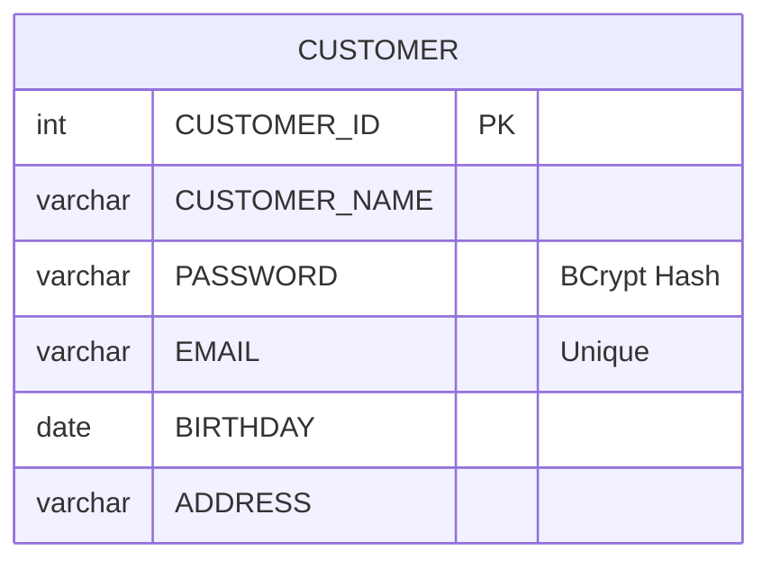

# berry-books-api-sdd - データモデル仕様書

プロジェクトID: berry-books-api-sdd  
バージョン: 3.0.0  
最終更新日: 2026-01-10  
ステータス: サービス分離アーキテクチャ対応完了

* 変更履歴:
  * v3.0.0 (2026-01-10): サービス分離アーキテクチャ対応
  * サービス間の外部キー制約の削除（CUSTOMER_ID、BOOK_ID）
  * スナップショットパターンの導入（BOOK_NAME、PUBLISHER_NAME）
  * データ整合性をアプリケーションレイヤーで保証
  * v2.0.0 (2025-12-27): マイクロサービスアーキテクチャ導入
  * v1.0.0: 初版

---

## 1. 概要

本文書は、berry-books-api REST APIのデータベーススキーマ（RDB論理設計）を記述する。

* データベース種別: HSQLDB

注意: 
* JPAエンティティクラスの設計（@Entity、@Column等のアノテーション、Javaクラス構造）は詳細設計フェーズで実施します
* データソース設定（JNDI名、接続URL、接続プール等）はarchitecture_design.mdに記載します
* データ管理の責務分担（サービス分離アーキテクチャ）については、architecture_design.mdを参照してください
* berry-books-apiは注文データ（ORDER_TRAN、ORDER_DETAIL）のみを直接管理します。書籍・在庫・カテゴリ・顧客データは外部APIを通じてアクセスします

---

## 2. ER図

### 2.1 全体ER図

```mermaid
erDiagram
    %% サービス間のリレーションシップは論理的参照のみ（外部キー制約なし）
    ORDER_TRAN ||--o{ ORDER_DETAIL : contains
    
    ORDER_TRAN {
        int ORDER_TRAN_ID PK
        date ORDER_DATE
        int CUSTOMER_ID "論理参照のみ（customer-hub-api）"
        int TOTAL_PRICE
        int DELIVERY_PRICE
        varchar DELIVERY_ADDRESS
        int SETTLEMENT_TYPE "1=Bank, 2=Credit, 3=COD"
    }
    
    ORDER_DETAIL {
        int ORDER_TRAN_ID PK_FK
        int ORDER_DETAIL_ID PK
        int BOOK_ID "論理参照のみ（back-office-api）"
        varchar(100) BOOK_NAME "スナップショット"
        varchar(50) PUBLISHER_NAME "スナップショット"
        int PRICE "スナップショット"
        int COUNT
    }
```

* 注意: 上記のER図はberry-books-api-sddが管理するテーブルのみを示しています。書籍・在庫・カテゴリ・出版社データはback-office-api-sdd、顧客データはcustomer-hub-apiが管理します。

### 2.2 他のサービスのテーブル構造（参考）

以下は参考情報です。これらのテーブルはberry-books-api-sddでは管理されません。

* back-office-api-sdd管理テーブル:
```mermaid
erDiagram
    PUBLISHER ||--o{ BOOK : publishes
    CATEGORY ||--o{ BOOK : categorizes
    BOOK ||--|| STOCK : has
    
    PUBLISHER {
        int PUBLISHER_ID PK
        varchar PUBLISHER_NAME
    }
    
    CATEGORY {
        int CATEGORY_ID PK
        varchar CATEGORY_NAME
    }
    
    BOOK {
        int BOOK_ID PK
        varchar BOOK_NAME
        varchar AUTHOR
        int CATEGORY_ID FK
        int PUBLISHER_ID FK
        int PRICE
    }
    
    STOCK {
        int BOOK_ID PK_FK
        int QUANTITY
        bigint VERSION "Optimistic Lock"
    }
```

* customer-hub-api管理テーブル:


---

## 3. テーブル定義

### 3.1 PUBLISHER（出版社）

#### 3.1.1 テーブル概要

出版社マスタテーブル。書籍の出版社情報を管理する。

#### 3.1.2 テーブル構造

| カラム名 | データ型 | PK | FK | NN | UQ | デフォルト | 説明 |
|---------|---------|----|----|----|----|----------|------|
| PUBLISHER_ID | INTEGER | ✓ | | ✓ | | IDENTITY | 出版社ID（自動採番） |
| PUBLISHER_NAME | VARCHAR(30) | | | ✓ | | | 出版社名 |

#### 3.1.3 制約

* 主キー: PUBLISHER_ID
* 自動採番: IDENTITY（INSERT時に自動生成）

---

### 3.2 CATEGORY（カテゴリ）

#### 3.2.1 テーブル概要

カテゴリマスタテーブル。書籍のカテゴリ情報を管理する。

#### 3.2.2 テーブル構造

| カラム名 | データ型 | PK | FK | NN | UQ | デフォルト | 説明 |
|---------|---------|----|----|----|----|----------|------|
| CATEGORY_ID | INTEGER | ✓ | | ✓ | | IDENTITY | カテゴリID（自動採番） |
| CATEGORY_NAME | VARCHAR(20) | | | ✓ | | | カテゴリ名 |

#### 3.2.3 制約

* 主キー: CATEGORY_ID
* 自動採番: IDENTITY（INSERT時に自動生成）

---

### 3.3 BOOK（書籍）

#### 3.3.1 テーブル概要

書籍マスタテーブル。書籍の基本情報を管理する。

#### 3.3.2 テーブル構造

| カラム名 | データ型 | PK | FK | NN | UQ | デフォルト | 説明 |
|---------|---------|----|----|----|----|----------|------|
| BOOK_ID | INTEGER | ✓ | | ✓ | | IDENTITY | 書籍ID（自動採番） |
| BOOK_NAME | VARCHAR(80) | | | ✓ | | | 書籍名 |
| AUTHOR | VARCHAR(40) | | | ✓ | | | 著者 |
| CATEGORY_ID | INT | | ✓ | ✓ | | | カテゴリID |
| PUBLISHER_ID | INT | | ✓ | ✓ | | | 出版社ID |
| PRICE | INT | | | ✓ | | | 価格（円） |

#### 3.3.3 制約

* 主キー: BOOK_ID
* 外部キー:
  * CATEGORY_ID → CATEGORY.CATEGORY_ID
  * PUBLISHER_ID → PUBLISHER.PUBLISHER_ID
  * 自動採番: IDENTITY（INSERT時に自動生成）

#### 3.3.5 インデックス

* PK_BOOK: BOOK_ID（主キーインデックス）
* IDX_CATEGORY_ID: CATEGORY_ID（外部キーインデックス、検索最適化）

---

### 3.4 STOCK（在庫）

#### 3.4.1 テーブル概要

在庫マスタテーブル。書籍の在庫数を管理する。楽観的ロック制御用のVERSIONカラムを持つ。

#### 3.4.2 テーブル構造

| カラム名 | データ型 | PK | FK | NN | UQ | デフォルト | 説明 |
|---------|---------|----|----|----|----|----------|------|
| BOOK_ID | INT | ✓ | ✓ | ✓ | | | 書籍ID |
| QUANTITY | INT | | | ✓ | | | 在庫数 |
| VERSION | BIGINT | | | ✓ | | | バージョン番号（楽観的ロック用） |

#### 3.4.3 制約

* 主キー: BOOK_ID
* 外部キー: BOOK_ID → BOOK.BOOK_ID（1:1関係）

#### 3.4.5 楽観的ロック制御

* VERSION: 在庫更新時に自動インクリメント
* 更新処理の論理構造:
  * 対象テーブル: STOCK
  * SET句:
    * QUANTITY = QUANTITY - (減算数量)
    * VERSION = VERSION + 1
    * WHERE句:
      * BOOK_ID = (対象書籍ID)
      * VERSION = (現在のバージョン番号)
      * VERSION不一致時: UPDATE結果が0件 → OptimisticLockException

---

### 3.5 CUSTOMER（顧客）

#### 3.5.1 テーブル概要

顧客マスタテーブル。顧客情報を管理する。パスワードはBCryptハッシュで保存する。

* 注意: このテーブルは外部API（berry-books-rest）経由でアクセスされる。

#### 3.5.2 テーブル構造

| カラム名 | データ型 | PK | FK | NN | UQ | デフォルト | 説明 |
|---------|---------|----|----|----|----|----------|------|
| CUSTOMER_ID | INT | ✓ | | ✓ | | IDENTITY | 顧客ID（自動採番） |
| CUSTOMER_NAME | VARCHAR(30) | | | ✓ | | | 顧客名 |
| PASSWORD | VARCHAR(60) | | | ✓ | | | パスワード（BCryptハッシュ） |
| EMAIL | VARCHAR(30) | | | ✓ | ✓ | | メールアドレス（一意制約） |
| BIRTHDAY | DATE | | | | | | 生年月日 |
| ADDRESS | VARCHAR(120) | | | | | | 住所（UTF-8で40文字） |

#### 3.5.3 制約

* 主キー: CUSTOMER_ID
* 一意制約: EMAIL（同一メールアドレスでの重複登録不可）
* 自動採番: IDENTITY（INSERT時に自動生成）

#### 3.5.5 パスワードハッシュ

* ハッシュアルゴリズム: BCrypt（cost=10）
* ハッシュ長: 60文字（例: `$2a$10$...`）
* 平文パスワード: 開発環境のみサポート（本番環境では不可）

---

### 3.6 ORDER_TRAN（注文トランザクション）

#### 3.6.1 テーブル概要

注文トランザクションテーブル。顧客の注文情報（注文日、合計金額、配送先など）を管理する。

#### 3.6.2 テーブル構造

| カラム名 | データ型 | PK | FK | NN | UQ | デフォルト | 説明 |
|---------|---------|----|----|----|----|----------|------|
| ORDER_TRAN_ID | INTEGER | ✓ | | ✓ | | IDENTITY | 注文トランザクションID（自動採番） |
| ORDER_DATE | DATE | | | ✓ | | | 注文日 |
| CUSTOMER_ID | INT | | | ✓ | | | 顧客ID（論理参照のみ、外部キー制約なし） |
| TOTAL_PRICE | INT | | | ✓ | | | 注文金額合計（配送料を含む） |
| DELIVERY_PRICE | INT | | | ✓ | | | 配送料金 |
| DELIVERY_ADDRESS | VARCHAR(30) | | | ✓ | | | 配送先住所 |
| SETTLEMENT_TYPE | INT | | | ✓ | | | 決済方法（1:銀行振込, 2:クレジットカード, 3:着払い） |

#### 3.6.3 制約

* 主キー: ORDER_TRAN_ID
* 外部キー: なし（CUSTOMER_IDは論理参照のみ。顧客データはcustomer-hub-apiが管理）
* 自動採番: IDENTITY（INSERT時に自動生成）

#### 3.6.5 決済方法（SETTLEMENT_TYPE）

| 値 | 説明 |
|---|------|
| 1 | 銀行振込 |
| 2 | クレジットカード |
| 3 | 着払い |

---

### 3.7 ORDER_DETAIL（注文明細）

#### 3.7.1 テーブル概要

注文明細テーブル。各注文の書籍情報（書籍ID、価格、数量）を管理する。複合主キー（ORDER_TRAN_ID, ORDER_DETAIL_ID）を使用する。

#### 3.7.2 テーブル構造

| カラム名 | データ型 | PK | FK | NN | UQ | デフォルト | 説明 |
|---------|---------|----|----|----|----|----------|------|
| ORDER_TRAN_ID | INT | ✓ | ✓ | ✓ | | | 注文トランザクションID |
| ORDER_DETAIL_ID | INT | ✓ | | ✓ | | | 注文明細ID（注文内で一意） |
| BOOK_ID | INT | | | ✓ | | | 書籍ID（論理参照のみ、外部キー制約なし） |
| BOOK_NAME | VARCHAR(100) | | | ✓ | | | 書籍名（スナップショット：注文時点の名称） |
| PUBLISHER_NAME | VARCHAR(50) | | | ✓ | | | 出版社名（スナップショット：注文時点の名称） |
| PRICE | INT | | | ✓ | | | 価格（スナップショット：注文時点の価格） |
| COUNT | INT | | | ✓ | | | 注文数 |

#### 3.7.3 制約

* 主キー: (ORDER_TRAN_ID, ORDER_DETAIL_ID)（複合主キー）
* 外部キー:
  * ORDER_TRAN_ID → ORDER_TRAN.ORDER_TRAN_ID（サービス内の制約）
  * BOOK_ID: 外部キー制約なし（書籍データはback-office-api-sddが管理）

#### 3.7.5 複合主キー

* 複合主キー: (ORDER_TRAN_ID, ORDER_DETAIL_ID)
* ORDER_TRAN_ID: 注文トランザクションID（親テーブルへの外部キー）
* ORDER_DETAIL_ID: 注文明細ID（注文内で連番: 1, 2, 3, ...）

---

## 4. インデックス設計

### 4.1 インデックス一覧

| テーブル | インデックス名 | カラム | タイプ | 目的 |
|---------|--------------|--------|--------|------|
| PUBLISHER | PK_PUBLISHER | PUBLISHER_ID | PRIMARY KEY | 主キー |
| CATEGORY | PK_CATEGORY | CATEGORY_ID | PRIMARY KEY | 主キー |
| BOOK | PK_BOOK | BOOK_ID | PRIMARY KEY | 主キー |
| BOOK | IDX_CATEGORY_ID | CATEGORY_ID | INDEX | カテゴリ検索最適化 |
| BOOK | IDX_PUBLISHER_ID | PUBLISHER_ID | INDEX | 外部キー |
| STOCK | PK_STOCK | BOOK_ID | PRIMARY KEY | 主キー |
| CUSTOMER | PK_CUSTOMER | CUSTOMER_ID | PRIMARY KEY | 主キー |
| CUSTOMER | UQ_EMAIL | EMAIL | UNIQUE | メールアドレス一意制約 |
| ORDER_TRAN | PK_ORDER_TRAN | ORDER_TRAN_ID | PRIMARY KEY | 主キー |
| ORDER_TRAN | IDX_CUSTOMER_ID | CUSTOMER_ID | INDEX | 顧客別注文履歴検索最適化 |
| ORDER_DETAIL | PK_ORDER_DETAIL | (ORDER_TRAN_ID, ORDER_DETAIL_ID) | PRIMARY KEY | 複合主キー |
| ORDER_DETAIL | IDX_BOOK_ID | BOOK_ID | INDEX | 外部キー |

### 6.2 検索最適化

#### 4.2.1 書籍検索

* クエリ論理構造: カテゴリIDで検索
* SELECT句: 全カラム
* FROM句: BOOK テーブル
* WHERE句: CATEGORY_ID = パラメータ値

* 最適化: IDX_CATEGORY_ID インデックスを使用

#### 6.2.2 注文履歴検索

* クエリ論理構造: 顧客IDで注文履歴検索
* SELECT句: 全カラム
* FROM句: ORDER_TRAN テーブル
* WHERE句: CUSTOMER_ID = パラメータ値
* ORDER BY句: ORDER_DATE の降順

* 最適化: IDX_CUSTOMER_ID インデックスを使用

---

## 5. データ整合性ルール

### 5.1 外部キー制約

#### 5.1.1 berry-books-api-sdd管理テーブル（本サービス）

| 子テーブル | 親テーブル | 外部キー | 動作 |
|----------|----------|---------|------|
| ORDER_DETAIL | ORDER_TRAN | ORDER_TRAN_ID | CASCADE（注文削除時に明細も削除） |

注意: ORDER_TRAN.CUSTOMER_ID、ORDER_DETAIL.BOOK_IDは外部キー制約なし（他サービスが管理）

#### 5.1.2 他のサービス管理テーブル（参考）

* back-office-api-sdd:
| 子テーブル | 親テーブル | 外部キー | 動作 |
|----------|----------|---------|------|
| BOOK | CATEGORY | CATEGORY_ID | CASCADE |
| BOOK | PUBLISHER | PUBLISHER_ID | CASCADE |
| STOCK | BOOK | BOOK_ID | CASCADE |

* customer-hub-api:
| 子テーブル | 親テーブル | 外部キー | 動作 |
|----------|----------|---------|------|
| （単一テーブル） | - | - | - |

### 5.2 トランザクション分離レベル

* 分離レベル: READ_COMMITTED（デフォルト）

* ダーティリードを防ぐ
* 非反復可能読み取り（Non-Repeatable Read）は許容
* ファントムリード（Phantom Read）は許容

### 5.3 楽観的ロック制御

* 対象テーブル: STOCK

* VERSION: 在庫更新時に自動インクリメント
* 競合検出: UPDATE結果が0件の場合、OptimisticLockException
* リトライ: アプリケーション側で再試行（UI側でユーザーに通知）

---

## 6. データライフサイクル

### 6.1 データ削除順序

#### 6.1.1 berry-books-api-sdd管理テーブル

外部キー制約により、以下の順序で削除する必要がある：

1. ORDER_DETAIL
2. ORDER_TRAN

#### 6.1.2 他のサービス管理テーブル（参考）

* back-office-api-sdd:
  1. STOCK
  2. BOOK
  3. CATEGORY
  4. PUBLISHER

* customer-hub-api:
  1. CUSTOMER

---

## 7. データベース設計原則

### 7.1 命名規則

* テーブル名: 英語大文字、単数形（BOOK, ORDER_TRAN）
* カラム名: 英語大文字、スネークケース（BOOK_NAME, ORDER_DATE）
* 主キー: テーブル名 + _ID（BOOK_ID, CUSTOMER_ID）
* 外部キー制約: FK_カラム名（FK_CATEGORY_ID）

### 7.2 正規化

* 第1正規形: 原子性を満たす（繰り返しフィールドなし）
* 第2正規形: 部分関数従属性なし
* 第3正規形: 推移的関数従属性なし

### 7.3 非正規化

ORDER_DETAILテーブルでは、以下のカラムで非正規化を許容：

* `BOOK_NAME` (VARCHAR(100)): 書籍名（注文時点の値を保持）
* `PUBLISHER_NAME` (VARCHAR(50)): 出版社名（注文時点の値を保持）
* `PRICE` (INT): 価格（注文時点の値を保持）

---

## 8. 参考資料

本データモデル仕様書に関連する詳細ドキュメント：

* [requirements.md](requirements.md) - 要件定義書
* [functional_design.md](functional_design.md) - 機能設計書（API仕様）
* [architecture_design.md](architecture_design.md) - アーキテクチャ設計書
* [behaviors.md](behaviors.md) - 振る舞い仕様書（受入基準）
* [external_interface.md](external_interface.md) - 外部インターフェース仕様書
* [README.md](../../README.md) - プロジェクトREADME
