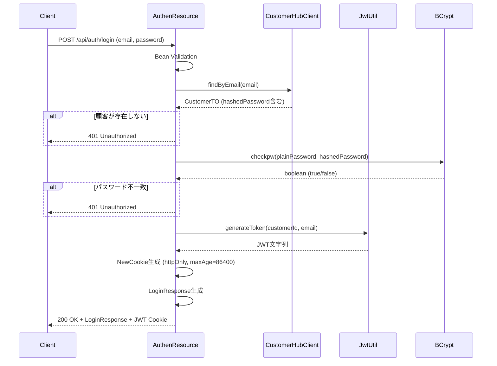
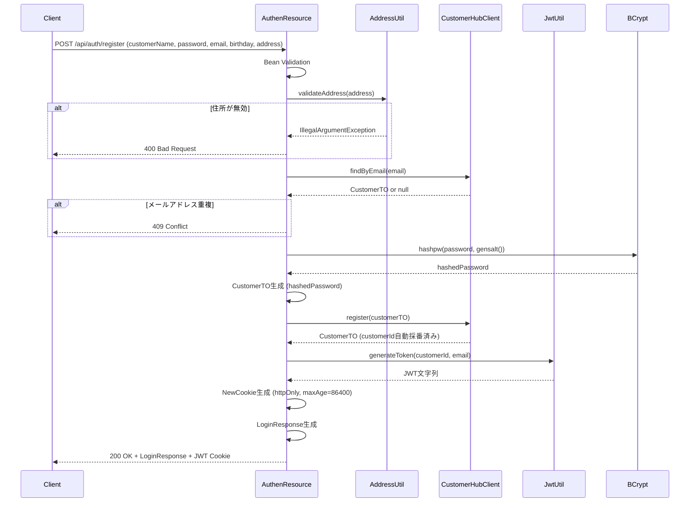
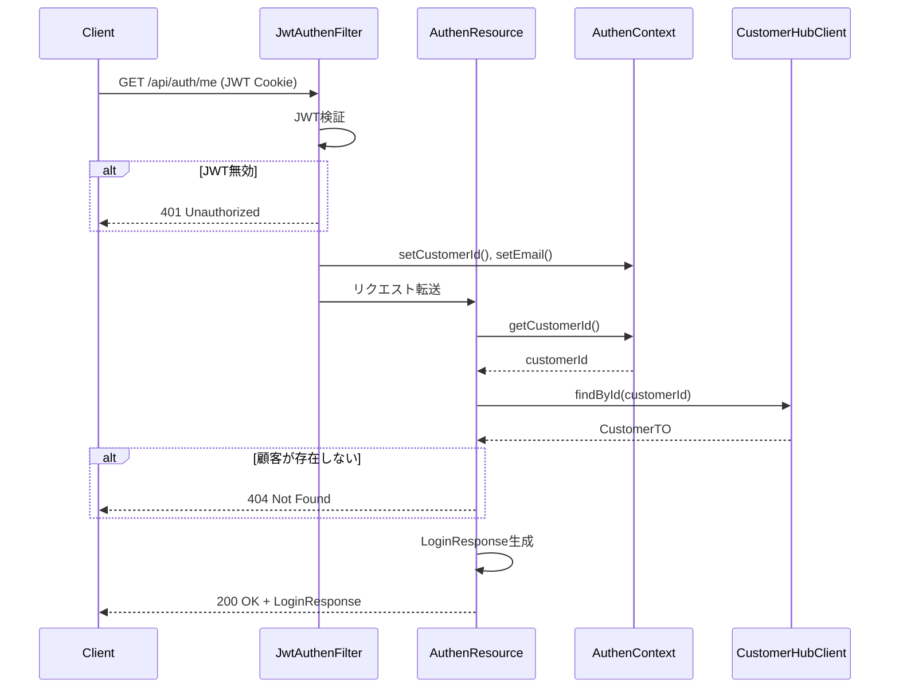

# API_001_auth - 認証API 詳細設計書

API ID: API_001_auth  
API名: 認証API  
バージョン: 1.0.0  
最終更新日: 2026-01-18  
ステータス: 詳細設計確定

---

## 1. API概要

* ベースパス: `/api/auth`
* 認証: ログイン、ログアウト、新規登録は認証不要（公開エンドポイント）、現在のユーザー情報取得は認証必須
* 実装パターン: 独自実装 + 外部API連携
  * JWT生成・検証は本システムで実装（JwtUtil使用）
  * 顧客情報はcustomer-hub-api経由で取得

---

## 2. パッケージ構造

### 2.1 API固有パッケージ

```
pro.kensait.berrybooks
├── api
│   ├── AuthenResource.java         # 認証APIエンドポイント
│   ├── dto
│   │   ├── LoginRequest.java       # ログインリクエストDTO
│   │   ├── LoginResponse.java      # ログインレスポンスDTO
│   │   └── RegisterRequest.java    # 新規登録リクエストDTO
│   └── exception
│       ├── EmailAlreadyExistsException.java        # メールアドレス重複例外
│       └── EmailAlreadyExistsExceptionMapper.java  # 例外マッパー
└── util
    └── AddressUtil.java             # 住所バリデーションユーティリティ
```

注意: 共通コンポーネント（JwtUtil、AuthenContext、JwtAuthenFilter、CustomerHubRestClient）は[common/detailed_design.md](../common/detailed_design.md)を参照

---

## 3. Resourceクラス設計

### 3.1 AuthenResource（認証APIリソース）

#### 3.1.1 概要

* 責務: 認証APIエンドポイントの提供
* パッケージ: `pro.kensait.berrybooks.api`

#### 3.1.2 クラス定義

* クラス名: `AuthenResource`
* アノテーション:
  * `@Path("/auth")` - ベースパス
  * `@ApplicationScoped` - CDI管理Bean（シングルトン）

#### 3.1.3 依存関係

* `@Inject private CustomerHubRestClient customerHubClient;` - customer-hub-api連携クライアント
* `@Inject private JwtUtil jwtUtil;` - JWT生成・検証ユーティリティ
* `@Inject private AuthenContext authenContext;` - 認証コンテキスト
* `@Context private HttpServletRequest httpServletRequest;` - HTTPリクエスト
* `private static final Logger logger = LoggerFactory.getLogger(AuthenResource.class);`

#### 3.1.4 メソッド設計

##### login(LoginRequest request) - ログイン

* シグネチャ:
```java
@POST
@Path("/login")
@Consumes(MediaType.APPLICATION_JSON)
@Produces(MediaType.APPLICATION_JSON)
public Response login(@Valid LoginRequest request)
```

* 目的: ログイン処理（JWT Cookie発行）
* パラメータ:
  * `LoginRequest request` - ログインリクエスト（email, password）
  * `@Valid` - Bean Validation実行

* 処理フロー:
  1. ログ出力: `logger.info("[ AuthenResource#login ] email={}", request.email())`
  2. 顧客情報取得: `customerHubClient.findByEmail(request.email())` - メールアドレスで顧客を検索
  3. 顧客存在チェック: `customer == null` → 401 Unauthorized（"メールアドレスまたはパスワードが正しくありません"）
  4. パスワード照合:
    * BCryptハッシュの場合: `BCrypt.checkpw(request.password(), customer.password())` - BCrypt照合
    * 平文パスワード（開発環境）: `request.password().equals(customer.password())` - 平文比較
    * パスワード不一致の場合 → 401 Unauthorized（"メールアドレスまたはパスワードが正しくありません"）
  5. JWT生成: `jwtUtil.generateToken(customer.customerId().longValue(), customer.email())` - JWTトークン生成
  6. Cookie生成: `NewCookie.Builder(cookieName).value(jwt).httpOnly(true).path("/").maxAge(86400).build()`
    * httpOnly: true（JavaScript からアクセス不可）
    * secure: false（開発環境）、本番環境ではtrue
    * path: "/"（アプリケーション全体で有効）
    * maxAge: 86400秒（24時間）
  7. LoginResponse生成: `new LoginResponse(customer.customerId(), customer.customerName(), customer.email(), customer.birthday(), customer.address())`
  8. ログ出力: `logger.info("[ AuthenResource#login ] Login successful: customerId={}", customer.customerId())`
  9. レスポンス返却: `Response.ok(response).cookie(jwtCookie).build()`

* レスポンス: `200 OK + LoginResponse + JWT Cookie`

* エラーケース:
  * メールアドレス未登録 → `401 Unauthorized`
  * パスワード不一致 → `401 Unauthorized`
  * バリデーションエラー → `400 Bad Request`（ValidationExceptionMapperで処理）

##### logout() - ログアウト

* シグネチャ:
```java
@POST
@Path("/logout")
@Produces(MediaType.APPLICATION_JSON)
public Response logout()
```

* 目的: ログアウト処理（JWT Cookie削除）
* パラメータ: なし

* 処理フロー:
  1. ログ出力: `logger.info("[ AuthenResource#logout ] Logout request")`
  2. Cookie削除: `NewCookie.Builder(cookieName).value("").httpOnly(true).path("/").maxAge(0).build()`
    * maxAge: 0（Cookie削除）
  3. ログ出力: `logger.info("[ AuthenResource#logout ] Logout successful")`
  4. レスポンス返却: `Response.ok().cookie(deleteCookie).build()`

* レスポンス: `200 OK + 削除Cookie`

* 注意:
  * 未ログイン状態でも正常終了（冪等性）
  * セキュリティ上、常に成功レスポンスを返却

##### register(RegisterRequest request) - 新規登録

* シグネチャ:
```java
@POST
@Path("/register")
@Consumes(MediaType.APPLICATION_JSON)
@Produces(MediaType.APPLICATION_JSON)
public Response register(@Valid RegisterRequest request)
```

* 目的: 新規顧客登録（JWT Cookie発行）
* パラメータ:
  * `RegisterRequest request` - 新規登録リクエスト（customerName, password, email, birthday, address）
  * `@Valid` - Bean Validation実行

* 処理フロー:
  1. ログ出力: `logger.info("[ AuthenResource#register ] email={}", request.email())`
  2. 住所バリデーション: `AddressUtil.validateAddress(request.address())` - 都道府県名チェック
    * 無効な住所の場合 → IllegalArgumentExceptionをスロー（400 Bad Request）
  3. メールアドレス重複チェック: `customerHubClient.findByEmail(request.email())`
    * 存在する場合 → EmailAlreadyExistsExceptionをスロー（409 Conflict）
  4. パスワードハッシュ化: `BCrypt.hashpw(request.password(), BCrypt.gensalt())` - BCryptハッシュ生成
  5. CustomerTO生成: `new CustomerTO(null, request.customerName(), hashedPassword, request.email(), request.birthday(), request.address())`
    * customerId: null（自動採番）
  6. 顧客登録: `customerHubClient.register(customerTO)` - customer-hub-apiへ登録リクエスト
    * 409 Conflictの場合 → EmailAlreadyExistsExceptionをスロー
  7. JWT生成: `jwtUtil.generateToken(createdCustomer.customerId().longValue(), createdCustomer.email())` - JWTトークン生成
  8. Cookie生成: `NewCookie.Builder(cookieName).value(jwt).httpOnly(true).path("/").maxAge(86400).build()`
  9. LoginResponse生成: `new LoginResponse(createdCustomer.customerId(), createdCustomer.customerName(), createdCustomer.email(), createdCustomer.birthday(), createdCustomer.address())`
  10. ログ出力: `logger.info("[ AuthenResource#register ] Registration successful: customerId={}", createdCustomer.customerId())`
  11. レスポンス返却: `Response.ok(response).cookie(jwtCookie).build()`

* レスポンス: `200 OK + LoginResponse + JWT Cookie`

* エラーケース:
  * メールアドレス重複 → `409 Conflict`（EmailAlreadyExistsExceptionMapper）
  * 住所バリデーションエラー → `400 Bad Request`（IllegalArgumentException）
  * バリデーションエラー → `400 Bad Request`（ValidationExceptionMapperで処理）

##### getCurrentUser() - 現在のログインユーザー情報取得

* シグネチャ:
```java
@GET
@Path("/me")
@Produces(MediaType.APPLICATION_JSON)
public Response getCurrentUser()
```

* 目的: 現在のログインユーザー情報を取得
* パラメータ: なし（JWT Cookieから取得）
* 認証: 必須（JwtAuthenFilterで処理）

* 処理フロー:
  1. ログ出力: `logger.info("[ AuthenResource#getCurrentUser ]")`
  2. 認証チェック: `authenContext.isAuthenticated()` - 認証済みかどうかを判定
    * 未認証の場合 → 401 Unauthorized（"認証が必要です"）
  3. 顧客ID取得: `authenContext.getCustomerId()` - AuthenContextから顧客ID取得
  4. 顧客情報取得: `customerHubClient.findById(customerId)` - customer-hub-apiから顧客情報取得
    * 存在しない場合 → 404 Not Found（"顧客が見つかりません"）
  5. LoginResponse生成: `new LoginResponse(customer.customerId(), customer.customerName(), customer.email(), customer.birthday(), customer.address())`
  6. ログ出力: `logger.info("[ AuthenResource#getCurrentUser ] customerId={}", customerId)`
  7. レスポンス返却: `Response.ok(response).build()`

* レスポンス: `200 OK + LoginResponse`

* エラーケース:
  * JWT Cookie未設定 → `401 Unauthorized`（JwtAuthenFilterで処理）
  * JWT無効 → `401 Unauthorized`（JwtAuthenFilterで処理）
  * 顧客が存在しない → `404 Not Found`

---

## 4. DTO設計

### 4.1 LoginRequest（ログインリクエストDTO）

#### 4.1.1 概要

* 責務: ログインリクエスト情報
* パッケージ: `pro.kensait.berrybooks.api.dto`

#### 4.1.2 クラス定義

* 構造種別: Java Record（イミュータブル）
* クラス名: `LoginRequest`

#### 4.1.3 コンポーネント設計

```java
public record LoginRequest(
    @NotBlank(message = "メールアドレスは必須です")
    @Email(message = "メールアドレス形式が不正です")
    @Size(max = 30, message = "メールアドレスは30文字以内で入力してください")
    String email,
    
    @NotBlank(message = "パスワードは必須です")
    @Size(min = 1, max = 60, message = "パスワードは60文字以内で入力してください")
    String password
) {}
```

---

### 4.2 LoginResponse（ログインレスポンスDTO）

#### 4.2.1 概要

* 責務: ログインレスポンス情報（顧客情報）
* パッケージ: `pro.kensait.berrybooks.api.dto`

#### 4.2.2 クラス定義

* 構造種別: Java Record（イミュータブル）
* クラス名: `LoginResponse`

#### 4.2.3 コンポーネント設計

```java
public record LoginResponse(
    Integer customerId,
    String customerName,
    String email,
    LocalDate birthday,
    String address
) {}
```

* 注意:
  * パスワードは含めない（セキュリティ上の理由）
  * CustomerTOからLoginResponseへのマッピングはAuthenResourceで実施

---

### 4.3 RegisterRequest（新規登録リクエストDTO）

#### 4.3.1 概要

* 責務: 新規登録リクエスト情報
* パッケージ: `pro.kensait.berrybooks.api.dto`

#### 4.3.2 クラス定義

* 構造種別: Java Record（イミュータブル）
* クラス名: `RegisterRequest`

#### 4.3.3 コンポーネント設計

```java
public record RegisterRequest(
    @NotBlank(message = "顧客名は必須です")
    @Size(max = 20, message = "顧客名は20文字以内で入力してください")
    String customerName,
    
    @NotBlank(message = "パスワードは必須です")
    @Size(min = 1, max = 100, message = "パスワードは100文字以内で入力してください")
    String password,
    
    @NotBlank(message = "メールアドレスは必須です")
    @Email(message = "メールアドレス形式が不正です")
    @Size(max = 30, message = "メールアドレスは30文字以内で入力してください")
    String email,
    
    LocalDate birthday,
    
    @NotBlank(message = "住所は必須です")
    @Size(max = 30, message = "住所は30文字以内で入力してください")
    String address
) {}
```

* バリデーション:
  * customerName: 必須、20文字以内
  * password: 必須、1〜100文字
  * email: 必須、メールアドレス形式、30文字以内
  * birthday: 任意（nullも許容）
  * address: 必須、30文字以内

---

## 5. ビジネス例外

### 5.1 EmailAlreadyExistsException（メールアドレス重複例外）

#### 5.1.1 概要

* 責務: メールアドレス重複エラー
* パッケージ: `pro.kensait.berrybooks.api.exception`

#### 5.1.2 クラス定義

* クラス名: `EmailAlreadyExistsException`
* 継承: `RuntimeException`

#### 5.1.3 コンストラクタ

```java
public class EmailAlreadyExistsException extends RuntimeException {
    
    public EmailAlreadyExistsException() {
        super("指定されたメールアドレスは既に登録されています");
    }
    
    public EmailAlreadyExistsException(String message) {
        super(message);
    }
}
```

---

### 5.2 EmailAlreadyExistsExceptionMapper（例外マッパー）

#### 5.2.1 概要

* 責務: メールアドレス重複例外を409 Conflictに変換
* パッケージ: `pro.kensait.berrybooks.api.exception`

#### 5.2.2 クラス定義

* クラス名: `EmailAlreadyExistsExceptionMapper`
* アノテーション:
  * `@Provider` - JAX-RS Provider
* 実装インターフェース: `ExceptionMapper<EmailAlreadyExistsException>`

#### 5.2.3 メソッド設計

##### toResponse(EmailAlreadyExistsException exception)

* シグネチャ:
```java
@Override
public Response toResponse(EmailAlreadyExistsException exception)
```

* 目的: メールアドレス重複例外をHTTPレスポンスに変換
* 処理:
  1. 警告ログ出力: `logger.warn("[ EmailAlreadyExistsExceptionMapper ] {}", exception.getMessage())`
  2. ErrorResponse構築:
    * status: 409
    * error: "Conflict"
    * message: exception.getMessage()
    * path: (リクエストパスは取得不可、空文字列)
  3. Response返却:
    * ステータス: 409 Conflict
    * Content-Type: application/json（`.type(MediaType.APPLICATION_JSON)`）
    * ボディ: ErrorResponse

* 戻り値: Response（409 Conflict）

---

## 6. ユーティリティ

### 6.1 AddressUtil（住所バリデーションユーティリティ）

#### 6.1.1 概要

* 責務: 住所バリデーション（都道府県名から始まること）
* パッケージ: `pro.kensait.berrybooks.util`

#### 6.1.2 クラス定義

* クラス名: `AddressUtil`
* 構造: ユーティリティクラス（staticメソッドのみ）

#### 6.1.3 定数定義

```java
private static final Set<String> PREFECTURES = Set.of(
    "北海道", "青森県", "岩手県", "宮城県", "秋田県", "山形県", "福島県",
    "茨城県", "栃木県", "群馬県", "埼玉県", "千葉県", "東京都", "神奈川県",
    "新潟県", "富山県", "石川県", "福井県", "山梨県", "長野県", "岐阜県",
    "静岡県", "愛知県", "三重県", "滋賀県", "京都府", "大阪府", "兵庫県",
    "奈良県", "和歌山県", "鳥取県", "島根県", "岡山県", "広島県", "山口県",
    "徳島県", "香川県", "愛媛県", "高知県", "福岡県", "佐賀県", "長崎県",
    "熊本県", "大分県", "宮崎県", "鹿児島県", "沖縄県"
);
```

#### 6.1.4 メソッド設計

##### validateAddress(String address)

* シグネチャ:
```java
public static void validateAddress(String address)
```

* 目的: 住所が都道府県名から始まることを検証
* パラメータ:
  * `String address` - 検証対象の住所

* 処理:
  1. nullチェック: `address == null || address.isEmpty()` → IllegalArgumentExceptionをスロー
  2. 都道府県名チェック:
    * PREFECTURES.stream().anyMatch(address::startsWith) - いずれかの都道府県名で始まるか確認
    * 一致しない場合 → IllegalArgumentExceptionをスロー（"住所は都道府県名から始めてください"）

* 例外:
  * IllegalArgumentException: 住所が都道府県名から始まらない場合

* 使用例:
```java
AddressUtil.validateAddress("東京都渋谷区1-2-3");  // OK
AddressUtil.validateAddress("渋谷区1-2-3");        // IllegalArgumentException
```

---

## 7. 処理フロー

### 7.1 ログイン処理フロー



---

### 7.2 新規登録処理フロー



---

### 7.3 現在のユーザー情報取得フロー



---

## 8. エラーハンドリング

### 8.1 エラーシナリオ

| エラーケース | HTTPステータス | レスポンス | 処理 |
|-----------|--------------|----------|------|
| メールアドレス未登録（ログイン） | 401 Unauthorized | "メールアドレスまたはパスワードが正しくありません" | AuthenResourceで直接レスポンス |
| パスワード不一致（ログイン） | 401 Unauthorized | "メールアドレスまたはパスワードが正しくありません" | AuthenResourceで直接レスポンス |
| メールアドレス重複（登録） | 409 Conflict | "指定されたメールアドレスは既に登録されています" | EmailAlreadyExistsExceptionMapper |
| 住所バリデーションエラー（登録） | 400 Bad Request | "住所は都道府県名から始めてください" | GenericExceptionMapper（IllegalArgumentException） |
| Bean Validationエラー | 400 Bad Request | 制約違反メッセージ | ValidationExceptionMapper |
| JWT Cookie未設定（/me） | 401 Unauthorized | "認証が必要です" | JwtAuthenFilter |
| JWT無効（/me） | 401 Unauthorized | "認証が必要です" | JwtAuthenFilter |
| 顧客が存在しない（/me） | 404 Not Found | "顧客が見つかりません" | AuthenResourceで直接レスポンス |

---

### 8.2 エラーレスポンス形式

* ErrorResponse構造:

```json
{
  "status": 409,
  "error": "Conflict",
  "message": "指定されたメールアドレスは既に登録されています",
  "path": "/api/auth/register"
}
```

---

## 9. セキュリティ考慮事項

### 9.1 パスワード管理

* パスワードハッシュ化:
  * BCryptアルゴリズムを使用
  * ソルト自動生成: `BCrypt.gensalt()`
  * ラウンド数: デフォルト（10）
  * 開発環境では平文パスワードも許容（BCrypt照合失敗時に平文比較）

### 9.2 JWT Cookie設定

* HttpOnly: true - JavaScriptからアクセス不可（XSS攻撃対策）
* Secure: false（開発環境）、本番環境ではtrue（HTTPS必須）
* Path: "/" - アプリケーション全体で有効
* MaxAge: 86400秒（24時間）
* SameSite: 未設定（ブラウザのデフォルト動作）

### 9.3 認証エラーメッセージ

* メールアドレス未登録とパスワード不一致で同じメッセージを返却
  * 理由: アカウント列挙攻撃（Account Enumeration）対策
  * メッセージ: "メールアドレスまたはパスワードが正しくありません"

---

## 10. テスト要件

### 10.1 ユニットテスト

* 対象: `AddressUtil`

* テストケース:
  * 正常系: 都道府県名から始まる住所（"東京都渋谷区1-2-3"）
  * 異常系: 都道府県名から始まらない住所（"渋谷区1-2-3"）
  * 異常系: null住所
  * 異常系: 空文字列住所

### 10.2 統合テスト（E2Eテスト）

* 対象: AuthenResourceの全エンドポイント

* テストシナリオ:
  * ログイン成功（JWT Cookie発行）
  * ログイン失敗（メールアドレス未登録）
  * ログイン失敗（パスワード不一致）
  * ログアウト成功（Cookie削除）
  * 新規登録成功（JWT Cookie発行）
  * 新規登録失敗（メールアドレス重複）
  * 新規登録失敗（住所バリデーションエラー）
  * 現在のユーザー情報取得成功
  * 現在のユーザー情報取得失敗（JWT未設定）

---

## 11. 設定情報

### 11.1 MicroProfile Config

* ファイル: `src/main/resources/META-INF/microprofile-config.properties`

```properties
# JWT設定
jwt.secret-key=BerryBooksSecretKeyForJWT2024MustBe32CharactersOrMore
jwt.expiration-ms=86400000
jwt.cookie-name=berry-books-jwt

# 外部API設定
customer-hub-api.base-url=http://localhost:8080/customer-hub-api/api/customers
```

---

## 12. 参考資料

### 12.1 関連仕様書

* [functional_design.md](../../basic_design/functional_design.md) - 機能設計書
* [behaviors.md](../../basic_design/behaviors.md) - 振る舞い仕様書（E2Eテスト用）
* [architecture_design.md](../../basic_design/architecture_design.md) - アーキテクチャ設計書
* [external_interface.md](../../basic_design/external_interface.md) - 外部インターフェース仕様書

### 12.2 共通機能詳細設計

* [common/detailed_design.md](../common/detailed_design.md) - 共通機能詳細設計書
  * JwtUtil - JWT生成・検証ユーティリティ
  * AuthenContext - 認証コンテキスト
  * JwtAuthenFilter - JWT認証フィルター
  * CustomerHubRestClient - customer-hub-api連携クライアント

### 12.3 タスク

* [tasks/API_001_auth.md](../../../tasks/API_001_auth.md) - 認証APIタスク

### 12.4 プロジェクト情報

* [README.md](../../../README.md) - プロジェクトREADME

### 12.5 Agent Skills

* [architecture.md](../../../../../agent_skills/jakarta-ee-api-base/principles/architecture.md) - Jakarta EE APIアーキテクチャ標準
* [security.md](../../../../../agent_skills/jakarta-ee-api-base/principles/security.md) - セキュリティ標準
* [common_rules.md](../../../../../agent_skills/jakarta-ee-api-base/principles/common_rules.md) - 共通ルール
