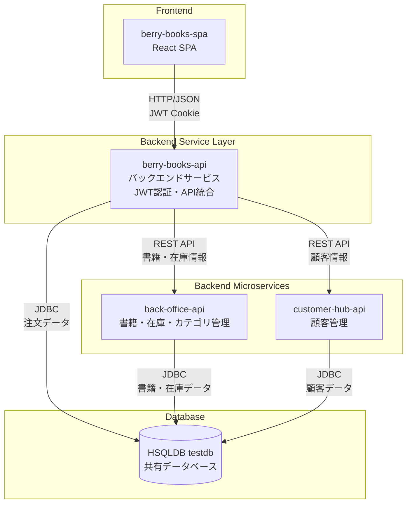
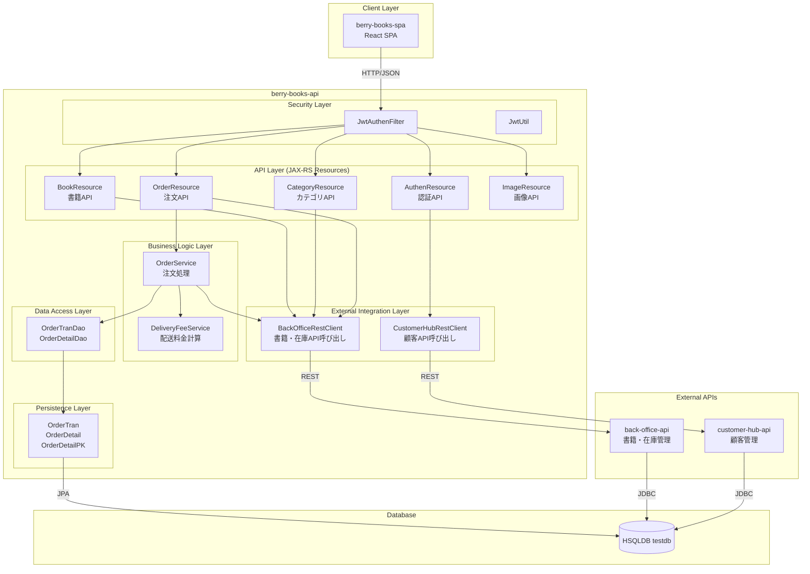
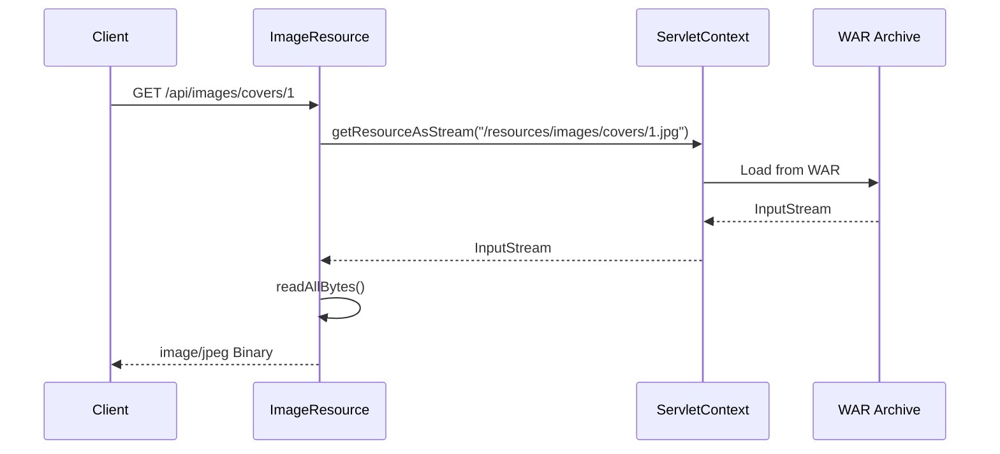
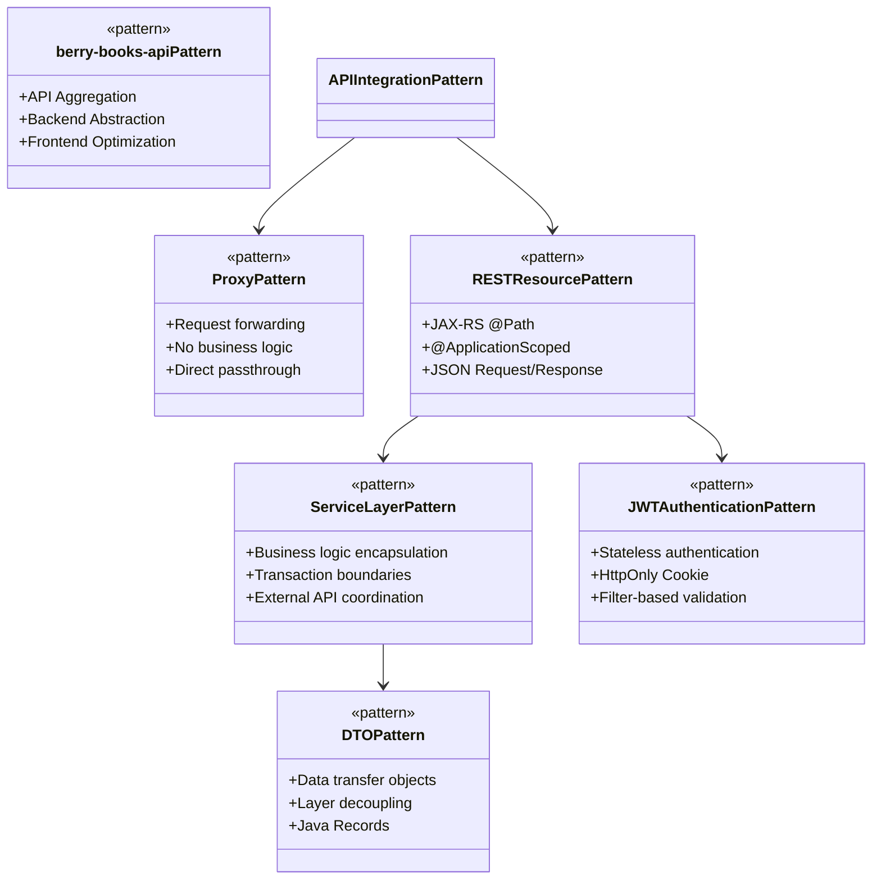
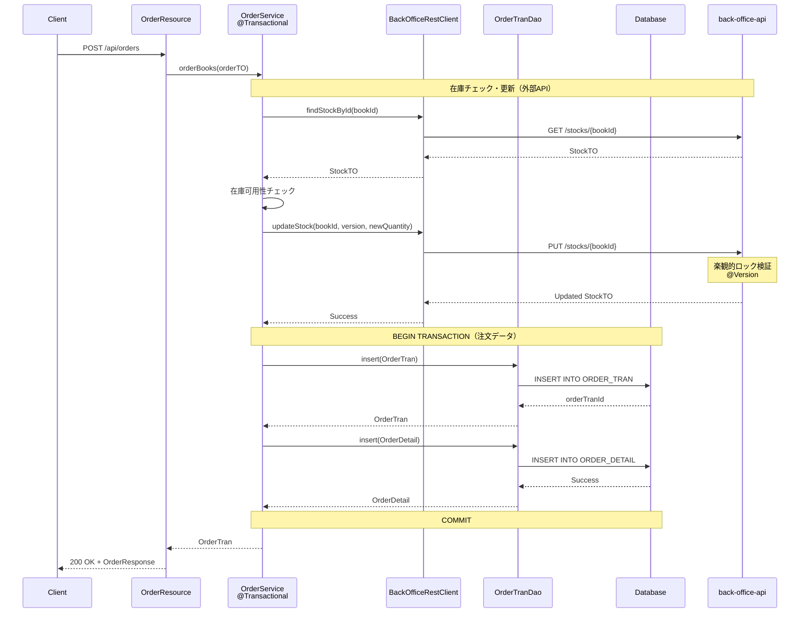
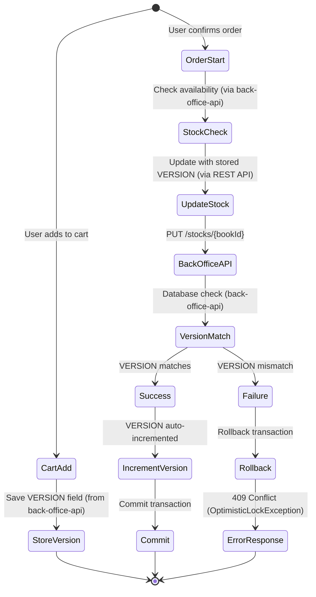

# berry-books-api - アーキテクチャ設計書

プロジェクトID: berry-books-api  
バージョン: 3.0.0  
最終更新日: 2026-01-17  
ステータス: REST API アーキテクチャ確定

---

## 概要

このドキュメントは、berry-books-apiプロジェクト固有のアーキテクチャ設計を記述する。

* 共通的な技術スタック、開発ガイドライン、技術的対応方針については、以下を参照すること：
  * [jee_api_architecture.md](../../../../../agent_skills/jakarta-ee-api-base/principles/jee_api_architecture.md) - Jakarta EE APIアーキテクチャ標準
  * [common_rules.md](../../../../../agent_skills/jakarta-ee-api-base/principles/common_rules.md) - 共通ルール
  * [security_standard.md](../../../../../agent_skills/jakarta-ee-api-base/principles/security_standard.md) - セキュリティ標準

---

## 1. バックエンドサービスアーキテクチャ

### 1.1 アーキテクチャパターン

berry-books-apiは、フロントエンド（berry-books-spa）の唯一のエントリーポイントとして機能するバックエンドサービスです。マイクロサービスアーキテクチャにおいて、複数のバックエンドサービスを統合し、フロントエンドに最適化されたAPIを提供します。

#### 1.1.1 このパターンの利点

| 利点 | 説明 |
|-----|------|
| フロントエンド最適化 | フロントエンドに必要なデータ形式で直接レスポンス |
| バックエンドの抽象化 | 複数のマイクロサービスの存在を隠蔽 |
| 認証の一元化 | 本システムでJWT認証を管理 |
| API集約 | 複数のバックエンドAPIの呼び出しを1つに集約 |
| 柔軟な拡張 | バックエンドの変更がフロントエンドに影響しない |

#### 1.1.2 マイクロサービス構成



#### 1.1.3 責務分担

| システム | 責務 | 管理するデータ |
|---------|------|--------------|
| berry-books-api | • JWT認証<br/>• 注文管理<br/>• 配送料金計算<br/>• 外部API連携<br/>• 画像配信 | ORDER_TRAN<br/>ORDER_DETAIL |
| back-office-api | • 書籍管理<br/>• 在庫管理<br/>• カテゴリ管理<br/>• 楽観的ロック制御 | BOOK<br/>STOCK<br/>CATEGORY<br/>PUBLISHER |
| customer-hub-api | • 顧客CRUD<br/>• 認証情報管理<br/>• メール重複チェック | CUSTOMER |

---

## 2. レイヤードアーキテクチャ

### 2.1 システム構成図



### 2.2 コンポーネントの責務

| レイヤー | 責務 | 実装方式 |
|-------|-----------------|-------------------|
| API Layer (JAX-RS Resource) | • HTTPリクエスト・レスポンス処理<br/>• JWT認証情報の取得<br/>• 外部API呼び出し（BookResource、CategoryResource）<br/>• ビジネスロジック実行（OrderResource）<br/>• 静的リソース配信（ImageResource） | 外部API連携型: REST Clientで外部呼び出し<br/>独自実装型: サービス層を呼び出し |
| Security Layer | • JWT生成・検証<br/>• Cookie管理<br/>• 認証フィルター処理<br/>• 認証情報の管理（`@RequestScoped` CDI Bean） | JWT認証は本システムで一元管理 |
| Service Layer | • 注文ビジネスロジック<br/>• 配送料金計算<br/>• トランザクション境界<br/>• 外部API呼び出し | OrderService、DeliveryFeeServiceのみ実装<br/>（BookService、CategoryServiceは不要） |
| DAO Layer | • 注文データのCRUD操作<br/>• JPQL実行<br/>• エンティティライフサイクル管理 | OrderTranDao、OrderDetailDaoのみ実装<br/>（BookDao、StockDaoは不要） |
| Entity Layer | • 注文データ構造<br/>• リレーションシップ定義<br/>• データベースマッピング | OrderTran、OrderDetail、OrderDetailPKのみ実装<br/>（Book、Stock、Customerは不要） |
| External Integration Layer | • 外部API呼び出し<br/>• DTOマッピング<br/>• エラーハンドリング<br/>• リトライ処理 | BackOfficeRestClient、CustomerHubRestClient |

#### 2.2.1 外部API呼び出し vs 独自実装

| API Resource | 実装パターン | 説明 |
|-------------|------------|------|
| BookResource | 外部API呼び出し | back-office-apiから書籍情報を取得 |
| CategoryResource | 外部API呼び出し | back-office-apiからカテゴリ情報を取得 |
| AuthenResource | 独自実装 + 外部連携 | JWT生成、customer-hub-apiで認証情報取得 |
| OrderResource | 独自実装 + 外部連携 | 注文処理、back-office-apiで在庫更新 |
| ImageResource | 独自実装 | WAR内リソースを直接配信 |

### 2.3 静的リソース配信（画像API）

* 設計原則: WAR内リソースへの安全なアクセス



* 実装方針:

1. ServletContext使用: WAR内リソースへのアクセスには`ServletContext.getResourceAsStream()`を使用
2. パス形式: `/resources/...` から始まる絶対パス（WARルート相対）
3. フォールバック: 画像が存在しない場合は`no-image.jpg`を返却
4. ファイルシステム禁止: `new File("src/main/...")` は開発環境でのみ動作

---

## 3. デザインパターン適用

### 3.1 適用パターン



| パターン | 目的 | 適用箇所 |
|---------|------|---------|
| berry-books-api Pattern | API統合・バックエンド抽象化 | berry-books-api全体 |
| Proxy Pattern | 外部APIへの透過的転送 | BookResource, CategoryResource |
| REST Resource Pattern | HTTPエンドポイント提供 | AuthenResource, BookResource, OrderResource |
| サービスレイヤー | 注文ビジネスロジック集約 | OrderService, DeliveryFeeService |
| リポジトリ (DAO) | 注文データアクセス | OrderTranDao, OrderDetailDao |
| DTO (Record) | データ転送オブジェクト | LoginResponse, OrderResponse, CartItemRequest |
| JWT認証 | ステートレス認証 | JwtAuthenFilter, JwtUtil |
| 依存性注入 | 疎結合 | @Inject (CDI) |
| 楽観的ロック | 並行制御（外部API側） | back-office-api の Stock エンティティ |
| トランザクション | 注文データ整合性 | @Transactional（OrderService） |

### 3.2 DTO設計方針

| DTO | 実装方式 | 設計根拠 |
|-----|---------|---------|
| `LoginRequest` | Record | イミュータブル、バリデーション対象 |
| `LoginResponse` | Record | 顧客情報の読み取り専用DTO |
| `OrderRequest` | Record | 注文リクエストの複雑なデータ構造 |
| `OrderResponse` | Record | 注文結果の読み取り専用DTO |
| `CartItemRequest` | Record | カートアイテムのイミュータブルDTO |
| `ErrorResponse` | Record | 統一的なエラーレスポンス形式 |

---

## 4. パッケージ構造

### 4.1 ベースパッケージ

```
pro.kensait.berrybooks
```

* 重要: このプロジェクトはバックエンドサービスアーキテクチャを採用しているため、パッケージ構造は以下の特徴があります：
* `external/` パッケージが存在（外部API連携）
* `service/` は注文処理とデリバリーのみ（書籍・カテゴリサービスは不要）
* `dao/` と `entity/` は注文関連のみ（書籍・在庫・顧客エンティティは不要）

### 4.2 パッケージ階層（概要）

```
pro.kensait.berrybooks
├── api                    # Presentation Layer (JAX-RS Resources)
│   ├── dto               # Data Transfer Objects
│   └── exception         # Exception Mappers
├── security              # Security Layer (JWT認証)
├── service               # Business Logic Layer（注文処理のみ）
├── dao                   # Data Access Layer（注文データのみ）
├── entity                # Persistence Layer（注文エンティティのみ）
├── external              # External Integration Layer（外部連携）
│   └── dto               # 外部API用DTO
├── common                # Common Classes
└── util                  # Utilities
```

* 詳細なクラス構成: 各API機能の`detailed_design.md`を参照してください。

| API | 詳細設計書 |
|-----|----------|
| 認証API | [API_001_auth/detailed_design.md](../api/API_001_auth/detailed_design.md) |
| 書籍API（外部API連携） | [API_002_books/detailed_design.md](../api/API_002_books/detailed_design.md) |
| 注文API | [API_003_orders/detailed_design.md](../api/API_003_orders/detailed_design.md) |
| 画像API | [API_004_images/detailed_design.md](../api/API_004_images/detailed_design.md) |

### 4.3 berry-books-api特有のパッケージ

| パッケージ | 目的 | 備考 |
|-----------|------|------|
| `external` | 外部API連携 | back-office-api、customer-hub-apiとの連携 |
| `external.dto` | 外部APIのDTO | 外部APIのレスポンス/リクエストをマッピング |
| `service.order` | 注文ビジネスロジック | 本システムで実装する唯一のサービス層 |
| `dao` | 注文データアクセス | 注文関連データのみ管理 |
| `entity` | 注文エンティティ | OrderTran、OrderDetailのみ |

### 4.4 マイクロサービスアーキテクチャによる実装制約

* 実装されているもの:
  * 注文関連のエンティティ（OrderTran, OrderDetail）
  * 注文処理サービス（OrderService, DeliveryFeeService）
  * 外部API連携クライアント（BackOfficeRestClient, CustomerHubRestClient）

* 実装されていないもの（外部APIで管理）:
  * 書籍・在庫・カテゴリのエンティティ、DAO、サービス → back-office-apiで管理
  * 顧客のエンティティ、DAO、サービス → customer-hub-apiで管理

---

## 5. トランザクション管理（プロジェクト固有）

### 5.1 トランザクション境界とマイクロサービス連携

マイクロサービスアーキテクチャでは、トランザクションは各マイクロサービスで独立して管理されます。



### 5.2 トランザクション戦略

#### 5.2.1 分散トランザクションの扱い

複数のマイクロサービスにまたがるトランザクションは結果整合性（Eventual Consistency）で管理します。

| トランザクション範囲 | 管理方式 | 実装 |
|------------------|---------|------|
| 外部API（在庫更新） | 外部APIの独立トランザクション | back-office-apiがトランザクション管理 |
| ローカル（注文作成） | JTA宣言的トランザクション | berry-books-apiの@Transactional |

#### 5.2.2 OrderService.orderBooks() の処理フロー

1. 在庫可用性チェック（外部API）: `backOfficeClient.findStockById(bookId)`
2. 在庫更新（外部API・楽観的ロック）: `backOfficeClient.updateStock(bookId, version, newQuantity)`
   * 楽観的ロック検証はback-office-api側で実行
   * 失敗時は`OptimisticLockException`をスロー
3. 注文トランザクション作成（ローカルDB）: `orderTranDao.insert(orderTran)`
4. 注文明細作成（ローカルDB）: `orderDetailDao.insert(orderDetail)` × N
5. コミット: 正常終了時
6. ロールバック: `OptimisticLockException`, `OutOfStockException` 発生時

#### 5.2.3 エラーハンドリング

| エラー | 発生箇所 | 対応 |
|-------|---------|------|
| `OutOfStockException` | OrderService（在庫チェック） | トランザクションロールバック、409 Conflict |
| `OptimisticLockException` | back-office-api（在庫更新） | トランザクションロールバック、409 Conflict |
| その他の例外 | 各処理 | トランザクションロールバック、500 Internal Server Error |

* 注意: 在庫更新に成功し、注文作成に失敗した場合、在庫の不整合が発生する可能性があります。これは将来的にSaga パターンや補償トランザクションで対応する必要があります。

---

## 6. 並行制御（楽観的ロック） - 外部API管理

### 6.1 楽観的ロック戦略（マイクロサービスアーキテクチャ）

マイクロサービスアーキテクチャでは、在庫の楽観的ロックはback-office-apiが管理します。berry-books-apiはクライアントから受け取ったバージョン番号を外部APIに転送します。



### 6.2 実装詳細

#### 6.2.1 責務分担

| システム | 責務 |
|---------|------|
| back-office-api | • STOCKテーブル管理<br/>• @Versionによる楽観的ロック<br/>• OptimisticLockException送出 |
| berry-books-api | • バージョン番号の転送<br/>• 外部API呼び出し<br/>• 例外の転送（409 Conflict） |

#### 6.2.2 処理フロー

1. 書籍一覧取得時: back-office-apiからVERSION値を含む書籍・在庫情報を取得
2. カート追加時（SPA側）: VERSION値をカートアイテムに保存
3. 注文確定時: 
   * berry-books-api: `BackOfficeRestClient.updateStock(bookId, version, newQuantity)`
   * back-office-api: `PUT /stocks/{bookId}` で楽観的ロック検証
   * WHERE句: `bookId = ? AND version = ?`
   * 成功時: VERSION自動インクリメント、更新後のStockTOを返却
   * 失敗時: 409 Conflict（OptimisticLockException）を返却
4. berry-books-api側の処理: 
   * 成功時: 注文処理を続行
   * 失敗時: `OptimisticLockException`を再スローし、ExceptionMapperで409 Conflictレスポンス

---

## 7. 認証除外エンドポイント

プロジェクト固有の認証除外エンドポイント:

* `/api/auth/login`
* `/api/auth/logout`
* `/api/auth/register`
* `/api/books`（書籍一覧・詳細は認証不要）
* `/api/images`（画像APIは認証不要）

---

## 8. スナップショットパターン

### 8.1 適用対象

注文明細データ

### 8.2 保存項目

* 書籍ID（論理参照のみ）
* 書籍名（注文時点のスナップショット）
* 出版社名（注文時点のスナップショット）
* 価格（注文時点のスナップショット）

### 8.3 設計意図

* 注文履歴は過去の取引記録であり、書籍マスタの変更や削除の影響を受けるべきではない
* 外部サービスが停止している場合でも注文履歴を表示可能
* 注文履歴表示時の外部API呼び出しを削減し、パフォーマンスを向上

---

## 9. 実装状況

* 最終更新: 2026-01-17  
* 実装バージョン: v3.0.0 - サービス分離アーキテクチャ完全対応版

| コンポーネント | 状態 | 実装方針 |
|-------------|------|---------|
| 認証リソース | ✅ 完了 | JWT認証、外部サービス連携 |
| 書籍リソース | ✅ 完了 | 外部API呼び出し |
| カテゴリリソース | ✅ 完了 | 外部API呼び出し |
| 注文リソース | ✅ 完了 | 注文処理、在庫管理連携、スナップショット保存 |
| 画像リソース | ✅ 完了 | WAR内静的リソース配信 |
| 外部API連携（書籍・在庫） | ✅ 完了 | REST Client実装 |
| 外部API連携（顧客管理） | ✅ 完了 | REST Client実装 |
| JWT生成・検証 | ✅ 完了 | 認証トークン管理 |
| 認証フィルター | ✅ 完了 | リクエスト認証処理 |
| 例外マッパー | ✅ 完了 | 統一的なエラーハンドリング |

---

## 10. 参考資料

### 10.1 関連仕様書

* [requirements.md](requirements.md) - 要件定義書
* [functional_design.md](functional_design.md) - 機能設計書（API仕様）
* [behaviors.md](behaviors.md) - 振る舞い仕様書（受入基準）
* [data_model.md](data_model.md) - データモデル仕様書
* [external_interface.md](external_interface.md) - 外部インターフェース仕様書

### 10.2 プロジェクトREADME

* [README.md](../../README.md) - プロジェクトREADME

### 10.3 共通原則・標準

* [architecture.md](../../../../../agent_skills/jakarta-ee-api-base/principles/architecture.md) - Jakarta EE APIアーキテクチャ標準
* [common_rules.md](../../../../../agent_skills/jakarta-ee-api-base/principles/common_rules.md) - 共通ルール
* [security.md](../../../../../agent_skills/jakarta-ee-api-base/principles/security.md) - セキュリティ標準
