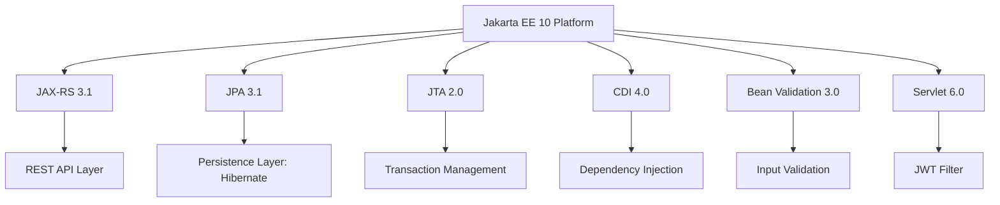
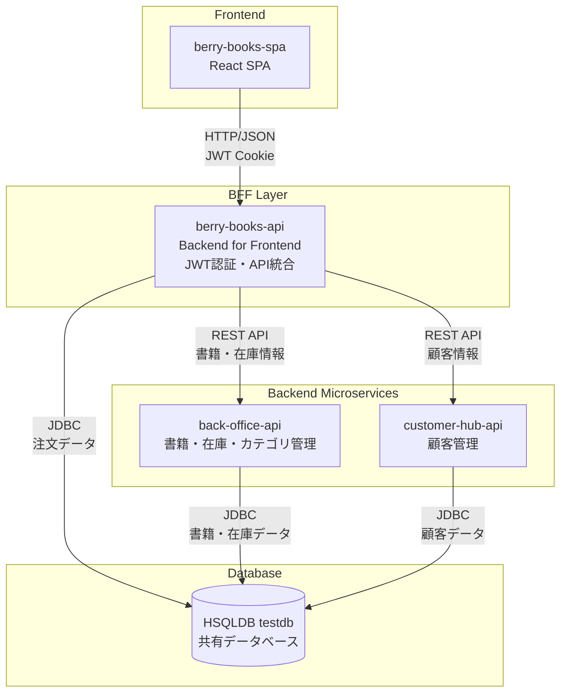
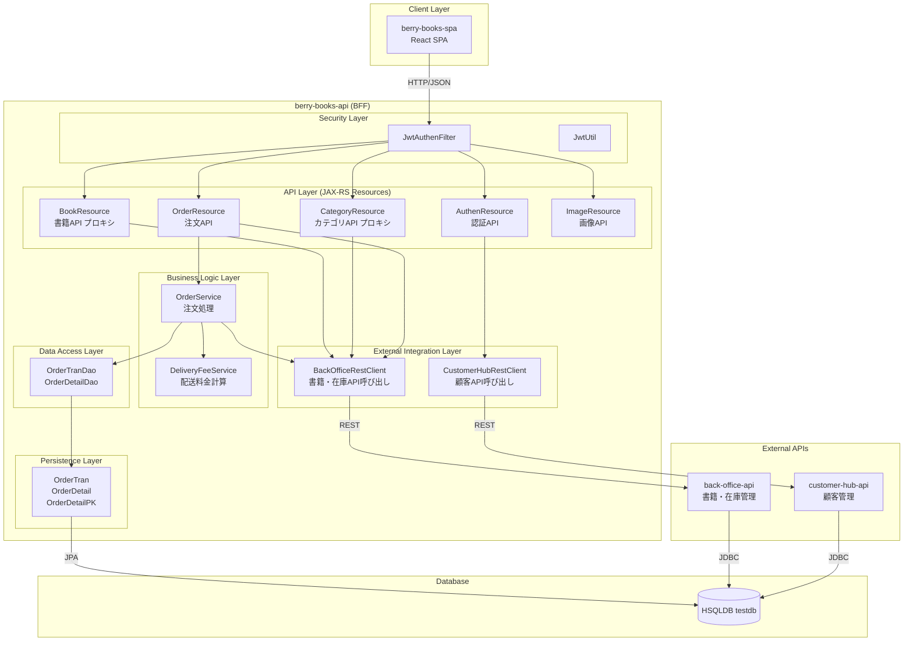
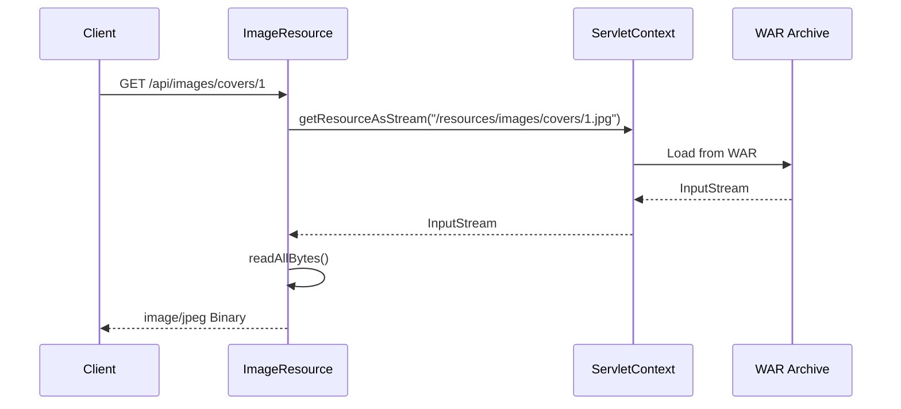
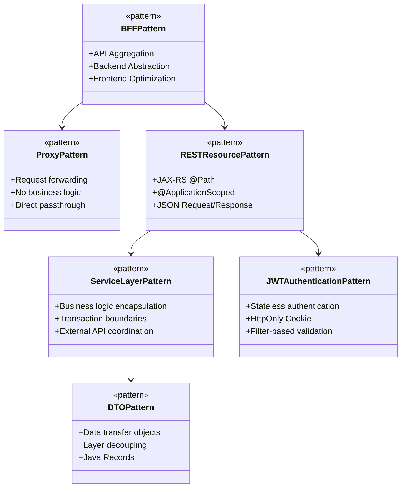
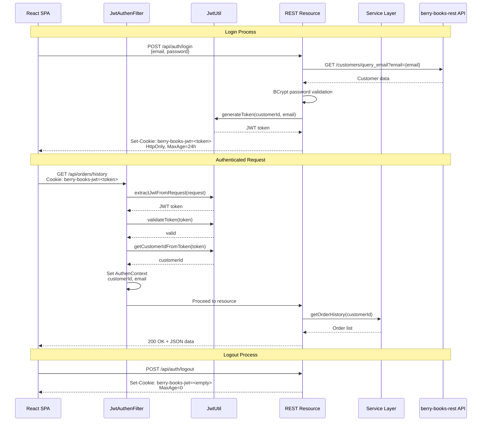
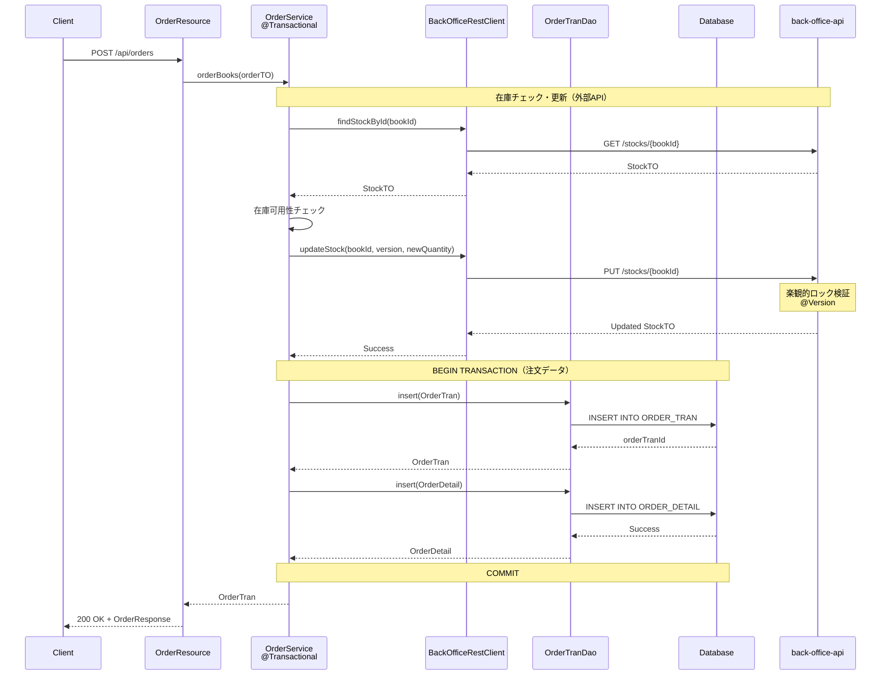
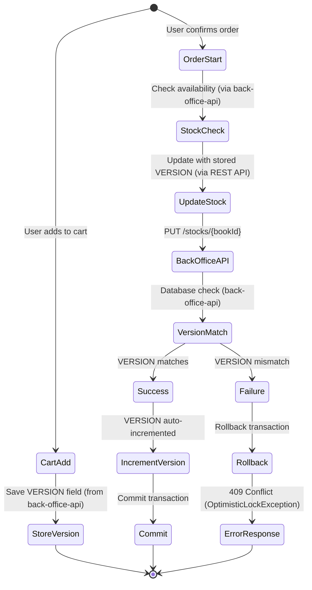
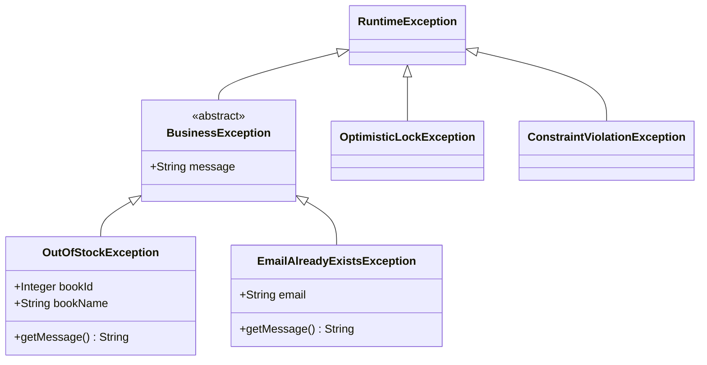
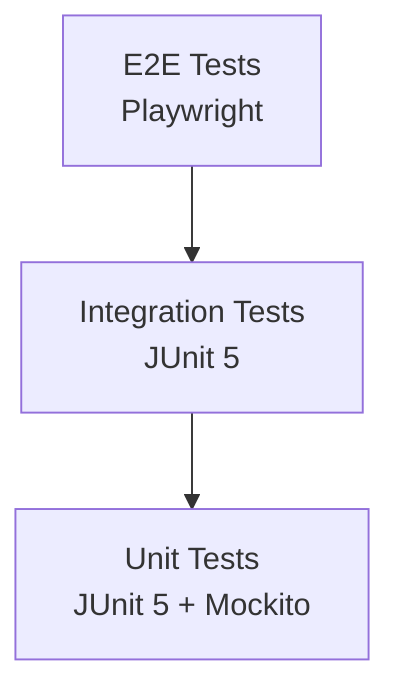

# berry-books-api - アーキテクチャ設計書

プロジェクトID: berry-books-api  
バージョン: 2.0.0  
最終更新日: 2025-12-27  
ステータス: REST API アーキテクチャ確定

---

## 1. 技術スタック

### 1.1 コアプラットフォーム

| レイヤー | 技術 | バージョン | 選定理由 |
|-------|-----------|---------|-----------|
| ランタイム | JDK | 21 | 最新LTS、パフォーマンス向上、新機能活用 |
| プラットフォーム | Jakarta EE | 10.0 | エンタープライズJavaの標準、豊富な機能 |
| アプリサーバー | Payara Server | 6.x | Jakarta EE 10完全対応、安定性 |
| データベース | HSQLDB | 2.7.x | 軽量、開発・テスト環境に適している |
| ビルドツール | Gradle | 8.x | 柔軟なビルド設定、依存関係管理 |

### 1.2 Jakarta EE仕様



| 仕様 | バージョン | 目的 |
|--------------|---------|---------|
| Jakarta RESTful Web Services (JAX-RS) | 3.1 | REST APIエンドポイント |
| Jakarta Persistence (JPA) | 3.1 | O/Rマッピング、データアクセス |
| Jakarta Transactions (JTA) | 2.0 | トランザクション管理 |
| Jakarta CDI | 4.0 | 依存性注入、スコープ管理 |
| Jakarta Bean Validation | 3.0 | 入力検証 |
| Jakarta Servlet | 6.0 | HTTP処理、フィルター |

### 1.3 追加ライブラリ

| ライブラリ | 目的 | 選定理由 |
|---------|---------|-----------|
| jjwt 0.12.6 | JWT生成・検証 | 安定性、セキュリティ、使いやすさ |
| BCrypt | パスワードハッシュ化 | 業界標準、レインボーテーブル攻撃耐性 |
| SLF4J + Log4j2 | ログ出力 | 構造化ログ、パフォーマンス |
| JUnit 5 | 単体テスト | モダンなテストフレームワーク |
| Mockito | モッキング | サービス層のテスト |

---

## 2. アーキテクチャ設計

### 2.1 BFF（Backend for Frontend）パターン

berry-books-apiは、フロントエンド（berry-books-spa）の唯一のエントリーポイントとして機能するBFF（Backend for Frontend）です。マイクロサービスアーキテクチャにおいて、複数のバックエンドサービスを統合し、フロントエンドに最適化されたAPIを提供します。

#### 2.1.1 BFFパターンの利点

| 利点 | 説明 |
|-----|------|
| フロントエンド最適化 | フロントエンドに必要なデータ形式で直接レスポンス |
| バックエンドの抽象化 | 複数のマイクロサービスの存在を隠蔽 |
| 認証の一元化 | BFF層でJWT認証を管理 |
| API集約 | 複数のバックエンドAPIの呼び出しを1つに集約 |
| 柔軟な拡張 | バックエンドの変更がフロントエンドに影響しない |

#### 2.1.2 マイクロサービス構成



#### 2.1.3 責務分担

| システム | 責務 | 管理するデータ |
|---------|------|--------------|
| berry-books-api<br/>(BFF) | • JWT認証<br/>• API統合・プロキシ<br/>• 注文処理<br/>• 配送料金計算<br/>• 画像配信 | ORDER_TRAN<br/>ORDER_DETAIL |
| back-office-api | • 書籍管理<br/>• 在庫管理<br/>• カテゴリ管理<br/>• 楽観的ロック制御 | BOOK<br/>STOCK<br/>CATEGORY<br/>PUBLISHER |
| customer-hub-api | • 顧客CRUD<br/>• 認証情報管理<br/>• メール重複チェック | CUSTOMER |

### 2.2 BFF レイヤードアーキテクチャ



### 2.3 コンポーネントの責務（BFFパターン）

| レイヤー | 責務 | 実装方式 |
|-------|-----------------|-------------------|
| API Layer (JAX-RS Resource) | • HTTPリクエスト・レスポンス処理<br/>• JWT認証情報の取得<br/>• 外部APIへのプロキシ（BookResource、CategoryResource）<br/>• ビジネスロジック実行（OrderResource）<br/>• 静的リソース配信（ImageResource） | プロキシ型: 外部APIに転送<br/>独自実装型: サービス層を呼び出し |
| Security Layer | • JWT生成・検証<br/>• Cookie管理<br/>• 認証フィルター処理<br/>• 認証情報のスレッドローカル管理 | JWT認証はBFF層で一元管理 |
| Service Layer | • 注文ビジネスロジック<br/>• 配送料金計算<br/>• トランザクション境界<br/>• 外部API呼び出し | OrderService、DeliveryFeeServiceのみ実装<br/>（BookService、CategoryServiceは不要） |
| DAO Layer | • 注文データのCRUD操作<br/>• JPQL実行<br/>• エンティティライフサイクル管理 | OrderTranDao、OrderDetailDaoのみ実装<br/>（BookDao、StockDaoは不要） |
| Entity Layer | • 注文データ構造<br/>• リレーションシップ定義<br/>• データベースマッピング | OrderTran、OrderDetail、OrderDetailPKのみ実装<br/>（Book、Stock、Customerは不要） |
| External Integration Layer | • 外部API呼び出し<br/>• DTOマッピング<br/>• エラーハンドリング<br/>• リトライ処理 | BackOfficeRestClient、CustomerHubRestClient |

#### 2.3.1 プロキシパターン vs 独自実装

| API Resource | 実装パターン | 説明 |
|-------------|------------|------|
| BookResource | プロキシ | back-office-apiにそのまま転送、独自ロジックなし |
| CategoryResource | プロキシ | back-office-apiにそのまま転送、独自ロジックなし |
| AuthenResource | 独自実装 + 外部連携 | JWT生成、customer-hub-apiで認証情報取得 |
| OrderResource | 独自実装 + 外部連携 | 注文処理、back-office-apiで在庫更新 |
| ImageResource | 独自実装 | WAR内リソースを直接配信 |

### 2.3 静的リソース配信（画像API）

* 設計原則: WAR内リソースへの安全なアクセス



* 実装方針:

1. ServletContext使用: WAR内リソースへのアクセスには`ServletContext.getResourceAsStream()`を使用
2. パス形式: `/resources/...` から始まる絶対パス（WARルート相対）
3. フォールバック: 画像が存在しない場合は`no-image.jpg`を返却
4. ファイルシステム禁止: `new File("src/main/...")` は開発環境でのみ動作

* 非推奨なアプローチ:
  * ファイルシステムへの直接アクセス（開発環境でのみ動作）
  * 相対パスを使用したFileオブジェクトの生成

* 推奨アプローチ:
  * ServletContextをインジェクションして使用
  * ServletContext.getResourceAsStream()でWARルート相対パスを指定
  * パス形式: `/resources/images/covers/1.jpg`のような絶対パス（WARルート相対）

---

## 3. デザインパターン

### 3.1 適用パターン（BFF）



| パターン | 目的 | 適用箇所 |
|---------|------|---------|
| BFF Pattern | API統合・バックエンド抽象化 | berry-books-api全体 |
| Proxy Pattern | 外部APIへの透過的転送 | BookResource, CategoryResource |
| REST Resource Pattern | HTTPエンドポイント提供 | AuthenResource, BookResource, OrderResource |
| サービスレイヤー | 注文ビジネスロジック集約 | OrderService, DeliveryFeeService |
| リポジトリ (DAO) | 注文データアクセス | OrderTranDao, OrderDetailDao |
| DTO (Record) | データ転送オブジェクト | LoginResponse, OrderResponse, CartItemRequest |
| JWT認証 | ステートレス認証 | JwtAuthenFilter, JwtUtil |
| 依存性注入 | 疎結合 | @Inject (CDI) |
| 楽観的ロック | 並行制御（外部API側） | back-office-api の Stock エンティティ |
| トランザクション | 注文データ整合性 | @Transactional（OrderService） |

### 3.2 DTO設計方針

| DTO | 実装方式 | 設計根拠 |
|-----|---------|---------|
| `LoginRequest` | Record | イミュータブル、バリデーション対象 |
| `LoginResponse` | Record | 顧客情報の読み取り専用DTO |
| `OrderRequest` | Record | 注文リクエストの複雑なデータ構造 |
| `OrderResponse` | Record | 注文結果の読み取り専用DTO |
| `CartItemRequest` | Record | カートアイテムのイミュータブルDTO |
| `ErrorResponse` | Record | 統一的なエラーレスポンス形式 |

---

## 3. パッケージ構造

### 3.1 ベースパッケージ

```
pro.kensait.berrybooks
```

* 重要: このプロジェクトはBFF（Backend for Frontend）パターンを採用しているため、パッケージ構造は以下の特徴があります：
* `external/` パッケージが存在（外部API連携）
* `service/` は注文処理とデリバリーのみ（書籍・カテゴリサービスは不要）
* `dao/` と `entity/` は注文関連のみ（書籍・在庫・顧客エンティティは不要）

### 3.2 パッケージ階層（概要）

```
pro.kensait.berrybooks
├── api                    # Presentation Layer (JAX-RS Resources)
│   ├── dto               # Data Transfer Objects
│   └── exception         # Exception Mappers
├── security              # Security Layer (JWT認証)
├── service               # Business Logic Layer（注文処理のみ）
├── dao                   # Data Access Layer（注文データのみ）
├── entity                # Persistence Layer（注文エンティティのみ）
├── external              # External Integration Layer（BFFの核心）
│   └── dto               # 外部API用DTO
├── common                # Common Classes
└── util                  # Utilities
```

* 詳細なクラス構成: 各API機能の`detailed_design.md`を参照してください。

| API | 詳細設計書 |
|-----|----------|
| 認証API | [API_001_auth/detailed_design.md](../api/API_001_auth/detailed_design.md) |
| 書籍API（プロキシ） | [API_002_books/detailed_design.md](../api/API_002_books/detailed_design.md) |
| 注文API | [API_003_orders/detailed_design.md](../api/API_003_orders/detailed_design.md) |
| 画像API | [API_004_images/detailed_design.md](../api/API_004_images/detailed_design.md) |

### 3.3 BFF特有のパッケージ

| パッケージ | 目的 | 備考 |
|-----------|------|------|
| `external` | 外部API連携 | BFF特有：back-office-api、customer-hub-apiとの連携 |
| `external.dto` | 外部APIのDTO | 外部APIのレスポンス/リクエストをマッピング |
| `service.order` | 注文ビジネスロジック | BFFで実装する唯一のサービス層 |
| `dao` | 注文データアクセス | 注文関連データのみ管理 |
| `entity` | 注文エンティティ | OrderTran、OrderDetailのみ |

### 3.4 BFFパターンによる実装制約

* 実装されているもの:
  * 注文関連のエンティティ（OrderTran, OrderDetail）
  * 注文処理サービス（OrderService, DeliveryFeeService）
  * 外部API連携クライアント（BackOfficeRestClient, CustomerHubRestClient）

* 実装されていないもの（外部APIで管理）:
  * 書籍・在庫・カテゴリのエンティティ、DAO、サービス → back-office-apiで管理
  * 顧客のエンティティ、DAO、サービス → customer-hub-apiで管理

### 3.5 パッケージング規約

| レイヤー | パッケージ | 責務 | 命名規則 |
|---------|-----------|------|---------|
| Presentation | `api` | REST APIエンドポイント | `*Resource` |
| | `api.dto` | リクエスト/レスポンスDTO | `*Request`, `*Response` |
| | `api.exception` | API層の例外マッパー | `*ExceptionMapper` |
| Security | `security` | JWT認証関連 | 用途に応じた命名 |
| Business Logic | `service.*` | ビジネスロジック（注文のみ） | `*Service` |
| Data Access | `dao` | データアクセス（注文のみ） | `*Dao` |
| Persistence | `entity` | JPAエンティティ（注文のみ） | エンティティ名 |
| External Integration | `external` | 外部API連携クライアント | `*RestClient` |
| | `external.dto` | 外部API用DTO | `*TO`, `*Request` |
| Cross-Cutting | `common` | 共通クラス | 用途に応じた命名 |
| | `util` | ユーティリティ | `*Util` |

### 3.6 インポートの推奨事項

* Jakarta EEパッケージ: `jakarta.*`
* 標準Javaライブラリ: `java.*`, `javax.*`（javax.cryptoなどレガシー）
* プロジェクト内: `pro.kensait.berrybooks.*`
* サードパーティ: その他（jjwt、slf4j等）

## 4. 命名規則とコーディング規約

### 4.1 クラス命名規則

| コンポーネントタイプ | パッケージ | クラス名パターン | 例 |
|------------------|----------|----------------|-----|
| REST Resource | `api` | `EntityName + Resource` | `AuthenResource`, `BookResource` |
| DTO (Request) | `api.dto` | `Purpose + Request` | `LoginRequest`, `OrderRequest` |
| DTO (Response) | `api.dto` | `Purpose + Response` | `LoginResponse`, `OrderResponse` |
| Exception Mapper | `api.exception` | `ExceptionName + Mapper` | `OutOfStockExceptionMapper` |
| Service | `service.*` | `EntityName + Service` | `BookService`, `OrderService` |
| DAO | `dao` | `EntityName + Dao` | `BookDao`, `StockDao` |
| Entity | `entity` | PascalCase 名詞 | `Book`, `OrderTran` |
| Exception | `service.*` | `ErrorType + Exception` | `OutOfStockException` |
| Enum | `common` | PascalCase | `SettlementType` |
| Utility | `util` / `common` | `FeatureName + Util` | `MessageUtil`, `AddressUtil` |

---

## 5. デザインパターンと実装方針

前述の「3. デザインパターン」セクションを参照してください。

---

## 6. JWT認証アーキテクチャ

### 6.1 認証フロー



### 6.2 JWT設定

設定ファイル: `src/main/resources/META-INF/microprofile-config.properties`

```properties
# JWT秘密鍵（本番環境では環境変数で上書きすること）
jwt.secret-key=BerryBooksSecretKeyForJWT2024MustBe32CharactersOrMore

# JWT有効期限（ミリ秒）デフォルト: 24時間
jwt.expiration-ms=86400000

# JWT Cookie名
jwt.cookie-name=berry-books-jwt
```

* 初期化とフォールバック処理:

MicroProfile Configの設定プロパティインジェクションが環境によって信頼性が低い場合があるため、初期化メソッドで明示的にnullチェックとフォールバック値を設定します。

* JwtUtilの初期化仕様:
  * スコープ: アプリケーションスコープ
  * 設定プロパティ:
  * `jwt.secret-key`: JWT署名用の秘密鍵
  * `jwt.expiration-ms`: トークン有効期限（ミリ秒）、デフォルト値=86400000
  * 初期化処理（PostConstruct
    public void init() {
        // @ConfigPropertyが失敗した場合のフォールバック
        if (secretKey == null || secretKey.isEmpty()) {
            logger.warn("jwt.secret-key is not configured, using default value.");
            secretKey = "BerryBooksSecretKeyForJWT2024MustBe32CharactersOrMore";
        }
        if (expirationMs == null) {
            logger.warn("jwt.expiration-ms is not configured, using default value.");
            expirationMs = 86400000L; // 24 hours
        }
        
        this.key = Keys.hmacShaKeyFor(secretKey.getBytes(StandardCharsets.UTF_8));
        logger.info("JWT secret key initialized, expiration: {} ms", expirationMs);
    }
}
```

* 設計上の理由:
  * `@ConfigProperty`の`defaultValue`だけでは不十分（nullが注入される場合がある）
  * `@PostConstruct`で明示的に初期化し、安全にデフォルト値を設定
  * 設定欠落時は警告ログを出力し、運用で検知可能にする

### 6.3 JWTフィルターの実装詳細

* コンテキストパス対応:

JwtAuthenFilterは、リクエストURIからコンテキストパスを除外してパスマッチングを行います。

* パス処理ロジック:
  1. HTTPリクエストからリクエストURIを取得
  2. HTTPリクエストからコンテキストパスを取得
  3. リクエストURIからコンテキストパスを除外した部分パスを抽出
  4. 例: `/berry-books-api-sdd/api/auth/login` → `/api/auth/login`
  5. 抽出したパスが公開エンドポイントかどうかを判定
  6. 公開エンドポイントの場合は認証をスキップ

* 認証除外エンドポイント:
  * `/api/auth/login`
  * `/api/auth/logout`
  * `/api/auth/register`
  * `/api/books`（書籍一覧・詳細は認証不要）
  * `/api/images`（画像APIは認証不要）

### 6.4 セキュリティ対策

| 対策 | 実装 | 目的 |
|---------|---------------|------|
| HttpOnly Cookie | `httpOnly=true` | XSS攻撃対策（JavaScriptからアクセス不可） |
| Secure Cookie | `secure=true`（本番環境） | HTTPS通信のみでCookie送信 |
| BCrypt | `BCrypt.hashpw()` | パスワードハッシュ化、レインボーテーブル攻撃耐性 |
| Bean Validation | `@Valid`, `@NotBlank` | サーバーサイド入力検証 |
| JPA/JPQL | Prepared Statement | SQLインジェクション対策 |
| Exception Mapper | `@Provider` | 統一的なエラーレスポンス、情報漏洩防止 |
| Context Path 正規化 | `getContextPath()` | マルチテナント・リバースプロキシ対応 |

---

## 7. トランザクション管理（BFFパターン）

### 7.1 トランザクション境界とマイクロサービス連携

BFFパターンでは、トランザクションは各マイクロサービスで独立して管理されます。



### 7.2 トランザクション戦略（BFFパターン）

#### 7.2.1 分散トランザクションの扱い

BFFパターンでは、複数のマイクロサービスにまたがるトランザクションは結果整合性（Eventual Consistency）で管理します。

| トランザクション範囲 | 管理方式 | 実装 |
|------------------|---------|------|
| 外部API（在庫更新） | 外部APIの独立トランザクション | back-office-apiがトランザクション管理 |
| ローカル（注文作成） | JTA宣言的トランザクション | berry-books-apiの@Transactional |

#### 7.2.2 OrderService.orderBooks() の処理フロー

1. 在庫可用性チェック（外部API）: `backOfficeClient.findStockById(bookId)`
2. 在庫更新（外部API・楽観的ロック）: `backOfficeClient.updateStock(bookId, version, newQuantity)`
   * 楽観的ロック検証はback-office-api側で実行
   * 失敗時は`OptimisticLockException`をスロー
3. 注文トランザクション作成（ローカルDB）: `orderTranDao.insert(orderTran)`
4. 注文明細作成（ローカルDB）: `orderDetailDao.insert(orderDetail)` × N
5. コミット: 正常終了時
6. ロールバック: `OptimisticLockException`, `OutOfStockException` 発生時

#### 7.2.3 エラーハンドリング

| エラー | 発生箇所 | 対応 |
|-------|---------|------|
| `OutOfStockException` | OrderService（在庫チェック） | トランザクションロールバック、409 Conflict |
| `OptimisticLockException` | back-office-api（在庫更新） | トランザクションロールバック、409 Conflict |
| その他の例外 | 各処理 | トランザクションロールバック、500 Internal Server Error |

* 注意: 在庫更新に成功し、注文作成に失敗した場合、在庫の不整合が発生する可能性があります。これは将来的にSaga パターンや補償トランザクションで対応する必要があります。

---

## 8. 並行制御（楽観的ロック） - 外部API管理

### 8.1 楽観的ロック戦略（BFFパターン）

BFFパターンでは、在庫の楽観的ロックはback-office-apiが管理します。berry-books-apiはクライアントから受け取ったバージョン番号を外部APIに転送します。



### 8.2 実装詳細（BFFとしての役割）

#### 8.2.1 責務分担

| システム | 責務 |
|---------|------|
| back-office-api | • STOCKテーブル管理<br/>• @Versionによる楽観的ロック<br/>• OptimisticLockException送出 |
| berry-books-api (BFF) | • バージョン番号の転送<br/>• 外部API呼び出し<br/>• 例外のプロキシ（409 Conflict） |

#### 8.2.2 処理フロー

1. 書籍一覧取得時: back-office-apiからVERSION値を含む書籍・在庫情報を取得
2. カート追加時（SPA側）: VERSION値をカートアイテムに保存
3. 注文確定時: 
   * berry-books-api: `BackOfficeRestClient.updateStock(bookId, version, newQuantity)`
   * back-office-api: `PUT /stocks/{bookId}` で楽観的ロック検証
   * WHERE句: `bookId = ? AND version = ?`
   * 成功時: VERSION自動インクリメント、更新後のStockTOを返却
   * 失敗時: 409 Conflict（OptimisticLockException）を返却
4. BFF側の処理: 
   * 成功時: 注文処理を続行
   * 失敗時: `OptimisticLockException`を再スローし、ExceptionMapperで409 Conflictレスポンス

#### 8.2.3 エラーレスポンス

```json
{
  "status": 409,
  "error": "Conflict",
  "message": "在庫が他のユーザーによって更新されました。最新の在庫情報を確認してください。",
  "path": "/api/orders"
}
```

---

## 9. エラーハンドリング戦略

### 9.1 例外階層



### 9.2 Exception Mapper

| Exception | HTTP Status | ExceptionMapper | エラーメッセージ例 |
|-----------|------------|-----------------|------------------|
| `OutOfStockException` | 409 Conflict | `OutOfStockExceptionMapper` | "在庫が不足しています" |
| `OptimisticLockException` | 409 Conflict | `OptimisticLockExceptionMapper` | "他のユーザーが購入済みです" |
| `ConstraintViolationException` | 400 Bad Request | `ValidationExceptionMapper` | "メールアドレスは必須です" |
| `EmailAlreadyExistsException` | 409 Conflict | (ServiceでハンドリングError) | "指定されたメールアドレスは既に登録されています" |
| `Exception` (その他) | 500 Internal Server Error | `GenericExceptionMapper` | "サーバーエラーが発生しました" |

### 9.3 統一的なエラーレスポンス形式

```json
{
  "status": 409,
  "error": "Conflict",
  "message": "在庫が不足しています: Java入門",
  "path": "/api/orders"
}
```

* ErrorResponse構造:

レコード型のエラーレスポンスオブジェクト

| フィールド名 | 型 | 説明 |
|------------|---|------|
| status | int | HTTPステータスコード |
| error | String | エラー種別 |
| message | String | エラーメッセージ |
| path | String | リクエストパス |

---

## 10. データベース構成

### 10.1 永続化構成

* persistence.xml:

```xml
<persistence-unit name="BerryBooksPU" transaction-type="JTA">
    <jta-data-source>jdbc/HsqldbDS</jta-data-source>
    <properties>
        <property name="jakarta.persistence.schema-generation.database.action" 
                  value="none"/>
        <property name="eclipselink.logging.level" value="FINE"/>
        <property name="eclipselink.logging.parameters" value="true"/>
    </properties>
</persistence-unit>
```

### 10.2 コネクションプール

| パラメータ | 値 | 備考 |
|-----------|-------|-------|
| JNDI名 | jdbc/HsqldbDS | DataSource JNDI ルックアップ |
| プール名 | HsqldbPool | コネクションプール識別子 |
| ドライバ | org.hsqldb.jdbc.JDBCDriver | HSQLDB JDBC ドライバ |
| URL | jdbc:hsqldb:hsql://localhost:9001/testdb | TCP接続 |
| ユーザー | SA | デフォルトHSQLDBユーザー |
| パスワード | (空) | パスワードなし |
| 最小プールサイズ | 10 | 最小接続数 |
| 最大プールサイズ | 50 | 最大接続数 |

### 10.3 データベース制約

* トランザクション分離レベル: READ_COMMITTED（デフォルト）
* 接続タイムアウト: 30秒
* アイドルタイムアウト: 300秒

---

## 11. ログ戦略

### 11.1 ログフレームワーク

```
SLF4J (API) → Log4j2 (Implementation)
```

* 依存関係:
  * `org.slf4j:slf4j-api:2.0.x` - SLF4J API（ロギングファサード）
  * `org.apache.logging.log4j:log4j-core:2.21.x` - Log4j2コア実装
  * `org.apache.logging.log4j:log4j-slf4j2-impl:2.21.x` - SLF4J 2.xバインディング

### 11.2 ログレベル

| レベル | 用途 | 例 |
|-------|-------|-----|
| ERROR | システムエラー、予期しない例外 | データベース接続エラー、NullPointerException |
| WARN | ビジネス例外、警告 | 在庫不足、楽観的ロック競合、認証失敗 |
| INFO | メソッド開始点、主要イベント | API呼び出し、注文作成、ログイン成功 |
| DEBUG | 詳細フロー、パラメータ値 | SQLクエリ、メソッド引数、JWT検証プロセス |

### 11.3 ログパターン

```
* 標準形式:
INFO  [ ClassName#methodName ] message

* パラメータ付き:
INFO  [ ClassName#methodName ] param1=value1, param2=value2

* 例外:
ERROR [ ClassName#methodName ] Error message
java.lang.RuntimeException: ...
    at ...
```

### 11.4 ログ出力方針

* 出力対象:
  * 全REST APIエンドポイントのエントリ
  * 全パブリックサービスメソッドのエントリ
  * ビジネス例外の発生（WARN）
  * システム例外の発生（ERROR、スタックトレース付き）
  * 重要な状態変更（在庫更新、注文作成など）

---

## 12. テスト戦略

### 12.1 テストピラミッド



### 12.2 テストアプローチ

| テストタイプ | ツール | カバレッジ目標 | 対象 |
|------------|--------|--------------|------|
| ユニットテスト | JUnit 5 + Mockito | 80%以上 | サービス層のビジネスロジック |
| 統合テスト | JUnit 5 | 主要フロー | サービス + DAO + データベース |
| E2Eテスト | Playwright | 主要シナリオ | REST API全体フロー |

* ユニットテスト:
  * サービスレイヤーの全パブリックメソッド
  * ビジネスロジックの境界値テスト
  * エラーシナリオのテスト
  * DAOをMockitoでモック

* E2Eテスト:
  * ログイン → 書籍検索 → 注文 → 注文履歴参照
  * エラーケース（在庫不足、認証エラー等）
  * HTTP Client（curl, Postman等）でのAPI呼び出し

---

## 13. ビルド＆デプロイ

### 13.1 ビルドプロセス

```bash
# 依存関係の確認
./gradlew :berry-books-api:dependencies

# プロジェクトをビルド
./gradlew :berry-books-api:war

# テスト実行
./gradlew :berry-books-api:test

# カバレッジレポート生成
./gradlew :berry-books-api:jacocoTestReport
```

### 13.2 デプロイアーキテクチャ

```
Payara Server 6.x
├── domains/
│   └── domain1/
│       ├── applications/
│       │   └── berry-books-api.war
│       ├── config/
│       │   └── domain.xml (DataSource設定)
│       └── logs/
│           └── server.log
```

* デプロイ手順:
  1. HSQLDBサーバー起動: `./gradlew startHsqldb`
  2. Payara Server起動: `./gradlew startPayara`
  3. データベース初期化: `./gradlew :berry-books-api:setupHsqldb`（初回のみ）
  4. WARファイルビルド: `./gradlew :berry-books-api:war`
  5. デプロイ: `./gradlew :berry-books-api:deploy`

---

## 14. パフォーマンス考慮事項

### 14.1 最適化戦略

| 項目 | 戦略 | 期待効果 |
|------|------|---------|
| N+1問題回避 | JOIN FETCHを使用 | データベースクエリ回数削減 |
| 接続プール | 最小10、最大50接続 | データベース接続オーバーヘッド削減 |
| JWT検証キャッシュ | （将来検討）JWT検証結果のキャッシュ | CPU使用率削減 |
| インデックス | 外部キー、検索対象カラムにインデックス | クエリ実行速度向上 |
| ステートレス設計 | JWT認証、サーバーサイドセッションなし | 水平スケーリング対応 |

---

## 15. 技術リスクと軽減策

| リスク | 確率 | 影響度 | 軽減策 |
|--------|------|--------|--------|
| JWT秘密鍵漏洩 | 低 | 高 | 環境変数管理、定期的な鍵ローテーション |
| 楽観的ロック競合多発 | 中 | 中 | エラーメッセージで再試行を促す、UI側でリトライ機構 |
| データベース接続枯渇 | 低 | 高 | 接続プールサイズの適切な設定、接続リーク監視 |
| N+1問題によるパフォーマンス劣化 | 中 | 中 | JOIN FETCH使用、クエリログ監視 |

---

## 16. 開発ガイドライン

### 16.1 コーディング規約

* 命名規則:
  * クラス名: PascalCase
  * メソッド名: camelCase
  * 定数: UPPER_SNAKE_CASE
  * パッケージ名: lowercase

* コードフォーマット:
  * インデント: スペース4つ
  * 行の最大長: 120文字
  * Java 21の新機能を積極的に活用（Records, Sealed Classes等）

### 16.2 REST API設計原則

* リソース指向: エンドポイントは名詞（`/api/books`, `/api/orders`）
* HTTPメソッド: GET（取得）、POST（作成）、PUT（更新）、DELETE（削除）
* ステータスコード: 適切なHTTPステータスコードを返す
  * 200 OK: 成功
  * 201 Created: 作成成功
  * 400 Bad Request: バリデーションエラー
  * 401 Unauthorized: 認証エラー
  * 409 Conflict: ビジネスエラー（在庫不足、楽観的ロック競合）
  * 500 Internal Server Error: システムエラー

### 16.2.1 静的リソースアクセスのベストプラクティス

* WAR内リソースへのアクセス:

* 非推奨アプローチ:
  * ファイルシステムの相対パスを使用したFileオブジェクトの生成
  * FileInputStreamによる直接読み込み
  * 問題点: 開発環境でのみ動作、デプロイ後は動作しない

* 推奨アプローチ:
  * ServletContextをインジェクション
  * ServletContext.getResourceAsStream()を使用してリソースを取得
  * パス形式: `/resources/images/1.jpg`のようなWARルート相対パス
  * 利点: デプロイ後も正常に動作

* 理由:
  * WARファイルはアーカイブ形式で、ファイルシステムAPIでは直接アクセス不可
  * ServletContextはコンテナが提供するAPIで、WAR内外のリソースに統一的にアクセス可能
  * 開発環境と本番環境で動作を統一できる

### 16.3 ログ出力規約

* 全REST APIエンドポイントの開始点でINFOログ
* 全サービスメソッドの開始点でINFOログ
* ビジネス例外はWARNログ
* システム例外はERRORログ（スタックトレース付き）

### 16.4 ブランチ戦略

* ブランチモデル: GitHub Flow
* ブランチ命名規則:
  * `main`: 本番環境
  * `feature/[FEATURE_NAME]`: 機能開発
  * `bugfix/[BUG_NAME]`: バグ修正
  * `hotfix/[ISSUE_NAME]`: 緊急修正

---

## 17. 実装状況と技術的対応方針

* 最終更新: 2026-01-10  
* 実装バージョン: v3.0.0 - サービス分離アーキテクチャ完全対応版

### 18.1 実装完了状況

| コンポーネント | 状態 | 実装方針 |
|-------------|------|---------|
| 認証リソース | ✅ 完了 | JWT認証、外部サービス連携 |
| 書籍リソース | ✅ 完了 | プロキシパターン（BFF層） |
| カテゴリリソース | ✅ 完了 | プロキシパターン（BFF層） |
| 注文リソース | ✅ 完了 | 注文処理、在庫管理連携、スナップショット保存 |
| 画像リソース | ✅ 完了 | WAR内静的リソース配信 |
| 外部API連携（書籍・在庫） | ✅ 完了 | REST Client実装 |
| 外部API連携（顧客管理） | ✅ 完了 | REST Client実装 |
| JWT生成・検証 | ✅ 完了 | 認証トークン管理 |
| 認証フィルター | ✅ 完了 | リクエスト認証処理 |
| 例外マッパー | ✅ 完了 | 統一的なエラーハンドリング |

### 18.2 技術的対応方針

#### 18.2.1 設定管理

* 設定ファイル: MicroProfile Config仕様に準拠

* 管理項目:
  * JWT設定（秘密鍵、有効期限、Cookie名）
  * 外部サービスURL（顧客管理API、書籍・在庫管理API）

* 実装方針:
  * 設定値はアプリケーション初期化時に明示的に読み込み
  * デフォルト値を必ず設定し、設定ファイルがない場合でも動作可能
  * 初期化ログで設定値を確認可能にする

* 採用理由: 
* 環境間での設定値の一貫性を保証
* デプロイ時の設定ミスを早期発見
* 開発・テスト・本番環境での柔軟な設定変更

#### 18.2.2 依存性注入（CDI）

* 役割:
  * CDIコンテナの明示的有効化
  * 依存性注入の動作保証
  * 外部設定読み込み機能の有効化

* 設定方針: Jakarta EE 10推奨設定を使用

#### 18.2.3 エラーハンドリング統一

* 基本方針:
  * すべてのエラーレスポンスでコンテンツタイプを明示
  * 統一されたエラーレスポンス形式（ErrorResponse DTO）
  * 適切なHTTPステータスコードの返却

* エラー分類:
  * ビジネスエラー: 409 Conflict（在庫不足、楽観的ロック競合）
  * バリデーションエラー: 400 Bad Request
  * 認証エラー: 401 Unauthorized
  * システムエラー: 500 Internal Server Error

#### 18.2.4 認証・認可機構

* 公開エンドポイント:
  * ログイン、ログアウト、ユーザー登録
  * 書籍一覧、書籍詳細、カテゴリ一覧
  * 画像リソース

* 認証必須エンドポイント:
  * 注文処理、注文履歴参照
  * ユーザー情報参照

* 認証処理フロー:
  1. リクエストからJWT Cookieを抽出
  2. JWTトークンの検証（署名、有効期限）
  3. 認証情報をスレッドローカルに保存
  4. 認証失敗時は401エラーを返却

#### 18.2.5 スナップショットパターン

* 適用対象: 注文明細データ

* 保存項目:
  * 書籍ID（論理参照のみ）
  * 書籍名（注文時点のスナップショット）
  * 出版社名（注文時点のスナップショット）
  * 価格（注文時点のスナップショット）

* 設計意図:
  * 注文履歴は過去の取引記録であり、書籍マスタの変更や削除の影響を受けるべきではない
  * 外部サービスが停止している場合でも注文履歴を表示可能
  * 注文履歴表示時の外部API呼び出しを削減し、パフォーマンスを向上

### 18.3 動作確認結果

* テスト実行日: 2026-01-10

| API分類 | 主要エンドポイント | 動作状況 | 備考 |
|---------|------------------|---------|------|
| 書籍API | GET /api/books | ✅ 正常 | 外部API連携 |
| カテゴリAPI | GET /api/categories | ✅ 正常 | 外部API連携 |
| 画像API | GET /api/images/covers/{id} | ✅ 正常 | WAR内リソース |
| 認証API | POST /api/auth/login | ✅ 正常 | 外部API連携 |
| ユーザー情報API | GET /api/auth/me | ✅ 正常 | JWT認証 |
| 注文履歴API | GET /api/orders/history | ✅ 正常 | スナップショット表示 |
| ログアウトAPI | POST /api/auth/logout | ✅ 正常 | Cookie削除 |

* 確認事項:
  * BFF層のプロキシパターンが正常に機能
  * 外部サービス（書籍・在庫管理、顧客管理）との連携が正常
  * スナップショットパターンによる注文履歴表示が正常
  * エラーハンドリングが適切に機能
  * JWT認証フローが正常

---

## 18. 参考資料

### 18.1 公式ドキュメント

* Jakarta EE 10: https://jakarta.ee/specifications/platform/10/
* JAX-RS 3.1: https://jakarta.ee/specifications/restful-ws/3.1/
* JPA 3.1: https://jakarta.ee/specifications/persistence/3.1/
* JWT (JSON Web Token): https://jwt.io/
* jjwt: https://github.com/jwtk/jjwt
* MicroProfile Config: https://microprofile.io/specifications/microprofile-config/

### 18.2 関連仕様書

* [requirements.md](requirements.md) - 要件定義書
* [functional_design.md](functional_design.md) - 機能設計書（API仕様）
* [behaviors.md](behaviors.md) - 振る舞い仕様書（受入基準）
* [data_model.md](data_model.md) - データモデル仕様書
* [external_interface.md](external_interface.md) - 外部インターフェース仕様書

### 18.3 プロジェクトREADME

* [README.md](../../README.md) - プロジェクトREADME
